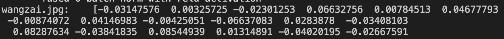

# 特征提取

## 目录

- [1. 简介](#1)
- [2. 网络结构](#2)
- [3. 通用识别模型](#3)
- [4. 自定义特征提取](#4)
  - [4.1 数据准备](#4.1)
  - [4.2 模型训练](#4.2)
  - [4.3 模型评估](#4.3)
  - [4.4 模型推理](#4.4)
    - [4.4.1 导出推理模型](#4.4.1)
    - [4.4.2 获取特征向量](#4.4.2)

<a name="1"></a> 

## 1. 简介

特征提取是图像识别中的关键一环，它的作用是将输入的图片转化为固定维度的特征向量，用于后续的[向量检索](./vector_search.md)。好的特征需要具备相似度保持性，即在特征空间中，相似度高的图片对其特征相似度要比较高（距离比较近），相似度低的图片对，其特征相似度要比较小（距离比较远）。[Deep Metric Learning](../algorithm_introduction/metric_learning.md)用以研究如何通过深度学习的方法获得具有强表征能力的特征。

<a name="2"></a> 

## 2. 网络结构
为了图像识别任务的灵活定制，我们将整个网络分为 Backbone、 Neck、 Head 以及 Loss 部分，整体结构如下图所示:

图中各个模块的功能为:

- **Backbone**: 指定所使用的骨干网络。 值得注意的是，PaddleClas 提供的基于 ImageNet 的预训练模型，最后一层的输出为 1000，我们需要依据所需的特征维度定制最后一层的输出。
- **Neck**: 用以特征增强及特征维度变换。这儿的 Neck，可以是一个简单的 Linear Layer，用来做特征维度变换；也可以是较复杂的 FPN 结构，用以做特征增强。
- **Head**: 用来将 feature 转化为 logits。除了常用的 Fc Layer 外，还可以替换为 cosmargin, arcmargin, circlemargin 等模块。
- **Loss**: 指定所使用的 Loss 函数。我们将 Loss 设计为组合 loss 的形式，可以方便得将 Classification Loss 和 Pair_wise Loss 组合在一起。

<a name="3"></a> 

## 3. 通用识别模型

在 PP-Shitu 中, 我们采用 [PP_LCNet_x2_5](../models/PP-LCNet.md) 作为骨干网络 Neck 部分选用 Linear Layer, Head 部分选用 [ArcMargin](../../../ppcls/arch/gears/arcmargin.py)，Loss 部分选用 CELoss，详细的配置文件见[通用识别配置文件](../../../ppcls/configs/GeneralRecognition/GeneralRecognition_PPLCNet_x2_5.yaml)。其中，训练数据为如下 7 个公开数据集的汇总：
| 数据集       | 数据量   | 类别数   | 场景  | 数据集地址 |
| :------------:  | :-------------: | :-------: | :-------: | :--------: |
| Aliproduct | 2498771 | 50030 | 商品 | [地址](https://retailvisionworkshop.github.io/recognition_challenge_2020/) |
| GLDv2 | 1580470 | 81313  | 地标 | [地址](https://github.com/cvdfoundation/google-landmark) |
| VeRI-Wild | 277797 | 30671 | 车辆 | [地址](https://github.com/PKU-IMRE/VERI-Wild)|
| LogoDet-3K | 155427 | 3000 | Logo | [地址](https://github.com/Wangjing1551/LogoDet-3K-Dataset) |
| iCartoonFace | 389678 | 5013  | 动漫人物 | [地址](http://challenge.ai.iqiyi.com/detail?raceId=5def69ace9fcf68aef76a75d) |
| SOP | 59551 | 11318  | 商品 | [地址](https://cvgl.stanford.edu/projects/lifted_struct/) |
| Inshop | 25882 | 3997  | 商品 | [地址](http://mmlab.ie.cuhk.edu.hk/projects/DeepFashion.html) |
| **Total** | **5M** | **185K**  | ---- | ---- |

最终的模型效果如下表所示:
| 模型       | Aliproduct  | VeRI-Wild  |  LogoDet-3K |  iCartoonFace | SOP | Inshop | Latency(ms) |
| :----------:  | :---------: | :-------: | :-------: | :--------: | :--------: | :--------: | :--------: |
PP-LCNet-2.5x | 0.839 | 0.888 | 0.861 | 0.841 | 0.793 | 0.892 | 5.0
* 采用的评测指标为：`Recall@1`
* 速度评测机器的 CPU 具体信息为：`Intel(R) Xeon(R) Gold 6148 CPU @ 2.40GHz`
* 速度指标的评测条件为： 开启 MKLDNN, 线程数设置为 10
* 预训练模型地址：[通用识别预训练模型](https://paddle-imagenet-models-name.bj.bcebos.com/dygraph/rec/models/pretrain/general_PPLCNet_x2_5_pretrained_v1.0.pdparams)

<a name="4"></a> 

## 4. 自定义特征提取

自定义特征提取，是指依据自己的任务，重新训练特征提取模型。主要包含四个步骤：1）数据准备；2）模型训练；3）模型评估；4）模型推理。

<a name="4.1"></a> 

### 4.1 数据准备

首先，需要基于任务定制自己的数据集。数据集格式参见[格式说明](https://github.com/PaddlePaddle/PaddleClas/blob/develop/docs/zh_CN/data_preparation/recognition_dataset.md#%E6%95%B0%E6%8D%AE%E9%9B%86%E6%A0%BC%E5%BC%8F%E8%AF%B4%E6%98%8E)。在启动模型训练之前，需要在配置文件中修改数据配置相关的内容, 主要包括数据集的地址以及类别数量。对应到配置文件中的位置如下所示：
```
  Head:
    name: ArcMargin 
    embedding_size: 512
    class_num: 185341    #此处表示类别数
```
```
  Train:
    dataset:
      name: ImageNetDataset
      image_root: ./dataset/     #此处表示train数据所在的目录
      cls_label_path: ./dataset/train_reg_all_data.txt  #此处表示train数据集label文件的地址
```
```
    Query:
      dataset: 
        name: VeriWild
        image_root: ./dataset/Aliproduct/.    #此处表示query数据集所在的目录
        cls_label_path: ./dataset/Aliproduct/val_list.txt.    #此处表示query数据集label文件的地址
```
```
    Gallery:
      dataset: 
        name: VeriWild
        image_root: ./dataset/Aliproduct/    #此处表示gallery数据集所在的目录
        cls_label_path: ./dataset/Aliproduct/val_list.txt.   #此处表示gallery数据集label文件的地址
```

<a name="4.2"></a> 

### 4.2 模型训练

- 单机单卡训练
```shell
export CUDA_VISIBLE_DEVICES=0
python tools/train.py -c ppcls/configs/GeneralRecognition/GeneralRecognition_PPLCNet_x2_5.yaml
```
- 单机多卡训练
```shell
export CUDA_VISIBLE_DEVICES=0,1,2,3
python -m paddle.distributed.launch \
    --gpus="0,1,2,3" tools/train.py \
    -c ppcls/configs/GeneralRecognition/GeneralRecognition_PPLCNet_x2_5.yaml
```
**注意:** 
配置文件中默认采用`在线评估`的方式，如果你想加快训练速度，去除`在线评估`，只需要在上述命令后面，增加 `-o eval_during_train=False`。训练完毕后，在 output 目录下会生成最终模型文件 `latest`，`best_model` 和训练日志文件 `train.log`。其中，`best_model` 用来存储当前评测指标下的最佳模型；`latest` 用来存储最新生成的模型, 方便在任务中断的情况下从断点位置启动训练。

- 断点续训：
```shell
export CUDA_VISIBLE_DEVICES=0,1,2,3
python -m paddle.distributed.launch \
    --gpus="0,1,2,3" tools/train.py \
    -c ppcls/configs/GeneralRecognition/GeneralRecognition_PPLCNet_x2_5.yaml \
    -o Global.checkpoint="output/RecModel/latest"
```

<a name="4.3"></a> 

### 4.3 模型评估

- 单卡评估
```shell
export CUDA_VISIBLE_DEVICES=0
python tools/eval.py \
-c ppcls/configs/GeneralRecognition/GeneralRecognition_PPLCNet_x2_5.yaml \
-o Global.pretrained_model="output/RecModel/best_model"
```

- 多卡评估
```shell
export CUDA_VISIBLE_DEVICES=0,1,2,3
python -m paddle.distributed.launch \
    --gpus="0,1,2,3" tools/eval.py \
    -c  ppcls/configs/GeneralRecognition/GeneralRecognition_PPLCNet_x2_5.yaml \
    -o  Global.pretrained_model="output/RecModel/best_model"
```
**推荐：** 建议使用多卡评估。多卡评估方式可以利用多卡并行计算快速得到整体数据集的特征集合，能够加速评估的过程。

<a name="4.4"></a> 

### 4.4 模型推理

推理过程包括两个步骤： 1)导出推理模型; 2)获取特征向量

<a name="4.4.1"></a> 

#### 4.4.1 导出推理模型

```
python tools/export_model \
-c ppcls/configs/GeneralRecognition/GeneralRecognition_PPLCNet_x2_5.yaml \
-o Global.pretrained_model="output/RecModel/best_model"
```
生成的推理模型位于 `inference` 目录，里面包含三个文件，分别为 `inference.pdmodel`、`inference.pdiparams`、`inference.pdiparams.info`。
其中: `inference.pdmodel` 用来存储推理模型的结构, `inference.pdiparams` 和 `inference.pdiparams.info` 用来存储推理模型相关的参数信息。

<a name="4.4.2"></a> 

#### 4.4.2 获取特征向量

```
cd deploy
python python/predict_rec.py \
-c configs/inference_rec.yaml \
-o Global.rec_inference_model_dir="../inference"
```
得到的特征输出格式如下图所示：


在实际使用过程中，单纯得到特征往往并不能够满足业务的需求。如果想进一步通过特征检索来进行图像识别，可以参照文档[向量检索](./vector_search.md)。
