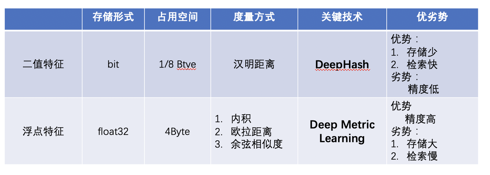

# 特征提取
## 1. 特征提取简介
特征提取是图像识别中的关键一环，它的作用是将输入的图片转化为固定维度的特征向量，用于后续的[向量检索](./vector_search.md)。好的特征需要具备相似度保持性，即在特征空间中，相似度高的图片对其特征相似度要比较高（距离比较近）；相似度低的图片，其特征相似度要比较小（距离比较远）。依据应用场景的不同， 我们可以选用不同长度的实值特征(real-valued feature)或者是二值特征（binary feature)。顾名思义，实值特征的每个元素都是一个实数，而二值特征每个元素为非0即1（或者表示为-1和1），二者的差异见下表所示。



[Deep Metric Learning](../algorithm_introduction/metric_learning.md)和 DeepHash分别用以研究如何通过深度学习的方法获得好的实值和二值特征表示。本文主要介绍如何使用PaddleClas构建一个特征学习网络， 如何进行训练、评估和推理。
## 2. 网络结构

为了图像识别任务的灵活定制，我们将整个网络分为Backbone, Neck, Head以及Loss部分，整体结构如上图所示，下面分别介绍各自的功能:
- Backbone:   指定所使用的骨干网络。 值得注意的是，PaddleClas提供的基于ImageNet的预训练模型，最后一层的输出为1000， 我们需要依据所需的特征维度定制最后一层的输出。
- Neck:  用以特征增强及特征维度变换。  这儿的Neck，可以是一个简单的Linear Layer，用来做特征维度变换；也可以是较复杂的FPN结构，用以做特征增强。
- Head:  用来将feature转化为logits。 除了常用的Fc Layer外，还可以替换为cosmargin, arcmargin, circlemargin等模块
- Loss:  指定所使用的Loss函数。  我们将Loss设计为组合loss的形式， 可以方便得将Classification Loss和Similarity Preserving Loss组合在一起

## 3. 配置文件介绍
下面以通用图像识别为例，介绍配置文件的含义：
## 网络结构
```
Arch:
  name: RecModel
  infer_output_key: features
  infer_add_softmax: False

  Backbone: 
    name: PPLCNet_x2_5
    pretrained: True
    use_ssld: True
  BackboneStopLayer:
    name: flatten_0
  Neck:
    name: FC
    embedding_size: 1280
    class_num: 512
  Head:
    name: ArcMargin 
    embedding_size: 512
    class_num: 185341
    margin: 0.2
    scale: 30
```
- **name**: 模型的名字。有别于PaddleClas提供的标准分类模型，定制化的识别模型，统一命名为RecModel
- **infer_output_key**: 推理时需要用到的Tensor的key名。 训练模型时，网络会以字典的形式输出features和logits。识别任务中，推理时只需要用到features
- **infer_output_key**： 推理时是否需要加softmax。为了和分类任务的统一后处理；分类任务推理时需要加softmax操作，识别任务不需要
- **Backbone**:  骨干网络。 此处选用的是经过SSLD蒸馏之后的PPLCNet_x2_5预训练模型
- **BackboneStopLayer**:  网络截断指示。用以去除预训练模型的最后一层Linear, 方便后续定制特征增强功能和特征维度变化
- **Neck**:  用以进行特征维度转换。 此处输出为512维的特征向量
- **Head**:  用来将feature转化为logits。 此处采用ArcMargin, 可以依据训练数据修改类别数class_num, 以及超参数margin和scale

## Loss构成
### 单Loss示例
```
Loss:
  Train:
    - CELoss:
        weight: 1.0
  Eval:
    - CELoss:
        weight: 1.0
```
此处选用的是CELoss， 结合Head部分的ArcMargin, 因此使用的是[ArcFace](https://arxiv.org/abs/1801.07698)中的算法

### 组合Loss示例
```
Loss:
  Train:
    - CELoss:
        weight: 1.0
    - TripletLossV2:
        weight: 1.0
        margin: 0.5
  Eval:
    - CELoss:
        weight: 1.0
```
此处选用的是CELoss和TripletLoss的一个组合，两者的比例为1：1.

# 4.训练、评估、推理
下面以`ppcls/configs/Products/ResNet50_vd_SOP.yaml`为例，介绍模型的训练、评估、推理过程
## 4.1 数据准备
首先，下载[SOP](https://cvgl.stanford.edu/projects/lifted_struct/)数据集, 数据文件结构如下所示：
```
.
├── bicycle_final
├── bicycle_final.txt
├── cabinet_final
├── cabinet_final.txt
├── chair_final
......
├── Ebay_final.txt
├── Ebay_info.txt
├── Ebay_test.txt
├── Ebay_train.txt
├── fan_final
......
├── LICENSE
```

## 4.2 训练
- 单机单卡训练
```
python tools/train.py -c ppcls/configs/ResNet50_vd_SOP.yaml
```
- 单机多卡训练
```
python -m paddle.distributed.launch 
    --gpus="0,1,2,3" tools/train.py 
    -c ppcls/configs/ResNet50_vd_SOP.yaml
```
训练完成之后，会在`output`目录下生成`best_model`模型文件。

## 4.3 评估
- 单卡评估
```
python tools/eval.py -c ppcls/configs/ResNet50_vd_SOP.yaml -o Global.pretrained_model="output/RecModel/best_model"
```
- 多卡评估
```
python -m paddle.distributed.launch 
    --gpus="0,1,2,3" tools/eval.py 
    -c  ppcls/configs/ResNet50_vd_SOP.yaml
    -o  Global.pretrained_model="output/RecModel/best_model"
```
## 4.4 推理
推理过程包括两个步骤： 1)导出推理模型, 2)获取特征向量
### 4.4.1 导出推理模型
```
python tools/export_model -c ppcls/configs/ResNet50_vd_SOP.yaml -o Global.pretrained_model="output/RecModel/best_model"
```
生成的推理模型位于`inference`目录，名字为`inference.pd*`

### 4.4.2 获取特征向量
```
cd deploy
python python/predict_rec.py -c configs/inference_rec.yaml  -o rec_inference_model_dir="../inference"
```
