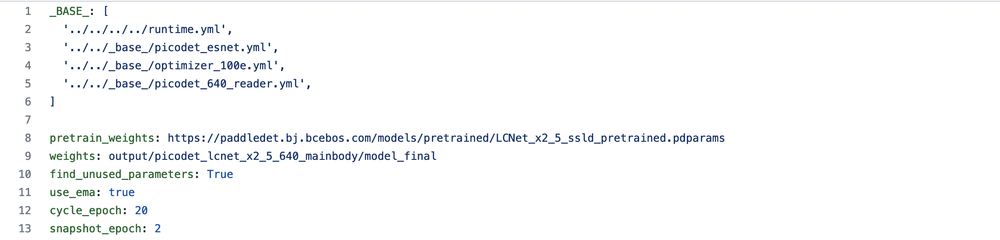

# 主体检测


主体检测技术是目前应用非常广泛的一种检测技术，它指的是检测出图片中一个或者多个主体的坐标位置，然后将图像中的对应区域裁剪下来，进行识别，从而完成整个识别过程。主体检测是识别任务的前序步骤，可以有效提升识别精度。

本部分主要从数据集、模型选择和模型训练 3 个方面对该部分内容进行介绍。

----------

## 目录

- [1. 数据集](#1)
- [2. 模型选择](#2)
  - [2.1 轻量级主体检测模型](#2.1)
  - [2.2 服务端主体检测模型](#2.2)
- [3. 模型训练](#3)
  - [3.1 环境准备](#3.1)
  - [3.2 数据准备](#3.2)
  - [3.3 配置文件改动和说明](#3.3)
  - [3.4 启动训练](#3.4)
  - [3.5 模型预测与调试](#3.5)
- [4. 模型推理部署](#4)
  - [4.1 推理模型准备](#4.1)
  - [4.2 基于python预测引擎推理](#4.2)
  - [4.3 其他推理方式](#4.3)


<a name="1"></a>

## 1. 数据集

在 PaddleClas 的识别任务中，训练主体检测模型时主要用到了以下几个数据集。

| 数据集       | 数据量 | 主体检测任务中使用的数据量 | 场景         | 数据集地址                                                 |
| ------------ | ------ | -------------------------- | ------------ | ---------------------------------------------------------- |
| Objects365   | 170W   | 6k                         | 通用场景     | [地址](https://www.objects365.org/overview.html)           |
| COCO2017     | 12W    | 5k                         | 通用场景     | [地址](https://cocodataset.org/)                           |
| iCartoonFace | 2k     | 2k                         | 动漫人脸检测 | [地址](https://github.com/luxiangju-PersonAI/iCartoonFace) |
| LogoDet-3k   | 3k     | 2k                         | Logo 检测    | [地址](https://github.com/Wangjing1551/LogoDet-3K-Dataset) |
| RPC          | 3k     | 3k                         | 商品检测     | [地址](https://rpc-dataset.github.io/)                     |

在实际训练的过程中，将所有数据集混合在一起。由于是主体检测，这里将所有标注出的检测框对应的类别都修改为 `前景` 的类别，最终融合的数据集中只包含 1 个类别，即前景。

<a name="2"></a>

## 2. 模型选择

目标检测方法种类繁多，比较常用的有两阶段检测器（如 FasterRCNN 系列等）；单阶段检测器（如 YOLO、SSD 等）；anchor-free 检测器（如 PicoDet、FCOS 等）。PaddleDetection 中针对服务端使用场景，自研了 PP-YOLO 系列模型；针对端侧（CPU 和移动端等）使用场景，自研了 PicoDet 系列模型，在服务端和端侧均处于业界较为领先的水平。

基于上述研究，PaddleClas 中提供了 2 个通用主体检测模型，为轻量级与服务端主体检测模型，分别适用于端侧场景以及服务端场景。下面的表格中给出了在上述 5 个数据集上的平均 mAP 以及它们的模型大小、预测速度对比信息。

| 模型               | 模型结构  | 预训练模型下载地址                                           | inference 模型下载地址                                       | mAP   | inference 模型大小(MB) | 单张图片预测耗时(不包含预处理)(ms) |
| ------------------ | --------- | ------------------------------------------------------------ | ------------------------------------------------------------ | ----- | ---------------------- | ---------------------------------- |
| 轻量级主体检测模型 | PicoDet   | [地址](https://paddle-imagenet-models-name.bj.bcebos.com/dygraph/rec/models/pretrain/picodet_PPLCNet_x2_5_mainbody_lite_v1.0_pretrained.pdparams) | [tar 格式文件地址](https://paddle-imagenet-models-name.bj.bcebos.com/dygraph/rec/models/inference/picodet_PPLCNet_x2_5_mainbody_lite_v1.0_infer.tar) [zip 格式文件地址](https://paddle-imagenet-models-name.bj.bcebos.com/dygraph/rec/models/inference/picodet_PPLCNet_x2_5_mainbody_lite_v1.0_infer.zip) | 40.1% | 30.1                   | 29.8                               |
| 服务端主体检测模型 | PP-YOLOv2 | [地址](https://paddle-imagenet-models-name.bj.bcebos.com/dygraph/rec/models/pretrain/ppyolov2_r50vd_dcn_mainbody_v1.0_pretrained.pdparams) | [tar 格式文件地址](https://paddle-imagenet-models-name.bj.bcebos.com/dygraph/rec/models/inference/ppyolov2_r50vd_dcn_mainbody_v1.0_infer.tar) [zip 格式文件地址](https://paddle-imagenet-models-name.bj.bcebos.com/dygraph/rec/models/inference/ppyolov2_r50vd_dcn_mainbody_v1.0_infer.zip) | 42.5% | 210.5                  | 466.6                              |

* 注意
  * 由于部分解压缩软件在解压上述 `tar` 格式文件时存在问题，建议非命令行用户下载 `zip` 格式文件并解压。`tar` 格式文件建议使用命令 `tar xf xxx.tar` 解压。
  * 速度评测机器的 CPU 具体信息为：`Intel(R) Xeon(R) Gold 6148 CPU @ 2.40GHz`，速度指标为开启 mkldnn，线程数设置为 10 测试得到。
  * 主体检测的预处理过程较为耗时，平均每张图在上述机器上的时间在 40~55 ms 左右，没有包含在上述的预测耗时统计中。

<a name="2.1"></a>

### 2.1 轻量级主体检测模型

PicoDet 由 [PaddleDetection](https://github.com/PaddlePaddle/PaddleDetection) 提出，是一个适用于 CPU 或者移动端场景的目标检测算法。具体地，它融合了下面一系列优化算法。

- [ATSS](https://arxiv.org/abs/1912.02424)
- [Generalized Focal Loss](https://arxiv.org/abs/2006.04388)
- 余弦学习率策略
- Cycle-EMA
- 轻量级检测 head


更多关于 PicoDet 的优化细节与 benchmark 可以参考 [PicoDet 系列模型介绍](https://github.com/PaddlePaddle/PaddleDetection/blob/develop/configs/picodet/README.md)。

在轻量级主体检测任务中，为了更好地兼顾检测速度与效果，我们使用 PPLCNet_x2_5 作为主体检测模型的骨干网络，同时将训练与预测的图像尺度修改为了 640x640，其余配置与 [picodet_lcnet_1_5x_416_coco.yml](https://github.com/PaddlePaddle/PaddleDetection/blob/develop/configs/picodet/more_config/picodet_lcnet_1_5x_416_coco.yml) 完全一致。将数据集更换为自定义的主体检测数据集，进行训练，最终得到检测模型。

<a name="2.2"></a>

### 2.2 服务端主体检测模型

PP-YOLO 由 [PaddleDetection](https://github.com/PaddlePaddle/PaddleDetection) 提出，从骨干网络、数据增广、正则化策略、损失函数、后处理等多个角度对 yolov3 模型进行深度优化，最终在“速度-精度”方面达到了业界领先的水平。具体地，优化的策略如下。

- 更优的骨干网络: ResNet50vd-DCN
- 更大的训练 batch size: 8 GPUs，每 GPU batch_size=24，对应调整学习率和迭代轮数
- [Drop Block](https://arxiv.org/abs/1810.12890)
- [Exponential Moving Average](https://www.investopedia.com/terms/e/ema.asp)
- [IoU Loss](https://arxiv.org/pdf/1902.09630.pdf)
- [Grid Sensitive](https://arxiv.org/abs/2004.10934)
- [Matrix NMS](https://arxiv.org/pdf/2003.10152.pdf)
- [CoordConv](https://arxiv.org/abs/1807.03247)
- [Spatial Pyramid Pooling](https://arxiv.org/abs/1406.4729)
- 更优的预训练模型

更多关于 PP-YOLO 的详细介绍可以参考：[PP-YOLO 模型](https://github.com/PaddlePaddle/PaddleDetection/blob/release%2F2.1/configs/ppyolo/README_cn.md)。

在服务端主体检测任务中，为了保证检测效果，我们使用 ResNet50vd-DCN 作为检测模型的骨干网络，使用配置文件 [ppyolov2_r50vd_dcn_365e_coco.yml](https://github.com/PaddlePaddle/PaddleDetection/blob/release/2.1/configs/ppyolo/ppyolov2_r50vd_dcn_365e_coco.yml)，更换为自定义的主体检测数据集，进行训练，最终得到检测模型。

<a name="3"></a>

## 3. 模型训练

本节主要介绍怎样基于 PaddleDetection，基于自己的数据集，训练主体检测模型。

<a name="3.1"></a>

### 3.1 环境准备

下载 PaddleDetection 代码，安装 requirements。

```shell
cd <path/to/clone/PaddleDetection>
git clone https://github.com/PaddlePaddle/PaddleDetection.git

cd PaddleDetection
# 安装其他依赖
pip install -r requirements.txt
```

更多安装教程，请参考: [安装文档](https://github.com/PaddlePaddle/PaddleDetection/blob/release/2.1/docs/tutorials/INSTALL_cn.md)

<a name="3.2"></a>

### 3.2 数据准备

对于自定义数据集，首先需要将自己的数据集修改为 COCO 格式，可以参考[自定义检测数据集教程](https://github.com/PaddlePaddle/PaddleDetection/blob/release/2.1/static/docs/tutorials/Custom_DataSet.md)制作 COCO 格式的数据集。

主体检测任务中，所有的检测框均属于前景，在这里需要将标注文件中，检测框的 `category_id` 修改为 1，同时将整个标注文件中的 `categories` 映射表修改为下面的格式，即整个类别映射表中只包含`前景`类别。

```json
[{u'id': 1, u'name': u'foreground', u'supercategory': u'foreground'}]
```

<a name="3.3"></a>

### 3.3 配置文件改动和说明

我们使用 `configs/ppyolo/ppyolov2_r50vd_dcn_365e_coco.yml` 配置进行训练，配置文件摘要如下：



从上图看到 `ppyolov2_r50vd_dcn_365e_coco.yml` 配置需要依赖其他的配置文件，这些配置文件的含义如下:

```
coco_detection.yml：主要说明了训练数据和验证数据的路径

runtime.yml：主要说明了公共的运行参数，比如是否使用 GPU、每多少个 epoch 存储 checkpoint 等

optimizer_365e.yml：主要说明了学习率和优化器的配置

ppyolov2_r50vd_dcn.yml：主要说明模型和主干网络的情况

ppyolov2_reader.yml：主要说明数据读取器配置，如 batch size，并发加载子进程数等，同时包含读取后预处理操作，如 resize、数据增强等等
```

在主体检测任务中，需要将 `datasets/coco_detection.yml` 中的 `num_classes` 参数修改为 1（只有 1 个前景类别），同时将训练集和测试集的路径修改为自定义数据集的路径。

此外，也可以根据实际情况，修改上述文件，比如，如果显存溢出，可以将 batch size 和学习率等比缩小等。

<a name="3.4"></a>

### 3.4 启动训练

PaddleDetection 提供了单卡/多卡训练模式，满足用户多种训练需求。

* GPU 单卡训练

```bash
# windows 和 Mac 下不需要执行该命令
export CUDA_VISIBLE_DEVICES=0
python tools/train.py -c configs/ppyolo/ppyolov2_r50vd_dcn_365e_coco.yml
```

* GPU 多卡训练

```bash
export CUDA_VISIBLE_DEVICES=0,1,2,3
python -m paddle.distributed.launch --gpus 0,1,2,3 tools/train.py -c configs/ppyolo/ppyolov2_r50vd_dcn_365e_coco.yml --eval
```

--eval：表示边训练边验证。


* （**推荐**）模型微调
如果希望加载 PaddleClas 中已经训练好的主体检测模型，在自己的数据集上进行模型微调，可以使用下面的命令进行训练。

```bash
export CUDA_VISIBLE_DEVICES=0
# 指定 pretrain_weights 参数，加载通用的主体检测预训练模型
python tools/train.py -c configs/ppyolo/ppyolov2_r50vd_dcn_365e_coco.yml -o pretrain_weights=https://paddle-imagenet-models-name.bj.bcebos.com/dygraph/rec/models/pretrain/ppyolov2_r50vd_dcn_mainbody_v1.0_pretrained.pdparams
```

* 模型恢复训练

在日常训练过程中，有的用户由于一些原因导致训练中断，可以使用 `-r` 的命令恢复训练:

```bash
export CUDA_VISIBLE_DEVICES=0,1,2,3
python -m paddle.distributed.launch --gpus 0,1,2,3 tools/train.py -c configs/ppyolo/ppyolov2_r50vd_dcn_365e_coco.yml --eval -r output/ppyolov2_r50vd_dcn_365e_coco/10000
```

注意：如果遇到 "`Out of memory error`" 问题, 尝试在 `ppyolov2_reader.yml` 文件中调小 `batch_size`，同时等比例调小学习率。

<a name="3.5"></a>

### 3.5 模型预测与调试

使用下面的命令完成 PaddleDetection 的预测过程。

```bash
export CUDA_VISIBLE_DEVICES=0
python tools/infer.py -c configs/ppyolo/ppyolov2_r50vd_dcn_365e_coco.yml --infer_img=your_image_path.jpg --output_dir=infer_output/ --draw_threshold=0.5 -o weights=output/ppyolov2_r50vd_dcn_365e_coco/model_final
```

`--draw_threshold` 是个可选参数. 根据 [NMS](https://ieeexplore.ieee.org/document/1699659) 的计算，不同阈值会产生不同的结果 `keep_top_k` 表示设置输出目标的最大数量，默认值为 100，用户可以根据自己的实际情况进行设定。

<a name="4"></a>
## 4. 模型推理部署

<a name="4.1"></a>
### 4.1 推理模型准备

执行导出模型脚本：

```bash
python tools/export_model.py -c configs/ppyolo/ppyolov2_r50vd_dcn_365e_coco.yml --output_dir=./inference -o weights=output/ppyolov2_r50vd_dcn_365e_coco/model_final.pdparams
```

预测模型会导出到 `inference/ppyolov2_r50vd_dcn_365e_coco` 目录下，分别为 `infer_cfg.yml` (预测不需要), `model.pdiparams`, `model.pdiparams.info`, `model.pdmodel` 。

注意： `PaddleDetection` 导出的 inference 模型的文件格式为 `model.xxx`，这里如果希望与 PaddleClas 的 inference 模型文件格式保持一致，需要将其 `model.xxx` 文件修改为 `inference.xxx` 文件，用于后续主体检测的预测部署。

更多模型导出教程，请参考： [EXPORT_MODEL](https://github.com/PaddlePaddle/PaddleDetection/blob/release/2.4/deploy/EXPORT_MODEL.md)

最终，目录 `inference/ppyolov2_r50vd_dcn_365e_coco` 中包含 `inference.pdiparams`, `inference.pdiparams.info` 以及 `inference.pdmodel` 文件，其中 `inference.pdiparams` 为保存的 inference 模型权重文件，`inference.pdmodel` 为保存的 inference 模型结构文件。

<a name="4.2"></a>
### 4.2 基于python预测引擎推理

导出模型之后，在主体检测与识别任务中，就可以将检测模型的路径更改为该 inference 模型路径，完成预测。

以商品识别为例，其配置文件为 [inference_product.yaml](../../../deploy/configs/inference_product.yaml)，修改其中的 `Global.det_inference_model_dir` 字段为导出的主体检测 inference 模型目录，参考[图像识别快速开始教程](../quick_start/quick_start_recognition.md)，即可完成商品检测与识别过程。

<a name="4.3"></a>
### 4.3 其他推理方式
其他推理方法，如C++推理部署、PaddleServing部署等请参考[检测模型推理部署](https://github.com/PaddlePaddle/PaddleDetection/blob/release/2.4/deploy/README.md)。


### FAQ

#### Q：可以使用其他的主体检测模型结构吗？

* A：可以的，但是目前的检测预处理过程仅适配了 PicoDet 以及 YOLO 系列的预处理，因此在使用的时候，建议优先使用这两个系列的模型进行训练，如果希望使用 Faster RCNN 等其他系列的模型，需要按照 PaddleDetection 的数据预处理，修改下预处理逻辑，这块如果您有需求或者有问题的话，欢迎提 issue 或者在微信群里反馈。

#### Q：可以修改主体检测的预测尺度吗？

* A：可以的，但是需要注意 2 个地方
  * PaddleClas 中提供的主体检测模型是基于 `640x640` 的分辨率去训练的，因此预测的时候也是默认使用 `640x640` 的分辨率进行预测，使用其他分辨率预测的话，精度会有所降低。
  * 在模型导出的时候，建议也修改下模型导出的分辨率，保持模型导出、模型预测的分辨率一致。
