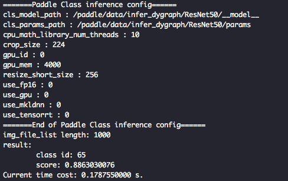

# 服务器端 C++ 预测

本教程将介绍在服务器端部署 PaddleClas 分类模型的详细步骤，识别模型部署方式将在近期支持，敬请期待。

---

## 目录

- [1. 准备环境](#1)
    - [1.1 编译 opencv 库](#1.1)
    - [1.2 准备环境](#1.2)
        - [1.2.1 预测库源码编译](#1.2.1)
        - [1.2.2 直接下载安装](#1.2.2)
- [2. 编译](#2)
    - [2.1 编译 PaddleClas C++ 预测 demo](#2.1)
    - [2.2 编译 config lib 预测库与 cls lib 预测库](#2.2)
- [3. 运行](#3)
    - [3.1 准备 inference model](#3.1)
    - [3.2 运行 demo](#3.2)


<a name="1"></a>
## 1. 准备环境

- Linux 环境，推荐使用 docker。
- Windows 环境，目前支持基于 `Visual Studio 2019 Community` 进行编译；此外，如果您希望通过生成 `sln 解决方案` 的方式进行编译，可以参考该文档：[https://zhuanlan.zhihu.com/p/145446681](https://zhuanlan.zhihu.com/p/145446681)

* 该文档主要介绍基于 Linux 环境下的 PaddleClas C++ 预测流程，如果需要在 Windows 环境下使用预测库进行 C++ 预测，具体编译方法请参考 [Windows 下编译教程](./cpp_deploy_on_windows.md)。

<a name="1.1"></a>
### 1.1 编译 opencv 库

* 首先需要从 opencv 官网上下载在 Linux 环境下源码编译的包，以 3.4.7 版本为例，下载及解压缩命令如下：

```
wget https://github.com/opencv/opencv/archive/3.4.7.tar.gz
tar -xvf 3.4.7.tar.gz
```

执行完成上述命令后，会在当前目录下生成 `opencv-3.4.7/` 的目录。

* 编译 opencv，首先设置 opencv 源码路径(`root_path`)以及安装路径(`install_path`)，`root_path` 为下载的 opencv 源码路径，`install_path` 为 opencv 的安装路径。在本例中，源码路径即为当前目录下的 `opencv-3.4.7/`。

```shell
cd ./opencv-3.4.7
export root_path=$PWD
export install_path=${root_path}/opencv3
```

* 然后在 opencv 源码路径下，按照下面的命令进行编译：

```shell
rm -rf build
mkdir build
cd build

cmake .. \
    -DCMAKE_INSTALL_PREFIX=${install_path} \
    -DCMAKE_BUILD_TYPE=Release \
    -DBUILD_SHARED_LIBS=OFF \
    -DWITH_IPP=OFF \
    -DBUILD_IPP_IW=OFF \
    -DWITH_LAPACK=OFF \
    -DWITH_EIGEN=OFF \
    -DCMAKE_INSTALL_LIBDIR=lib64 \
    -DWITH_ZLIB=ON \
    -DBUILD_ZLIB=ON \
    -DWITH_JPEG=ON \
    -DBUILD_JPEG=ON \
    -DWITH_PNG=ON \
    -DBUILD_PNG=ON \
    -DWITH_TIFF=ON \
    -DBUILD_TIFF=ON

make -j
make install
```

* 执行完成上述命令后，会生成 opencv 头文件和库文件，用于后面的 PaddleClas 代码编译。

以 opencv3.4.7 版本为例，最终在安装路径下的文件结构如下所示。**注意**：不同的 opencv 版本，下述的文件结构可能不同。

```
opencv3/
|-- bin
|-- include
|-- lib64
|-- share
```

<a name="1.2"></a>
### 1.2 获取 Paddle 预测库

* 有 2 种方式获取 Paddle 预测库，下面进行详细介绍。

<a name="1.2.1"></a>
#### 1.2.1 预测库源码编译
如果希望获取最新预测库特性，可以从 GitHub 上克隆 Paddle 最新代码，从源码编译预测库。对于不同平台的编译流程，请参考 [Paddle 预测库官网](https://paddleinference.paddlepaddle.org.cn/v2.1/user_guides/source_compile.html) 的说明。编译示例如下：

1. 使用 Git 获取源代码：

```shell
git clone https://github.com/PaddlePaddle/Paddle.git
cd Paddle
```

2. 进入 `Paddle` 目录后，开始进行编译：

```shell
rm -rf build
mkdir build
cd build

cmake  .. \
    -DWITH_CONTRIB=OFF \
    -DWITH_MKL=ON \
    -DWITH_MKLDNN=ON  \
    -DWITH_TESTING=OFF \
    -DCMAKE_BUILD_TYPE=Release \
    -DWITH_INFERENCE_API_TEST=OFF \
    -DON_INFER=ON \
    -DWITH_PYTHON=ON
make -j
make inference_lib_dist
```

关于编译参数选项可以参考 Paddle C++ 预测库官网：[编译选项表](https://www.paddlepaddle.org.cn/documentation/docs/zh/develop/install/Tables.html#bianyixuanxiangbiao)。


3. 编译完成之后，可以在 `./build/paddle_inference_install_dir/` 文件下看到以下文件及目录：

```
build/paddle_inference_install_dir/
|-- CMakeCache.txt
|-- paddle
|-- third_party
|-- version.txt
```

<a name="1.2.2"></a>
#### 1.2.2 直接下载安装

[Paddle 预测库官网](https://paddleinference.paddlepaddle.org.cn/v2.1/user_guides/download_lib.html#c) 上提供了不同版本的 Paddle 预测库，包括多个操作系统平台和 GPU、CPU 等多个硬件平台的预编译库，可以在官网查找并选择合适的预测库版本进行下载，建议选择 `2.1.1` 版本。

**注意**：在选择预测库时，所选预测库版本需要与后续编译选项一致：
* CPU 预测库仅可用于 GPU 预测，具体又分为 `mkl` 和 `openblas`，分别对应其低层实现基于 `MKL` 数学运算库 和 `OpenBLAS` 数学运算库；
* GPU 预测库支持 GPU 预测和 CPU 预测，其 GPU 预测功能底层实现基于 CUDA、cuDNN，CPU 预测功能底层基于 `MKL` 实现。

以 `manylinux_cuda10.2_cudnn8.1_avx_mkl_trt7_gcc8.2` 的 `2.1.1` 版本为例，可使用下述命令下载并解压：

```shell
wget https://paddle-inference-lib.bj.bcebos.com/2.1.1-gpu-cuda10.2-cudnn8.1-mkl-gcc8.2/paddle_inference.tgz
tar -xf paddle_inference.tgz
```

上述命令会在当前目录下生成 `paddle_inference/` 目录。

<a name="2"></a>
## 2. 编译

<a name="2.1"></a>
### 2.1 编译 PaddleClas C++ 预测 demo

编译命令如下，其中 Paddle C++ 预测库、OpenCV 等依赖库的路径需要根据机器上的实际位置进行修改。

```shell
sh tools/build_demo.sh
```

具体地，`tools/build_demo.sh` 中内容如下：

```shell
OpenCV_DIR=path/to/opencv
PADDLE_LIB_DIR=path/to/paddle
CUDA_LIB_DIR=path/to/cuda
CUDNN_LIB_DIR=path/to/cudnn
TENSORRT_LIB_DIR=path/to/tensorrt
CONFIG_LIB_PATH=path/to/config/library
CLS_LIB_PATH=path/to/cls/library
CMP_STATIC=ON

BUILD_DIR=build
rm -rf ${BUILD_DIR}
mkdir ${BUILD_DIR}
cd ${BUILD_DIR}
cmake .. \
    -DWITH_MKL=ON \
    -DWITH_GPU=ON \
    -DWITH_TENSORRT=OFF \
    -DWITH_STATIC_LIB=OFF \
    -DOpenCV_DIR=${OpenCV_DIR} \
    -DPADDLE_LIB=${PADDLE_LIB_DIR} \
    -DCUDA_LIB=${CUDA_LIB_DIR} \
    -DCUDNN_LIB=${CUDNN_LIB_DIR} \
    -DCONFIG_LIB=${CONFIG_LIB_PATH} \
    -DCLS_LIB=${CLS_LIB_PATH} \
    -DCMP_STATIC=OFF \

make -j
```

上述命令中，各个编译选项的具体说明如下：
* `DWITH_MKL`：是否使用 MKL 数学运算库，默认为 `ON`，注意需要与下载的预测库版本一致。如为 `OpenBLAS` 版本预测库，则需设置为 `OFF`；
* `DWITH_GPU`：使用使用 GPU 预测库，默认为 `OFF`，当下载预测库版本为 GPU 预测库时，可置为 `ON`，同时请设置 `DCUDA_LIB` 与 `DCUDNN_LIB`，否则请设置为 `OFF`；
* `DWITH_TENSORRT`：是否使用 TensorRT，默认为 `OFF`，当 `DWITH_GPU` 设置为 `ON` 时有效，同时请设置 `DTENSORRT_LIB`；
* `DWITH_STATIC_LIB`：是否使用 Paddle 预测库中的静态链接库，默认为 `OFF`；
* `DOpenCV_DIR`：OpenCV 编译库的路径，本例中为 `opencv-3.4.7/opencv3/share/OpenCV`，注意该路径下需要有 `OpenCVConfig.cmake` 文件；
* `DPADDLE_LIB`：Paddle 预测库路径，一般使用下载并解压的预编译库路径 `paddle_inference` 即可，或编译生成的预测库的路径 `build/paddle_inference_install_dir`，注意该路径下需要有 `paddle` 和 `third_party` 两个子路径；
* `DCUDA_LIB`：CUDA 库路径，当 `DWITH_GPU` 设置为 `ON` 时有效，在 docker 中通常为 `/usr/local/cuda/lib64`；
* `DCUDNN_LIB`：cuDNN 库路径，当 `DWITH_GPU` 设置为 `ON` 时有效，在 docker 中通常为 `/usr/lib/x86_64-linux-gnu/`；
* `DTENSORRT_LIB`：TensorRT 库路径，当 `DWITH_GPU` 与 `DUSE_TENSORRT` 均设置为 `ON` 时有效，在 dokcer 中通常为 `/usr/local/TensorRT6-cuda10.0-cudnn7/`；
* `DCONFIG_LIB`：如需使用已编译好的 `config lib`，请设置为 `config lib` 的路径，否则请删除该选项；
* `DCLS_LIB`：如需使用已编译好的 `cls lib`，请设置为 `cls lib` 的路径，否则请删除该选项；
* `DCMP_STATIC`：是否将 `config lib` 和 `cls lib` 编译为静态链接库，默认为 `ON`，如需编译为动态链接库，请设置为 `OFF`。

在执行上述命令，编译完成之后，会在当前路径下生成 `build` 目录，其中有可执行文件 `clas_system`。并且，如未设置 `DCONFIG_LIB` 与 `DCLS_LIB`，则会在 `.\lib\` 路径下生成 `config lib` 和 `cls lib` 两个库文件，根据 `DCMP_STATIC` 的设置，两个库文件将被编译为静态链接库（`libconfig.a`、`libcls.a`）或动态链接库（`libconfig.so`、`libcls.so`）。

<a name="2.2"></a>
### 2.2 编译 config lib 预测库与 cls lib 预测库

除了可以直接编译 demo，也同样可以仅编译 config lib 和 cls lib 预测库，只需运行如下命令：

```shell
sh tools/build_lib.sh
```

具体地，`tools/build_lib.sh` 中内容如下：

```shell
OpenCV_DIR=path/to/opencv
PADDLE_LIB_DIR=path/to/paddle

BUILD_DIR=./lib/build
rm -rf ${BUILD_DIR}
mkdir ${BUILD_DIR}
cd ${BUILD_DIR}
cmake .. \
    -DOpenCV_DIR=${OpenCV_DIR} \
    -DPADDLE_LIB=${PADDLE_LIB_DIR} \
    -DCMP_STATIC=ON \

make
```

上述命令中，各个编译选项的具体说明如下：
* `DOpenCV_DIR`：OpenCV 编译库的路径，本例中为 `opencv-3.4.7/opencv3/share/OpenCV`，注意该路径下需要有 `OpenCVConfig.cmake` 文件；
* `DPADDLE_LIB`：Paddle 预测库路径，一般使用下载并解压的预编译库路径 `paddle_inference` 即可，或编译生成的预测库的路径 `build/paddle_inference_install_dir`，注意该路径下需要有 `paddle` 和 `third_party` 两个子路径；
* `DCMP_STATIC`：是否将 `config lib` 和 `cls lib` 编译为静态链接库（`.a`），默认为 `ON`，如需编译为动态链接库（`.so`），请设置为 `OFF`。

执行上述命令后，将在目录 `./lib/` 下生成 `config lib` 和 `cls lib` 的动态链接库（`libcls.so` 和 `libconfig.so`）或静态链接库（`libcls.a` 和 `libconfig.a`）。在[2.1 编译 PaddleClas C++ 预测 demo](#2.1)中，可以通过指定编译选项 `DCLS_LIB` 和 `DCONFIG_LIB` 指定已有链接库的路径，链接库同样也可用于二次开发。

<a name="3"></a>
## 3. 运行

<a name="3.1"></a>
### 3.1 准备 inference model

首先需要准备 inference model，关于将模型导出为 inference model 的具体步骤，可以参考 [模型导出](./export_model.md) 文档。假设导出的预测模型文件放在 `./inference` 目录下，则目录结构如下。

```
inference/
|--inference.pdmodel
|--inference.pdiparams
```

**注意**：上述文件中，`cls_infer.pdmodel` 文件存储了模型网络结构信息，`cls_infer.pdiparams` 文件存储了模型参数权重信息。在运行预测时，注意两个文件的路径需要分别设置为配置文件 `tools/config.txt` 中的字段 `cls_model_path` 和 `cls_params_path` 的值。

<a name="3.2"></a>
### 3.2 运行 demo

首先修改 `tools/config.txt` 中对应字段：
* use_gpu：是否使用 GPU；
* gpu_id：使用的 GPU 卡号；
* gpu_mem：显存；
* cpu_math_library_num_threads：底层科学计算库所用线程的数量；
* use_mkldnn：是否使用 MKLDNN 加速；
* use_tensorrt: 是否使用 tensorRT 进行加速；
* use_fp16：是否使用半精度浮点数进行计算，该选项仅在 use_tensorrt 为 true 时有效；
* cls_model_path：预测模型结构文件路径；
* cls_params_path：预测模型参数文件路径；
* resize_short_size：预处理时图像缩放大小；
* crop_size：预处理时图像裁剪后的大小。

然后修改 `tools/run.sh`：
  * `./build/clas_system ./tools/config.txt ./docs/imgs/ILSVRC2012_val_00000666.JPEG`
  * 上述命令中分别为：编译得到的可执行文件 `clas_system`；运行时的配置文件 `config.txt`；待预测的图像。

* 最后执行以下命令，完成对一幅图像的分类。

```shell
sh tools/run.sh
```

* 最终屏幕上会输出结果，如下图所示。



其中 `class id` 表示置信度最高的类别对应的 id，score 表示图片属于该类别的概率。
