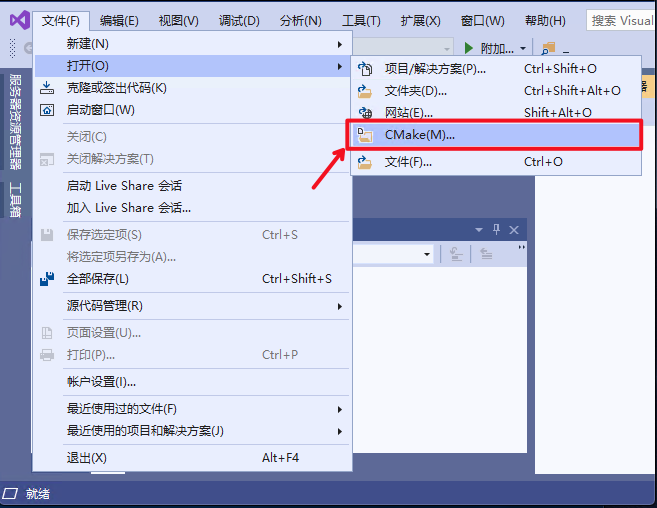
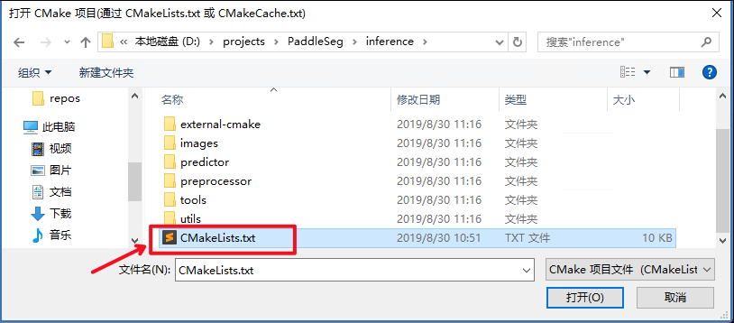
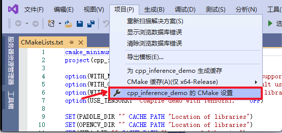
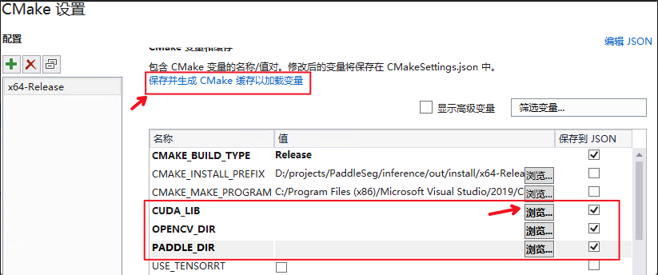
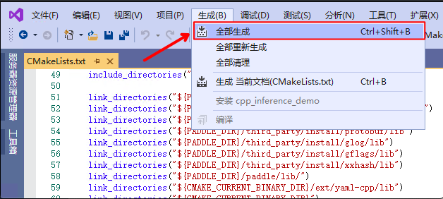

# 基于 Visual Studio 2019 Community CMake 编译指南

PaddleClas 在 Windows 平台下基于 `Visual Studio 2019 Community` 进行了测试。微软从 `Visual Studio 2017` 开始即支持直接管理 `CMake` 跨平台编译项目，但是直到 `2019` 版才提供了稳定和完全的支持，所以如果你想使用 CMake 管理项目编译构建，我们推荐使用 `Visual Studio 2019`。如果您希望通过生成 `sln 解决方案` 的方式进行编译，可以参考该文档：[https://zhuanlan.zhihu.com/p/145446681](https://zhuanlan.zhihu.com/p/145446681)。

-----
## 目录
* [1. 前置条件](#1)
	* [1.1 下载 PaddlePaddle C++ 预测库 paddle_inference_install_dir](#1.1)
	* [1.2 安装配置 OpenCV](#1.2)
* [2. 使用 Visual Studio 2019 编译](#2)
* [3. 预测](#3)
	* [3.1 准备 inference model](#3.1)
	* [3.2 运行预测](#3.2)
	* [3.3 注意事项](#3.3)

<a name='1'></a>
## 1. 前置条件
* Visual Studio 2019
* CUDA 9.0 / CUDA 10.0，cudnn 7.6+（仅在使用 GPU 版本的预测库时需要）
* CMake 3.0+

请确保系统已经正确安装并配置好上述基本软件，其中：
  * 在安装 `Visual Studio 2019` 时，`工作负载` 需要勾选 `使用 C++的桌面开发`；
  * CUDA 需要正确安装并设置系统环境变量；
  * CMake 需要正确安装并将路径添加到系统环境变量中。

以下示例基于 `Visual Studio 2019 Community` 版本，以工作目录为 `D:\projects` 进行演示。

<a name="1.1"></a>
### 1.1 下载 PaddlePaddle C++ 预测库 paddle_inference_install_dir

PaddlePaddle C++ 预测库针对不同的 `CPU `和 `CUDA` 版本提供了不同的预编译版本，请根据实际情况下载: [C++预测库下载列表](https://paddleinference.paddlepaddle.org.cn/user_guides/download_lib.html#windows)，建议选择 `2.1.1` 版本。

**注意**：在选择预测库时，所选预测库版本需要与后续编译选项一致：
* CPU 预测库仅可用于 GPU 预测，具体又分为 `mkl` 和 `openblas`，分别对应其低层实现基于 `MKL` 数学运算库 和 `OpenBLAS` 数学运算库；
* GPU 预测库支持 GPU 预测和 CPU 预测，其 GPU 预测功能底层实现基于 CUDA、cuDNN，CPU 预测功能底层基于 `MKL` 实现。

下载并解压后，目录 `D:\projects\paddle_inference_install_dir` 包含内容为：

```
paddle_inference_install_dir
├── paddle      # paddle 核心库和头文件
├── third_party # 第三方依赖库和头文件
└── version.txt # 版本和编译信息
```

**注意**：需要将 `Paddle 预测库` 的路径（`D:\projects\paddle_inference_install_dir\paddle\lib`）添加到系统环境变量 `Path` 中。

<a name='1.2'></a>
### 1.2 安装配置 OpenCV

1. 在 OpenCV 官网下载适用于 Windows 平台的 3.4.6 版本，[下载地址](https://sourceforge.net/projects/opencvlibrary/files/3.4.6/opencv-3.4.6-vc14_vc15.exe/download)；
2. 运行下载的可执行文件，将 OpenCV 解压至指定目录，如 `D:\projects\opencv`；
3. 配置环境变量，如下流程所示：
  * 此电脑（我的电脑）-> 属性 -> 高级系统设置 -> 环境变量；
  * 在系统变量中找到 Path（如没有，自行创建），并双击编辑；
  * 新建，将 OpenCV 路径填入并保存，如 `D:\projects\opencv\build\x64\vc14\bin`；

<a name="2"></a>
## 2. 使用 Visual Studio 2019 编译

1. 打开 Visual Studio 2019 Community，点击 `继续但无需代码`


2. 点击：`文件`->`打开`->`CMake`



选择项目代码所在路径，并打开 `CMakeList.txt`：



3. 点击：`项目`->`CMake 设置`



4. 请设置以下参数的值

| 名称                          | 值                 | 保存到 JSON |
| ----------------------------- | ------------------ | ----------- |
| CMAKE_BACKWARDS_COMPATIBILITY | 3.17               | [√]         |
| CMAKE_BUILD_TYPE              | RelWithDebInfo     | [√]         |
| CUDA_LIB                      | CUDA 的库路径         | [√]         |
| CUDNN_LIB                     | CUDNN 的库路径        | [√]         |
| OpenCV_DIR                    | OpenCV 的安装路径     | [√]         |
| PADDLE_LIB                    | Paddle 预测库的路径   | [√]         |
| WITH_GPU                      | [√]                | [√]         |
| WITH_MKL                      | [√]                | [√]         |
| WITH_STATIC_LIB               | [√]                | [√]         |

除上述选项外，还有以下两个选项可依据具体情况设置：
* `DCONFIG_LIB`：如需使用已编译好的 `config lib`，请设置为 `config lib` 的路径，否则请删除该选项；
* `DCLS_LIB`：如需使用已编译好的 `cls lib`，请设置为 `cls lib` 的路径，否则请删除该选项；

**注意**：
* `CMAKE_BACKWARDS_COMPATIBILITY` 的值请根据自己 `cmake` 版本设置，`cmake` 版本可以通过命令：`cmake --version` 查询；
* `CUDA_LIB` 、 `CUDNN_LIB` 的值仅需在使用 **GPU 版本**预测库时指定，其中 CUDA 库版本尽量对齐，**使用 9.0、10.0 版本，不使用 9.2、10.1 等版本 CUDA 库**；
* 在设置 `CUDA_LIB`、`CUDNN_LIB`、`OPENCV_DIR`、`PADDLE_LIB` 时，点击 `浏览`，分别设置相应的路径；
   * `CUDA_LIB` 和 `CUDNN_LIB`：该路径取决于 CUDA 与 CUDNN 的安装位置。
   * `OpenCV_DIR`：该路径下需要有`.cmake` 文件，一般为 `opencv/build/`；
   * `PADDLE_LIB`：该路径下需要有 `CMakeCache.txt` 文件，一般为 `paddle_inference_install_dir/`。
* 在使用 `CPU` 版预测库时，请不要勾选 `WITH_GPU` - `保存到 JSON`。



设置完成后，点击上图中 `保存并生成 CMake 缓存以加载变量`。

5. 点击`生成`->`全部生成`



在编译完成后，会生成可执行文件 `clas_system.exe`。并且，如未设置 `DCONFIG_LIB` 与 `DCLS_LIB`，则会在 `.\lib\` 目录下生成 `config lib` 和 `cls lib` 两个静态链接库文件（`libconfig.a`、`libcls.a`）。类似地，你也可以仅编译生成 `config lib` 和 `cls lib` 两个静态链接库文件，只需打开路径为 `D:\projects\PaddleClas\deploy\cpp\lib\CMakeList.txt` 的 `CMake` 文件并进行编译即可，具体参考[2. 使用 Visual Studio 2019 编译](#2)，完成编译后，同样可在 `.\lib\` 目录下生成静态链接库文件，静态链接库文件可用于二次开发。

<a name='3'></a>
## 3. 预测

<a name='3.1'></a>
### 3.1 准备 inference model

首先需要准备 inference model，关于将模型导出为 inference model 的具体步骤，可以参考 [模型导出](./export_model.md) 文档。假设导出的预测模型文件放在 `./inference` 目录下，则目录结构如下。

```
inference/
|--inference.pdmodel
|--inference.pdiparams
```

**注意**：上述文件中，`cls_infer.pdmodel` 文件存储了模型网络结构信息，`cls_infer.pdiparams` 文件存储了模型参数权重信息。在运行预测时，注意两个文件的路径需要分别设置为配置文件 `tools/config.txt` 中的字段 `cls_model_path` 和 `cls_params_path` 的值。

<a name='3.2'></a>
### 3.2 运行预测

首先修改 `tools/config.txt` 中对应字段：
* use_gpu：是否使用 GPU；
* gpu_id：使用的 GPU 卡号；
* gpu_mem：显存；
* cpu_math_library_num_threads：底层科学计算库所用线程的数量；
* use_mkldnn：是否使用 MKLDNN 加速；
* use_tensorrt: 是否使用 tensorRT 进行加速；
* use_fp16：是否使用半精度浮点数进行计算，该选项仅在 use_tensorrt 为 true 时有效；
* cls_model_path：预测模型结构文件路径；
* cls_params_path：预测模型参数文件路径；
* resize_short_size：预处理时图像缩放大小；
* crop_size：预处理时图像裁剪后的大小。

`Visual Studio 2019` 编译产出的可执行文件 `clas_system.exe` 在 `out\build\x64-Release` 目录下，打开 `cmd`，并切换到该目录：

```shell
cd D:\projects\PaddleClas\deploy\cpp\out\build\x64-Release
```

可执行文件 `clas_system.exe` 即为编译产出的的预测程序，运行下述命令即可执行预测：
```shell
.\clas_system.exe D:\projects\PaddleClas\deploy\cpp\tools\config.txt .\docs\ILSVRC2012_val_00008306.JPEG
```

上述命令中，第一个参数（`D:\projects\PaddleClas\deploy\cpp\tools\config.txt`）为配置文件路径，第二个参数（`.\docs\ILSVRC2012_val_00008306.JPEG`）为需要预测的图片路径。

注意，需要在配置文件中正确设置预测参数，包括所用模型文件的路径（`cls_model_path` 和 `cls_params_path`）。
<a name='3.3'></a>
### 3.3 注意事项
* 在 Windows 下的终端中执行文件 exe 时，可能会发生乱码的现象，此时需要在终端中输入 `CHCP 65001`，将终端的编码方式由 GBK 编码(默认)改为 UTF-8 编码，更加具体的解释可以参考这篇博客：[https://blog.csdn.net/qq_35038153/article/details/78430359](https://blog.csdn.net/qq_35038153/article/details/78430359)；
* 如果需要使用 CPU 预测，PaddlePaddle 在 Windows 上仅支持 avx 的 CPU 预测，目前不支持 noavx 的 CPU 预测；
* 在使用生成的 `clas_system.exe` 进行预测时，如提示 `由于找不到 paddle_fluid.dll，无法继续执行代码。重新安装程序可能会解决此问题`，请检查是否将 Paddle 预测库路径添加到系统环境变量，详见[1.1 下载 PaddlePaddle C++ 预测库 paddle_inference_install_dir](#1.1)。
