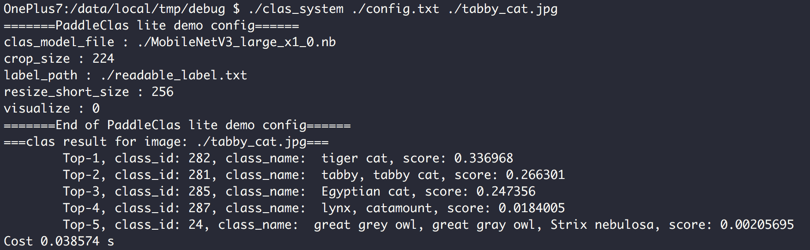

# PaddleLite 推理部署
---

本教程将介绍基于[Paddle Lite](https://github.com/PaddlePaddle/Paddle-Lite)在移动端部署 PaddleClas 分类模型的详细步骤。识别模型的部署将在近期支持，敬请期待。

Paddle Lite 是飞桨轻量化推理引擎，为手机、IOT 端提供高效推理能力，并广泛整合跨平台硬件，为端侧部署及应用落地问题提供轻量化的部署方案。

如果希望直接测试速度，可以参考[Paddle-Lite 移动端 benchmark 测试教程](../others/paddle_mobile_inference.md)。

---

## 目录
- [1. 准备环境](#1)
    - [1.1 准备交叉编译环境](#1.1)
    - [1.2 准备预测库](#1.2)
- [2. 开始运行](#2)
    - [2.1 模型优化](#2.1)
        - [2.1.1 pip 安装 paddlelite 并进行转换](#2.1.1)
        - [2.1.2 源码编译 Paddle-Lite 生成 opt 工具](#2.1.2)
        - [2.1.3 转换示例](#2.1.3)
    - [2.2 与手机联调](#2.2)
- [3. FAQ](#3)

<a name="1"></a>
## 1. 准备环境

Paddle Lite 目前支持以下平台部署：
* 电脑（编译 Paddle Lite）
* 安卓手机（armv7 或 armv8）

<a name="1.1"></a>
### 1.1 准备交叉编译环境

交叉编译环境用于编译 Paddle Lite 和 PaddleClas 的 C++ demo。
支持多种开发环境，关于 Docker、Linux、macOS、Windows 等不同开发环境的编译流程请参考[文档](https://paddle-lite.readthedocs.io/zh/latest/source_compile/compile_env.html)。

<a name="1.2"></a>
### 1.2 准备预测库

预测库有两种获取方式：
1. [建议]直接下载，预测库下载链接如下：
      |平台|预测库下载链接|
      |-|-|
      |Android|[arm7](https://paddlelite-data.bj.bcebos.com/Release/2.8-rc/Android/gcc/inference_lite_lib.android.armv7.gcc.c++_static.with_extra.with_cv.tar.gz) / [arm8](https://paddlelite-data.bj.bcebos.com/Release/2.8-rc/Android/gcc/inference_lite_lib.android.armv8.gcc.c++_static.with_extra.with_cv.tar.gz)|
      |iOS|[arm7](https://paddlelite-data.bj.bcebos.com/Release/2.8-rc/iOS/inference_lite_lib.ios.armv7.with_cv.with_extra.tiny_publish.tar.gz) / [arm8](https://paddlelite-data.bj.bcebos.com/Release/2.8-rc/iOS/inference_lite_lib.ios.armv8.with_cv.with_extra.tiny_publish.tar.gz)|

      **注**：
      1. 如果是从 Paddle-Lite [官方文档](https://paddle-lite.readthedocs.io/zh/latest/quick_start/release_lib.html#android-toolchain-gcc)下载的预测库，
      注意选择 `with_extra=ON，with_cv=ON` 的下载链接。
      2. 如果使用量化的模型部署在端侧，建议使用 Paddle-Lite develop 分支编译预测库。

2. 编译 Paddle-Lite 得到预测库，Paddle-Lite 的编译方式如下：

```shell
git clone https://github.com/PaddlePaddle/Paddle-Lite.git
cd Paddle-Lite
# 如果使用编译方式，建议使用 develop 分支编译预测库
git checkout develop
./lite/tools/build_android.sh  --arch=armv8  --with_cv=ON --with_extra=ON
```
**注意**：编译 Paddle-Lite 获得预测库时，需要打开`--with_cv=ON --with_extra=ON`两个选项，`--arch`表示`arm`版本，这里指定为 armv8，更多编译命令介绍请参考[Linux x86 环境下编译适用于 Android 的库](https://paddle-lite.readthedocs.io/zh/latest/source_compile/linux_x86_compile_android.html)，关于其他平台的编译操作，具体请参考[PaddleLite](https://paddle-lite.readthedocs.io/zh/latest/)中`源码编译`部分。

直接下载预测库并解压后，可以得到`inference_lite_lib.android.armv8/`文件夹，通过编译 Paddle-Lite 得到的预测库位于`Paddle-Lite/build.lite.android.armv8.gcc/inference_lite_lib.android.armv8/`文件夹下。
预测库的文件目录如下：

```
inference_lite_lib.android.armv8/
|-- cxx                                        C++ 预测库和头文件
|   |-- include                                C++ 头文件
|   |   |-- paddle_api.h
|   |   |-- paddle_image_preprocess.h
|   |   |-- paddle_lite_factory_helper.h
|   |   |-- paddle_place.h
|   |   |-- paddle_use_kernels.h
|   |   |-- paddle_use_ops.h
|   |   `-- paddle_use_passes.h
|   `-- lib                                           C++预测库
|       |-- libpaddle_api_light_bundled.a             C++静态库
|       `-- libpaddle_light_api_shared.so             C++动态库
|-- java                                     Java 预测库
|   |-- jar
|   |   `-- PaddlePredictor.jar
|   |-- so
|   |   `-- libpaddle_lite_jni.so
|   `-- src
|-- demo                                     C++和Java示例代码
|   |-- cxx                                  C++  预测库demo
|   `-- java                                 Java 预测库demo
```

<a name="2"></a>
## 2. 开始运行

<a name="2.1"></a>
### 2.1 模型优化

Paddle-Lite 提供了多种策略来自动优化原始的模型，其中包括量化、子图融合、混合精度、Kernel 优选等方法，使用 Paddle-Lite 的 `opt` 工具可以自动对 inference 模型进行优化，目前支持两种优化方式，优化后的模型更轻量，模型运行速度更快。在进行模型优化前，需要先准备 `opt` 优化工具，有以下两种方式。

**注意**：如果已经准备好了 `.nb` 结尾的模型文件，可以跳过此步骤。

<a name="2.1.1"></a>
#### 2.1.1 [建议]pip 安装 paddlelite 并进行转换

Python 下安装 `paddlelite`，目前最高支持 `Python3.7`。
**注意**：`paddlelite` whl 包版本必须和预测库版本对应。

```shell
pip install paddlelite==2.8
```

之后使用 `paddle_lite_opt` 工具可以进行 inference 模型的转换。`paddle_lite_opt` 的部分参数如下

|选项|说明|
|-|-|
|--model_dir|待优化的 PaddlePaddle 模型（非 combined 形式）的路径|
|--model_file|待优化的 PaddlePaddle 模型（combined 形式）的网络结构文件路径|
|--param_file|待优化的 PaddlePaddle 模型（combined 形式）的权重文件路径|
|--optimize_out_type|输出模型类型，目前支持两种类型：protobuf 和 naive_buffer，其中 naive_buffer 是一种更轻量级的序列化/反序列化实现。若您需要在 mobile 端执行模型预测，请将此选项设置为 naive_buffer。默认为 protobuf|
|--optimize_out|优化模型的输出路径|
|--valid_targets|指定模型可执行的 backend，默认为 arm。目前可支持 x86、arm、opencl、npu、xpu，可以同时指定多个 backend（以空格分隔），Model Optimize Tool 将会自动选择最佳方式。如果需要支持华为 NPU（Kirin 810/990 Soc 搭载的达芬奇架构 NPU），应当设置为 npu, arm|
|--record_tailoring_info|当使用 根据模型裁剪库文件 功能时，则设置该选项为 true，以记录优化后模型含有的 kernel 和 OP 信息，默认为 false|

`--model_file` 表示 inference 模型的 model 文件地址，`--param_file` 表示 inference 模型的 param 文件地址；`optimize_out` 用于指定输出文件的名称（不需要添加 `.nb` 的后缀）。直接在命令行中运行 `paddle_lite_opt`，也可以查看所有参数及其说明。

<a name="2.1.2"></a>
#### 2.1.2 源码编译 Paddle-Lite 生成 opt 工具

模型优化需要 Paddle-Lite 的 `opt` 可执行文件，可以通过编译 Paddle-Lite 源码获得，编译步骤如下：

```shell
# 如果准备环境时已经 clone 了 Paddle-Lite，则不用重新 clone Paddle-Lite
git clone https://github.com/PaddlePaddle/Paddle-Lite.git
cd Paddle-Lite
git checkout develop
# 启动编译
./lite/tools/build.sh build_optimize_tool
```

编译完成后，`opt` 文件位于 `build.opt/lite/api/` 下，可通过如下方式查看 `opt` 的运行选项和使用方式：

```shell
cd build.opt/lite/api/
./opt
```

`opt` 的使用方式与参数与上面的 `paddle_lite_opt` 完全一致。

<a name="2.1.3"></a>
#### 2.1.3 转换示例

下面以 PaddleClas 的 `MobileNetV3_large_x1_0` 模型为例，介绍使用 `paddle_lite_opt` 完成预训练模型到 inference 模型，再到 Paddle-Lite 优化模型的转换。

```shell
# 进入 PaddleClas 根目录
cd PaddleClas_root_path

# 下载并解压 inference 模型
wget https://paddle-imagenet-models-name.bj.bcebos.com/dygraph/inference/MobileNetV3_large_x1_0_infer.tar
tar -xf MobileNetV3_large_x1_0_infer.tar

# 将 inference 模型转化为 Paddle-Lite 优化模型
paddle_lite_opt --model_file=./MobileNetV3_large_x1_0_infer/inference.pdmodel --param_file=./MobileNetV3_large_x1_0_infer/inference.pdiparams --optimize_out=./MobileNetV3_large_x1_0
```

最终在当前文件夹下生成 `MobileNetV3_large_x1_0.nb` 的文件。

**注意**：`--optimize_out` 参数为优化后模型的保存路径，无需加后缀 `.nb`；`--model_file` 参数为模型结构信息文件的路径，`--param_file` 参数为模型权重信息文件的路径，请注意文件名。

<a name="2.2"></a>
### 2.2 与手机联调

首先需要进行一些准备工作。
1. 准备一台 arm8 的安卓手机，如果编译的预测库和 opt 文件是 armv7，则需要 arm7 的手机，并修改 Makefile 中 `ARM_ABI = arm7`。
2. 电脑上安装 ADB 工具，用于调试。 ADB 安装方式如下：

    * MAC 电脑安装 ADB:
    ```shell
    brew cask install android-platform-tools
    ```
    * Linux 安装 ADB
    ```shell
    sudo apt update
    sudo apt install -y wget adb
    ```
    * Window 安装 ADB
    win 上安装需要去谷歌的安卓平台下载 ADB 软件包进行安装：[链接](https://developer.android.com/studio)

3. 手机连接电脑后，开启手机 `USB 调试` 选项，选择 `文件传输` 模式，在电脑终端中输入：

```shell
adb devices
```
如果有 device 输出，则表示安装成功，如下所示：
```
List of devices attached
744be294    device
```

4. 准备优化后的模型、预测库文件、测试图像和类别映射文件。

```shell
cd PaddleClas_root_path
cd deploy/lite/

# 运行 prepare.sh
# prepare.sh 会将预测库文件、测试图像和使用的字典文件放置在预测库中的 demo/cxx/clas 文件夹下
sh prepare.sh /{lite prediction library path}/inference_lite_lib.android.armv8

# 进入 lite demo 的工作目录
cd /{lite prediction library path}/inference_lite_lib.android.armv8/
cd demo/cxx/clas/

# 将 C++ 预测动态库 so 文件复制到 debug 文件夹中
cp ../../../cxx/lib/libpaddle_light_api_shared.so ./debug/
```

`prepare.sh` 以 `PaddleClas/deploy/lite/imgs/tabby_cat.jpg` 作为测试图像，将测试图像复制到 `demo/cxx/clas/debug/` 文件夹下。
将 `paddle_lite_opt` 工具优化后的模型文件放置到 `/{lite prediction library path}/inference_lite_lib.android.armv8/demo/cxx/clas/debug/` 文件夹下。本例中，使用 [2.1.3 转换示例](#2.1.3) 生成的 `MobileNetV3_large_x1_0.nb` 模型文件。

执行完成后，clas 文件夹下将有如下文件格式：

```
demo/cxx/clas/
|-- debug/
|   |--MobileNetV3_large_x1_0.nb                优化后的分类器模型文件
|   |--tabby_cat.jpg                               待测试图像
|   |--imagenet1k_label_list.txt                类别映射文件
|   |--libpaddle_light_api_shared.so    C++预测库文件
|   |--config.txt                       分类预测超参数配置
|-- config.txt                                  分类预测超参数配置
|-- image_classfication.cpp                图像分类代码文件
|-- Makefile                                    编译文件
```

#### 注意：
* 上述文件中，`imagenet1k_label_list.txt` 是 ImageNet1k 数据集的类别映射文件，如果使用自定义的类别，需要更换该类别映射文件。

*  `config.txt` 包含了分类器的超参数，如下：

```shell
clas_model_file ./MobileNetV3_large_x1_0.nb # 模型文件地址
label_path ./imagenet1k_label_list.txt         # 类别映射文本文件
resize_short_size 256                       # resize 之后的短边边长
crop_size 224                                 # 裁剪后用于预测的边长 
visualize 0       # 是否进行可视化，如果选择的话，会在当前文件夹下生成名为 clas_result.png 的图像文件。
```

5. 启动调试，上述步骤完成后就可以使用 ADB 将文件夹 `debug/` push 到手机上运行，步骤如下：

```shell
# 执行编译，得到可执行文件 clas_system
make -j

# 将编译得到的可执行文件移动到 debug 文件夹中
mv clas_system ./debug/

# 将上述 debug 文件夹 push 到手机上
adb push debug /data/local/tmp/

adb shell
cd /data/local/tmp/debug
export LD_LIBRARY_PATH=/data/local/tmp/debug:$LD_LIBRARY_PATH

# clas_system 可执行文件的使用方式为:
# ./clas_system 配置文件路径  测试图像路径
./clas_system ./config.txt ./tabby_cat.jpg
```

如果对代码做了修改，则需要重新编译并 push 到手机上。

运行效果如下：

<div align="center">
    
</div>

<a name="3"></a>
## 3. FAQ
Q1：如果想更换模型怎么办，需要重新按照流程走一遍吗？  
A1：如果已经走通了上述步骤，更换模型只需要替换 `.nb` 模型文件即可，同时要注意修改下配置文件中的 `.nb` 文件路径以及类别映射文件（如有必要）。

Q2：换一个图测试怎么做？  
A2：替换 debug 下的测试图像为你想要测试的图像，使用 ADB 再次 push 到手机上即可。
