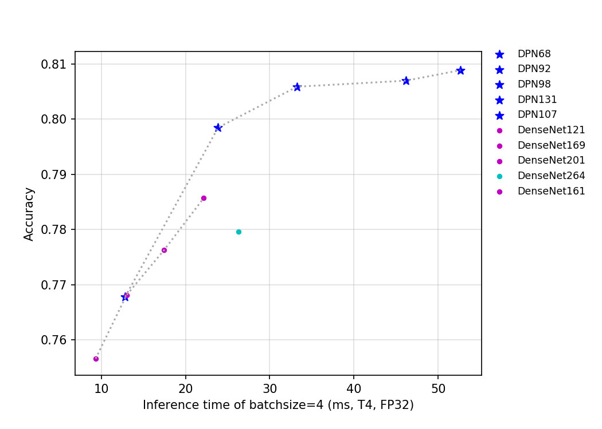
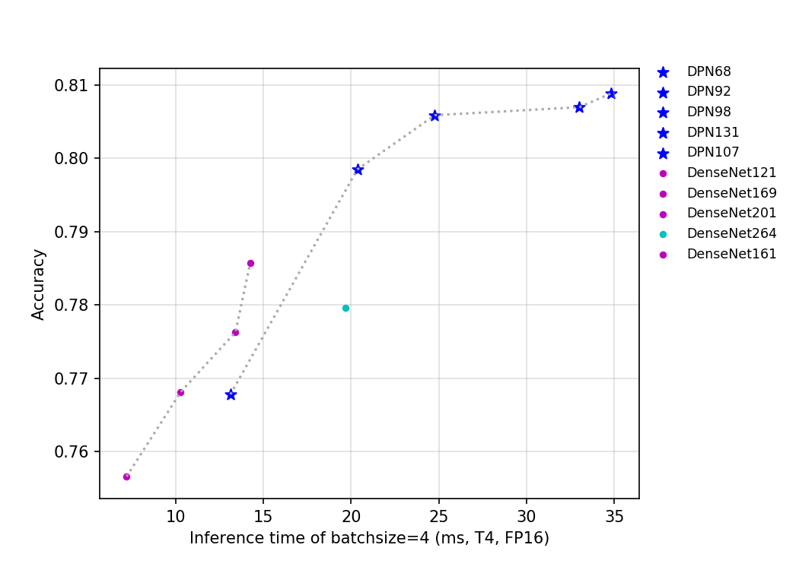

# DPN 与 DenseNet 系列
---
## 目录

* [1. 概述](#1)
* [2. 精度、FLOPS 和参数量](#2)
* [3. 基于 V100 GPU 的预测速度](#3)
* [4. 基于 T4 GPU 的预测速度](#4)

 

## 1. 概述
DenseNet 是 2017 年 CVPR best paper 提出的一种新的网络结构，该网络设计了一种新的跨层连接的 block，即 dense-block。相比 ResNet 中的 bottleneck，dense-block 设计了一个更激进的密集连接机制，即互相连接所有的层，每个层都会接受其前面所有层作为其额外的输入。DenseNet 将所有的 dense-block 堆叠，组合成了一个密集连接型网络。密集的连接方式使得 DenseNe 更容易进行梯度的反向传播，使得网络更容易训练。
DPN 的全称是 Dual Path Networks，即双通道网络。该网络是由 DenseNet 和 ResNeXt 结合的一个网络，其证明了 DenseNet 能从靠前的层级中提取到新的特征，而 ResNeXt 本质上是对之前层级中已提取特征的复用。作者进一步分析发现，ResNeXt 对特征有高复用率，但冗余度低，DenseNet 能创造新特征，但冗余度高。结合二者结构的优势，作者设计了 DPN 网络。最终 DPN 网络在同样 FLOPS 和参数量下，取得了比 ResNeXt 与 DenseNet 更好的结果。

该系列模型的 FLOPS、参数量以及 T4 GPU 上的预测耗时如下图所示。

目前 PaddleClas 开源的这两类模型的预训练模型一共有 10 个，其指标如上图所示，可以看到，在相同的 FLOPS 和参数量下，相比 DenseNet，DPN 拥有更高的精度。但是由于 DPN 有更多的分支，所以其推理速度要慢于 DenseNet。由于 DenseNet264 的网络层数最深，所以该网络是 DenseNet 系列模型中参数量最大的网络，DenseNet161 的网络的宽度最大，导致其是该系列中网络中计算量最大、精度最高的网络。从推理速度来看，计算量大且精度高的的 DenseNet161 比 DenseNet264 具有更快的速度，所以其比 DenseNet264 具有更大的优势。

对于 DPN 系列网络，模型的 FLOPS 和参数量越大，模型的精度越高。其中，由于 DPN107 的网络宽度最大，所以其是该系列网络中参数量与计算量最大的网络。

## 2. 精度、FLOPS 和参数量

| Models      | Top1   | Top5   | Reference top1 | Reference top5 | FLOPS (G) | Parameters (M) |
|:--:|:--:|:--:|:--:|:--:|:--:|:--:|
| DenseNet121 | 0.757  | 0.926  | 0.750             |                   | 5.690        | 7.980             |
| DenseNet161 | 0.786  | 0.941  | 0.778             |                   | 15.490       | 28.680            |
| DenseNet169 | 0.768  | 0.933  | 0.764             |                   | 6.740        | 14.150            |
| DenseNet201 | 0.776  | 0.937  | 0.775             |                   | 8.610        | 20.010            |
| DenseNet264 | 0.780  | 0.939  | 0.779             |                   | 11.540       | 33.370            |
| DPN68       | 0.768  | 0.934  | 0.764             | 0.931             | 4.030        | 10.780            |
| DPN92       | 0.799  | 0.948  | 0.793             | 0.946             | 12.540       | 36.290            |
| DPN98       | 0.806  | 0.951  | 0.799             | 0.949             | 22.220       | 58.460            |
| DPN107      | 0.809  | 0.953  | 0.802             | 0.951             | 35.060       | 82.970            |
| DPN131      | 0.807  | 0.951  | 0.801             | 0.949             | 30.510       | 75.360            |

 
## 3. 基于 V100 GPU 的预测速度

| Models                               | Crop Size | Resize Short Size | FP32 Batch Size=1 (ms) | FP32 Batch Size=4 (ms) | FP32 Batch Size=8 (ms) |
|-------------|-----------|-------------------|-------------------|-------------------|-------------------|
| DenseNet121 | 224       | 256               | 3.40               | 6.94               | 9.17               |
| DenseNet161 | 224       | 256               | 7.06               | 14.37              | 19.55              |
| DenseNet169 | 224       | 256               | 5.00               | 10.29              | 12.84              |
| DenseNet201 | 224       | 256               | 6.38               | 13.72              | 17.17              |
| DenseNet264 | 224       | 256               | 9.34              | 20.95             | 25.41             |
| DPN68       | 224       | 256               | 8.18              | 11.40             | 14.82             |
| DPN92       | 224       | 256               | 12.48             | 20.04             | 25.10             |
| DPN98       | 224       | 256               | 14.70             | 25.55             | 35.12             |
| DPN107      | 224       | 256               | 19.46             | 35.62             | 50.22             |
| DPN131      | 224       | 256               | 19.64             | 34.60             | 47.42             |

## 4. 基于 T4 GPU 的预测速度

| Models      | Crop Size | Resize Short Size | FP16 Batch Size=1 (ms) | FP16 Batch Size=4 (ms) | FP16 Batch Size=8 (ms) | FP32 Batch Size=1 (ms) | FP32 Batch Size=4 (ms) | FP32 Batch Size=8 (ms) |
|-------------|-----------|-------------------|------------------------------|------------------------------|------------------------------|------------------------------|------------------------------|------------------------------|
| DenseNet121 | 224       | 256               | 4.16436                      | 7.2126                       | 10.50221                     | 4.40447                      | 9.32623                      | 15.25175                     |
| DenseNet161 | 224       | 256               | 9.27249                      | 14.25326                     | 20.19849                     | 10.39152                     | 22.15555                     | 35.78443                     |
| DenseNet169 | 224       | 256               | 6.11395                      | 10.28747                     | 13.68717                     | 6.43598                      | 12.98832                     | 20.41964                     |
| DenseNet201 | 224       | 256               | 7.9617                       | 13.4171                      | 17.41949                     | 8.20652                      | 17.45838                     | 27.06309                     |
| DenseNet264 | 224       | 256               | 11.70074                     | 19.69375                     | 24.79545                     | 12.14722                     | 26.27707                     | 40.01905                     |
| DPN68       | 224       | 256               | 11.7827                      | 13.12652                     | 16.19213                     | 11.64915                     | 12.82807                     | 18.57113                     |
| DPN92       | 224       | 256               | 18.56026                     | 20.35983                     | 29.89544                     | 18.15746                     | 23.87545                     | 38.68821                     |
| DPN98       | 224       | 256               | 21.70508                     | 24.7755                      | 40.93595                     | 21.18196                     | 33.23925                     | 62.77751                     |
| DPN107      | 224       | 256               | 27.84462                     | 34.83217                     | 60.67903                     | 27.62046                     | 52.65353                     | 100.11721                    |
| DPN131      | 224       | 256               | 28.58941                     | 33.01078                     | 55.65146                     | 28.33119                     | 46.19439                     | 89.24904                     |
