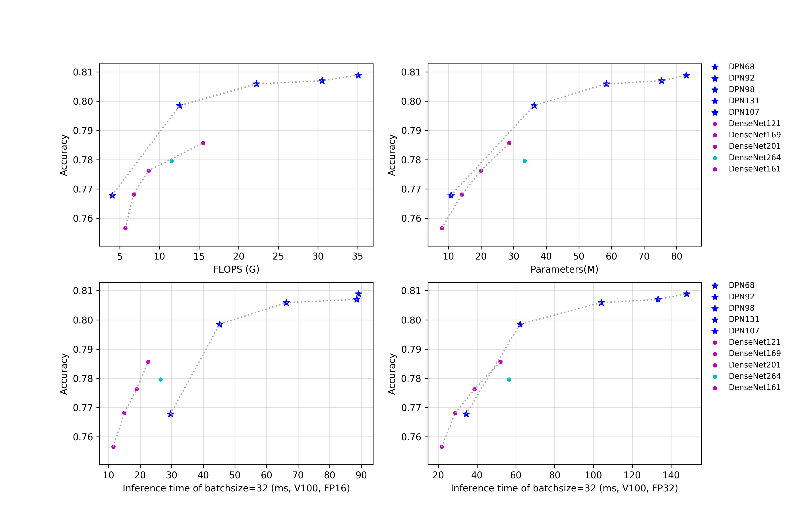

# DPN与DenseNet系列

## 概述
正在持续更新中......

所有模型在预测时，图像的crop_size设置为224，resize_short_size设置为256。

## 精度、FLOPS和参数量

| Models      | Top1   | Top5   | Reference top1 | Reference top5 | FLOPS (G) | Parameters (M) |
|:--:|:--:|:--:|:--:|:--:|:--:|:--:|
| DenseNet121 | 0.757  | 0.926  | 0.750             |                   | 5.690        | 7.980             |
| DenseNet161 | 0.786  | 0.941  | 0.778             |                   | 15.490       | 28.680            |
| DenseNet169 | 0.768  | 0.933  | 0.764             |                   | 6.740        | 14.150            |
| DenseNet201 | 0.776  | 0.937  | 0.775             |                   | 8.610        | 20.010            |
| DenseNet264 | 0.780  | 0.939  | 0.779             |                   | 11.540       | 33.370            |
| DPN68       | 0.768  | 0.934  | 0.764             | 0.931             | 4.030        | 10.780            |
| DPN92       | 0.799  | 0.948  | 0.793             | 0.946             | 12.540       | 36.290            |
| DPN98       | 0.806  | 0.951  | 0.799             | 0.949             | 22.220       | 58.460            |
| DPN107      | 0.809  | 0.953  | 0.802             | 0.951             | 35.060       | 82.970            |
| DPN131      | 0.807  | 0.951  | 0.801             | 0.949             | 30.510       | 75.360            |

## FP32预测速度

| Models                               | Crop Size | Resize Short Size | Batch Size=1 (ms) |
|-------------|-----------|-------------------|--------------------------|
| DenseNet121 | 224       | 256               | 4.371                    |
| DenseNet161 | 224       | 256               | 8.863                    |
| DenseNet169 | 224       | 256               | 6.391                    |
| DenseNet201 | 224       | 256               | 8.173                    |
| DenseNet264 | 224       | 256               | 11.942                   |
| DPN68       | 224       | 256               | 11.805                   |
| DPN92       | 224       | 256               | 17.840                   |
| DPN98       | 224       | 256               | 21.057                   |
| DPN107      | 224       | 256               | 28.685                   |
| DPN131      | 224       | 256               | 28.083                   |
