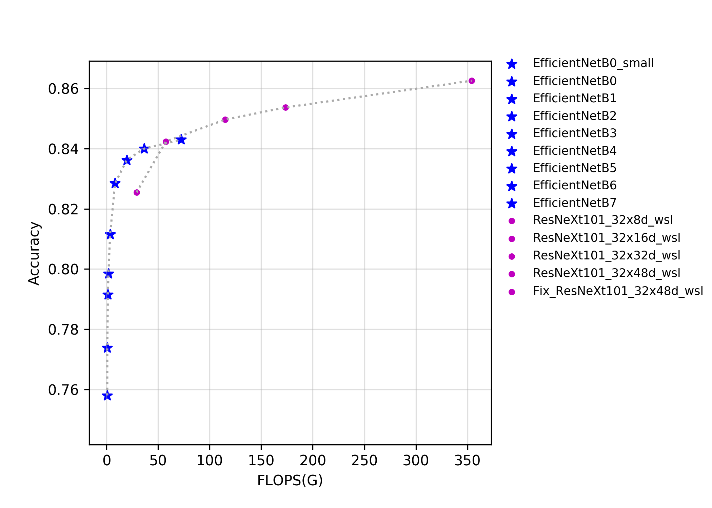
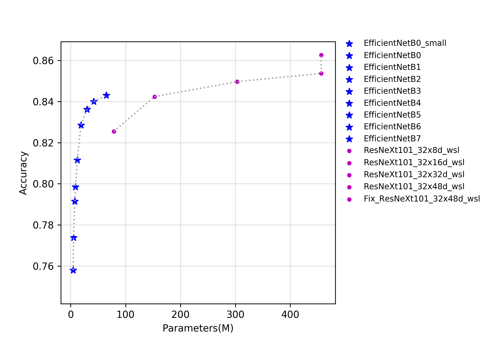
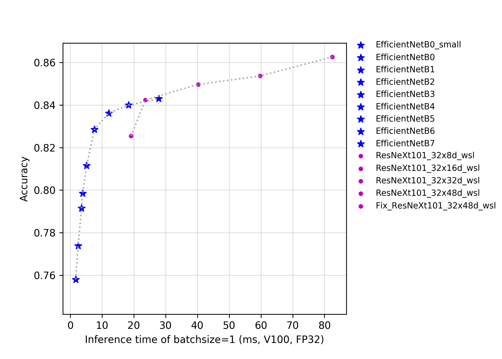

# EfficientNet与ResNeXt101_wsl系列

## 概述
正在持续更新中......

该系列模型的FLOPS、参数量以及FP32预测耗时如下图所示。

## 精度、FLOPS和参数量

| Models                        | Top1   | Top5   | Reference top1 | Reference top5 | FLOPS (G) | Parameters (M) |
|:--:|:--:|:--:|:--:|:--:|:--:|:--:|
| ResNeXt101_ 32x8d_wsl      | 0.826  | 0.967  | 0.822             | 0.964             | 29.140       | 78.440            |
| ResNeXt101_ 32x16d_wsl     | 0.842  | 0.973  | 0.842             | 0.972             | 57.550       | 152.660           |
| ResNeXt101_ 32x32d_wsl     | 0.850  | 0.976  | 0.851             | 0.975             | 115.170      | 303.110           |
| ResNeXt101_ 32x48d_wsl     | 0.854  | 0.977  | 0.854             | 0.976             | 173.580      | 456.200           |
| Fix_ResNeXt101_ 32x48d_wsl | 0.863  | 0.980  | 0.864             | 0.980             | 354.230      | 456.200           |
| EfficientNetB0                | 0.774  | 0.933  | 0.773             | 0.935             | 0.720        | 5.100             |
| EfficientNetB1                | 0.792  | 0.944  | 0.792             | 0.945             | 1.270        | 7.520             |
| EfficientNetB2                | 0.799  | 0.947  | 0.803             | 0.950             | 1.850        | 8.810             |
| EfficientNetB3                | 0.812  | 0.954  | 0.817             | 0.956             | 3.430        | 11.840            |
| EfficientNetB4                | 0.829  | 0.962  | 0.830             | 0.963             | 8.290        | 18.760            |
| EfficientNetB5                | 0.836  | 0.967  | 0.837             | 0.967             | 19.510       | 29.610            |
| EfficientNetB6                | 0.840  | 0.969  | 0.842             | 0.968             | 36.270       | 42.000            |
| EfficientNetB7                | 0.843  | 0.969  | 0.844             | 0.971             | 72.350       | 64.920            |
| EfficientNetB0_ small      | 0.758  | 0.926  |                   |                   | 0.720        | 4.650             |

## FP32预测速度

| Models                               | Crop Size | Resize Short Size | Batch Size=1 (ms) |
|-------------------------------|-----------|-------------------|--------------------------|
| ResNeXt101_ 32x8d_wsl      | 224       | 256               | 19.127                   |
| ResNeXt101_ 32x16d_wsl     | 224       | 256               | 23.629                   |
| ResNeXt101_ 32x32d_wsl     | 224       | 256               | 40.214                   |
| ResNeXt101_ 32x48d_wsl     | 224       | 256               | 59.714                   |
| Fix_ResNeXt101_ 32x48d_wsl | 320       | 320               | 82.431                   |
| EfficientNetB0                | 224       | 256               | 2.449                    |
| EfficientNetB1                | 240       | 272               | 3.547                    |
| EfficientNetB2                | 260       | 292               | 3.908                    |
| EfficientNetB3                | 300       | 332               | 5.145                    |
| EfficientNetB4                | 380       | 412               | 7.609                    |
| EfficientNetB5                | 456       | 488               | 12.078                   |
| EfficientNetB6                | 528       | 560               | 18.381                   |
| EfficientNetB7                | 600       | 632               | 27.817                   |
| EfficientNetB0_ small      | 224       | 256               | 1.692                    |
