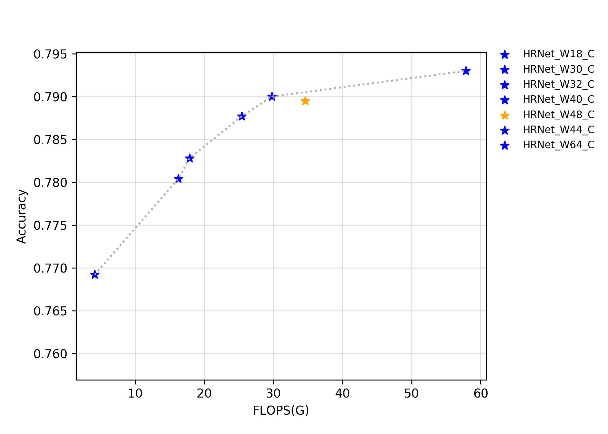
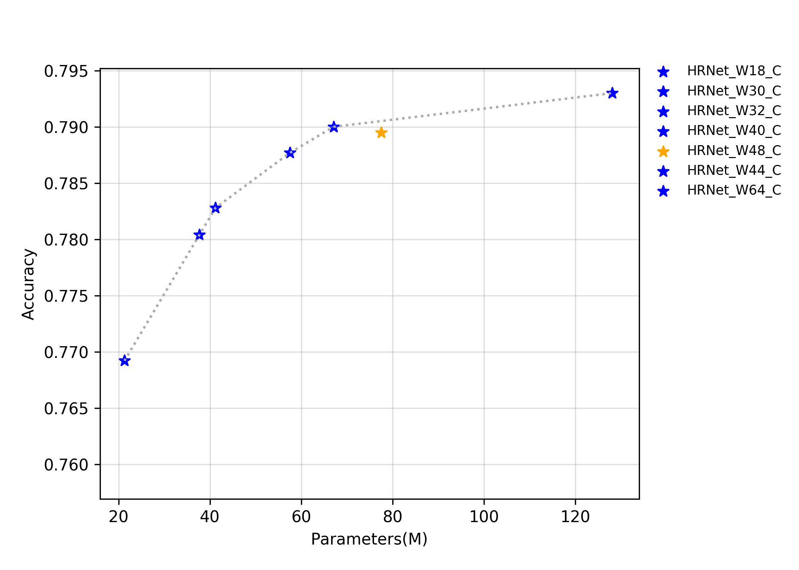
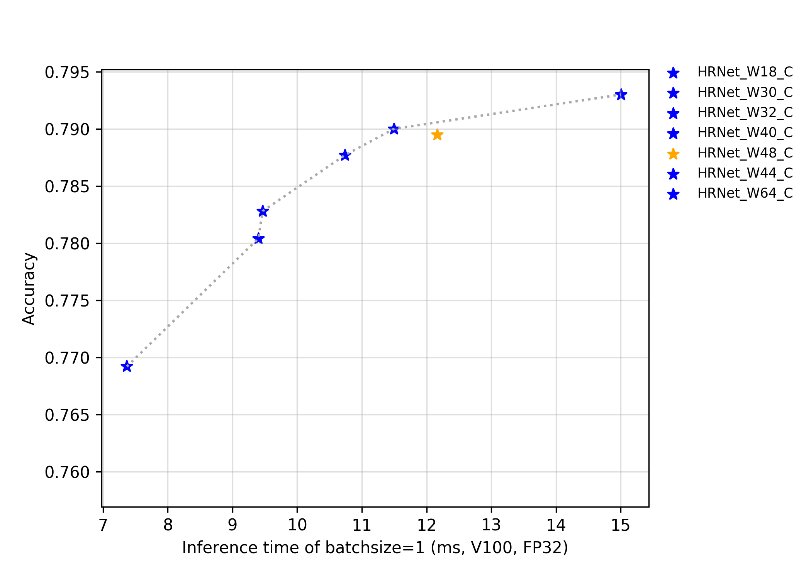

# HRNet系列

## 概述
正在持续更新中......

该系列模型的FLOPS、参数量以及fp32预测耗时如下图所示。

## 精度、FLOPS和参数量

| Models      | Top1   | Top5   | Reference top1 | Reference top5 | FLOPS (G) | Parameters (M) |
|:--:|:--:|:--:|:--:|:--:|:--:|:--:|
| HRNet_W18_C | 0.769  | 0.934  | 0.768             | 0.934             | 4.140        | 21.290            |
| HRNet_W30_C | 0.780  | 0.940  | 0.782             | 0.942             | 16.230       | 37.710            |
| HRNet_W32_C | 0.783  | 0.942  | 0.785             | 0.942             | 17.860       | 41.230            |
| HRNet_W40_C | 0.788  | 0.945  | 0.789             | 0.945             | 25.410       | 57.550            |
| HRNet_W44_C | 0.790  | 0.945  | 0.789             | 0.944             | 29.790       | 67.060            |
| HRNet_W48_C | 0.790  | 0.944  | 0.793             | 0.945             | 34.580       | 77.470            |
| HRNet_W64_C | 0.793  | 0.946  | 0.795             | 0.946             | 57.830       | 128.060           |

## FP32预测速度

| Models      | Crop Size | Resize Short Size | Batch Size=1 (ms) |
|-------------|-----------|-------------------|--------------------------|
| HRNet_W18_C | 224       | 256               | 7.368                    |
| HRNet_W30_C | 224       | 256               | 9.402                    |
| HRNet_W32_C | 224       | 256               | 9.467                    |
| HRNet_W40_C | 224       | 256               | 10.739                   |
| HRNet_W44_C | 224       | 256               | 11.497                   |
| HRNet_W48_C | 224       | 256               | 12.165                   |
| HRNet_W64_C | 224       | 256               | 15.003                   |
