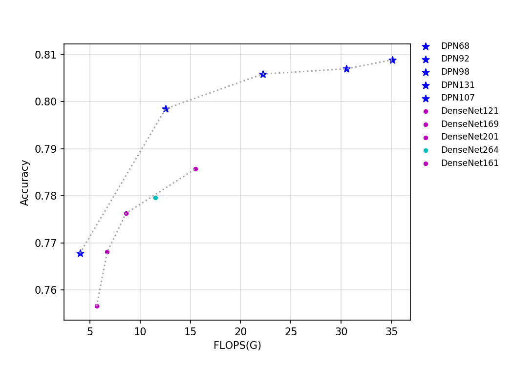
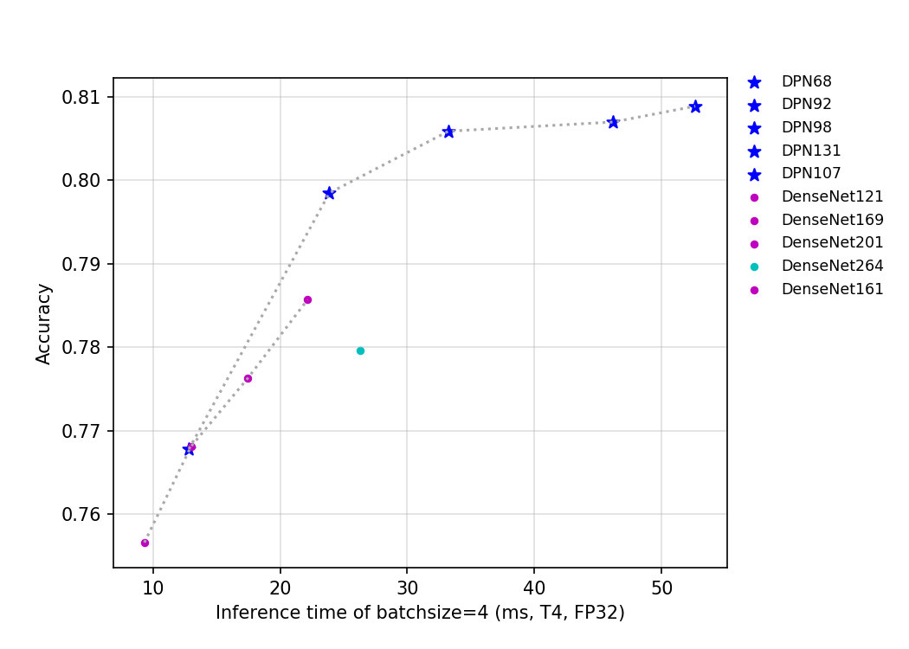
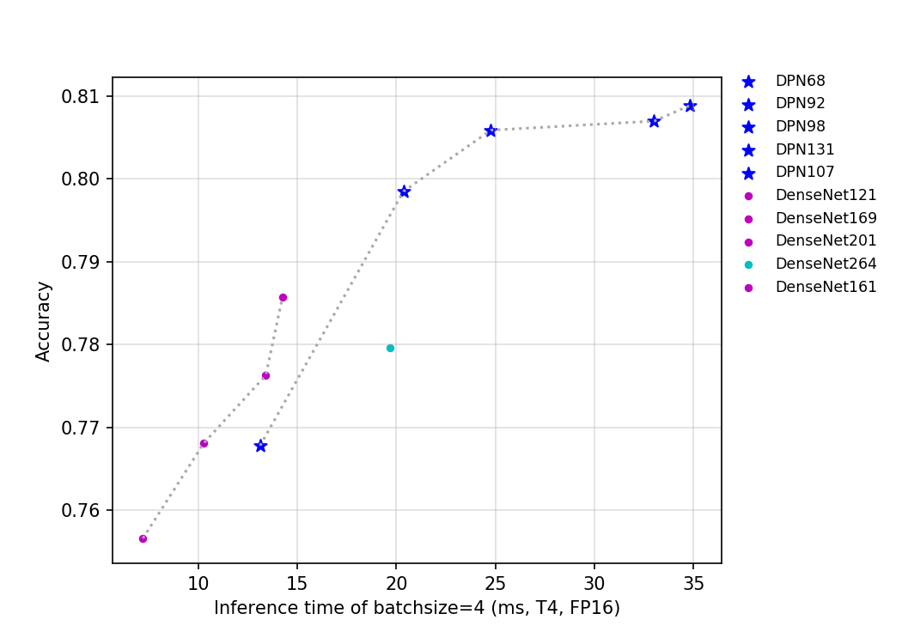

# DPN 系列
-----

## 目录

- [1. 模型介绍](#1)
    - [1.1 模型简介](#1.1)
    - [1.2 模型指标](#1.2)
    - [1.3 Benchmark](#1.3)
      - [1.3.1 基于 V100 GPU 的预测速度](#1.3.1)
      - [1.3.2 基于 T4 GPU 的预测速度](#1.3.2)
- [2. 模型快速体验](#2)
- [3. 模型训练、评估和预测](#3)
- [4. 模型推理部署](#4)
  - [4.1 推理模型准备](#4.1)
  - [4.2 基于 Python 预测引擎推理](#4.2)
  - [4.3 基于 C++ 预测引擎推理](#4.3)
  - [4.4 服务化部署](#4.4)
  - [4.5 端侧部署](#4.5)
  - [4.6 Paddle2ONNX 模型转换与预测](#4.6)

## 1. 模型介绍

### 1.1 模型简介

DPN 的全称是 Dual Path Networks，即双通道网络。该网络是由 DenseNet 和 ResNeXt 结合的一个网络，其证明了 DenseNet 能从靠前的层级中提取到新的特征，而 ResNeXt 本质上是对之前层级中已提取特征的复用。作者进一步分析发现，ResNeXt 对特征有高复用率，但冗余度低，DenseNet 能创造新特征，但冗余度高。结合二者结构的优势，作者设计了 DPN 网络。最终 DPN 网络在同样 FLOPs 和参数量下，取得了比 ResNeXt 与 DenseNet 更好的结果。

该系列模型的 FLOPs、参数量以及 T4 GPU 上的预测耗时如下图所示。

目前 PaddleClas 开源的 DenseNet 与 DPN 模型的预训练模型一共有 10 个，其指标如上图所示，可以看到，在相同的 FLOPs 和参数量下，相比 DenseNet，DPN 拥有更高的精度。但是由于 DPN 有更多的分支，所以其推理速度要慢于 DenseNet。由于 DenseNet264 的网络层数最深，所以该网络是 DenseNet 系列模型中参数量最大的网络，DenseNet161 的网络的宽度最大，导致其是该系列中网络中计算量最大、精度最高的网络。从推理速度来看，计算量大且精度高的的 DenseNet161 比 DenseNet264 具有更快的速度，所以其比 DenseNet264 具有更大的优势。

对于 DPN 系列网络，模型的 FLOPs 和参数量越大，模型的精度越高。其中，由于 DPN107 的网络宽度最大，所以其是该系列网络中参数量与计算量最大的网络。

### 1.2 模型指标

| Models      | Top1   | Top5   | Reference top1 | Reference top5 | FLOPs (G) | Params (M) |
|:--:|:--:|:--:|:--:|:--:|:--:|:--:|
| DPN68       | 0.768  | 0.934  | 0.764             | 0.931             | 4.030        | 10.780            |
| DPN92       | 0.799  | 0.948  | 0.793             | 0.946             | 12.540       | 36.290            |
| DPN98       | 0.806  | 0.951  | 0.799             | 0.949             | 22.220       | 58.460            |
| DPN107      | 0.809  | 0.953  | 0.802             | 0.951             | 35.060       | 82.970            |
| DPN131      | 0.807  | 0.951  | 0.801             | 0.949             | 30.510       | 75.360            |

### 1.3 Benchmark

#### 1.3.1 基于 V100 GPU 的预测速度

| Models                               | Crop Size | Resize Short Size | FP32 Batch Size=1 (ms) | FP32 Batch Size=4 (ms) | FP32 Batch Size=8 (ms) |
|-------------|-----------|-------------------|-------------------|-------------------|-------------------|
| DPN68       | 224       | 256               | 2.82              | 10.90             | 14.45             |
| DPN92       | 224       | 256               | 4.64             | 11.20             | 20.00             |
| DPN98       | 224       | 256               | 6.15             | 25.22             | 35.69             |
| DPN107      | 224       | 256               | 8.39             | 34.44             | 52.12             |
| DPN131      | 224       | 256               | 8.26             | 33.96             | 48.62             |

**备注：** 精度类型为 FP32，推理过程使用 TensorRT-8.0.3.4。

#### 1.3.2 基于 T4 GPU 的预测速度

| Models      | Size | Latency(ms) FP32 bs=1 | Latency(ms) FP32 bs=4 | Latency(ms) FP32 bs=8 |
|-------------|-----------|------------------------------|------------------------------|------------------------------|------------------------------|------------------------------|------------------------------|
| DPN68       | 224       | 11.7827                      | 13.12652                     | 16.19213                     | 11.64915                     | 12.82807                     | 18.57113                     |
| DPN92       | 224       | 18.56026                     | 20.35983                     | 29.89544                     | 18.15746                     | 23.87545                     | 38.68821                     |
| DPN98       | 224       | 21.70508                     | 24.7755                      | 40.93595                     | 21.18196                     | 33.23925                     | 62.77751                     |
| DPN107      | 224       | 27.84462                     | 34.83217                     | 60.67903                     | 27.62046                     | 52.65353                     | 100.11721                    |
| DPN131      | 224       | 28.58941                     | 33.01078                     | 55.65146                     | 28.33119                     | 46.19439                     | 89.24904                     |

**备注：** 推理过程使用 TensorRT-8.0.3.4。

## 2. 模型快速体验

安装 paddlepaddle 和 paddleclas 即可快速对图片进行预测，体验方法可以参考[ResNet50 模型快速体验](./ResNet.md#2)。

## 3. 模型训练、评估和预测

此部分内容包括训练环境配置、ImageNet数据的准备、该模型在 ImageNet 上的训练、评估、预测等内容。在 `ppcls/configs/ImageNet/DPN/` 中提供了该模型的训练配置，启动训练方法可以参考：[ResNet50 模型训练、评估和预测](./ResNet.md#3-模型训练评估和预测)。

## 4. 模型推理部署

### 4.1 推理模型准备

Paddle Inference 是飞桨的原生推理库， 作用于服务器端和云端，提供高性能的推理能力。相比于直接基于预训练模型进行预测，Paddle Inference可使用 MKLDNN、CUDNN、TensorRT 进行预测加速，从而实现更优的推理性能。更多关于Paddle Inference推理引擎的介绍，可以参考[Paddle Inference官网教程](https://www.paddlepaddle.org.cn/documentation/docs/zh/guides/infer/inference/inference_cn.html)。

Inference 的获取可以参考 [ResNet50 推理模型准备](./ResNet.md#4.1) 。

### 4.2 基于 Python 预测引擎推理

PaddleClas 提供了基于 python 预测引擎推理的示例。您可以参考[ResNet50 基于 Python 预测引擎推理](./ResNet.md#4.2) 完成模型的推理预测。

### 4.3 基于 C++ 预测引擎推理

PaddleClas 提供了基于 C++ 预测引擎推理的示例，您可以参考[服务器端 C++ 预测](../../deployment/image_classification/cpp/linux.md)来完成相应的推理部署。如果您使用的是 Windows 平台，可以参考[基于 Visual Studio 2019 Community CMake 编译指南](../../deployment/image_classification/cpp/windows.md)完成相应的预测库编译和模型预测工作。

### 4.4 服务化部署

Paddle Serving 提供高性能、灵活易用的工业级在线推理服务。Paddle Serving 支持 RESTful、gRPC、bRPC 等多种协议，提供多种异构硬件和多种操作系统环境下推理解决方案。更多关于Paddle Serving 的介绍，可以参考[Paddle Serving 代码仓库](https://github.com/PaddlePaddle/Serving)。

PaddleClas 提供了基于 Paddle Serving 来完成模型服务化部署的示例，您可以参考[模型服务化部署](../../deployment/image_classification/paddle_serving.md)来完成相应的部署工作。

### 4.5 端侧部署

Paddle Lite 是一个高性能、轻量级、灵活性强且易于扩展的深度学习推理框架，定位于支持包括移动端、嵌入式以及服务器端在内的多硬件平台。更多关于 Paddle Lite 的介绍，可以参考[Paddle Lite 代码仓库](https://github.com/PaddlePaddle/Paddle-Lite)。

PaddleClas 提供了基于 Paddle Lite 来完成模型端侧部署的示例，您可以参考[端侧部署](../../deployment/image_classification/paddle_lite.md)来完成相应的部署工作。

### 4.6 Paddle2ONNX 模型转换与预测

Paddle2ONNX 支持将 PaddlePaddle 模型格式转化到 ONNX 模型格式。通过 ONNX 可以完成将 Paddle 模型到多种推理引擎的部署，包括TensorRT/OpenVINO/MNN/TNN/NCNN，以及其它对 ONNX 开源格式进行支持的推理引擎或硬件。更多关于 Paddle2ONNX 的介绍，可以参考[Paddle2ONNX 代码仓库](https://github.com/PaddlePaddle/Paddle2ONNX)。

PaddleClas 提供了基于 Paddle2ONNX 来完成 inference 模型转换 ONNX 模型并作推理预测的示例，您可以参考[Paddle2ONNX 模型转换与预测](../../deployment/image_classification/paddle2onnx.md)来完成相应的部署工作。
