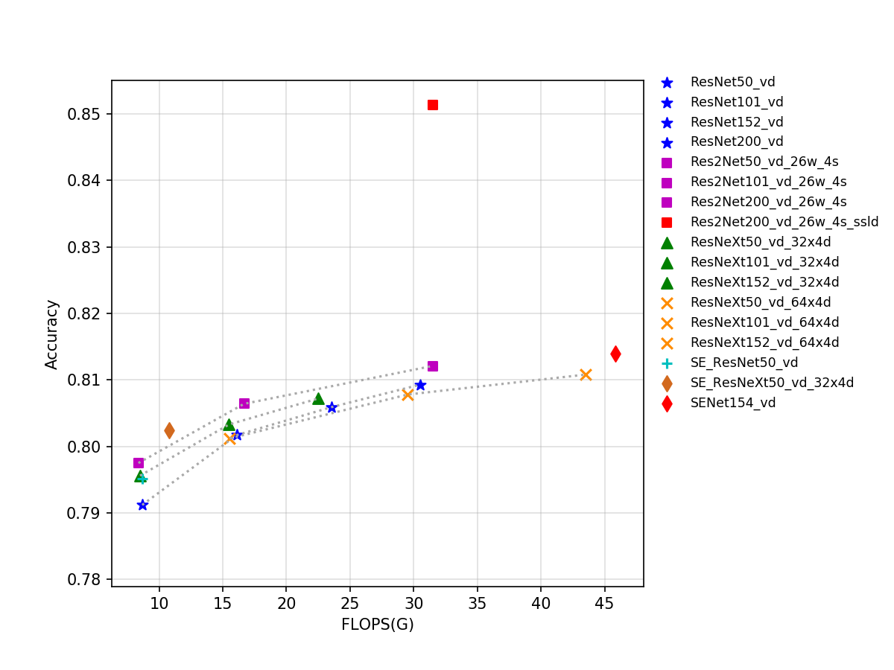
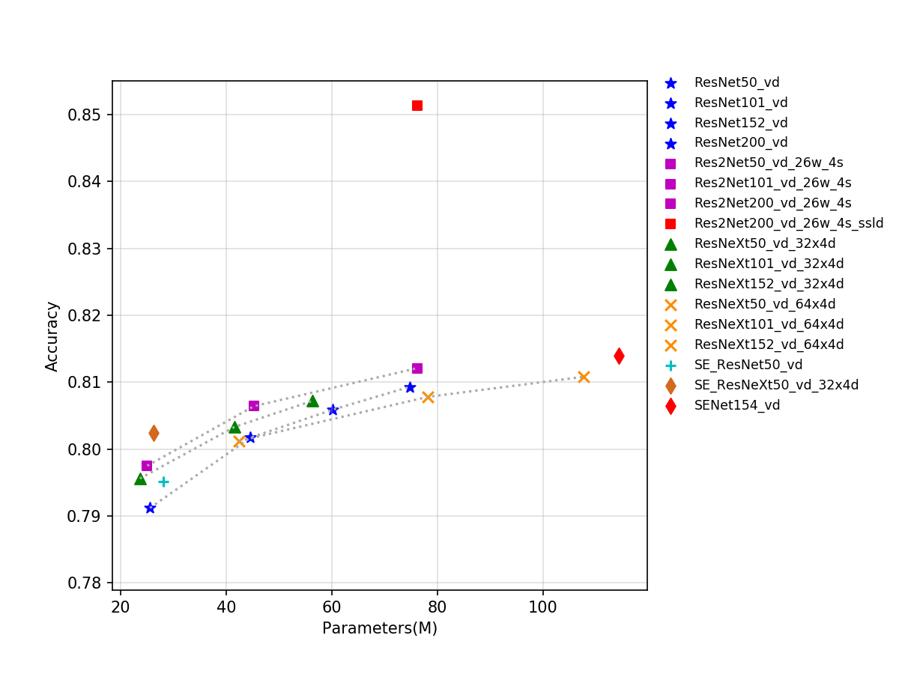
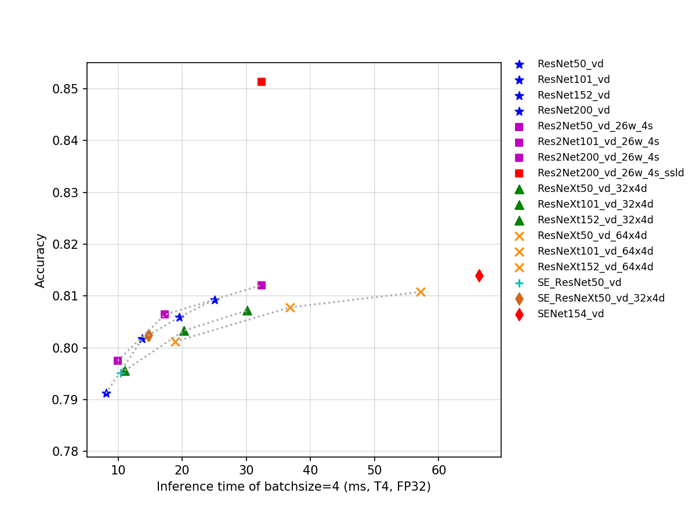
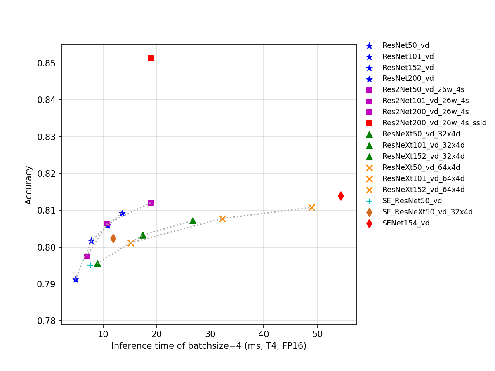

# Res2Net 系列
-----

## 目录

- [1. 模型介绍](#1)
    - [1.1 模型简介](#1.1)
    - [1.2 模型指标](#1.2)
    - [1.3 Benchmark](#1.3)
      - [1.3.1 基于 V100 GPU 的预测速度](#1.3.1)
      - [1.3.2 基于 T4 GPU 的预测速度](#1.3.2)
- [2. 模型快速体验](#2)
- [3. 模型训练、评估和预测](#3)
- [4. 模型推理部署](#4)
  - [4.1 推理模型准备](#4.1)
  - [4.2 基于 Python 预测引擎推理](#4.2)
  - [4.3 基于 C++ 预测引擎推理](#4.3)
  - [4.4 服务化部署](#4.4)
  - [4.5 端侧部署](#4.5)
  - [4.6 Paddle2ONNX 模型转换与预测](#4.6)

## 1. 模型介绍

### 1.1 模型简介

Res2Net 是 2019 年提出的一种全新的对 ResNet 的改进方案，该方案可以和现有其他优秀模块轻松整合，在不增加计算负载量的情况下，在 ImageNet、CIFAR-100 等数据集上的测试性能超过了 ResNet。Res2Net 结构简单，性能优越，进一步探索了 CNN 在更细粒度级别的多尺度表示能力。Res2Net 揭示了一个新的提升模型精度的维度，即 scale，其是除了深度、宽度和基数的现有维度之外另外一个必不可少的更有效的因素。该网络在其他视觉任务如目标检测、图像分割等也有相当不错的表现。

该系列模型的 FLOPs、参数量以及 T4 GPU 上的预测耗时如下图所示。

目前 PaddleClas 开源的 Res2Net 模型的预训练模型一共有 8 个，其指标如图所示，从图中可以看出，Res2Net 表现较为优秀，相比 ResNeXt 中的 group 操作、SEResNet 中的 SE 结构操作，Res2Net 在相同 FLOPs、Params 和推理速度下往往精度更佳。

### 1.2 模型指标

| Models                | Top1   | Top5   | Reference top1 | Reference top5 | FLOPs (G) | Params (M) |
|:--:|:--:|:--:|:--:|:--:|:--:|:--:|
| Res2Net50_26w_4s      | 0.793  | 0.946  | 0.780             | 0.936             | 8.520        | 25.700            |
| Res2Net50_vd_26w_4s   | 0.798  | 0.949  |                   |                   | 8.370        | 25.060            |
| Res2Net50_vd_26w_4s_ssld   | 0.831  | 0.966  |                   |                   | 8.370        | 25.060            |
| Res2Net50_14w_8s      | 0.795  | 0.947  | 0.781             | 0.939             | 9.010        | 25.720            |
| Res2Net101_vd_26w_4s  | 0.806  | 0.952  |                   |                   | 16.670       | 45.220            |
| Res2Net101_vd_26w_4s_ssld  | 0.839  | 0.971  |                   |                   | 16.670       | 45.220            |
| Res2Net200_vd_26w_4s  | 0.812  | 0.957  |                   |                   | 31.490       | 76.210            |
| Res2Net200_vd_26w_4s_ssld  | **0.851**  | 0.974  |                   |                   | 31.490       | 76.210            |

### 1.3 Benchmark

#### 1.3.1 基于 V100 GPU 的预测速度

| Models      | Size | Latency(ms) bs=1 | Latency(ms) bs=4 | Latency(ms) bs=8 |
|-----------------------|-------------------|-----------------------|-----------------------|-----------------------|
| Res2Net50_26w_4s      | 224       | 3.31               | 5.65               | 8.33               |
| Res2Net50_vd_26w_4s   | 224       | 3.35               | 5.79               | 8.63               |
| Res2Net50_14w_8s      | 224       | 4.13               | 6.56               | 9.45              |
| Res2Net101_vd_26w_4s  | 224       | 5.96               | 10.56              | 15.20              |
| Res2Net200_vd_26w_4s  | 224       | 10.80             | 19.48             | 27.95             |
| Res2Net50_vd_26w_4s_ssld | 224  | 3.35 | 5.79 | 8.63 |
| Res2Net101_vd_26w_4s_ssld | 224  | 5.96 | 10.56 | 15.20 |
| Res2Net200_vd_26w_4s_ssld | 224  | 10.80 | 19.48 | 27.95 |

**备注：** 精度类型为 FP32，推理过程使用 TensorRT-8.0.3.4。

#### 1.3.2 基于 T4 GPU 的预测速度

| Models            | Size | Latency(ms) FP16 bs=1 | Latency(ms) FP16 bs=4 | Latency(ms) FP16 bs=8 | Latency(ms) FP32 bs=1 | Latency(ms) FP32 bs=4 | Latency(ms) FP32 bs=8 |
|:--:|:--:|:--:|:--:|:--:|:--:|:--:|:--:|
| Res2Net50_26w_4s      | 224  | 3.56067                      | 6.61827                      | 11.41566                     | 4.47188                      | 9.65722                      | 17.54535                     |
| Res2Net50_vd_26w_4s   | 224  | 3.69221                      | 6.94419                      | 11.92441                     | 4.52712                      | 9.93247                      | 18.16928                     |
| Res2Net50_14w_8s      | 224  | 4.45745                      | 7.69847                      | 12.30935                     | 5.4026                       | 10.60273                     | 18.01234                     |
| Res2Net101_vd_26w_4s  | 224  | 6.53122                      | 10.81895                     | 18.94395                     | 8.08729                      | 17.31208                     | 31.95762                     |
| Res2Net200_vd_26w_4s  | 224  | 11.66671                     | 18.93953                     | 33.19188                     | 14.67806                     | 32.35032                     | 63.65899                     |

**备注：** 推理过程使用 TensorRT-8.0.3.4。

  

## 2. 模型快速体验

安装 paddlepaddle 和 paddleclas 即可快速对图片进行预测，体验方法可以参考[ResNet50 模型快速体验](./ResNet.md#2-模型快速体验)。

## 3. 模型训练、评估和预测

此部分内容包括训练环境配置、ImageNet数据的准备、该模型在 ImageNet 上的训练、评估、预测等内容。在 `ppcls/configs/ImageNet/Res2Net/` 中提供了该模型的训练配置，启动训练方法可以参考：[ResNet50 模型训练、评估和预测](./ResNet.md#3-模型训练评估和预测)。

## 4. 模型推理部署

### 4.1 推理模型准备

Paddle Inference 是飞桨的原生推理库， 作用于服务器端和云端，提供高性能的推理能力。相比于直接基于预训练模型进行预测，Paddle Inference可使用 MKLDNN、CUDNN、TensorRT 进行预测加速，从而实现更优的推理性能。更多关于Paddle Inference推理引擎的介绍，可以参考[Paddle Inference官网教程](https://www.paddlepaddle.org.cn/documentation/docs/zh/guides/infer/inference/inference_cn.html)。

Inference 的获取可以参考 [ResNet50 推理模型准备](./ResNet.md#41-推理模型准备) 。

### 4.2 基于 Python 预测引擎推理

PaddleClas 提供了基于 python 预测引擎推理的示例。您可以参考[ResNet50 基于 Python 预测引擎推理](./ResNet.md#42-基于-python-预测引擎推理) 。

### 4.3 基于 C++ 预测引擎推理

PaddleClas 提供了基于 C++ 预测引擎推理的示例，您可以参考[服务器端 C++ 预测](../../deployment/image_classification/cpp/linux.md)来完成相应的推理部署。如果您使用的是 Windows 平台，可以参考[基于 Visual Studio 2019 Community CMake 编译指南](../../deployment/image_classification/cpp/windows.md)完成相应的预测库编译和模型预测工作。

### 4.4 服务化部署

Paddle Serving 提供高性能、灵活易用的工业级在线推理服务。Paddle Serving 支持 RESTful、gRPC、bRPC 等多种协议，提供多种异构硬件和多种操作系统环境下推理解决方案。更多关于Paddle Serving 的介绍，可以参考[Paddle Serving 代码仓库](https://github.com/PaddlePaddle/Serving)。

PaddleClas 提供了基于 Paddle Serving 来完成模型服务化部署的示例，您可以参考[模型服务化部署](../../deployment/image_classification/paddle_serving.md)来完成相应的部署工作。

### 4.5 端侧部署

Paddle Lite 是一个高性能、轻量级、灵活性强且易于扩展的深度学习推理框架，定位于支持包括移动端、嵌入式以及服务器端在内的多硬件平台。更多关于 Paddle Lite 的介绍，可以参考[Paddle Lite 代码仓库](https://github.com/PaddlePaddle/Paddle-Lite)。

PaddleClas 提供了基于 Paddle Lite 来完成模型端侧部署的示例，您可以参考[端侧部署](../../deployment/image_classification/paddle_lite.md)来完成相应的部署工作。

### 4.6 Paddle2ONNX 模型转换与预测

Paddle2ONNX 支持将 PaddlePaddle 模型格式转化到 ONNX 模型格式。通过 ONNX 可以完成将 Paddle 模型到多种推理引擎的部署，包括TensorRT/OpenVINO/MNN/TNN/NCNN，以及其它对 ONNX 开源格式进行支持的推理引擎或硬件。更多关于 Paddle2ONNX 的介绍，可以参考[Paddle2ONNX 代码仓库](https://github.com/PaddlePaddle/Paddle2ONNX)。

PaddleClas 提供了基于 Paddle2ONNX 来完成 inference 模型转换 ONNX 模型并作推理预测的示例，您可以参考[Paddle2ONNX 模型转换与预测](../../deployment/image_classification/paddle2onnx.md)来完成相应的部署工作。
