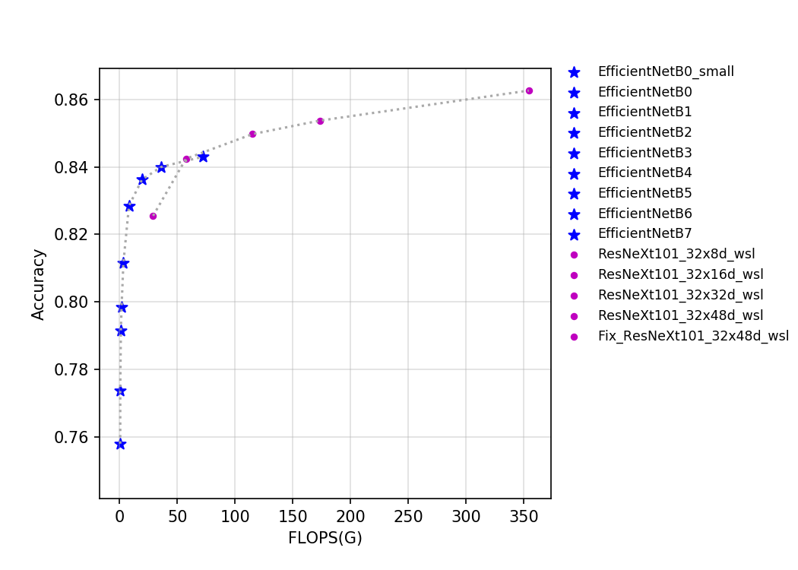
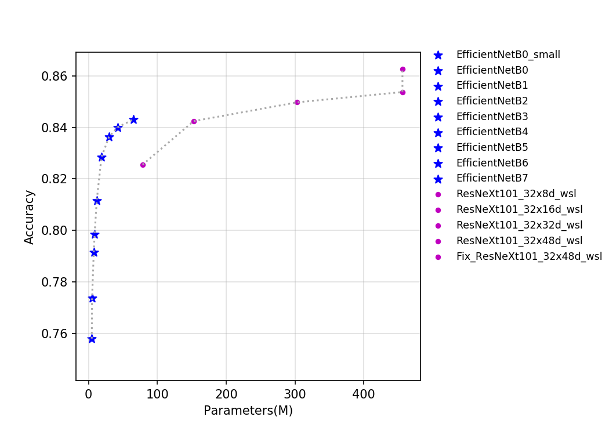
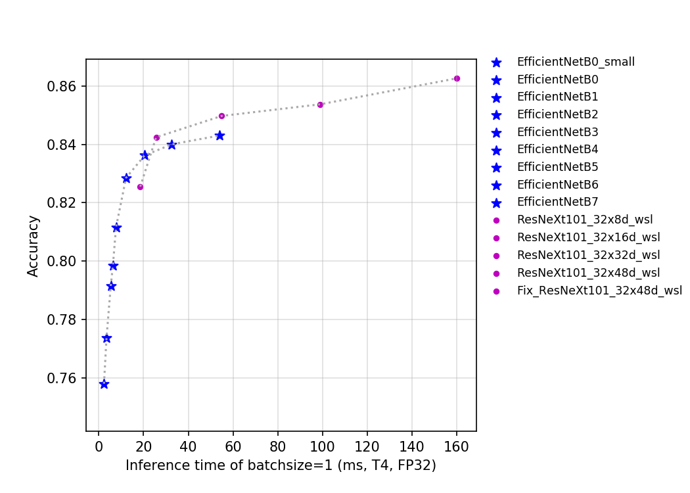
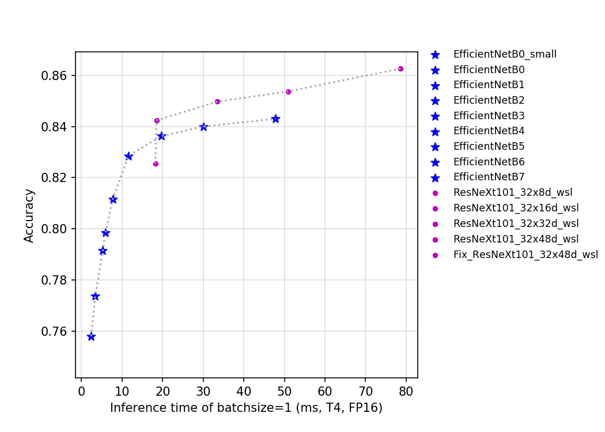

# ResNeXt 系列
-----

## 目录

- [1. 模型介绍](#1)
    - [1.1 模型简介](#1.1)
    - [1.2 模型指标](#1.2)
    - [1.3 Benchmark](#1.3)
      - [1.3.1 基于 V100 GPU 的预测速度](#1.3.1)
      - [1.3.2 基于 V100 GPU 的预测速度](#1.3.2)
- [2. 模型快速体验](#2)
- [3. 模型训练、评估和预测](#3)
- [4. 模型推理部署](#4)
  - [4.1 推理模型准备](#4.1)
  - [4.2 基于 Python 预测引擎推理](#4.2)
  - [4.3 基于 C++ 预测引擎推理](#4.3)
  - [4.4 服务化部署](#4.4)
  - [4.5 端侧部署](#4.5)
  - [4.6 Paddle2ONNX 模型转换与预测](#4.6)

## 1. 模型介绍

### 1.1 模型简介

ResNeXt 是 facebook 于 2016 年提出的一种对 ResNet 的改进版网络。在 2019 年，facebook 通过弱监督学习研究了该系列网络在 ImageNet 上的精度上限，为了区别之前的 ResNeXt 网络，该系列网络的后缀为 wsl，其中 wsl 是弱监督学习（weakly-supervised-learning）的简称。为了能有更强的特征提取能力，研究者将其网络宽度进一步放大，其中最大的 ResNeXt101_32x48d_wsl 拥有 8 亿个参数，将其在 9.4 亿的弱标签图片下训练并在 ImageNet-1k 上做 finetune，最终在 ImageNet-1k 的 top-1 达到了 85.4%，这也是迄今为止在 ImageNet-1k 的数据集上以 224x224 的分辨率下精度最高的网络。Fix-ResNeXt 中，作者使用了更大的图像分辨率，针对训练图片和验证图片数据预处理不一致的情况下做了专门的 Fix 策略，并使得 ResNeXt101_32x48d_wsl 拥有了更高的精度，由于其用到了 Fix 策略，故命名为 Fix-ResNeXt101_32x48d_wsl。

该系列模型的 FLOPs、参数量以及 T4 GPU 上的预测耗时如下图所示。

### 1.2 模型指标

| Models                        | Top1   | Top5   | Reference top1 | Reference top5 | FLOPs (G) | Params (M) |
|:--:|:--:|:--:|:--:|:--:|:--:|:--:|
| ResNeXt101_ 32x8d_wsl      | 0.826  | 0.967  | 0.822             | 0.964             | 29.140       | 78.440            |
| ResNeXt101_ 32x16d_wsl     | 0.842  | 0.973  | 0.842             | 0.972             | 57.550       | 152.660           |
| ResNeXt101_ 32x32d_wsl     | 0.850  | 0.976  | 0.851             | 0.975             | 115.170      | 303.110           |
| ResNeXt101_ 32x48d_wsl     | 0.854  | 0.977  | 0.854             | 0.976             | 173.580      | 456.200           |
| Fix_ResNeXt101_ 32x48d_wsl | 0.863  | 0.980  | 0.864             | 0.980             | 354.230      | 456.200           |

**备注：** PaddleClas 所提供的该系列模型的预训练模型权重，均是基于其官方提供的权重转得。

### 1.3 Benchmark

#### 1.3.1 基于 V100 GPU 的预测速度

| Models      | Size | Latency(ms) bs=1 | Latency(ms) bs=4 | Latency(ms) bs=8 |
|-------------------------------|-------------------|-------------------------------|-------------------------------|-------------------------------|
| ResNeXt101_ 32x8d_wsl      | 224      | 15.85 | 23.61 | 35.60 |
| ResNeXt101_ 32x16d_wsl     | 224      | 20.58 | 37.38 | 66.45 |
| ResNeXt101_ 32x32d_wsl     | 224      | 49.87 | 86.16 | 120.14 |
| ResNeXt101_ 32x48d_wsl     | 224      | 69.81 | 121.22 | 205.55 |
| Fix_ResNeXt101_ 32x48d_wsl | 320      | 55.01 | 122.63 | 204.66 |

**备注：** 精度类型为 FP32，推理过程使用 TensorRT-8.0.3.4。

#### 1.3.2 基于 T4 GPU 的预测速度

| Models            | Size | Latency(ms) FP16 bs=1 | Latency(ms) FP16 bs=4 | Latency(ms) FP16 bs=8 | Latency(ms) FP32 bs=1 | Latency(ms) FP32 bs=4 | Latency(ms) FP32 bs=8 |
|:--:|:--:|:--:|:--:|:--:|:--:|:--:|:--:|
| ResNeXt101_ 32x8d_wsl      | 224 | 18.19374                     | 21.93529                     | 34.67802                     | 18.52528                     | 34.25319                     | 67.2283                      |
| ResNeXt101_ 32x16d_wsl     | 224 | 18.52609                     | 36.8288                      | 62.79947                     | 25.60395                     | 71.88384                     | 137.62327                    |
| ResNeXt101_ 32x32d_wsl     | 224 | 33.51391                     | 70.09682                     | 125.81884                    | 54.87396                     | 160.04337                    | 316.17718                    |
| ResNeXt101_ 32x48d_wsl     | 224 | 50.97681                     | 137.60926                    | 190.82628                    | 99.01698256                  | 315.91261                    | 551.83695                    |
| Fix_ResNeXt101_ 32x48d_wsl | 320 | 78.62869                     | 191.76039                    | 317.15436                    | 160.0838242                  | 595.99296                    | 1151.47384                   |

**备注：** 推理过程使用 TensorRT-8.0.3.4。

## 2. 模型快速体验

安装 paddlepaddle 和 paddleclas 即可快速对图片进行预测，体验方法可以参考[ResNet50 模型快速体验](./ResNet.md#2)。

## 3. 模型训练、评估和预测

此部分内容包括训练环境配置、ImageNet数据的准备、该模型在 ImageNet 上的训练、评估、预测等内容。在 `ppcls/configs/ImageNet/ResNeXt/` 中提供了该模型的训练配置，启动训练方法可以参考：[ResNet50 模型训练、评估和预测](./ResNet.md#3-模型训练评估和预测)。

## 4. 模型推理部署

### 4.1 推理模型准备

Paddle Inference 是飞桨的原生推理库， 作用于服务器端和云端，提供高性能的推理能力。相比于直接基于预训练模型进行预测，Paddle Inference可使用 MKLDNN、CUDNN、TensorRT 进行预测加速，从而实现更优的推理性能。更多关于Paddle Inference推理引擎的介绍，可以参考[Paddle Inference官网教程](https://www.paddlepaddle.org.cn/documentation/docs/zh/guides/infer/inference/inference_cn.html)。

Inference 的获取可以参考 [ResNet50 推理模型准备](./ResNet.md#4.1) 。

### 4.2 基于 Python 预测引擎推理

PaddleClas 提供了基于 python 预测引擎推理的示例。您可以参考[ResNet50 基于 Python 预测引擎推理](./ResNet.md#4.2) 完成模型的推理预测。

### 4.3 基于 C++ 预测引擎推理

PaddleClas 提供了基于 C++ 预测引擎推理的示例，您可以参考[服务器端 C++ 预测](../../deployment/image_classification/cpp/linux.md)来完成相应的推理部署。如果您使用的是 Windows 平台，可以参考[基于 Visual Studio 2019 Community CMake 编译指南](../../deployment/image_classification/cpp/windows.md)完成相应的预测库编译和模型预测工作。

### 4.4 服务化部署

Paddle Serving 提供高性能、灵活易用的工业级在线推理服务。Paddle Serving 支持 RESTful、gRPC、bRPC 等多种协议，提供多种异构硬件和多种操作系统环境下推理解决方案。更多关于Paddle Serving 的介绍，可以参考[Paddle Serving 代码仓库](https://github.com/PaddlePaddle/Serving)。

PaddleClas 提供了基于 Paddle Serving 来完成模型服务化部署的示例，您可以参考[模型服务化部署](../../deployment/image_classification/paddle_serving.md)来完成相应的部署工作。

### 4.5 端侧部署

Paddle Lite 是一个高性能、轻量级、灵活性强且易于扩展的深度学习推理框架，定位于支持包括移动端、嵌入式以及服务器端在内的多硬件平台。更多关于 Paddle Lite 的介绍，可以参考[Paddle Lite 代码仓库](https://github.com/PaddlePaddle/Paddle-Lite)。

PaddleClas 提供了基于 Paddle Lite 来完成模型端侧部署的示例，您可以参考[端侧部署](../../deployment/image_classification/paddle_lite.md)来完成相应的部署工作。

### 4.6 Paddle2ONNX 模型转换与预测

Paddle2ONNX 支持将 PaddlePaddle 模型格式转化到 ONNX 模型格式。通过 ONNX 可以完成将 Paddle 模型到多种推理引擎的部署，包括TensorRT/OpenVINO/MNN/TNN/NCNN，以及其它对 ONNX 开源格式进行支持的推理引擎或硬件。更多关于 Paddle2ONNX 的介绍，可以参考[Paddle2ONNX 代码仓库](https://github.com/PaddlePaddle/Paddle2ONNX)。

PaddleClas 提供了基于 Paddle2ONNX 来完成 inference 模型转换 ONNX 模型并作推理预测的示例，您可以参考[Paddle2ONNX 模型转换与预测](../../deployment/image_classification/paddle2onnx.md)来完成相应的部署工作。
