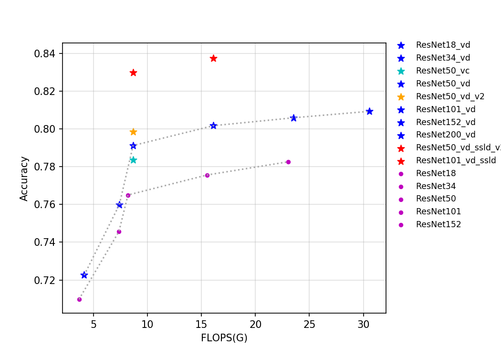
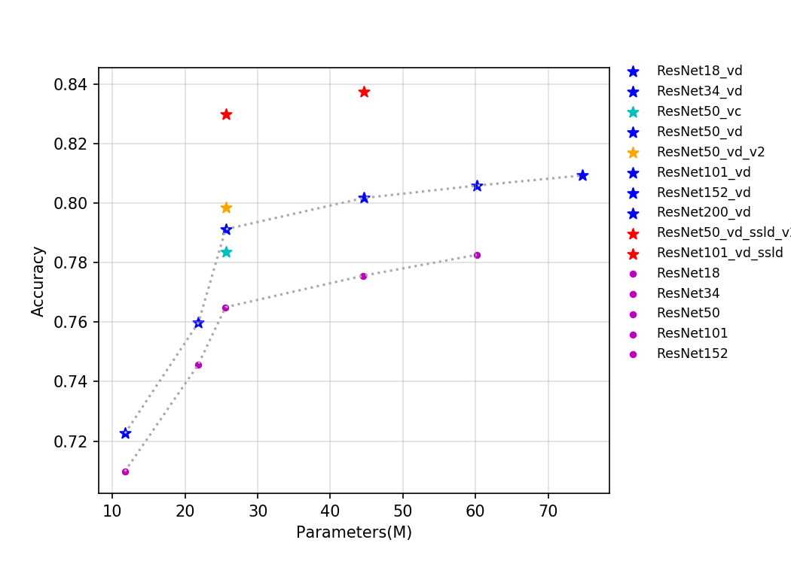
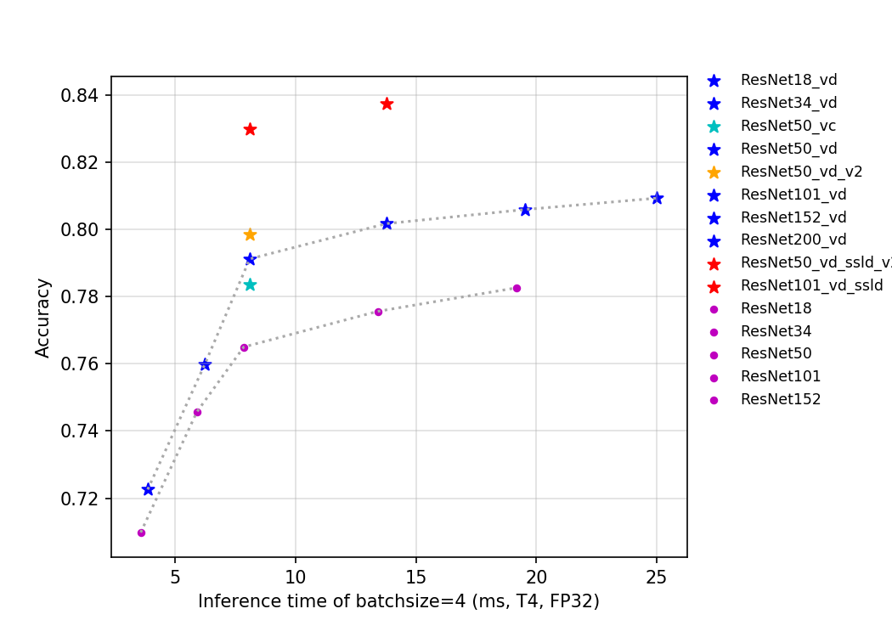
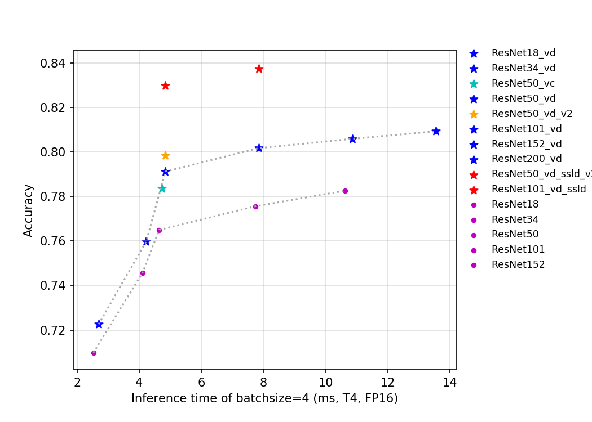

# ResNet 及其 Vd 系列
-----
## 目录

* [1. 概述](#1)
* [2. 精度、FLOPS 和参数量](#2)
* [3. 基于 V100 GPU 的预测速度](#3)
* [4. 基于 T4 GPU 的预测速度](#4)

## 1. 概述

ResNet 系列模型是在 2015 年提出的，一举在 ILSVRC2015 比赛中取得冠军，top5 错误率为 3.57%。该网络创新性的提出了残差结构，通过堆叠多个残差结构从而构建了 ResNet 网络。实验表明使用残差块可以有效地提升收敛速度和精度。

斯坦福大学的 Joyce Xu 将 ResNet 称为「真正重新定义了我们看待神经网络的方式」的三大架构之一。由于 ResNet 卓越的性能，越来越多的来自学术界和工业界学者和工程师对其结构进行了改进，比较出名的有 Wide-ResNet, ResNet-vc,ResNet-vd, Res2Net 等，其中 ResNet-vc 与 ResNet-vd 的参数量和计算量与 ResNet 几乎一致，所以在此我们将其与 ResNet 统一归为 ResNet 系列。

本次发布 ResNet 系列的模型包括 ResNet50，ResNet50_vd，ResNet50_vd_ssld，ResNet200_vd 等 14 个预训练模型。在训练层面上，ResNet 的模型采用了训练 ImageNet 的标准训练流程，而其余改进版模型采用了更多的训练策略，如 learning rate 的下降方式采用了 cosine decay，引入了 label smoothing 的标签正则方式，在数据预处理加入了 mixup 的操作，迭代总轮数从 120 个 epoch 增加到 200 个 epoch。

其中，ResNet50_vd_v2 与 ResNet50_vd_ssld 采用了知识蒸馏，保证模型结构不变的情况下，进一步提升了模型的精度，具体地，ResNet50_vd_v2 的 teacher 模型是 ResNet152_vd（top1 准确率 80.59%），数据选用的是 ImageNet-1k 的训练集，ResNet50_vd_ssld 的 teacher 模型是 ResNeXt101_32x16d_wsl（top1 准确率 84.2%），数据选用结合了 ImageNet-1k 的训练集和 ImageNet-22k 挖掘的 400 万数据。知识蒸馏的具体方法正在持续更新中。

该系列模型的 FLOPS、参数量以及 T4 GPU 上的预测耗时如下图所示。

通过上述曲线可以看出，层数越多，准确率越高，但是相应的参数量、计算量和延时都会增加。ResNet50_vd_ssld 通过用更强的 teacher 和更多的数据，将其在 ImageNet-1k 上的验证集 top-1 精度进一步提高，达到了 82.39%，刷新了 ResNet50 系列模型的精度。

## 2. 精度、FLOPS 和参数量

| Models           | Top1 | Top5 | Reference top1 | Reference top5 | FLOPS (G) | Parameters (M) |
|:--:|:--:|:--:|:--:|:--:|:--:|:--:|
| ResNet18         | 0.710           | 0.899           | 0.696                    | 0.891                    | 3.660     | 11.690    |
| ResNet18_vd      | 0.723           | 0.908           |                          |                          | 4.140     | 11.710    |
| ResNet34         | 0.746           | 0.921           | 0.732                    | 0.913                    | 7.360     | 21.800    |
| ResNet34_vd      | 0.760           | 0.930           |                          |                          | 7.390     | 21.820    |
| ResNet34_vd_ssld      | 0.797           | 0.949           |                          |                          | 7.390     | 21.820    |
| ResNet50         | 0.765           | 0.930           | 0.760                    | 0.930                    | 8.190     | 25.560    |
| ResNet50_vc      | 0.784           | 0.940           |                          |                          | 8.670     | 25.580    |
| ResNet50_vd      | 0.791           | 0.944           | 0.792                    | 0.946                    | 8.670     | 25.580    |
| ResNet50_vd_v2   | 0.798           | 0.949           |                          |                          | 8.670     | 25.580    |
| ResNet101        | 0.776           | 0.936           | 0.776                    | 0.938                    | 15.520    | 44.550    |
| ResNet101_vd     | 0.802           | 0.950           |                          |                          | 16.100    | 44.570    |
| ResNet152        | 0.783           | 0.940           | 0.778                    | 0.938                    | 23.050    | 60.190    |
| ResNet152_vd     | 0.806           | 0.953           |                          |                          | 23.530    | 60.210    |
| ResNet200_vd     | 0.809           | 0.953           |                          |                          | 30.530    | 74.740    |
| ResNet50_vd_ssld | 0.824           | 0.961           |                          |                          | 8.670     | 25.580    |
| ResNet50_vd_ssld_v2 | 0.830           | 0.964           |                          |                          | 8.670     | 25.580    |
| Fix_ResNet50_vd_ssld_v2 | 0.840           | 0.970           |                          |                          | 17.696     | 25.580    |
| ResNet101_vd_ssld | 0.837           | 0.967           |                          |                          | 16.100    | 44.570     |

* 注：`ResNet50_vd_ssld_v2` 是在 `ResNet50_vd_ssld` 训练策略的基础上加上 AutoAugment 训练得到，`Fix_ResNet50_vd_ssld_v2` 是固定 `ResNet50_vd_ssld_v2` 除 FC 层外所有的网络参数，在 320x320 的图像输入分辨率下，基于 ImageNet1k 数据集微调得到。

## 3. 基于 V100 GPU 的预测速度

| Models                 | Crop Size | Resize Short Size | FP32 Batch Size=1 (ms) | FP32 Batch Size=1\4 (ms) | FP32 Batch Size=8 (ms) |
|------------------|-----------|-------------------|--------------------------|--------------------------|--------------------------|
| ResNet18         | 224       | 256               | 1.22               | 2.19               | 3.63               |
| ResNet18_vd      | 224       | 256               | 1.26               | 2.28               | 3.89               |
| ResNet34         | 224       | 256               | 1.97               | 3.25               | 5.70               |
| ResNet34_vd      | 224       | 256               | 2.00               | 3.28               | 5.84               |
| ResNet34_vd_ssld      | 224       | 256               | 2.00               | 3.26               | 5.85               |
| ResNet50         | 224       | 256               | 2.54               | 4.79               | 7.40               |
| ResNet50_vc      | 224       | 256               | 2.57               | 4.83               | 7.52               |
| ResNet50_vd      | 224       | 256               | 2.60               | 4.86               | 7.63               |
| ResNet50_vd_v2   | 224       | 256               | 2.59               | 4.86               | 7.59               |
| ResNet101        | 224       | 256               | 4.37               | 8.18               | 12.38              |
| ResNet101_vd     | 224       | 256               | 4.43               | 8.25               | 12.60              |
| ResNet152        | 224       | 256               | 6.05               | 11.41              | 17.33              |
| ResNet152_vd     | 224       | 256               | 6.11               | 11.51              | 17.59              |
| ResNet200_vd     | 224       | 256               | 7.70               | 14.57              | 22.16              |
| ResNet50_vd_ssld | 224       | 256               | 2.59           | 4.87               | 7.62               |
| ResNet101_vd_ssld  | 224       | 256             | 4.43             | 8.25             | 12.58            |

## 4. 基于 T4 GPU 的预测速度

| Models            | Crop Size | Resize Short Size | FP16 Batch Size=1 (ms) | FP16 Batch Size=4 (ms) | FP16 Batch Size=8 (ms) | FP32 Batch Size=1 (ms) | FP32 Batch Size=4 (ms) | FP32 Batch Size=8 (ms) |
|-------------------|-----------|-------------------|------------------------------|------------------------------|------------------------------|------------------------------|------------------------------|------------------------------|
| ResNet18          | 224       | 256               | 1.3568                       | 2.5225                       | 3.61904                      | 1.45606                      | 3.56305                      | 6.28798                      |
| ResNet18_vd       | 224       | 256               | 1.39593                      | 2.69063                      | 3.88267                      | 1.54557                      | 3.85363                      | 6.88121                      |
| ResNet34          | 224       | 256               | 2.23092                      | 4.10205                      | 5.54904                      | 2.34957                      | 5.89821                      | 10.73451                     |
| ResNet34_vd       | 224       | 256               | 2.23992                      | 4.22246                      | 5.79534                      | 2.43427                      | 6.22257                      | 11.44906                     |
| ResNet34_vd_ssld       | 224       | 256               | 2.23992                      | 4.22246                      | 5.79534                      | 2.43427                      | 6.22257                      | 11.44906                     |
| ResNet50          | 224       | 256               | 2.63824                      | 4.63802                      | 7.02444                      | 3.47712                      | 7.84421                      | 13.90633                     |
| ResNet50_vc       | 224       | 256               | 2.67064                      | 4.72372                      | 7.17204                      | 3.52346                      | 8.10725                      | 14.45577                     |
| ResNet50_vd       | 224       | 256               | 2.65164                      | 4.84109                      | 7.46225                      | 3.53131                      | 8.09057                      | 14.45965                     |
| ResNet50_vd_v2    | 224       | 256               | 2.65164                      | 4.84109                      | 7.46225                      | 3.53131                      | 8.09057                      | 14.45965                     |
| ResNet101         | 224       | 256               | 5.04037                      | 7.73673                      | 10.8936                      | 6.07125                      | 13.40573                     | 24.3597                      |
| ResNet101_vd      | 224       | 256               | 5.05972                      | 7.83685                      | 11.34235                     | 6.11704                      | 13.76222                     | 25.11071                     |
| ResNet152         | 224       | 256               | 7.28665                      | 10.62001                     | 14.90317                     | 8.50198                      | 19.17073                     | 35.78384                     |
| ResNet152_vd      | 224       | 256               | 7.29127                      | 10.86137                     | 15.32444                     | 8.54376                      | 19.52157                     | 36.64445                     |
| ResNet200_vd      | 224       | 256               | 9.36026                      | 13.5474                      | 19.0725                      | 10.80619                     | 25.01731                     | 48.81399                     |
| ResNet50_vd_ssld  | 224       | 256               | 2.65164                      | 4.84109                      | 7.46225                      | 3.53131                      | 8.09057                      | 14.45965                     |
| ResNet50_vd_ssld_v2  | 224       | 256               | 2.65164                      | 4.84109                      | 7.46225                      | 3.53131                      | 8.09057                      | 14.45965                     |
| Fix_ResNet50_vd_ssld_v2  | 320       | 320               | 3.42818                      | 7.51534                      | 13.19370                      | 5.07696                      | 14.64218                      | 27.01453                     |
| ResNet101_vd_ssld | 224       | 256               | 5.05972                      | 7.83685                      | 11.34235                     | 6.11704                      | 13.76222                     | 25.11071                     |
