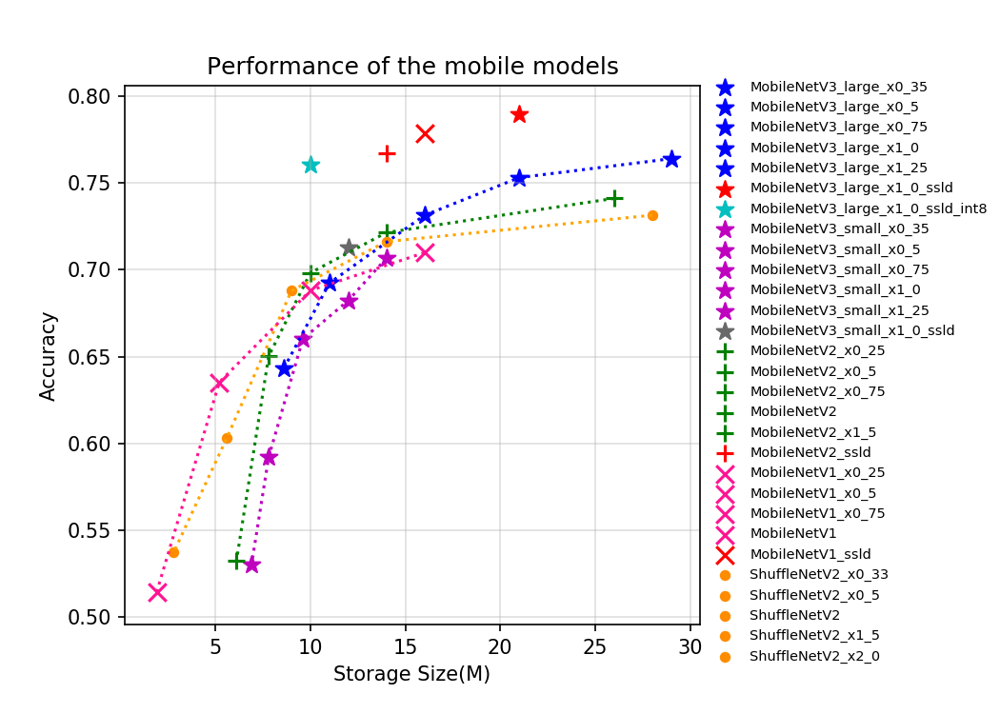
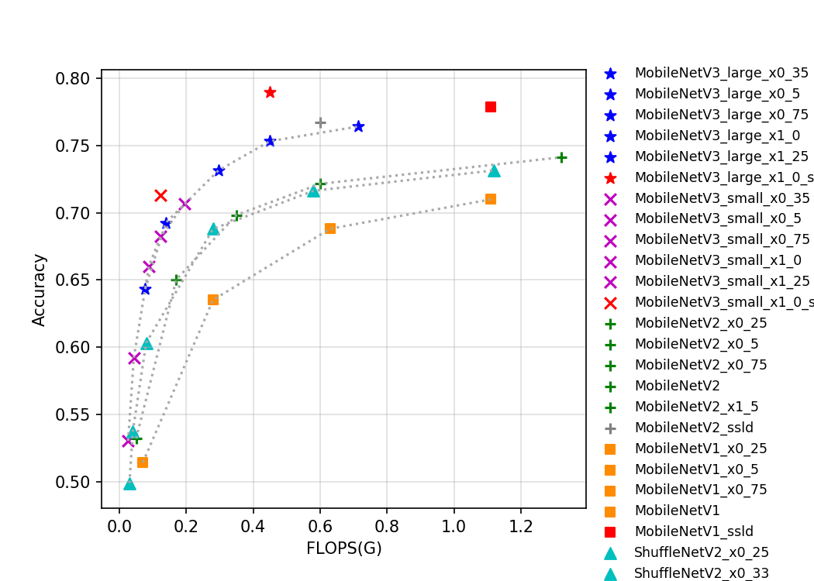
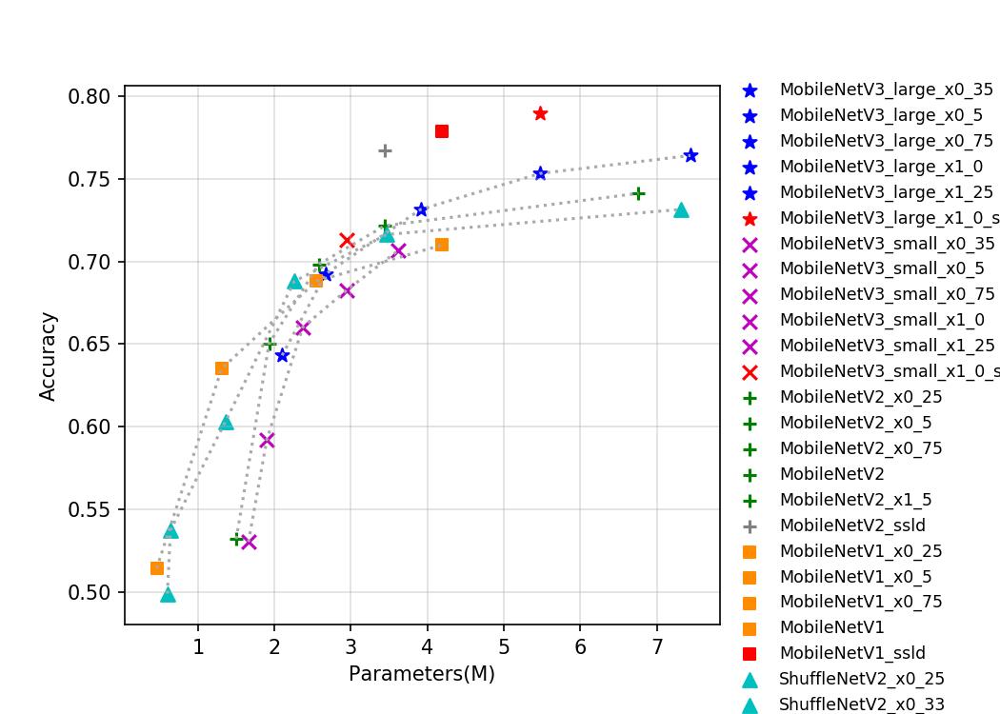

# ShuffleNetV2 系列
-----

## 目录

- [1. 模型介绍](#1)
    - [1.1 模型简介](#1.1)
    - [1.2 模型指标](#1.2)
    - [1.3 Benchmark](#1.3)
      - [1.3.1 基于 SD855 的预测速度和存储大小](#1.3.1)
      - [1.3.2 基于 V100 GPU 的预测速度](#1.3.2)
- [2. 模型快速体验](#2)
- [3. 模型训练、评估和预测](#3)
- [4. 模型推理部署](#4)
  - [4.1 推理模型准备](#4.1)
  - [4.2 基于 Python 预测引擎推理](#4.2)
  - [4.3 基于 C++ 预测引擎推理](#4.3)
  - [4.4 服务化部署](#4.4)
  - [4.5 端侧部署](#4.5)
  - [4.6 Paddle2ONNX 模型转换与预测](#4.6)

## 1. 模型介绍

### 1.1 模型简介

ShuffleNet 系列网络是旷视提出的轻量化网络结构，到目前为止，该系列网络一共有两种典型的结构，即 ShuffleNetV1 与 ShuffleNetV2。ShuffleNet 中的 Channel Shuffle 操作可以将组间的信息进行交换，并且可以实现端到端的训练。在 ShuffleNetV2 的论文中，作者提出了设计轻量级网络的四大准则，并且根据四大准则与 ShuffleNetV1 的不足，设计了 ShuffleNetV2 网络。

目前 PaddleClas 开源的的移动端系列的预训练模型一共有 35 个，其指标如图所示。从图片可以看出，越新的轻量级模型往往有更优的表现，MobileNetV3 代表了目前主流的轻量级神经网络结构。在 MobileNetV3 中，作者为了获得更高的精度，在 global-avg-pooling 后使用了 1x1 的卷积。该操作大幅提升了参数量但对计算量影响不大，所以如果从存储角度评价模型的优异程度，MobileNetV3 优势不是很大，但由于其更小的计算量，使得其有更快的推理速度。此外，我们模型库中的 ssld 蒸馏模型表现优异，从各个考量角度下，都刷新了当前轻量级模型的精度。由于 MobileNetV3 模型结构复杂，分支较多，对 GPU 并不友好，GPU 预测速度不如 MobileNetV1。GhostNet 于 2020 年提出，通过引入 ghost 的网络设计理念，大大降低了计算量和参数量，同时在精度上也超过前期最高的 MobileNetV3 网络结构。

### 1.2 模型指标

| Models                               | Top1    | Top5    | Reference top1 | Reference top5 | FLOPs (G) | Params (M) |
|:--:|:--:|:--:|:--:|:--:|:--:|:--:|
| ShuffleNetV2                         | 0.688   | 0.885   | 0.694             |                   | 0.280        | 2.260             |
| ShuffleNetV2_x0_25                   | 0.499   | 0.738   |                   |                   | 0.030        | 0.600             |
| ShuffleNetV2_x0_33                   | 0.537   | 0.771   |                   |                   | 0.040        | 0.640             |
| ShuffleNetV2_x0_5                    | 0.603   | 0.823   | 0.603             |                   | 0.080        | 1.360             |
| ShuffleNetV2_x1_5                    | 0.716   | 0.902   | 0.726             |                   | 0.580        | 3.470             |
| ShuffleNetV2_x2_0                    | 0.732   | 0.912   | 0.749             |                   | 1.120        | 7.320             |
| ShuffleNetV2_swish                   | 0.700   | 0.892   |                   |                   | 0.290        | 2.260             |

### 1.3 Benchmark

#### 1.3.1 基于 SD855 的预测速度和存储大小

| Models                               | SD855 time(ms) bs=1, thread=1 | SD855 time(ms) bs=1, thread=2 | SD855 time(ms) bs=1, thread=4 | Storage Size(M) |
|:--:|----|----|----|----|
| ShuffleNetV2                         | 9.72       | 5.97       | 4.13       | 9.000           |
| ShuffleNetV2_x0_25                   | 1.94        | 1.53        | 1.43        | 2.700           |
| ShuffleNetV2_x0_33                   | 2.23        | 1.70        | 1.79        | 2.800           |
| ShuffleNetV2_x0_5                    | 3.67        | 2.63        | 2.06        | 5.600           |
| ShuffleNetV2_x1_5                    | 17.21      | 10.56      | 6.81       | 14.000          |
| ShuffleNetV2_x2_0                    | 31.21      | 18.98      | 11.65      | 28.000          |
| ShuffleNetV2_swish                   | 31.21      | 9.06       | 5.74       | 9.100           |

#### 1.3.2 基于 V100 GPU 的预测速度

| Models      | Size | Latency(ms) bs=1 | Latency(ms) bs=4 | Latency(ms) bs=8 |
| --------------------------------  | ----------------- | ------------------------------ | ------------------------------ | ------------------------------ |
| ShuffleNetV2                     | 224       | 1.05   | 1.76                           | 2.37                           |
| ShuffleNetV2_x0_25               | 224       | 0.92   | 1.27                           | 1.73                           |
| ShuffleNetV2_x0_33               | 224       | 0.91   | 1.29                           | 1.81                           |
| ShuffleNetV2_x0_5                | 224       | 0.89   | 1.43                           | 1.94                           |
| ShuffleNetV2_x1_5                | 224       | 0.93   | 1.99                           | 2.85                           |
| ShuffleNetV2_x2_0                | 224       | 1.45   | 2.70                           | 3.35                           |
| ShuffleNetV2_swish               | 224       | 1.43   | 1.93                           | 2.69                           |

**备注：** 精度类型为 FP32，推理过程使用 TensorRT。

  

## 2. 模型快速体验

安装 paddlepaddle 和 paddleclas 即可快速对图片进行预测，体验方法可以参考[ResNet50 模型快速体验](./ResNet.md#2-模型快速体验)。

## 3. 模型训练、评估和预测

此部分内容包括训练环境配置、ImageNet数据的准备、该模型在 ImageNet 上的训练、评估、预测等内容。在 `ppcls/configs/ImageNet/ShuffleNetV2/` 中提供了该模型的训练配置，启动训练方法可以参考：[ResNet50 模型训练、评估和预测](./ResNet.md#3-模型训练评估和预测)。

## 4. 模型推理部署

### 4.1 推理模型准备

Paddle Inference 是飞桨的原生推理库， 作用于服务器端和云端，提供高性能的推理能力。相比于直接基于预训练模型进行预测，Paddle Inference可使用 MKLDNN、CUDNN、TensorRT 进行预测加速，从而实现更优的推理性能。更多关于Paddle Inference推理引擎的介绍，可以参考[Paddle Inference官网教程](https://www.paddlepaddle.org.cn/documentation/docs/zh/guides/infer/inference/inference_cn.html)。

Inference 的获取可以参考 [ResNet50 推理模型准备](./ResNet.md#41-推理模型准备) 。

### 4.2 基于 Python 预测引擎推理

PaddleClas 提供了基于 python 预测引擎推理的示例。您可以参考[ResNet50 基于 Python 预测引擎推理](./ResNet.md#42-基于-python-预测引擎推理) 。

### 4.3 基于 C++ 预测引擎推理

PaddleClas 提供了基于 C++ 预测引擎推理的示例，您可以参考[服务器端 C++ 预测](../../deployment/image_classification/cpp/linux.md)来完成相应的推理部署。如果您使用的是 Windows 平台，可以参考[基于 Visual Studio 2019 Community CMake 编译指南](../../deployment/image_classification/cpp/windows.md)完成相应的预测库编译和模型预测工作。

### 4.4 服务化部署

Paddle Serving 提供高性能、灵活易用的工业级在线推理服务。Paddle Serving 支持 RESTful、gRPC、bRPC 等多种协议，提供多种异构硬件和多种操作系统环境下推理解决方案。更多关于Paddle Serving 的介绍，可以参考[Paddle Serving 代码仓库](https://github.com/PaddlePaddle/Serving)。

PaddleClas 提供了基于 Paddle Serving 来完成模型服务化部署的示例，您可以参考[模型服务化部署](../../deployment/image_classification/paddle_serving.md)来完成相应的部署工作。

### 4.5 端侧部署

Paddle Lite 是一个高性能、轻量级、灵活性强且易于扩展的深度学习推理框架，定位于支持包括移动端、嵌入式以及服务器端在内的多硬件平台。更多关于 Paddle Lite 的介绍，可以参考[Paddle Lite 代码仓库](https://github.com/PaddlePaddle/Paddle-Lite)。

PaddleClas 提供了基于 Paddle Lite 来完成模型端侧部署的示例，您可以参考[端侧部署](../../deployment/image_classification/paddle_lite.md)来完成相应的部署工作。

### 4.6 Paddle2ONNX 模型转换与预测

Paddle2ONNX 支持将 PaddlePaddle 模型格式转化到 ONNX 模型格式。通过 ONNX 可以完成将 Paddle 模型到多种推理引擎的部署，包括TensorRT/OpenVINO/MNN/TNN/NCNN，以及其它对 ONNX 开源格式进行支持的推理引擎或硬件。更多关于 Paddle2ONNX 的介绍，可以参考[Paddle2ONNX 代码仓库](https://github.com/PaddlePaddle/Paddle2ONNX)。

PaddleClas 提供了基于 Paddle2ONNX 来完成 inference 模型转换 ONNX 模型并作推理预测的示例，您可以参考[Paddle2ONNX 模型转换与预测](../../deployment/image_classification/paddle2onnx.md)来完成相应的部署工作。
