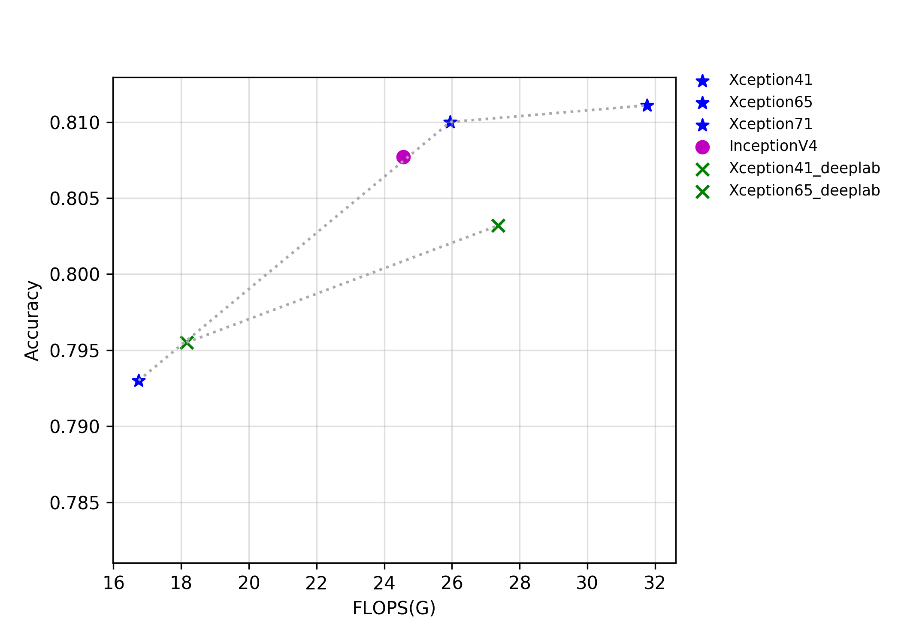
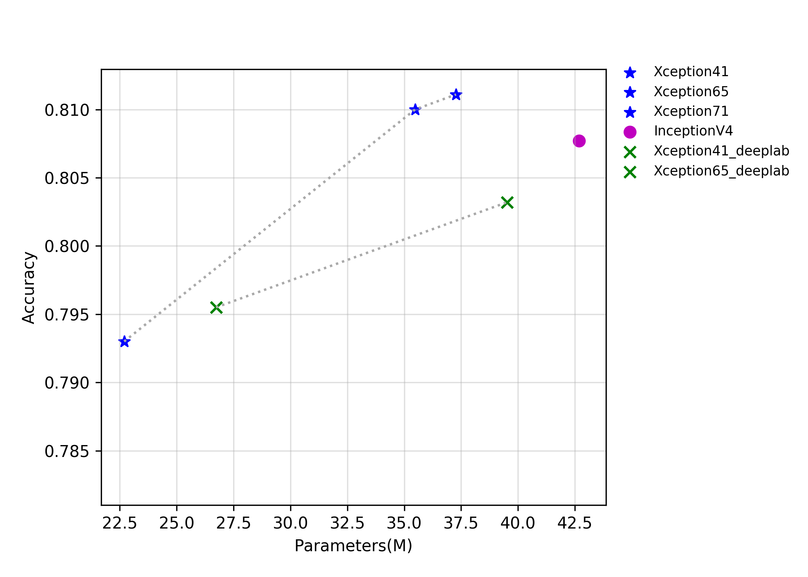

# Inception系列

## 概述

GoogLeNet是2014年由Google设计的一种新的神经网络结构，其与VGG网络并列成为当年ImageNet挑战赛的双雄。GoogLeNet首次引入Inception结构，在网络中堆叠该结构使得网络层数达到了22层，这也是卷积网络首次超过20层的标志。由于在Inception结构中使用了1x1的卷积用于通道数降维，并且使用了Global-pooling代替传统的多fc层加工特征的方式，最终的GoogLeNet网络的FLOPS和参数量远小于VGG网络，成为当时神经网络设计的一道亮丽风景线。

Xception 是 Google 继 Inception 后提出的对 InceptionV3 的另一种改进。在Xception中，作者使用了深度可分离卷积代替了传统的卷积操作，该操作大大节省了网络的FLOPS和参数量，但是精度反而有所提升。在DeeplabV3+中，作者将Xception做了进一步的改进，同时增加了Xception的层数，设计出了Xception65和Xception71的网络。

InceptionV4是2016年由Google设计的新的神经网络，当时残差结构风靡一时，但是作者认为仅使用Inception 结构也可以达到很高的性能。InceptionV4使用了更多的Inception module，在ImageNet上的精度再创新高。

该系列模型的FLOPS、参数量以及FP32预测耗时如下图所示。

上图反映了Xception系列和InceptionV4的精度和其他指标的关系。其中Xception_deeplab与论文结构保持一致，Xception是PaddleClas的改进模型，在预测速度基本不变的情况下，精度提升约0.6%。

## 精度、FLOPS和参数量

| Models             | Top1   | Top5   | Reference top1 | Reference top5 | FLOPS (G) | Parameters (M) |
|:--:|:--:|:--:|:--:|:--:|:--:|:--:|
| GoogLeNet          | 0.707  | 0.897  | 0.698             |                   | 2.880        | 8.460             |
| Xception41         | 0.793  | 0.945  | 0.790             | 0.945             | 16.740       | 22.690            |
| Xception41 _deeplab | 0.796  | 0.944  |                   |                   | 18.160       | 26.730            |
| Xception65         | 0.810  | 0.955  |                   |                   | 25.950       | 35.480            |
| Xception65 _deeplab | 0.803  | 0.945  |                   |                   | 27.370       | 39.520            |
| Xception71         | 0.811  | 0.955  |                   |                   | 31.770       | 37.280            |
| InceptionV4        | 0.808  | 0.953  | 0.800             | 0.950             | 24.570       | 42.680            |

## FP32预测速度

| Models                 | Crop Size | Resize Short Size | Batch Size=1 (ms) |
|------------------------|-----------|-------------------|--------------------------|
| GoogLeNet              | 224       | 256               | 1.807                    |
| Xception41             | 299       | 320               | 3.972                    |
| Xception41 _deeplab | 299       | 320               | 4.408                    |
| Xception65             | 299       | 320               | 6.174                    |
| Xception65 _deeplab | 299       | 320               | 6.464                    |
| Xception71             | 299       | 320               | 6.782                    |
| InceptionV4            | 299       | 320               | 11.141                   |
