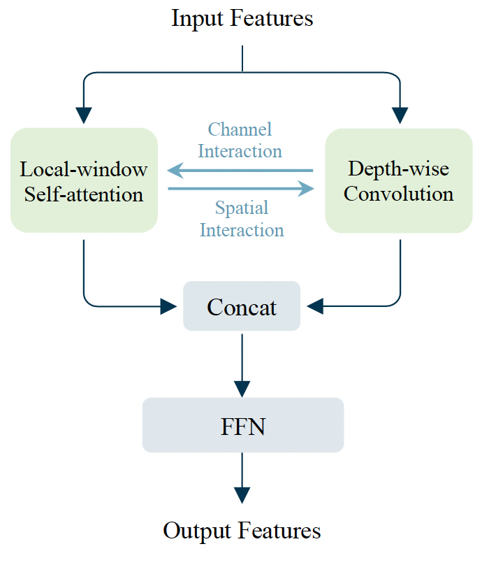

# MixFormer
---
## 目录

- [1. 介绍](#1)
- [2. 主要结果](#2)
    - [2.1 图像分类](#2.1)
    - [2.2 目标检测与实例分割](#2.2)
    - [2.3 语义分割](#2.3)
    - [2.4 人体关键点](#2.4)
    - [2.4 长尾实例分割](#2.5)
- [3. 引用](#3)

<a name='1'></a>
## 1. 介绍

MixFormer是一个高效、通用的骨干网路（Vision Transformer）。在MixFormer中，主要有两个创新的设计：（1）通过平行分支的设计，将局部窗口自注意力（local-window self-attention）与Depthwise卷积进行组合，解决局部窗口自注意力的感受野受限的问题，（2）在平行分支之间提出双向交互模块，使得两个分支可以在channel和spatial两个维度都能实现信息互补，增强整体的建模能力。上述两个设计的组合使得MixFormer可以融合不同局部窗口与不同维度的特征信息，从而在图像分类以及5个重要的下游任务中取得比其他vision transformer骨干网络更好的结果。

> [**MixFormer: Mixing Features across Windows and Dimensions**](https://arxiv.org/abs/2204.02557)<br> 
> Qiang Chen, Qiman Wu, Jian Wang, Qinghao Hu, Tao Hu, Errui Ding, Jian Cheng, Jingdong Wang<br>
> CVPR2022, **Oral** presentation




<a name='2'></a>
## 2. 主要结果

<a name='2.1'></a>
### 图像分类
我们提供了MixFormer在ImageNet-1K数据集上的精度。与其他vision transformer不同的是，MixFormer即使在小模型的场景下，也能有很好的性能表现，而其他的vision transformer往往只有在模型较大的情况下（例如，4.5G FLOPs）才比较有效。

| Models | Top1 | Top5 | Reference top1| FLOPs (G) |
|:--:|:--:|:--:|:--:|:--:|
| MixFormer-B0 | - | - | 0.765 |  0.4  |
| MixFormer-B1 | - | - | 0.789 |  0.7  |
| MixFormer-B2 | - | - | 0.800 |  0.9  |
| MixFormer-B3 | - | - | 0.817 |  1.9  |
| MixFormer-B4 | - | - | 0.830 |  3.6  |
| MixFormer-B5 | - | - | 0.835 |  6.8  |
| MixFormer-B6 | - | - | 0.838 |  12.7  |

模型后续将提供下载。

<a name='2.2'></a>
### 目标检测与实例分割
下表中的所有结果都以Mask R-CNN为基础模型，并且采用3x多尺度训练得到的。

| Backbone | Params (M) | FLOPs (G) | schedule | mAP_box| mAP_mask |
|:--:|:--:|:--:|:--:|:--:| :--:|
| Swin-T | 48 | 264 | 3x | 46.0| 41.6 |
| MixFormer-B1 | 26 | 183 | 3x | 43.9 | 40.0 |
| MixFormer-B2 | 28 | 187 | 3x | 45.1 | 40.8 |
| MixFormer-B3 | 35 | 207 | 3x | 46.2 | 41.9 |
| MixFormer-B4 | 53 | 243 | 3x | **47.6** | **43.0** |

<a name='2.3'></a>
### 语义分割
下表中的所有结果都以UperNet为基础模型。

| Backbone | Params (M) | FLOPs (G) | iterations | mIoU_ss | mIoU_ms |
|:--:|:--:|:--:|:--:|:--:| :--:|
| Swin-T | 60 | 945 | 160k | 44.5| 45.8 |
| MixFormer-B1 | 35 | 854 | 160k | 42.0 | 43.5 |
| MixFormer-B2 | 37 | 859 | 160k | 43.1 | 43.9 |
| MixFormer-B3 | 44 | 880 | 160k | 44.5 | 45.5 |
| MixFormer-B4 | 63 | 918 | 160k | **46.8** | **48.0** |

<a name='2.4'></a>
### 人体关键点

| Backbone | mAP | mAP_50 | mAP_75 |
|:--:|:--:|:--:|:--:|
| ResNet50 | 71.8 | 89.8 | 79.5 |
| Swin-T | 74.2 | 92.5 | 82.5 |
| HRFormer-S | 74.5 | 92.3 | 82.1 |
| MixFormer-B4 | **75.3** | **93.5** | **83.5** |

<a name='2.5'></a>
### 长尾实例分割

| Backbone | mAP_mask | mAP_mask_50 | mAP_mask_75 |
|:--:|:--:|:--:|:--:|
| ResNet50 | 21.7 | 34.3 | 23.0 |
| Swin-T | 27.6 | 43.0 | 29.3 |
| MixFormer-B4 | **28.6** | **43.4** | **30.5** |

<a name="3"></a>
## 3. 引用

如果MixFormer对你有所启发，请考虑引用我们的MixFormer:
```
@inproceedings{chen2022mixformer,
  title={MixFormer: Mixing Features across Windows and Dimensions},
  author={Chen, Qiang and Wu, Qiman and Wang, Jian and Hu, Qinghao and Hu, Tao and Ding, Errui and Cheng, Jian and Wang, Jingdong},
  booktitle={IEEE Conference on Computer Vision and Pattern Recognition},
  year={2022}
}
```
