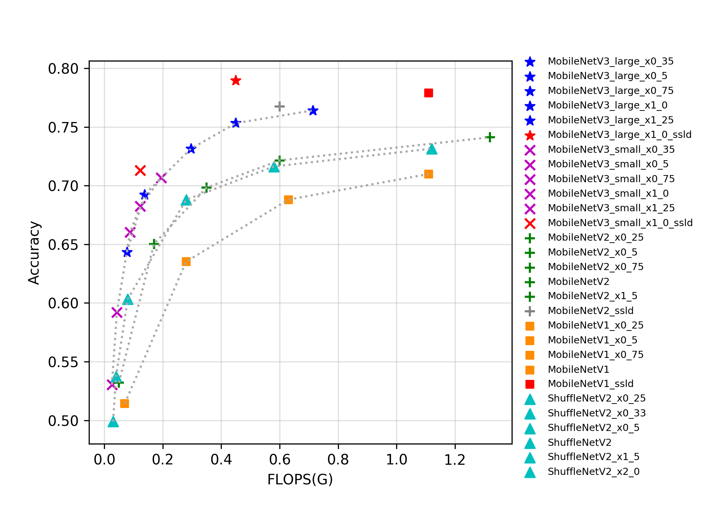
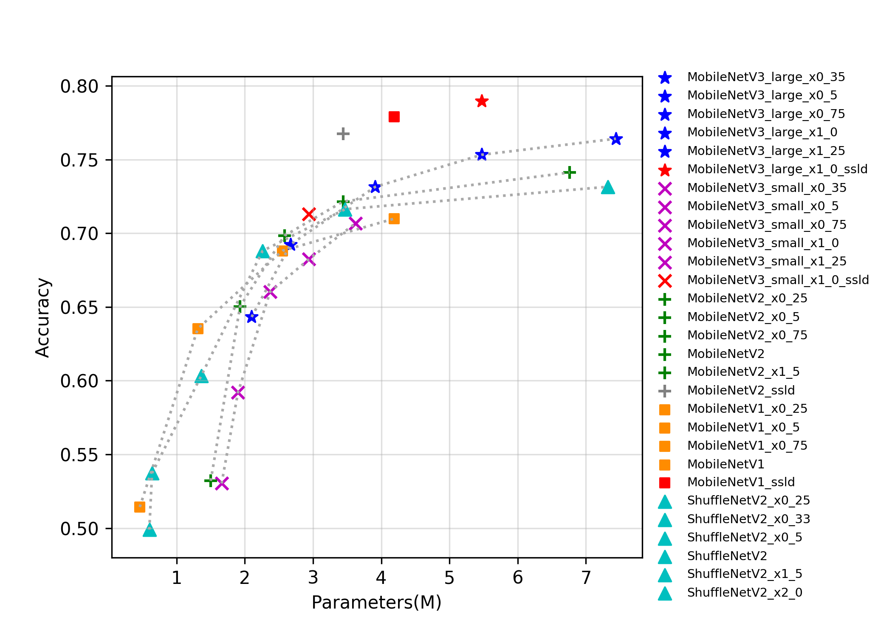

# 移动端系列

## 概述
MobileNetV1是Google于2017年发布的用于移动设备或嵌入式设备中的网络。该网络将传统的卷积操作替换深度可分离卷积，即Depthwise卷积和Pointwise卷积的组合，相比传统的卷积操作，该组合可以大大节省参数量和计算量。与此同时，MobileNetV1也可以用于目标检测、图像分割等其他视觉任务中。

MobileNetV2是Google继MobileNetV1提出的一种轻量级网络。相比MobileNetV1，MobileNetV2提出了Linear bottlenecks与Inverted residual block作为网络基本结构，通过大量地堆叠这些基本模块，构成了MobileNetV2的网络结构。最终，在FLOPS只有MobileNetV1的一半的情况下取得了更高的分类精度。

ShuffleNet系列网络是旷视提出的轻量化网络结构，到目前为止，该系列网络一共有两种典型的结构，即ShuffleNetV1与ShuffleNetV2。ShuffleNet中的Channel Shuffle操作可以将组间的信息进行交换，并且可以实现端到端的训练。在ShuffleNetV2的论文中，作者提出了设计轻量级网络的四大准则，并且根据四大准则与ShuffleNetV1的不足，设计了ShuffleNetV2网络。

MobileNetV3是Google于2019年提出的一种基于NAS的新的轻量级网络，为了进一步提升效果，将relu和sigmoid激活函数分别替换为hard_swish与hard_sigmoid激活函数，同时引入了一些专门减小网络计算量的改进策略。

目前PaddleClas开源的的移动端系列的预训练模型一共有32个，其指标如图所示。从图片可以看出，越新的轻量级模型往往有更优的表现，MobileNetV3代表了目前最新的轻量级神经网络结构。在MobileNetV3中，作者为了获得更高的精度，在global-avg-pooling后使用了1x1的卷积。该操作大幅提升了参数量但对计算量影响不大，所以如果从存储角度评价模型的优异程度，MobileNetV3优势不是很大，但由于其更小的计算量，使得其有更快的推理速度。此外，我们模型库中的ssld蒸馏模型表现优异，从各个考量角度下，都刷新了当前轻量级模型的精度。由于MobileNetV3模型结构复杂，分支较多，对GPU并不友好，GPU预测速度不如MobileNetV1。

## 精度、FLOPS和参数量

| Models                               | Top1    | Top5    | Reference top1 | Reference top5 | FLOPS (G) | Parameters (M) |
|:--:|:--:|:--:|:--:|:--:|:--:|:--:|
| MobileNetV1_x0_25                    | 0.514   | 0.755   | 0.506             |                   | 0.070        | 0.460             |
| MobileNetV1_x0_5                     | 0.635   | 0.847   | 0.637             |                   | 0.280        | 1.310             |
| MobileNetV1_x0_75                    | 0.688   | 0.882   | 0.684             |                   | 0.630        | 2.550             |
| MobileNetV1                          | 0.710   | 0.897   | 0.706             |                   | 1.110        | 4.190             |
| MobileNetV1_ssld                     | 0.779   | 0.939   |                   |                   | 1.110        | 4.190             |
| MobileNetV2_x0_25                    | 0.532   | 0.765   |                   |                   | 0.050        | 1.500             |
| MobileNetV2_x0_5                     | 0.650   | 0.857   | 0.654             | 0.864             | 0.170        | 1.930             |
| MobileNetV2_x0_75                    | 0.698   | 0.890   | 0.698             | 0.896             | 0.350        | 2.580             |
| MobileNetV2                          | 0.722   | 0.907   | 0.718             | 0.910             | 0.600        | 3.440             |
| MobileNetV2_x1_5                     | 0.741   | 0.917   |                   |                   | 1.320        | 6.760             |
| MobileNetV2_x2_0                     | 0.752   | 0.926   |                   |                   | 2.320        | 11.130            |
| MobileNetV2_ssld                     | 0.7674  | 0.9339  |                   |                   | 0.600        | 3.440             |
| MobileNetV3_large_ x1_25          | 0.764   | 0.930   | 0.766             |                   | 0.714        | 7.440             |
| MobileNetV3_large_ x1_0           | 0.753   | 0.923   | 0.752             |                   | 0.450        | 5.470             |
| MobileNetV3_large_ x0_75          | 0.731   | 0.911   | 0.733             |                   | 0.296        | 3.910             |
| MobileNetV3_large_ x0_5           | 0.692   | 0.885   | 0.688             |                   | 0.138        | 2.670             |
| MobileNetV3_large_ x0_35          | 0.643   | 0.855   | 0.642             |                   | 0.077        | 2.100             |
| MobileNetV3_small_ x1_25          | 0.707   | 0.895   | 0.704             |                   | 0.195        | 3.620             |
| MobileNetV3_small_ x1_0           | 0.682   | 0.881   | 0.675             |                   | 0.123        | 2.940             |
| MobileNetV3_small_ x0_75          | 0.660   | 0.863   | 0.654             |                   | 0.088        | 2.370             |
| MobileNetV3_small_ x0_5           | 0.592   | 0.815   | 0.580             |                   | 0.043        | 1.900             |
| MobileNetV3_small_ x0_35          | 0.530   | 0.764   | 0.498             |                   | 0.026        | 1.660             |
| MobileNetV3_large_ x1_0_ssld      | 0.790   | 0.945   |                   |                   | 0.450        | 5.470             |
| MobileNetV3_large_ x1_0_ssld_int8 | 0.761   |         |                   |                   |              |                   |
| MobileNetV3_small_ x1_0_ssld      | 0.713   | 0.901   |                   |                   | 0.123        | 2.940             |
| ShuffleNetV2                         | 0.688   | 0.885   | 0.694             |                   | 0.280        | 2.260             |
| ShuffleNetV2_x0_25                   | 0.499   | 0.738   |                   |                   | 0.030        | 0.600             |
| ShuffleNetV2_x0_33                   | 0.537   | 0.771   |                   |                   | 0.040        | 0.640             |
| ShuffleNetV2_x0_5                    | 0.603   | 0.823   | 0.603             |                   | 0.080        | 1.360             |
| ShuffleNetV2_x1_5                    | 0.716   | 0.902   | 0.726             |                   | 0.580        | 3.470             |
| ShuffleNetV2_x2_0                    | 0.732   | 0.912   | 0.749             |                   | 1.120        | 7.320             |
| ShuffleNetV2_swish                   | 0.700   | 0.892   |                   |                   | 0.290        | 2.260             |

## CPU预测速度和存储大小

| Models                               | batch_size=1(ms) | Storage Size(M) |
|:--:|:--:|:--:|
| MobileNetV1_x0_25                    | 3.220            | 1.900           |
| MobileNetV1_x0_5                     | 9.580            | 5.200           |
| MobileNetV1_x0_75                    | 19.436           | 10.000          |
| MobileNetV1                          | 32.523           | 16.000          |
| MobileNetV1_ssld                     | 32.523           | 16.000          |
| MobileNetV2_x0_25                    | 3.799            | 6.100           |
| MobileNetV2_x0_5                     | 8.702            | 7.800           |
| MobileNetV2_x0_75                    | 15.531           | 10.000          |
| MobileNetV2                          | 23.318           | 14.000          |
| MobileNetV2_x1_5                     | 45.624           | 26.000          |
| MobileNetV2_x2_0                     | 74.292           | 43.000          |
| MobileNetV2_ssld                     | 23.318           | 14.000          |
| MobileNetV3_large_x1_25          | 28.218           | 29.000          |
| MobileNetV3_large_x1_0           | 19.308           | 21.000          |
| MobileNetV3_large_x0_75          | 13.565           | 16.000          |
| MobileNetV3_large_x0_5           | 7.493            | 11.000          |
| MobileNetV3_large_x0_35          | 5.137            | 8.600           |
| MobileNetV3_small_x1_25          | 9.275            | 14.000          |
| MobileNetV3_small_x1_0           | 6.546            | 12.000          |
| MobileNetV3_small_x0_75          | 5.284            | 9.600           |
| MobileNetV3_small_x0_5           | 3.352            | 7.800           |
| MobileNetV3_small_x0_35          | 2.635            | 6.900           |
| MobileNetV3_large_x1_0_ssld      | 19.308           | 21.000          |
| MobileNetV3_large_x1_0_ssld_int8 | 14.395           | 10.000          |
| MobileNetV3_small_x1_0_ssld      | 6.546            | 12.000          |
| ShuffleNetV2                         | 10.941           | 9.000           |
| ShuffleNetV2_x0_25                   | 2.329            | 2.700           |
| ShuffleNetV2_x0_33                   | 2.643            | 2.800           |
| ShuffleNetV2_x0_5                    | 4.261            | 5.600           |
| ShuffleNetV2_x1_5                    | 19.352           | 14.000          |
| ShuffleNetV2_x2_0                    | 34.770           | 28.000          |
| ShuffleNetV2_swish                   | 16.023           | 9.100           |
