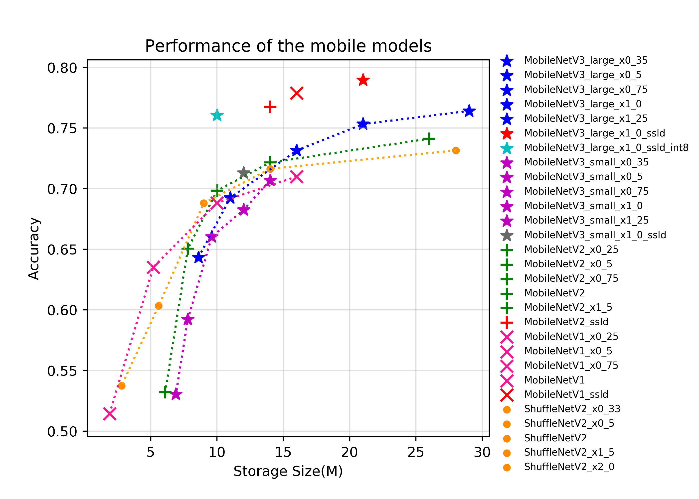
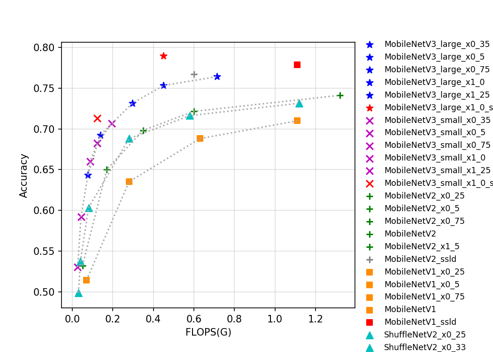

# 移动端系列
---
## 目录

* [1. 概述](#1)
* [2. 精度、FLOPS 和参数量](#2)
* [3. 基于 SD855 的预测速度和存储大小](#3)
* [4. 基于 V100 GPU 的预测速度](#4)
* [5. 基于 T4 GPU 的预测速度](#5)

 

## 1. 概述
MobileNetV1 是 Google 于 2017 年发布的用于移动设备或嵌入式设备中的网络。该网络将传统的卷积操作替换深度可分离卷积，即 Depthwise 卷积和 Pointwise 卷积的组合，相比传统的卷积操作，该组合可以大大节省参数量和计算量。与此同时，MobileNetV1 也可以用于目标检测、图像分割等其他视觉任务中。

MobileNetV2 是 Google 继 MobileNetV1 提出的一种轻量级网络。相比 MobileNetV1，MobileNetV2 提出了 Linear bottlenecks 与 Inverted residual block 作为网络基本结构，通过大量地堆叠这些基本模块，构成了 MobileNetV2 的网络结构。最终，在 FLOPS 只有 MobileNetV1 的一半的情况下取得了更高的分类精度。

ShuffleNet 系列网络是旷视提出的轻量化网络结构，到目前为止，该系列网络一共有两种典型的结构，即 ShuffleNetV1 与 ShuffleNetV2。ShuffleNet 中的 Channel Shuffle 操作可以将组间的信息进行交换，并且可以实现端到端的训练。在 ShuffleNetV2 的论文中，作者提出了设计轻量级网络的四大准则，并且根据四大准则与 ShuffleNetV1 的不足，设计了 ShuffleNetV2 网络。

MobileNetV3 是 Google 于 2019 年提出的一种基于 NAS 的新的轻量级网络，为了进一步提升效果，将 relu 和 sigmoid 激活函数分别替换为 hard_swish 与 hard_sigmoid 激活函数，同时引入了一些专门减小网络计算量的改进策略。

GhostNet 是华为于 2020 年提出的一种全新的轻量化网络结构，通过引入 ghost module，大大减缓了传统深度网络中特征的冗余计算问题，使得网络的参数量和计算量大大降低。

目前 PaddleClas 开源的的移动端系列的预训练模型一共有 35 个，其指标如图所示。从图片可以看出，越新的轻量级模型往往有更优的表现，MobileNetV3 代表了目前主流的轻量级神经网络结构。在 MobileNetV3 中，作者为了获得更高的精度，在 global-avg-pooling 后使用了 1x1 的卷积。该操作大幅提升了参数量但对计算量影响不大，所以如果从存储角度评价模型的优异程度，MobileNetV3 优势不是很大，但由于其更小的计算量，使得其有更快的推理速度。此外，我们模型库中的 ssld 蒸馏模型表现优异，从各个考量角度下，都刷新了当前轻量级模型的精度。由于 MobileNetV3 模型结构复杂，分支较多，对 GPU 并不友好，GPU 预测速度不如 MobileNetV1。GhostNet 于 2020 年提出，通过引入 ghost 的网络设计理念，大大降低了计算量和参数量，同时在精度上也超过前期最高的 MobileNetV3 网络结构。

## 2. 精度、FLOPS 和参数量

| Models                               | Top1    | Top5    | Reference top1 | Reference top5 | FLOPS (G) | Parameters (M) |
|:--:|:--:|:--:|:--:|:--:|:--:|:--:|
| MobileNetV1_x0_25                    | 0.514   | 0.755   | 0.506             |                   | 0.070        | 0.460             |
| MobileNetV1_x0_5                     | 0.635   | 0.847   | 0.637             |                   | 0.280        | 1.310             |
| MobileNetV1_x0_75                    | 0.688   | 0.882   | 0.684             |                   | 0.630        | 2.550             |
| MobileNetV1                          | 0.710   | 0.897   | 0.706             |                   | 1.110        | 4.190             |
| MobileNetV1_ssld                     | 0.779   | 0.939   |                   |                   | 1.110        | 4.190             |
| MobileNetV2_x0_25                    | 0.532   | 0.765   |                   |                   | 0.050        | 1.500             |
| MobileNetV2_x0_5                     | 0.650   | 0.857   | 0.654             | 0.864             | 0.170        | 1.930             |
| MobileNetV2_x0_75                    | 0.698   | 0.890   | 0.698             | 0.896             | 0.350        | 2.580             |
| MobileNetV2                          | 0.722   | 0.907   | 0.718             | 0.910             | 0.600        | 3.440             |
| MobileNetV2_x1_5                     | 0.741   | 0.917   |                   |                   | 1.320        | 6.760             |
| MobileNetV2_x2_0                     | 0.752   | 0.926   |                   |                   | 2.320        | 11.130            |
| MobileNetV2_ssld                     | 0.7674  | 0.9339  |                   |                   | 0.600        | 3.440             |
| MobileNetV3_large_ x1_25          | 0.764   | 0.930   | 0.766             |                   | 0.714        | 7.440             |
| MobileNetV3_large_ x1_0           | 0.753   | 0.923   | 0.752             |                   | 0.450        | 5.470             |
| MobileNetV3_large_ x0_75          | 0.731   | 0.911   | 0.733             |                   | 0.296        | 3.910             |
| MobileNetV3_large_ x0_5           | 0.692   | 0.885   | 0.688             |                   | 0.138        | 2.670             |
| MobileNetV3_large_ x0_35          | 0.643   | 0.855   | 0.642             |                   | 0.077        | 2.100             |
| MobileNetV3_small_ x1_25          | 0.707   | 0.895   | 0.704             |                   | 0.195        | 3.620             |
| MobileNetV3_small_ x1_0           | 0.682   | 0.881   | 0.675             |                   | 0.123        | 2.940             |
| MobileNetV3_small_ x0_75          | 0.660   | 0.863   | 0.654             |                   | 0.088        | 2.370             |
| MobileNetV3_small_ x0_5           | 0.592   | 0.815   | 0.580             |                   | 0.043        | 1.900             |
| MobileNetV3_small_ x0_35          | 0.530   | 0.764   | 0.498             |                   | 0.026        | 1.660             |
| MobileNetV3_small_ x0_35_ssld          | 0.556   | 0.777   | 0.498             |                   | 0.026        | 1.660             |
| MobileNetV3_large_ x1_0_ssld      | 0.790   | 0.945   |                   |                   | 0.450        | 5.470             |
| MobileNetV3_large_ x1_0_ssld_int8 | 0.761   |         |                   |                   |              |                   |
| MobileNetV3_small_ x1_0_ssld      | 0.713   | 0.901   |                   |                   | 0.123        | 2.940             |
| ShuffleNetV2                         | 0.688   | 0.885   | 0.694             |                   | 0.280        | 2.260             |
| ShuffleNetV2_x0_25                   | 0.499   | 0.738   |                   |                   | 0.030        | 0.600             |
| ShuffleNetV2_x0_33                   | 0.537   | 0.771   |                   |                   | 0.040        | 0.640             |
| ShuffleNetV2_x0_5                    | 0.603   | 0.823   | 0.603             |                   | 0.080        | 1.360             |
| ShuffleNetV2_x1_5                    | 0.716   | 0.902   | 0.726             |                   | 0.580        | 3.470             |
| ShuffleNetV2_x2_0                    | 0.732   | 0.912   | 0.749             |                   | 1.120        | 7.320             |
| ShuffleNetV2_swish                   | 0.700   | 0.892   |                   |                   | 0.290        | 2.260             |
| GhostNet_x0_5                        | 0.668   | 0.869   | 0.662             | 0.866             | 0.082        | 2.600             |
| GhostNet_x1_0                        | 0.740   | 0.916   | 0.739             | 0.914             | 0.294        | 5.200             |
| GhostNet_x1_3                        | 0.757   | 0.925   | 0.757             | 0.927             | 0.440        | 7.300             |
| GhostNet_x1_3_ssld                        | 0.794   | 0.945   | 0.757             | 0.927             | 0.440        | 7.300             |

## 3. 基于 SD855 的预测速度和存储大小

| Models                               | SD855 time(ms) bs=1, thread=1 | SD855 time(ms) bs=1, thread=2 | SD855 time(ms) bs=1, thread=4 | Storage Size(M) |
|:--:|----|----|----|----|
| MobileNetV1_x0_25                    | 2.88        | 1.82        | 1.26        | 1.900           |
| MobileNetV1_x0_5                     | 8.74        | 5.26        | 3.09        | 5.200           |
| MobileNetV1_x0_75                    | 17.84      | 10.61      | 6.21       | 10.000          |
| MobileNetV1                          | 30.24      | 17.86      | 10.30      | 16.000          |
| MobileNetV1_ssld                     | 30.19      | 17.85      | 10.23      | 16.000          |
| MobileNetV2_x0_25                    | 3.46        | 2.51        | 2.03        | 6.100           |
| MobileNetV2_x0_5                     | 7.69        | 4.92        | 3.57        | 7.800           |
| MobileNetV2_x0_75                    | 13.69      | 8.60       | 5.82       | 10.000          |
| MobileNetV2                          | 20.74      | 12.71      | 8.10       | 14.000          |
| MobileNetV2_x1_5                     | 40.79      | 24.49      | 15.50      | 26.000          |
| MobileNetV2_x2_0                     | 67.50      | 40.03      | 25.55      | 43.000          |
| MobileNetV2_ssld                     | 20.71      | 12.70      | 8.06       | 14.000          |
| MobileNetV3_large_x1_25          | 24.52      | 14.76      | 9.89       | 29.000          |
| MobileNetV3_large_x1_0           | 16.55      | 10.09      | 6.84       | 21.000          |
| MobileNetV3_large_x0_75          | 11.53      | 7.06       | 4.94       | 16.000          |
| MobileNetV3_large_x0_5           | 6.50        | 4.22        | 3.15        | 11.000          |
| MobileNetV3_large_x0_35          | 4.43        | 3.11        | 2.41        | 8.600           |
| MobileNetV3_small_x1_25          | 7.88        | 4.91        | 3.45        | 14.000          |
| MobileNetV3_small_x1_0           | 5.63        | 3.65        | 2.60        | 12.000          |
| MobileNetV3_small_x0_75          | 4.50        | 2.96        | 2.19        | 9.600           |
| MobileNetV3_small_x0_5           | 2.89        | 2.04    | 1.62        | 7.800           |
| MobileNetV3_small_x0_35          | 2.23        | 1.66        | 1.43        | 6.900           |
| MobileNetV3_small_x0_35_ssld          |             |             |             | 6.900           |
| MobileNetV3_large_x1_0_ssld      | 16.56      | 10.10      | 6.86       | 21.000          |
| MobileNetV3_large_x1_0_ssld_int8 |            |            |            | 10.000          |
| MobileNetV3_small_x1_0_ssld      | 5.64        | 3.67        | 2.61        | 12.000          |
| ShuffleNetV2                         | 9.72       | 5.97       | 4.13       | 9.000           |
| ShuffleNetV2_x0_25                   | 1.94        | 1.53        | 1.43        | 2.700           |
| ShuffleNetV2_x0_33                   | 2.23        | 1.70        | 1.79        | 2.800           |
| ShuffleNetV2_x0_5                    | 3.67        | 2.63        | 2.06        | 5.600           |
| ShuffleNetV2_x1_5                    | 17.21      | 10.56      | 6.81       | 14.000          |
| ShuffleNetV2_x2_0                    | 31.21      | 18.98      | 11.65      | 28.000          |
| ShuffleNetV2_swish                   | 31.21      | 9.06       | 5.74       | 9.100           |
| GhostNet_x0_5                   | 5.28       | 3.95       | 3.29       | 10.000           |
| GhostNet_x1_0                   | 12.89      | 8.66       | 6.72       | 20.000           |
| GhostNet_x1_3                   | 19.16      | 12.25      | 9.40       | 29.000           |
| GhostNet_x1_3_ssld                   | 19.16      | 17.85      | 10.18      | 29.000           |

## 4. 基于 V100 GPU 的预测速度

| Models                           | Crop Size | Resize Short Size | FP32 Batch Size=1 (ms) | FP32 Batch Size=4 (ms) | FP32 Batch Size=8 (ms) |
| -------------------------------- | --------- | ----------------- | ------------------------------ | ------------------------------ | ------------------------------ |
| MobileNetV1_x0_25                | 224       | 256               | 0.47                           | 0.93                           | 1.39                           |
| MobileNetV1_x0_5                 | 224       | 256               | 0.48                           | 1.09                           | 1.69                           |
| MobileNetV1_x0_75                | 224       | 256               | 0.55                           | 1.34                           | 2.03                           |
| MobileNetV1                      | 224       | 256               | 0.64                           | 1.57                           | 2.48                           |
| MobileNetV1_ssld                 | 224       | 256               | 0.66                           | 1.59                           | 2.58                           |
| MobileNetV2_x0_25                | 224       | 256               | 0.83                           | 1.17                           | 1.78                           |
| MobileNetV2_x0_5                 | 224       | 256               | 0.84                           | 1.45                           | 2.04                           |
| MobileNetV2_x0_75                | 224       | 256               | 0.96                           | 1.62                           | 2.53                           |
| MobileNetV2                      | 224       | 256               | 1.02                           | 1.93                           | 2.89                           |
| MobileNetV2_x1_5                 | 224       | 256               | 1.32                           | 2.58                           | 4.14                           |
| MobileNetV2_x2_0                 | 224       | 256               | 1.57                           | 3.13                           | 4.76                           |
| MobileNetV2_ssld                 | 224       | 256               | 1.01                           | 1.97                           | 2.84                           |
| MobileNetV3_large_x1_25          | 224       | 256               | 1.75                           | 2.87                           | 4.23                           |
| MobileNetV3_large_x1_0           | 224       | 256               | 1.37                           | 2.67                           | 3.46                           |
| MobileNetV3_large_x0_75          | 224       | 256               | 1.37                           | 2.23                           | 3.17                           |
| MobileNetV3_large_x0_5           | 224       | 256               | 1.10                           | 1.85                           | 2.69                           |
| MobileNetV3_large_x0_35          | 224       | 256               | 1.01                           | 1.44                           | 1.92                           |
| MobileNetV3_small_x1_25          | 224       | 256               | 1.20                           | 2.04                           | 2.64                           |
| MobileNetV3_small_x1_0           | 224       | 256               | 1.03                           | 1.76                           | 2.50                           |
| MobileNetV3_small_x0_75          | 224       | 256               | 1.04                           | 1.71                           | 2.37                           |
| MobileNetV3_small_x0_5           | 224       | 256               | 1.01                           | 1.49                           | 2.01                           |
| MobileNetV3_small_x0_35          | 224       | 256               | 1.01                           | 1.44                           | 1.92                           |
| MobileNetV3_small_x0_35_ssld     | 224       | 256               |                                |                                |                                |
| MobileNetV3_large_x1_0_ssld      | 224       | 256               | 1.35                           | 2.47                           | 3.72                           |
| MobileNetV3_large_x1_0_ssld_int8 | 224       | 256               |                                |                                |                                |
| MobileNetV3_small_x1_0_ssld      | 224       | 256               | 1.06                           | 1.89                           | 2.48                           |
| ShuffleNetV2                     | 224       | 256               | 1.05                           | 1.76                           | 2.37                           |
| ShuffleNetV2_x0_25               | 224       | 256               | 0.92                           | 1.27                           | 1.73                           |
| ShuffleNetV2_x0_33               | 224       | 256               | 0.91                           | 1.29                           | 1.81                           |
| ShuffleNetV2_x0_5                | 224       | 256               | 0.89                           | 1.43                           | 1.94                           |
| ShuffleNetV2_x1_5                | 224       | 256               | 0.93                           | 1.99                           | 2.85                           |
| ShuffleNetV2_x2_0                | 224       | 256               | 1.45                           | 2.70                           | 3.35                           |
| ShuffleNetV2_swish               | 224       | 256               | 1.43                           | 1.93                           | 2.69                           |
| GhostNet_x0_5                    | 224       | 256               | 1.66                           | 2.24                           | 2.73                           |
| GhostNet_x1_0                    | 224       | 256               | 1.69                           | 2.73                           | 3.81                           |
| GhostNet_x1_3                    | 224       | 256               | 1.84                           | 2.88                           | 3.94                           |
| GhostNet_x1_3_ssld               | 224       | 256               | 1.85                           | 3.17                           | 4.29                           |

## 5. 基于 T4 GPU 的预测速度

| Models            | Crop Size | Resize Short Size | FP32 Batch Size=1 (ms) | FP32 Batch Size=4 (ms) | FP32 Batch Size=8 (ms) |
|-----------------------------|-----------------------|-----------------------|-----------------------|-----------------------|-----------------------|
| MobileNetV1_x0_25           | 224       | 256               | 0.47                         | 0.93                         | 1.39                         |
| MobileNetV1_x0_5            | 224       | 256               | 0.48                         | 1.09                         | 1.69                         |
| MobileNetV1_x0_75           | 224       | 256               | 0.55                         | 1.34                         | 2.03                         |
| MobileNetV1                 | 224       | 256               | 0.64                         | 1.57                         | 2.48                         |
| MobileNetV1_ssld            | 224       | 256               | 0.66                         | 1.59                         | 2.58                         |
| MobileNetV2_x0_25           | 224       | 256               | 0.83                         | 1.17                         | 1.78                         |
| MobileNetV2_x0_5            | 224       | 256               | 0.84                         | 1.45                         | 2.04                         |
| MobileNetV2_x0_75           | 224       | 256               | 0.96                         | 1.62                         | 2.53                         |
| MobileNetV2                 | 224       | 256               | 1.02                         | 1.93                         | 2.89                         |
| MobileNetV2_x1_5            | 224       | 256               | 1.32                         | 2.58                         | 4.14                         |
| MobileNetV2_x2_0            | 224       | 256               | 1.57                         | 3.13                         | 4.76                         |
| MobileNetV2_ssld            | 224       | 256               | 1.01                         | 1.97                         | 2.84                         |
| MobileNetV3_small_x0_35     | 224       | 256               | 1.01                         | 1.44                         | 1.92                         |
| MobileNetV3_small_x0_5      | 224       | 256               | 1.01                         | 1.49                         | 2.01                         |
| MobileNetV3_small_x0_75     | 224       | 256               | 1.04                         | 1.71                         | 2.37                         |
| MobileNetV3_small_x1_0      | 224       | 256               | 1.03                         | 1.76                         | 2.50                         |
| MobileNetV3_small_x1_25     | 224       | 256               | 1.20                         | 2.04                         | 2.64                         |
| MobileNetV3_large_x0_35     | 224       | 256               | 1.10                         | 1.74                         | 2.34                         |
| MobileNetV3_large_x0_5      | 224       | 256               | 1.10                         | 1.85                         | 2.69                         |
| MobileNetV3_large_x0_75     | 224       | 256               | 1.37                         | 2.23                         | 3.17                         |
| MobileNetV3_large_x1_0      | 224       | 256               | 1.37                         | 2.67                         | 3.46                         |
| MobileNetV3_large_x1_25     | 224       | 256               | 1.75                         | 2.87                         | 4.23                         |
| MobileNetV3_small_x1_0_ssld | 224       | 256               | 1.06                         | 1.89                         | 2.48                         |
| MobileNetV3_large_x1_0_ssld | 224       | 256               | 1.35                         | 2.47                         | 3.72                         |
| ShuffleNetV2_swish          | 224       | 256               | 1.43                         | 1.93                         | 2.69                         |
| ShuffleNetV2_x0_25          | 224       | 256               | 0.92                         | 1.27                         | 1.73                         |
| ShuffleNetV2_x0_33          | 224       | 256               | 0.91                         | 1.29                         | 1.81                         |
| ShuffleNetV2_x0_5           | 224       | 256               | 0.89                         | 1.43                         | 1.94                         |
| ShuffleNetV2_x1_0           | 224       | 256               | 1.05                         | 1.76                         | 2.37                         |
| ShuffleNetV2_x1_5           | 224       | 256               | 0.93                         | 1.99                         | 2.85                         |
| ShuffleNetV2_x2_0           | 224       | 256               | 1.45                         | 2.70                         | 3.35                         |
| GhostNet_x0_5               | 224       | 256               | 1.66                         | 2.24                         | 2.73                         |
| GhostNet_x1_0               | 224       | 256               | 1.69                         | 2.73                         | 3.81                         |
| GhostNet_x1_3               | 224       | 256               | 1.84                         | 2.88                         | 3.94                         |
| GhostNet_x1_3_ssld          | 224       | 256               | 1.85                         | 3.17                         | 4.29                         |
