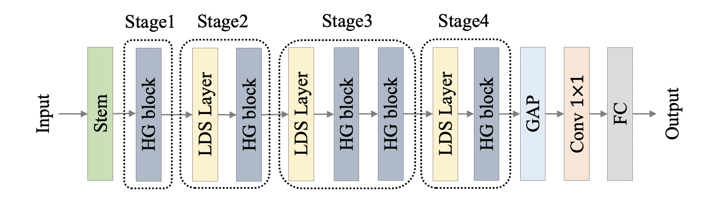
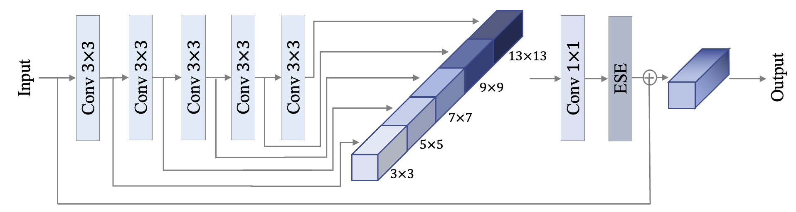

# PP-HGNet 系列
---
- [1. 模型介绍](#1)
    - [1.1 模型简介](#1.1)
    - [1.2 模型细节](#1.2)
    - [1.3 实验结果](#1.3)
- [2. 模型快速体验](#2)
    - [2.1 安装 paddlepaddle](#2.1)
    - [2.2 安装 paddleclas](#2.2)
    - [2.3 预测](#2.3)
- [3. 模型训练、评估和预测](#3)
    - [3.1 环境配置](#3.1)
    - [3.2 数据准备](#3.2)
    - [3.3 模型训练](#3.3)
    - [3.4 模型评估](#3.4)
    - [3.5 模型预测](#3.5)
- [4. 模型推理部署](#4)
  - [4.1 推理模型准备](#4.1)
    - [4.1.1 基于训练得到的权重导出 inference 模型](#4.1.1)
    - [4.1.2 直接下载 inference 模型](#4.1.2)
  - [4.2 基于 Python 预测引擎推理](#4.2)
    - [4.2.1 预测单张图像](#4.2.1)
    - [4.2.2 基于文件夹的批量预测](#4.2.2)
  - [4.3 基于 C++ 预测引擎推理](#4.3)
  - [4.4 服务化部署](#4.4)
  - [4.5 端侧部署](#4.5)
  - [4.6 Paddle2ONNX 模型转换与预测](#4.6)

<a name='1'></a>

## 1. 模型介绍

<a name='1.1'></a>

### 1.1 模型简介

PP-HGNet(High Performance GPU Net) 是百度飞桨视觉团队自研的更适用于 GPU 平台的高性能骨干网络，该网络在 VOVNet 的基础上使用了可学习的下采样层（LDS Layer），融合了 ResNet_vd、PPHGNet 等模型的优点，该模型在 GPU 平台上与其他 SOTA 模型在相同的速度下有着更高的精度。在同等速度下，该模型高于 ResNet34-D 模型 3.8 个百分点，高于 ResNet50-D 模型 2.4 个百分点，在使用百度自研 SSLD 蒸馏策略后，超越 ResNet50-D 模型 4.7 个百分点。与此同时，在相同精度下，其推理速度也远超主流 VisionTransformer 的推理速度。

<a name='1.2'></a>

### 1.2 模型细节

PP-HGNet 作者针对 GPU 设备，对目前 GPU 友好的网络做了分析和归纳，尽可能多的使用 3x3 标准卷积（计算密度最高）。在此将 VOVNet 作为基准模型，将主要的有利于 GPU 推理的改进点进行融合。从而得到一个有利于 GPU 推理的骨干网络，同样速度下，精度大幅超越其他 CNN 或者 VisionTransformer 模型。

PP-HGNet 骨干网络的整体结构如下：



其中，PP-HGNet是由多个HG-Block组成，HG-Block的细节如下：



<a name='1.3'></a>

### 1.3 实验结果

PP-HGNet 目前提供的模型的精度、速度指标及预训练权重链接如下：

| Model | Top-1 Acc(\%) | Top-5 Acc(\%) | Latency(ms) | 预训练模型下载地址 | inference模型下载地址 |
|:--: |:--: |:--: |:--: | :--: |:--: |
| PPHGNet_tiny      | 79.83 | 95.04 | 1.77 | [下载链接](https://paddle-imagenet-models-name.bj.bcebos.com/dygraph/legendary_models/PPHGNet_tiny_pretrained.pdparams) | [下载链接](https://paddle-imagenet-models-name.bj.bcebos.com/dygraph/inference/PPHGNet_tiny_infer.tar) |
| PPHGNet_tiny_ssld  | 81.95 | 96.12 | 1.77 | [下载链接](https://paddle-imagenet-models-name.bj.bcebos.com/dygraph/legendary_models/PPHGNet_tiny_ssld_pretrained.pdparams) | [下载链接](https://paddle-imagenet-models-name.bj.bcebos.com/dygraph/inference/PPHGNet_tiny_ssld_infer.tar) |
| PPHGNet_small     | 81.51| 95.82 | 2.52  | [下载链接](https://paddle-imagenet-models-name.bj.bcebos.com/dygraph/legendary_models/PPHGNet_small_pretrained.pdparams) | [下载链接](https://paddle-imagenet-models-name.bj.bcebos.com/dygraph/inference/PPHGNet_small_infer.tar) |
| PPHGNet_small_ssld | 83.82| 96.81 | 2.52  | [下载链接](https://paddle-imagenet-models-name.bj.bcebos.com/dygraph/legendary_models/PPHGNet_small_ssld_pretrained.pdparams) | [下载链接](https://paddle-imagenet-models-name.bj.bcebos.com/dygraph/inference/PPHGNet_small_ssld_infer.tar) |
| PPHGNet_base_ssld | 85.00| 97.35 | 5.97   | [下载链接](https://paddle-imagenet-models-name.bj.bcebos.com/dygraph/legendary_models/PPHGNet_base_ssld_pretrained.pdparams) | [下载链接](https://paddle-imagenet-models-name.bj.bcebos.com/dygraph/inference/PPHGNet_base_ssld_infer.tar) |

**备注：**
    
* 1. `_ssld` 表示使用 `SSLD 蒸馏`后的模型。关于 `SSLD蒸馏` 的内容，详情 [SSLD 蒸馏](../advanced_tutorials/knowledge_distillation.md)。
* 2. PP-HGNet 更多模型指标及权重，敬请期待。

PP-HGNet 与其他模型的比较如下，其中测试机器为 NVIDIA® Tesla® V100，开启 TensorRT 引擎，精度类型为 FP32。在相同速度下，PP-HGNet 精度均超越了其他 SOTA CNN 模型，在与 SwinTransformer 模型的比较中，在更高精度的同时，速度快 2 倍以上。

| Model | Top-1 Acc(\%) | Top-5 Acc(\%) | Latency(ms) |
|:--: |:--: |:--: |:--: |
| ResNet34                 | 74.57      | 92.14       | 1.97        |
| ResNet34_vd              | 75.98      | 92.98       | 2.00        |
| EfficientNetB0           | 77.38      | 93.31       | 1.96        |
| <b>PPHGNet_tiny<b>       | <b>79.83<b> | <b>95.04<b> | <b>1.77<b> |
| <b>PPHGNet_tiny_ssld<b>  | <b>81.95<b> | <b>96.12<b> | <b>1.77<b> |
| ResNet50                 | 76.50      | 93.00       | 2.54        |
| ResNet50_vd              | 79.12      | 94.44       | 2.60        |
| ResNet50_rsb             | 80.40      |         |     2.54        |
| EfficientNetB1           | 79.15      | 94.41       | 2.88        |
| SwinTransformer_tiny     | 81.2      | 95.5       | 6.59        |
| <b>PPHGNet_small<b>      | <b>81.51<b>| <b>95.82<b> | <b>2.52<b>  |
| <b>PPHGNet_small_ssld<b> | <b>83.82<b>| <b>96.81<b> | <b>2.52<b>  |
| Res2Net200_vd_26w_4s_ssld| 85.13      | 97.42       | 11.45       |
| ResNeXt101_32x48d_wsl    | 85.37      | 97.69       | 55.07       |
| SwinTransformer_base     | 85.2       | 97.5        | 13.53       |  
| <b>PPHGNet_base_ssld<b> | <b>85.00<b>| <b>97.35<b> | <b>5.97<b>   |
    
    
<a name="2"></a>

## 2. 模型快速体验

<a name="2.1"></a>  

### 2.1 安装 paddlepaddle

- 您的机器安装的是 CUDA9 或 CUDA10，请运行以下命令安装

```bash
python3 -m pip install paddlepaddle-gpu -i https://mirror.baidu.com/pypi/simple
```

- 您的机器是CPU，请运行以下命令安装

```bash
python3 -m pip install paddlepaddle -i https://mirror.baidu.com/pypi/simple
```

更多的版本需求，请参照[飞桨官网安装文档](https://www.paddlepaddle.org.cn/install/quick)中的说明进行操作。

<a name="2.2"></a>  

### 2.2 安装 paddleclas

使用如下命令快速安装 paddleclas

```  
pip3 install paddleclas
```

<a name="2.3"></a> 
    
### 2.3 预测

* 在命令行中使用 PPHGNet_small 的权重快速预测
    
```bash
paddleclas --model_name=PPHGNet_small  --infer_imgs="docs/images/inference_deployment/whl_demo.jpg"
```
    
结果如下：
```
>>> result
class_ids: [8, 7, 86, 82, 81], scores: [0.71479, 0.08682, 0.00806, 0.0023, 0.00121], label_names: ['hen', 'cock', 'partridge', 'ruffed grouse, partridge, Bonasa umbellus', 'ptarmigan'], filename: docs/images/inference_deployment/whl_demo.jpg
Predict complete!
```  
    
**备注**： 更换 PPHGNet 的其他 scale 的模型时，只需替换 `model_name`，如将此时的模型改为 `PPHGNet_tiny` 时，只需要将 `--model_name=PPHGNet_small` 改为 `--model_name=PPHGNet_tiny` 即可。   

    
* 在 Python 代码中预测
```python
from paddleclas import PaddleClas
clas = PaddleClas(model_name='PPHGNet_small')
infer_imgs = 'docs/images/inference_deployment/whl_demo.jpg'
result = clas.predict(infer_imgs)
print(next(result))
```

**备注**：`PaddleClas.predict()` 为可迭代对象（`generator`），因此需要使用 `next()` 函数或 `for` 循环对其迭
代调用。每次调用将以 `batch_size` 为单位进行一次预测，并返回预测结果。返回结果示例如下：

```
>>> result
[{'class_ids': [8, 7, 86, 82, 81], 'scores': [0.71479, 0.08682, 0.00806, 0.0023, 0.00121], 'label_names': ['hen', 'cock', 'partridge', 'ruffed grouse, partridge, Bonasa umbellus', 'ptarmigan'], 'filename': 'docs/images/inference_deployment/whl_demo.jpg'}]
```
    
    
<a name="3"></a> 
    
## 3. 模型训练、评估和预测
    
<a name="3.1"></a>  

### 3.1 环境配置

* 安装：请先参考文档[环境准备](../installation/install_paddleclas.md) 配置 PaddleClas 运行环境。

<a name="3.2"></a> 

### 3.2 数据准备

请在[ImageNet 官网](https://www.image-net.org/)准备 ImageNet-1k 相关的数据。


进入 PaddleClas 目录。

```
cd path_to_PaddleClas
```

进入 `dataset/` 目录，将下载好的数据命名为 `ILSVRC2012` ，存放于此。 `ILSVRC2012` 目录中具有以下数据：

```
├── train
│   ├── n01440764
│   │   ├── n01440764_10026.JPEG
│   │   ├── n01440764_10027.JPEG
├── train_list.txt
...
├── val
│   ├── ILSVRC2012_val_00000001.JPEG
│   ├── ILSVRC2012_val_00000002.JPEG
├── val_list.txt
```

其中 `train/` 和 `val/` 分别为训练集和验证集。`train_list.txt` 和 `val_list.txt` 分别为训练集和验证集的标签文件。
    
**备注：** 

* 关于 `train_list.txt`、`val_list.txt`的格式说明，可以参考[PaddleClas分类数据集格式说明](../data_preparation/classification_dataset.md#1-数据集格式说明) 。


<a name="3.3"></a> 

### 3.3 模型训练 


在 `ppcls/configs/ImageNet/PPHGNet/PPHGNet_small.yaml` 中提供了 PPHGNet_small 训练配置，可以通过如下脚本启动训练：

```shell
export CUDA_VISIBLE_DEVICES=0,1,2,3
python3 -m paddle.distributed.launch \
    --gpus="0,1,2,3" \
    tools/train.py \
        -c ppcls/configs/ImageNet/PPHGNet/PPHGNet_small.yaml 
```


**备注：** 

* 当前精度最佳的模型会保存在 `output/PPHGNet_small/best_model.pdparams`

<a name="3.4"></a>

### 3.4 模型评估

训练好模型之后，可以通过以下命令实现对模型指标的评估。

```bash
python3 tools/eval.py \
    -c ppcls/configs/ImageNet/PPHGNet/PPHGNet_small.yaml \
    -o Global.pretrained_model=output/PPHGNet_small/best_model
```

其中 `-o Global.pretrained_model="output/PPHGNet_small/best_model"` 指定了当前最佳权重所在的路径，如果指定其他权重，只需替换对应的路径即可。

<a name="3.5"></a>

### 3.5 模型预测

模型训练完成之后，可以加载训练得到的预训练模型，进行模型预测。在模型库的 `tools/infer.py` 中提供了完整的示例，只需执行下述命令即可完成模型预测：

```python
python3 tools/infer.py \
    -c ppcls/configs/ImageNet/PPHGNet/PPHGNet_small.yaml \
    -o Global.pretrained_model=output/PPHGNet_small/best_model 
```

输出结果如下：

```
[{'class_ids': [8, 7, 86, 82, 81], 'scores': [0.71479, 0.08682, 0.00806, 0.0023, 0.00121], 'file_name': 'docs/images/inference_deployment/whl_demo.jpg', 'label_names': ['hen', 'cock', 'partridge', 'ruffed grouse, partridge, Bonasa umbellus', 'ptarmigan']}]
```

**备注：** 

* 这里`-o Global.pretrained_model="output/PPHGNet_small/best_model"` 指定了当前最佳权重所在的路径，如果指定其他权重，只需替换对应的路径即可。
    
* 默认是对 `docs/images/inference_deployment/whl_demo.jpg` 进行预测，此处也可以通过增加字段 `-o Infer.infer_imgs=xxx` 对其他图片预测。
    
* 默认输出的是 Top-5 的值，如果希望输出 Top-k 的值，可以指定`-o Infer.PostProcess.topk=k`，其中，`k` 为您指定的值。


    
<a name="4"></a>

## 4. 模型推理部署

<a name="4.1"></a> 

### 4.1 推理模型准备

Paddle Inference 是飞桨的原生推理库， 作用于服务器端和云端，提供高性能的推理能力。相比于直接基于预训练模型进行预测，Paddle Inference可使用MKLDNN、CUDNN、TensorRT 进行预测加速，从而实现更优的推理性能。更多关于Paddle Inference推理引擎的介绍，可以参考[Paddle Inference官网教程](https://www.paddlepaddle.org.cn/documentation/docs/zh/guides/infer/inference/inference_cn.html)。
    
当使用 Paddle Inference 推理时，加载的模型类型为 inference 模型。本案例提供了两种获得 inference 模型的方法，如果希望得到和文档相同的结果，请选择[直接下载 inference 模型](#6.1.2)的方式。

    
<a name="4.1.1"></a> 

### 4.1.1 基于训练得到的权重导出 inference 模型

此处，我们提供了将权重和模型转换的脚本，执行该脚本可以得到对应的 inference 模型：

```bash
python3 tools/export_model.py \
    -c ppcls/configs/ImageNet/PPHGNet/PPHGNet_small.yaml \
    -o Global.pretrained_model=output/PPHGNet_small/best_model \
    -o Global.save_inference_dir=deploy/models/PPHGNet_small_infer
```
执行完该脚本后会在 `deploy/models/` 下生成 `PPHGNet_small_infer` 文件夹，`models` 文件夹下应有如下文件结构：

```
├── PPHGNet_small_infer
│   ├── inference.pdiparams
│   ├── inference.pdiparams.info
│   └── inference.pdmodel
```


<a name="4.1.2"></a> 

### 4.1.2 直接下载 inference 模型

[4.1.1 小节](#4.1.1)提供了导出 inference 模型的方法，此处也提供了该场景可以下载的 inference 模型，可以直接下载体验。

```
cd deploy/models
# 下载 inference 模型并解压
wget https://paddle-imagenet-models-name.bj.bcebos.com/dygraph/inference/PPHGNet_small_infer.tar && tar -xf PPHGNet_small_infer.tar
```

解压完毕后，`models` 文件夹下应有如下文件结构：

```
├── PPHGNet_small_infer
│   ├── inference.pdiparams
│   ├── inference.pdiparams.info
│   └── inference.pdmodel
```

<a name="4.2"></a> 

### 4.2 基于 Python 预测引擎推理


<a name="4.2.1"></a>  

#### 4.2.1 预测单张图像

返回 `deploy` 目录：

```
cd ../
```

运行下面的命令，对图像 `./images/ImageNet/ILSVRC2012_val_00000010.jpeg` 进行分类。

```shell
# 使用下面的命令使用 GPU 进行预测
python3 python/predict_cls.py -c configs/inference_cls.yaml -o Global.inference_model_dir=models/PPHGNet_small_infer
# 使用下面的命令使用 CPU 进行预测
python3 python/predict_cls.py -c configs/inference_cls.yaml -o Global.inference_model_dir=models/PPHGNet_small_infer -o Global.use_gpu=False
```

输出结果如下。

```
ILSVRC2012_val_00000010.jpeg:	class id(s): [332, 153, 283, 338, 204], score(s): [0.50, 0.05, 0.02, 0.01, 0.01], label_name(s): ['Angora, Angora rabbit', 'Maltese dog, Maltese terrier, Maltese', 'Persian cat', 'guinea pig, Cavia cobaya', 'Lhasa, Lhasa apso']
```

<a name="4.2.2"></a>  

#### 4.2.2 基于文件夹的批量预测

如果希望预测文件夹内的图像，可以直接修改配置文件中的 `Global.infer_imgs` 字段，也可以通过下面的 `-o` 参数修改对应的配置。

```shell
# 使用下面的命令使用 GPU 进行预测，如果希望使用 CPU 预测，可以在命令后面添加 -o Global.use_gpu=False
python3 python/predict_cls.py -c configs/inference_cls.yaml -o Global.inference_model_dir=models/PPHGNet_small_infer -o Global.infer_imgs=images/ImageNet/
```

终端中会输出该文件夹内所有图像的分类结果，如下所示。

```
ILSVRC2012_val_00000010.jpeg:	class id(s): [332, 153, 283, 338, 204], score(s): [0.50, 0.05, 0.02, 0.01, 0.01], label_name(s): ['Angora, Angora rabbit', 'Maltese dog, Maltese terrier, Maltese', 'Persian cat', 'guinea pig, Cavia cobaya', 'Lhasa, Lhasa apso']
ILSVRC2012_val_00010010.jpeg:	class id(s): [626, 622, 531, 487, 633], score(s): [0.68, 0.02, 0.02, 0.02, 0.02], label_name(s): ['lighter, light, igniter, ignitor', 'lens cap, lens cover', 'digital watch', 'cellular telephone, cellular phone, cellphone, cell, mobile phone', "loupe, jeweler's loupe"]
ILSVRC2012_val_00020010.jpeg:	class id(s): [178, 211, 171, 246, 741], score(s): [0.82, 0.00, 0.00, 0.00, 0.00], label_name(s): ['Weimaraner', 'vizsla, Hungarian pointer', 'Italian greyhound', 'Great Dane', 'prayer rug, prayer mat']
ILSVRC2012_val_00030010.jpeg:	class id(s): [80, 83, 136, 23, 93], score(s): [0.84, 0.00, 0.00, 0.00, 0.00], label_name(s): ['black grouse', 'prairie chicken, prairie grouse, prairie fowl', 'European gallinule, Porphyrio porphyrio', 'vulture', 'hornbill']
```


<a name="4.3"></a> 

### 4.3 基于 C++ 预测引擎推理

PaddleClas 提供了基于 C++ 预测引擎推理的示例，您可以参考[服务器端 C++ 预测](../inference_deployment/cpp_deploy.md)来完成相应的推理部署。如果您使用的是 Windows 平台，可以参考[基于 Visual Studio 2019 Community CMake 编译指南](../inference_deployment/cpp_deploy_on_windows.md)完成相应的预测库编译和模型预测工作。

<a name="4.4"></a> 

### 4.4 服务化部署

Paddle Serving 提供高性能、灵活易用的工业级在线推理服务。Paddle Serving 支持 RESTful、gRPC、bRPC 等多种协议，提供多种异构硬件和多种操作系统环境下推理解决方案。更多关于Paddle Serving 的介绍，可以参考[Paddle Serving 代码仓库](https://github.com/PaddlePaddle/Serving)。
    
PaddleClas 提供了基于 Paddle Serving 来完成模型服务化部署的示例，您可以参考[模型服务化部署](../inference_deployment/paddle_serving_deploy.md)来完成相应的部署工作。

<a name="4.5"></a> 

### 4.5 端侧部署

Paddle Lite 是一个高性能、轻量级、灵活性强且易于扩展的深度学习推理框架，定位于支持包括移动端、嵌入式以及服务器端在内的多硬件平台。更多关于 Paddle Lite 的介绍，可以参考[Paddle Lite 代码仓库](https://github.com/PaddlePaddle/Paddle-Lite)。
    
PaddleClas 提供了基于 Paddle Lite 来完成模型端侧部署的示例，您可以参考[端侧部署](../inference_deployment/paddle_lite_deploy.md)来完成相应的部署工作。

<a name="4.6"></a> 

### 4.6 Paddle2ONNX 模型转换与预测
    
Paddle2ONNX 支持将 PaddlePaddle 模型格式转化到 ONNX 模型格式。通过 ONNX 可以完成将 Paddle 模型到多种推理引擎的部署，包括TensorRT/OpenVINO/MNN/TNN/NCNN，以及其它对 ONNX 开源格式进行支持的推理引擎或硬件。更多关于 Paddle2ONNX 的介绍，可以参考[Paddle2ONNX 代码仓库](https://github.com/PaddlePaddle/Paddle2ONNX)。

PaddleClas 提供了基于 Paddle2ONNX 来完成 inference 模型转换 ONNX 模型并作推理预测的示例，您可以参考[Paddle2ONNX 模型转换与预测](../../../deploy/paddle2onnx/readme.md)来完成相应的部署工作。

