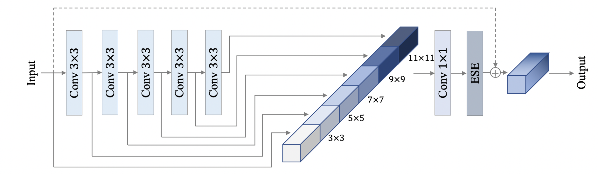

# PP-HGNet 系列
---
## 目录

* [1. 概述](#1)
* [2. 结构信息](#2)
* [3. 实验结果](#3)

## 1. 概述

PP-HGNet(High Performance GPU Net) 是百度飞桨视觉团队自研的更适用于 GPU 平台的高性能骨干网络，该网络在 VOVNet 的基础上使用了可学习的下采样层（LDS Layer），融合了 ResNet_vd、PPLCNet 等模型的优点，该模型在 GPU 平台上与其他 SOTA 模型在相同的速度下有着更高的精度。在同等速度下，该模型高于 ResNet34-D 模型 3.8 个百分点，高于 ResNet50-D 模型 2.4 个百分点，在使用百度自研 SSLD 蒸馏策略后，超越 ResNet50-D 模型 4.7 个百分点。与此同时，在相同精度下，其推理速度也远超主流 VisionTransformer 的推理速度。

## 2. 结构信息

PP-HGNet 作者针对 GPU 设备，对目前 GPU 友好的网络做了分析和归纳，尽可能多的使用 3x3 标准卷积（计算密度最高）。在此将 VOVNet 作为基准模型，将主要的有利于 GPU 推理的改进点进行融合。从而得到一个有利于 GPU 推理的骨干网络，同样速度下，精度大幅超越其他 CNN 或者 VisionTransformer 模型。

PP-HGNet 骨干网络的整体结构如下：

其中，PP-HGNet是由多个HG-Block组成，HG-Block的细节如下：

## 3. 实验结果

PP-HGNet 与其他模型的比较如下，其中测试机器为 NVIDIA® Tesla® V100，开启 TensorRT 引擎，精度类型为 FP32。在相同速度下，PP-HGNet 精度均超越了其他 SOTA CNN 模型，在与 SwinTransformer 模型的比较中，在更高精度的同时，速度快 2 倍以上。

| Model | Top-1 Acc(\%) | Top-5 Acc(\%) | Latency(ms) |
|-------|---------------|---------------|-------------|
| ResNet34                 | 74.57      | 92.14       | 1.97        |
| ResNet34_vd              | 75.98      | 92.98       | 2.00        |
| EfficientNetB0           | 77.38      | 93.31       | 1.96        |
| <b>PPHGNet_tiny<b>       | <b>79.83<b> | <b>95.04<b> | <b>1.77<b> |
| <b>PPHGNet_tiny_ssld<b>  | <b>81.95<b> | <b>96.12<b> | <b>1.77<b> |
| ResNet50                 | 76.50      | 93.00       | 2.54        |
| ResNet50_vd              | 79.12      | 94.44       | 2.60        |
| ResNet50_rsb             | 80.40      |         |     2.54        |
| EfficientNetB1           | 79.15      | 94.41       | 2.88        |
| SwinTransformer_tiny     | 81.2      | 95.5       | 6.59        |
| <b>PPHGNet_small<b>      | <b>81.51<b>| <b>95.82<b> | <b>2.52<b>  |
| <b>PPHGNet_small_ssld<b> | <b>83.82<b>| <b>96.81<b> | <b>2.52<b>  |

关于更多 PP-HGNet 的介绍以及下游任务的表现，敬请期待。
