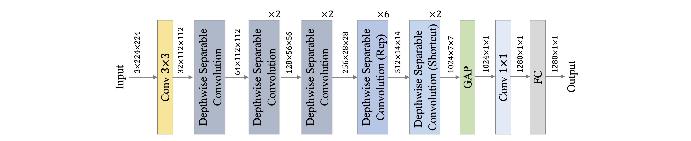

# PP-LCNetV2

---

## 目录

- [1. 模型介绍](#1)
    - [1.1 模型简介](#1.1)
    - [1.2 模型细节](#1.2)
      - [1.2.1 Rep 策略](#1.2.1)
      - [1.2.2 PW 卷积](#1.2.2)
      - [1.2.3 Shortcut](#1.2.3)
      - [1.2.4 激活函数](#1.2.4)
      - [1.2.5 SE 模块](#1.2.5)     
    - [1.3 实验结果](#1.3)
- [2. 模型快速体验](#2)
    - [2.1 安装 paddlepaddle](#2.1)
    - [2.2 安装 paddleclas](#2.2)
    - [2.3 预测](#2.3)
- [3. 模型训练、评估和预测](#3)
    - [3.1 环境配置](#3.1)
    - [3.2 数据准备](#3.2)
    - [3.3 模型训练](#3.3)
    - [3.4 模型评估](#3.4)
    - [3.5 模型预测](#3.5)
- [4. 模型推理部署](#4)
  - [4.1 推理模型准备](#4.1)
    - [4.1.1 基于训练得到的权重导出 inference 模型](#4.1.1)
    - [4.1.2 直接下载 inference 模型](#4.1.2)
  - [4.2 基于 Python 预测引擎推理](#4.2)
    - [4.2.1 预测单张图像](#4.2.1)
    - [4.2.2 基于文件夹的批量预测](#4.2.2)
  - [4.3 基于 C++ 预测引擎推理](#4.3)
  - [4.4 服务化部署](#4.4)
  - [4.5 端侧部署](#4.5)
  - [4.6 Paddle2ONNX 模型转换与预测](#4.6)

<a name="1"></a>

## 1. 模型介绍

<a name="1.1"></a>

### 1.1 模型简介

骨干网络对计算机视觉下游任务的影响不言而喻，不仅对下游模型的性能影响很大，而且模型效率也极大地受此影响，但现有的大多骨干网络在真实应用中的效率并不理想，特别是缺乏针对 Intel CPU 平台所优化的骨干网络，我们测试了现有的主流轻量级模型，发现在 Intel CPU 平台上的效率并不理想，然而目前 Intel CPU 平台在工业界仍有大量使用场景，因此我们提出了 PP-LCNet 系列模型，PP-LCNetV2 是在 [PP-LCNetV1](./PP-LCNet.md) 基础上所改进的。

<a name="1.2"></a>

## 1.2 模型细节



PP-LCNetV2 模型的网络整体结构如上图所示。PP-LCNetV2 模型是在 PP-LCNetV1 的基础上优化而来，主要使用重参数化策略组合了不同大小卷积核的深度卷积，并优化了点卷积、Shortcut等。

<a name="1.2.1"></a>

### 1.2.1 Rep 策略

卷积核的大小决定了卷积层感受野的大小，通过组合使用不同大小的卷积核，能够获取不同尺度的特征，因此 PPLCNetV2 在 Stage3、Stage4 中，在同一层组合使用 kernel size 分别为 5、3、1 的 DW 卷积，同时为了避免对模型效率的影响，使用重参数化（Re parameterization，Rep）策略对同层的 DW 卷积进行融合，如下图所示。


<a name="1.2.2"></a>

### 1.2.2 PW 卷积

深度可分离卷积通常由一层 DW 卷积和一层 PW 卷积组成，用以替换标准卷积，为了使深度可分离卷积具有更强的拟合能力，我们尝试使用两层 PW 卷积，同时为了控制模型效率不受影响，两层 PW 卷积设置为：第一个在通道维度对特征图压缩，第二个再通过放大还原特征图通道，如下图所示。通过实验发现，该策略能够显著提高模型性能，同时为了平衡对模型效率带来的影响，PPLCNetV2 仅在 Stage4、Stage5 中使用了该策略。


<a name="1.2.3"></a>

### 1.2.3 Shortcut

残差结构（residual）自提出以来，被诸多模型广泛使用，但在轻量级卷积神经网络中，由于残差结构所带来的元素级（element-wise）加法操作，会对模型的速度造成影响，我们在 PP-LCNetV2 中，以 Stage 为单位实验了 残差结构对模型的影响，发现残差结构的使用并非一定会带来性能的提高，因此 PPLCNetV2 仅在最后一个 Stage 中的使用了残差结构：在 Block 中增加 Shortcut，如下图所示。


<a name="1.2.4"></a>

### 1.2.4 激活函数

在目前的轻量级卷积神经网络中，ReLU、Hard-Swish 激活函数最为常用，虽然在模型性能方面，Hard-Swish 通常更为优秀，然而我们发现部分推理平台对于 Hard-Swish 激活函数的效率优化并不理想，因此为了兼顾通用性，PP-LCNetV2 默认使用了 ReLU 激活函数，并且我们测试发现，ReLU 激活函数对于较大模型的性能影响较小。

<a name="1.2.5"></a>

### 1.2.5 SE 模块

虽然 SE 模块能够显著提高模型性能，但其对模型速度的影响同样不可忽视，在 PP-LCNetV1 中，我们发现在模型中后部使用 SE 模块能够获得最大化的收益。在 PP-LCNetV2 的优化过程中，我们以 Stage 为单位对 SE 模块的位置做了进一步实验，并发现在 Stage3 中使用能够取得更好的平衡。

<a name="1.3"></a>

## 1.3 实验结果

PPLCNetV2 目前提供的模型的精度、速度指标及预训练权重链接如下：

| Model | Params(M) | FLOPs(M) | Top-1 Acc(\%) | Top-5 Acc(\%) | Latency(ms) | 预训练模型下载地址 | inference模型下载地址 |
|:--:|:--:|:--:|:--:|:--:|:--:|:--:|:--:|
| <b>PPLCNetV2_base<b>  | <b>6.6<b> | <b>604<b>  | <b>77.04<b> | <b>93.27<b> | <b>4.32<b> | [下载链接](https://paddle-imagenet-models-name.bj.bcebos.com/dygraph/legendary_models/PPLCNetV2_base_pretrained.pdparams) | [下载链接](https://paddle-imagenet-models-name.bj.bcebos.com/dygraph/inference/PPLCNetV2_base_infer.tar) |
| <b>PPLCNetV2_base_ssld<b>  | <b>6.6<b> | <b>604<b>  | <b>80.07<b> | <b>94.87<b> | <b>4.32<b> | [下载链接](https://paddle-imagenet-models-name.bj.bcebos.com/dygraph/legendary_models/PPLCNetV2_base_ssld_pretrained.pdparams) | [下载链接](https://paddle-imagenet-models-name.bj.bcebos.com/dygraph/inference/PPLCNetV2_base_ssld_infer.tar) |

**备注：**
    
* 1. `_ssld` 表示使用 `SSLD 蒸馏`后的模型。关于 `SSLD蒸馏` 的内容，详情 [SSLD 蒸馏](../advanced_tutorials/knowledge_distillation.md)。
* 2. PP-LCNetV2 更多模型指标及权重，敬请期待。

在不使用额外数据的前提下，PPLCNetV2_base 模型在图像分类 ImageNet 数据集上能够取得超过 77% 的 Top1 Acc，同时在 Intel CPU 平台的推理时间在 4.4 ms 以下，如下表所示，其中推理时间基于 Intel(R) Xeon(R) Gold 6271C CPU @ 2.60GHz 硬件平台，OpenVINO 推理平台。

| Model | Params(M) | FLOPs(M) | Top-1 Acc(\%) | Top-5 Acc(\%) | Latency(ms) |
|:--:|:--:|:--:|:--:|:--:|:--:|
| MobileNetV3_Large_x1_25 | 7.4 | 714  | 76.4 | 93.00 | 5.19 |
| PPLCNetV2_x2_5  | 9 | 906  | 76.60 | 93.00 | 7.25 |
| <b>PPLCNetV2_base<b>  | <b>6.6<b> | <b>604<b>  | <b>77.04<b> | <b>93.27<b> | <b>4.32<b> |
| <b>PPLCNetV2_base_ssld<b>  | <b>6.6<b> | <b>604<b>  | <b>80.07<b> | <b>94.87<b> | <b>4.32<b> |


<a name="2"></a>    
    
## 2. 模型快速体验

<a name="2.1"></a>   
    
### 2.1 安装 paddlepaddle

- 您的机器安装的是 CUDA9 或 CUDA10，请运行以下命令安装

```bash
python3 -m pip install paddlepaddle-gpu -i https://mirror.baidu.com/pypi/simple
```

- 您的机器是CPU，请运行以下命令安装

```bash
python3 -m pip install paddlepaddle -i https://mirror.baidu.com/pypi/simple
```

更多的版本需求，请参照[飞桨官网安装文档](https://www.paddlepaddle.org.cn/install/quick)中的说明进行操作。

<a name="2.2"></a>  

### 2.2 安装 paddleclas

使用如下命令快速安装 paddleclas

```  
pip3 install paddleclas
```
    
<a name="2.3"></a> 
    
### 2.3 预测

* 在命令行中使用 PPLCNetV2_base 的权重快速预测
    
```bash
paddleclas --model_name=PPLCNetV2_base  --infer_imgs="docs/images/inference_deployment/whl_demo.jpg"
```
    
结果如下：
```
>>> result
class_ids: [8, 7, 86, 82, 83], scores: [0.8859, 0.07156, 0.00588, 0.00047, 0.00034], label_names: ['hen', 'cock', 'partridge', 'ruffed grouse, partridge, Bonasa umbellus', 'prairie chicken, prairie grouse, prairie fowl'], filename: docs/images/inference_deployment/whl_demo.jpg
Predict complete
``` 
    
    
* 在 Python 代码中预测
```python
from paddleclas import PaddleClas
clas = PaddleClas(model_name='PPLCNetV2_base')
infer_imgs='docs/images/inference_deployment/whl_demo.jpg'
result=clas.predict(infer_imgs)
print(next(result))
```

**备注**：`PaddleClas.predict()` 为可迭代对象（`generator`），因此需要使用 `next()` 函数或 `for` 循环对其迭
代调用。每次调用将以 `batch_size` 为单位进行一次预测，并返回预测结果。返回结果示例如下：

```
>>> result
[{'class_ids': [8, 7, 86, 82, 83], 'scores': [0.8859, 0.07156, 0.00588, 0.00047, 0.00034], 'label_names': ['hen', 'cock', 'partridge', 'ruffed grouse, partridge, Bonasa umbellus', 'prairie chicken, prairie grouse, prairie fowl'], 'filename': 'docs/images/inference_deployment/whl_demo.jpg'}]
```

    
<a name="3"></a> 
    
## 3. 模型训练、评估和预测
    
<a name="3.1"></a>  

### 3.1 环境配置

* 安装：请先参考文档[环境准备](../installation/install_paddleclas.md) 配置 PaddleClas 运行环境。

<a name="3.2"></a> 

### 3.2 数据准备

请在[ImageNet 官网](https://www.image-net.org/)准备 ImageNet-1k 相关的数据。


进入 PaddleClas 目录。

```
cd path_to_PaddleClas
```

进入 `dataset/` 目录，将下载好的数据命名为 `ILSVRC2012` ，存放于此。 `ILSVRC2012` 目录中具有以下数据：

```
├── train
│   ├── n01440764
│   │   ├── n01440764_10026.JPEG
│   │   ├── n01440764_10027.JPEG
├── train_list.txt
...
├── val
│   ├── ILSVRC2012_val_00000001.JPEG
│   ├── ILSVRC2012_val_00000002.JPEG
├── val_list.txt
```

其中 `train/` 和 `val/` 分别为训练集和验证集。`train_list.txt` 和 `val_list.txt` 分别为训练集和验证集的标签文件。
    
**备注：** 

* 关于 `train_list.txt`、`val_list.txt`的格式说明，可以参考[PaddleClas分类数据集格式说明](../data_preparation/classification_dataset.md#1-数据集格式说明) 。


<a name="3.3"></a> 

### 3.3 模型训练 


在 `ppcls/configs/ImageNet/PPLCNetV2/PPLCNetV2_base.yaml` 中提供了 PPLCNetV2_base 训练配置，可以通过如下脚本启动训练：

```shell
export CUDA_VISIBLE_DEVICES=0,1,2,3
python3 -m paddle.distributed.launch \
    --gpus="0,1,2,3" \
    tools/train.py \
        -c ppcls/configs/ImageNet/PPLCNetV2/PPLCNetV2_base.yaml 
```


**备注：** 

* 当前精度最佳的模型会保存在 `output/PPLCNetV2_base/best_model.pdparams`

<a name="3.4"></a>

### 3.4 模型评估

训练好模型之后，可以通过以下命令实现对模型指标的评估。

```bash
python3 tools/eval.py \
    -c ppcls/configs/ImageNet/PPLCNetV2/PPLCNetV2_base.yaml \
    -o Global.pretrained_model=output/PPLCNetV2_base/best_model
```

其中 `-o Global.pretrained_model="output/PPLCNetV2_base/best_model"` 指定了当前最佳权重所在的路径，如果指定其他权重，只需替换对应的路径即可。

<a name="3.5"></a>

### 3.5 模型预测

模型训练完成之后，可以加载训练得到的预训练模型，进行模型预测。在模型库的 `tools/infer.py` 中提供了完整的示例，只需执行下述命令即可完成模型预测：

```python
python3 tools/infer.py \
    -c ppcls/configs/ImageNet/PPLCNetV2/PPLCNetV2_base.yaml \
    -o Global.pretrained_model=output/PPLCNetV2_base/best_model 
```

输出结果如下：

```
[{'class_ids': [8, 7, 86, 82, 83], 'scores': [0.8859, 0.07156, 0.00588, 0.00047, 0.00034], 'file_name': 'docs/images/inference_deployment/whl_demo.jpg', 'label_names': ['hen', 'cock', 'partridge', 'ruffed grouse, partridge, Bonasa umbellus', 'prairie chicken, prairie grouse, prairie fowl']}]
```

**备注：** 

* 这里`-o Global.pretrained_model="output/PPLCNetV2_base/best_model"` 指定了当前最佳权重所在的路径，如果指定其他权重，只需替换对应的路径即可。
    
* 默认是对 `docs/images/inference_deployment/whl_demo.jpg` 进行预测，此处也可以通过增加字段 `-o Infer.infer_imgs=xxx` 对其他图片预测。
    
* 默认输出的是 Top-5 的值，如果希望输出 Top-k 的值，可以指定`-o Infer.PostProcess.topk=k`，其中，`k` 为您指定的值。


    
<a name="4"></a>

## 4. 模型推理部署

<a name="4.1"></a> 

### 4.1 推理模型准备

Paddle Inference 是飞桨的原生推理库， 作用于服务器端和云端，提供高性能的推理能力。相比于直接基于预训练模型进行预测，Paddle Inference可使用MKLDNN、CUDNN、TensorRT 进行预测加速，从而实现更优的推理性能。更多关于Paddle Inference推理引擎的介绍，可以参考[Paddle Inference官网教程](https://www.paddlepaddle.org.cn/documentation/docs/zh/guides/infer/inference/inference_cn.html)。
    
当使用 Paddle Inference 推理时，加载的模型类型为 inference 模型。本案例提供了两种获得 inference 模型的方法，如果希望得到和文档相同的结果，请选择[直接下载 inference 模型](#6.1.2)的方式。

    
<a name="4.1.1"></a> 

### 4.1.1 基于训练得到的权重导出 inference 模型

此处，我们提供了将权重和模型转换的脚本，执行该脚本可以得到对应的 inference 模型：

```bash
python3 tools/export_model.py \
    -c ppcls/configs/ImageNet/PPLCNetV2/PPLCNetV2_base.yaml \
    -o Global.pretrained_model=output/PPLCNetV2_base/best_model \
    -o Global.save_inference_dir=deploy/models/PPLCNetV2_base_infer
```
执行完该脚本后会在 `deploy/models/` 下生成 `PPLCNetV2_base_infer` 文件夹，`models` 文件夹下应有如下文件结构：

```
├── PPLCNetV2_base_infer
│   ├── inference.pdiparams
│   ├── inference.pdiparams.info
│   └── inference.pdmodel
```


<a name="4.1.2"></a> 

### 4.1.2 直接下载 inference 模型

[4.1.1 小节](#4.1.1)提供了导出 inference 模型的方法，此处也提供了该场景可以下载的 inference 模型，可以直接下载体验。

```
cd deploy/models
# 下载 inference 模型并解压
wget https://paddle-imagenet-models-name.bj.bcebos.com/dygraph/inference/PPLCNetV2_base_infer.tar && tar -xf PPLCNetV2_base_infer.tar
```

解压完毕后，`models` 文件夹下应有如下文件结构：

```
├── PPLCNetV2_base_infer
│   ├── inference.pdiparams
│   ├── inference.pdiparams.info
│   └── inference.pdmodel
```

<a name="4.2"></a> 

### 4.2 基于 Python 预测引擎推理


<a name="4.2.1"></a>  

#### 4.2.1 预测单张图像

返回 `deploy` 目录：

```
cd ../
```

运行下面的命令，对图像 `./images/ImageNet/ILSVRC2012_val_00000010.jpeg` 进行分类。

```shell
# 使用下面的命令使用 GPU 进行预测
python3 python/predict_cls.py -c configs/inference_cls.yaml -o Global.inference_model_dir=models/PPLCNetV2_base_infer
# 使用下面的命令使用 CPU 进行预测
python3 python/predict_cls.py -c configs/inference_cls.yaml -o Global.inference_model_dir=models/PPLCNetV2_base_infer -o Global.use_gpu=False
```

输出结果如下。

```
ILSVRC2012_val_00000010.jpeg:	class id(s): [332, 153, 229, 204, 265], score(s): [0.28, 0.25, 0.03, 0.02, 0.02], label_name(s): ['Angora, Angora rabbit', 'Maltese dog, Maltese terrier, Maltese', 'Old English sheepdog, bobtail', 'Lhasa, Lhasa apso', 'toy poodle']
```

<a name="4.2.2"></a>  

#### 4.2.2 基于文件夹的批量预测

如果希望预测文件夹内的图像，可以直接修改配置文件中的 `Global.infer_imgs` 字段，也可以通过下面的 `-o` 参数修改对应的配置。

```shell
# 使用下面的命令使用 GPU 进行预测，如果希望使用 CPU 预测，可以在命令后面添加 -o Global.use_gpu=False
python3 python/predict_cls.py -c configs/inference_cls.yaml -o Global.inference_model_dir=models/PPLCNetV2_base_infer -o Global.infer_imgs=images/ImageNet/
```

终端中会输出该文件夹内所有图像的分类结果，如下所示。

```
ILSVRC2012_val_00000010.jpeg:	class id(s): [332, 153, 229, 204, 265], score(s): [0.28, 0.25, 0.03, 0.02, 0.02], label_name(s): ['Angora, Angora rabbit', 'Maltese dog, Maltese terrier, Maltese', 'Old English sheepdog, bobtail', 'Lhasa, Lhasa apso', 'toy poodle']
ILSVRC2012_val_00010010.jpeg:	class id(s): [626, 531, 761, 487, 673], score(s): [0.64, 0.06, 0.03, 0.02, 0.01], label_name(s): ['lighter, light, igniter, ignitor', 'digital watch', 'remote control, remote', 'cellular telephone, cellular phone, cellphone, cell, mobile phone', 'mouse, computer mouse']
ILSVRC2012_val_00020010.jpeg:	class id(s): [178, 209, 246, 181, 211], score(s): [0.97, 0.00, 0.00, 0.00, 0.00], label_name(s): ['Weimaraner', 'Chesapeake Bay retriever', 'Great Dane', 'Bedlington terrier', 'vizsla, Hungarian pointer']
ILSVRC2012_val_00030010.jpeg:	class id(s): [80, 143, 81, 137, 98], score(s): [0.91, 0.01, 0.00, 0.00, 0.00], label_name(s): ['black grouse', 'oystercatcher, oyster catcher', 'ptarmigan', 'American coot, marsh hen, mud hen, water hen, Fulica americana', 'red-breasted merganser, Mergus serrator'
```


<a name="4.3"></a> 

### 4.3 基于 C++ 预测引擎推理

PaddleClas 提供了基于 C++ 预测引擎推理的示例，您可以参考[服务器端 C++ 预测](../inference_deployment/cpp_deploy.md)来完成相应的推理部署。如果您使用的是 Windows 平台，可以参考[基于 Visual Studio 2019 Community CMake 编译指南](../inference_deployment/cpp_deploy_on_windows.md)完成相应的预测库编译和模型预测工作。

<a name="4.4"></a> 

### 4.4 服务化部署

Paddle Serving 提供高性能、灵活易用的工业级在线推理服务。Paddle Serving 支持 RESTful、gRPC、bRPC 等多种协议，提供多种异构硬件和多种操作系统环境下推理解决方案。更多关于Paddle Serving 的介绍，可以参考[Paddle Serving 代码仓库](https://github.com/PaddlePaddle/Serving)。
    
PaddleClas 提供了基于 Paddle Serving 来完成模型服务化部署的示例，您可以参考[模型服务化部署](../inference_deployment/paddle_serving_deploy.md)来完成相应的部署工作。

<a name="4.5"></a> 

### 4.5 端侧部署

Paddle Lite 是一个高性能、轻量级、灵活性强且易于扩展的深度学习推理框架，定位于支持包括移动端、嵌入式以及服务器端在内的多硬件平台。更多关于 Paddle Lite 的介绍，可以参考[Paddle Lite 代码仓库](https://github.com/PaddlePaddle/Paddle-Lite)。
    
PaddleClas 提供了基于 Paddle Lite 来完成模型端侧部署的示例，您可以参考[端侧部署](../inference_deployment/paddle_lite_deploy.md)来完成相应的部署工作。

<a name="4.6"></a> 

### 4.6 Paddle2ONNX 模型转换与预测
    
Paddle2ONNX 支持将 PaddlePaddle 模型格式转化到 ONNX 模型格式。通过 ONNX 可以完成将 Paddle 模型到多种推理引擎的部署，包括TensorRT/OpenVINO/MNN/TNN/NCNN，以及其它对 ONNX 开源格式进行支持的推理引擎或硬件。更多关于 Paddle2ONNX 的介绍，可以参考[Paddle2ONNX 代码仓库](https://github.com/PaddlePaddle/Paddle2ONNX)。

PaddleClas 提供了基于 Paddle2ONNX 来完成 inference 模型转换 ONNX 模型并作推理预测的示例，您可以参考[Paddle2ONNX 模型转换与预测](../../../deploy/paddle2onnx/readme.md)来完成相应的部署工作。
