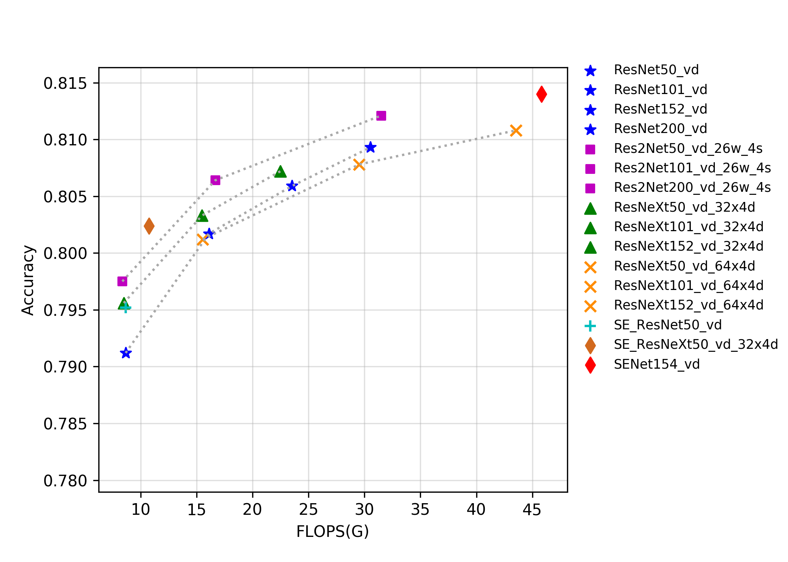
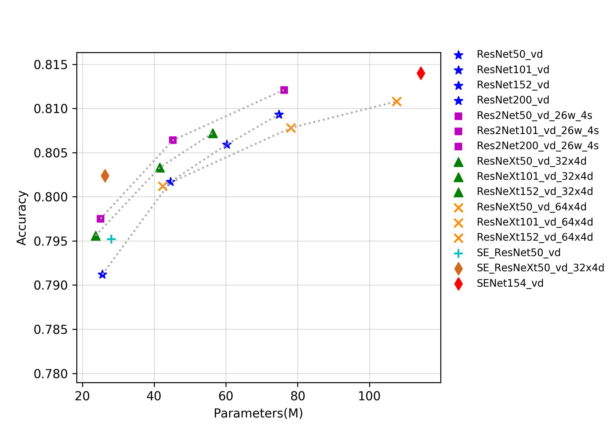
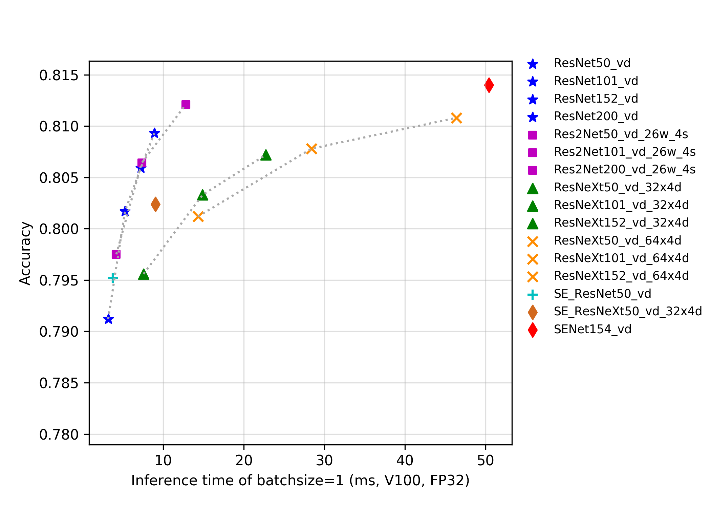

# SEResNeXt与Res2Net系列

## 概述
ResNeXt是ResNet的典型变种网络之一，ResNeXt发表于2017年的CVPR会议。在此之前，提升模型精度的方法主要集中在将网络变深或者变宽，这样增加了参数量和计算量，推理速度也会相应变慢。ResNeXt结构提出了通道分组（cardinality）的概念，作者通过实验发现增加通道的组数比增加深度和宽度更有效。其可以在不增加参数复杂度的前提下提高准确率，同时还减少了参数的数量，所以是比较成功的ResNet的变种。

SENet是2017年ImageNet分类比赛的冠军方案，其提出了一个全新的SE结构，该结构可以迁移到任何其他网络中，其通过控制scale的大小，把每个通道间重要的特征增强，不重要的特征减弱，从而让提取的特征指向性更强。

Res2Net是2019年提出的一种全新的对ResNet的改进方案，该方案可以和现有其他优秀模块轻松整合，在不增加计算负载量的情况下，在ImageNet、CIFAR-100等数据集上的测试性能超过了ResNet。Res2Net结构简单，性能优越，进一步探索了CNN在更细粒度级别的多尺度表示能力。Res2Net揭示了一个新的提升模型精度的维度，即scale，其是除了深度、宽度和基数的现有维度之外另外一个必不可少的更有效的因素。该网络在其他视觉任务如目标检测、图像分割等也有相当不错的表现。

该系列模型的FLOPS、参数量以及FP32预测耗时如下图所示。

目前PaddleClas开源的这三类的预训练模型一共有24个，其指标如图所示，从图中可以看出，在同样Flops和Params下，改进版的模型往往有更高的精度，但是推理速度往往不如ResNet系列。另一方面，Res2Net表现也较为优秀，相比ResNeXt中的group操作、SEResNet中的SE结构操作，Res2Net在相同Flops、Params和推理速度下往往精度更佳。

**注意**：所有模型在预测时，图像的crop_size设置为224，resize_short_size设置为256。

## 精度、FLOPS和参数量

| Models                | Top1   | Top5   | Reference top1 | Reference top5 | FLOPS (G) | Parameters (M) |
|:--:|:--:|:--:|:--:|:--:|:--:|:--:|
| Res2Net50_26w_4s      | 0.793  | 0.946  | 0.780             | 0.936             | 8.520        | 25.700            |
| Res2Net50_vd_26w_4s   | 0.798  | 0.949  |                   |                   | 8.370        | 25.060            |
| Res2Net50_14w_8s      | 0.795  | 0.947  | 0.781             | 0.939             | 9.010        | 25.720            |
| Res2Net101_vd_26w_4s  | 0.806  | 0.952  |                   |                   | 16.670       | 45.220            |
| Res2Net200_vd_26w_4s  | 0.812  | 0.957  |                   |                   | 31.490       | 76.210            |
| ResNeXt50_32x4d       | 0.778  | 0.938  | 0.778             |                   | 8.020        | 23.640            |
| ResNeXt50_vd_32x4d    | 0.796  | 0.946  |                   |                   | 8.500        | 23.660            |
| ResNeXt50_64x4d       | 0.784  | 0.941  |                   |                   | 15.060       | 42.360            |
| ResNeXt50_vd_64x4d    | 0.801  | 0.949  |                   |                   | 15.540       | 42.380            |
| ResNeXt101_32x4d      | 0.787  | 0.942  | 0.788             |                   | 15.010       | 41.540            |
| ResNeXt101_vd_32x4d   | 0.803  | 0.951  |                   |                   | 15.490       | 41.560            |
| ResNeXt101_64x4d      | 0.784  | 0.945  | 0.796             |                   | 29.050       | 78.120            |
| ResNeXt101_vd_64x4d   | 0.808  | 0.952  |                   |                   | 29.530       | 78.140            |
| ResNeXt152_32x4d      | 0.790  | 0.943  |                   |                   | 22.010       | 56.280            |
| ResNeXt152_vd_32x4d   | 0.807  | 0.952  |                   |                   | 22.490       | 56.300            |
| ResNeXt152_64x4d      | 0.795  | 0.947  |                   |                   | 43.030       | 107.570           |
| ResNeXt152_vd_64x4d   | 0.811  | 0.953  |                   |                   | 43.520       | 107.590           |
| SE_ResNet18_vd        | 0.733  | 0.914  |                   |                   | 4.140        | 11.800            |
| SE_ResNet34_vd        | 0.765  | 0.932  |                   |                   | 7.840        | 21.980            |
| SE_ResNet50_vd        | 0.795  | 0.948  |                   |                   | 8.670        | 28.090            |
| SE_ResNeXt50_32x4d    | 0.784  | 0.940  | 0.789             | 0.945             | 8.020        | 26.160            |
| SE_ResNeXt50_vd_32x4d | 0.802  | 0.949  |                   |                   | 10.760       | 26.280            |
| SE_ResNeXt101_32x4d   | 0.791  | 0.942  | 0.793             | 0.950             | 15.020       | 46.280            |
| SENet154_vd           | 0.814  | 0.955  |                   |                   | 45.830       | 114.290           |

## FP32预测速度

| Models                 | Crop Size | Resize Short Size | Batch Size=1 (ms) |
|-----------------------|-----------|-------------------|--------------------------|
| Res2Net50_26w_4s      | 224       | 256               | 4.148                    |
| Res2Net50_vd_26w_4s   | 224       | 256               | 4.172                    |
| Res2Net50_14w_8s      | 224       | 256               | 5.113                    |
| Res2Net101_vd_26w_4s  | 224       | 256               | 7.327                    |
| Res2Net200_vd_26w_4s  | 224       | 256               | 12.806                   |
| ResNeXt50_32x4d       | 224       | 256               | 10.964                   |
| ResNeXt50_vd_32x4d    | 224       | 256               | 7.566                    |
| ResNeXt50_64x4d       | 224       | 256               | 13.905                   |
| ResNeXt50_vd_64x4d    | 224       | 256               | 14.321                   |
| ResNeXt101_32x4d      | 224       | 256               | 14.915                   |
| ResNeXt101_vd_32x4d   | 224       | 256               | 14.885                   |
| ResNeXt101_64x4d      | 224       | 256               | 28.716                   |
| ResNeXt101_vd_64x4d   | 224       | 256               | 28.398                   |
| ResNeXt152_32x4d      | 224       | 256               | 22.996                   |
| ResNeXt152_vd_32x4d   | 224       | 256               | 22.729                   |
| ResNeXt152_64x4d      | 224       | 256               | 46.705                   |
| ResNeXt152_vd_64x4d   | 224       | 256               | 46.395                   |
| SE_ResNet18_vd        | 224       | 256               | 1.694                    |
| SE_ResNet34_vd        | 224       | 256               | 2.786                    |
| SE_ResNet50_vd        | 224       | 256               | 3.749                    |
| SE_ResNeXt50_32x4d    | 224       | 256               | 8.924                    |
| SE_ResNeXt50_vd_32x4d | 224       | 256               | 9.011                    |
| SE_ResNeXt101_32x4d   | 224       | 256               | 19.204                   |
| SENet154_vd           | 224       | 256               | 50.406                   |
