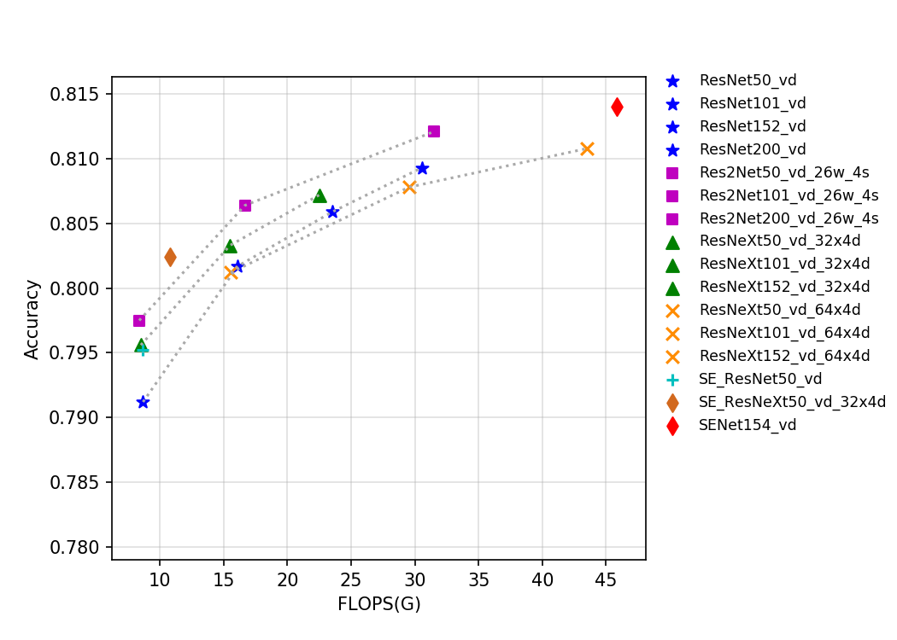
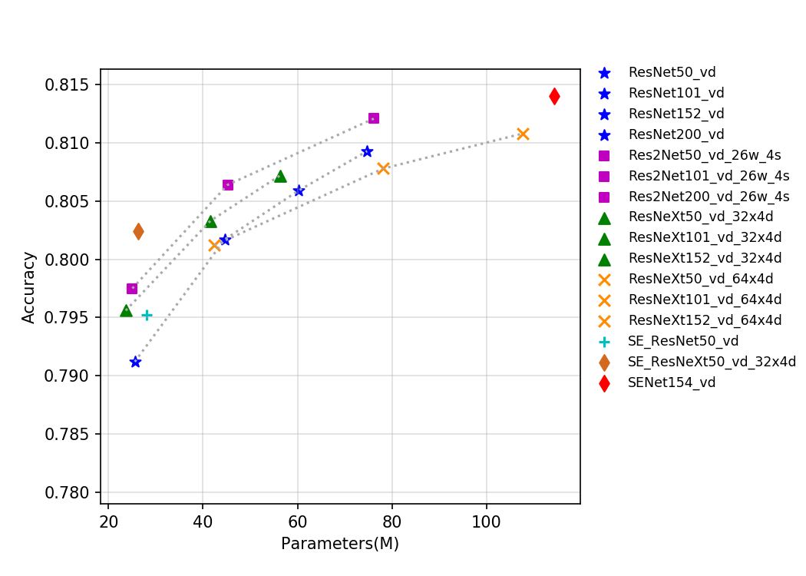
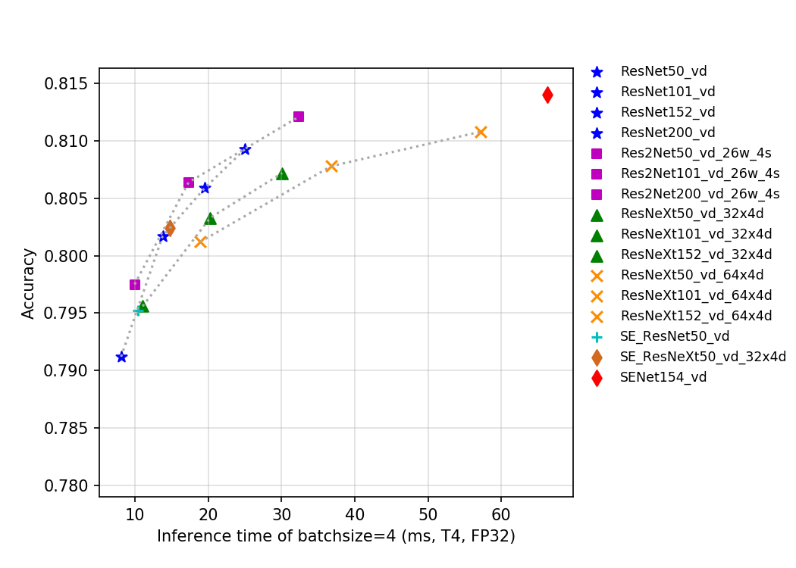

# SEResNeXt 与 Res2Net 系列

-----
## 目录

* [1. 概述](#1)
* [2. 精度、FLOPS 和参数量](#2)
* [3. 基于 V100 GPU 的预测速度](#3)
* [4. 基于 T4 GPU 的预测速度](#4)

## 1. 概述
ResNeXt 是 ResNet 的典型变种网络之一，ResNeXt 发表于 2017 年的 CVPR 会议。在此之前，提升模型精度的方法主要集中在将网络变深或者变宽，这样增加了参数量和计算量，推理速度也会相应变慢。ResNeXt 结构提出了通道分组（cardinality）的概念，作者通过实验发现增加通道的组数比增加深度和宽度更有效。其可以在不增加参数复杂度的前提下提高准确率，同时还减少了参数的数量，所以是比较成功的 ResNet 的变种。

SENet 是 2017 年 ImageNet 分类比赛的冠军方案，其提出了一个全新的 SE 结构，该结构可以迁移到任何其他网络中，其通过控制 scale 的大小，把每个通道间重要的特征增强，不重要的特征减弱，从而让提取的特征指向性更强。

Res2Net 是 2019 年提出的一种全新的对 ResNet 的改进方案，该方案可以和现有其他优秀模块轻松整合，在不增加计算负载量的情况下，在 ImageNet、CIFAR-100 等数据集上的测试性能超过了 ResNet。Res2Net 结构简单，性能优越，进一步探索了 CNN 在更细粒度级别的多尺度表示能力。Res2Net 揭示了一个新的提升模型精度的维度，即 scale，其是除了深度、宽度和基数的现有维度之外另外一个必不可少的更有效的因素。该网络在其他视觉任务如目标检测、图像分割等也有相当不错的表现。

该系列模型的 FLOPS、参数量以及 T4 GPU 上的预测耗时如下图所示。

目前 PaddleClas 开源的这三类的预训练模型一共有 24 个，其指标如图所示，从图中可以看出，在同样 Flops 和 Params 下，改进版的模型往往有更高的精度，但是推理速度往往不如 ResNet 系列。另一方面，Res2Net 表现也较为优秀，相比 ResNeXt 中的 group 操作、SEResNet 中的 SE 结构操作，Res2Net 在相同 Flops、Params 和推理速度下往往精度更佳。

## 2. 精度、FLOPS 和参数量

| Models                | Top1   | Top5   | Reference top1 | Reference top5 | FLOPS (G) | Parameters (M) |
|:--:|:--:|:--:|:--:|:--:|:--:|:--:|
| Res2Net50_26w_4s      | 0.793  | 0.946  | 0.780             | 0.936             | 8.520        | 25.700            |
| Res2Net50_vd_26w_4s   | 0.798  | 0.949  |                   |                   | 8.370        | 25.060            |
| Res2Net50_vd_26w_4s_ssld   | 0.831  | 0.966  |                   |                   | 8.370        | 25.060            |
| Res2Net50_14w_8s      | 0.795  | 0.947  | 0.781             | 0.939             | 9.010        | 25.720            |
| Res2Net101_vd_26w_4s  | 0.806  | 0.952  |                   |                   | 16.670       | 45.220            |
| Res2Net101_vd_26w_4s_ssld  | 0.839  | 0.971  |                   |                   | 16.670       | 45.220            |
| Res2Net200_vd_26w_4s  | 0.812  | 0.957  |                   |                   | 31.490       | 76.210            |
| Res2Net200_vd_26w_4s_ssld  | **0.851**  | 0.974  |                   |                   | 31.490       | 76.210            |
| ResNeXt50_32x4d       | 0.778  | 0.938  | 0.778             |                   | 8.020        | 23.640            |
| ResNeXt50_vd_32x4d    | 0.796  | 0.946  |                   |                   | 8.500        | 23.660            |
| ResNeXt50_64x4d       | 0.784  | 0.941  |                   |                   | 15.060       | 42.360            |
| ResNeXt50_vd_64x4d    | 0.801  | 0.949  |                   |                   | 15.540       | 42.380            |
| ResNeXt101_32x4d      | 0.787  | 0.942  | 0.788             |                   | 15.010       | 41.540            |
| ResNeXt101_vd_32x4d   | 0.803  | 0.951  |                   |                   | 15.490       | 41.560            |
| ResNeXt101_64x4d      | 0.784  | 0.945  | 0.796             |                   | 29.050       | 78.120            |
| ResNeXt101_vd_64x4d   | 0.808  | 0.952  |                   |                   | 29.530       | 78.140            |
| ResNeXt152_32x4d      | 0.790  | 0.943  |                   |                   | 22.010       | 56.280            |
| ResNeXt152_vd_32x4d   | 0.807  | 0.952  |                   |                   | 22.490       | 56.300            |
| ResNeXt152_64x4d      | 0.795  | 0.947  |                   |                   | 43.030       | 107.570           |
| ResNeXt152_vd_64x4d   | 0.811  | 0.953  |                   |                   | 43.520       | 107.590           |
| SE_ResNet18_vd        | 0.733  | 0.914  |                   |                   | 4.140        | 11.800            |
| SE_ResNet34_vd        | 0.765  | 0.932  |                   |                   | 7.840        | 21.980            |
| SE_ResNet50_vd        | 0.795  | 0.948  |                   |                   | 8.670        | 28.090            |
| SE_ResNeXt50_32x4d    | 0.784  | 0.940  | 0.789             | 0.945             | 8.020        | 26.160            |
| SE_ResNeXt50_vd_32x4d | 0.802  | 0.949  |                   |                   | 10.760       | 26.280            |
| SE_ResNeXt101_32x4d   | 0.7939  | 0.9443  | 0.793             | 0.950             | 15.020       | 46.280            |
| SENet154_vd           | 0.814  | 0.955  |                   |                   | 45.830       | 114.290           |

## 3. 基于 V100 GPU 的预测速度

| Models                 | Crop Size | Resize Short Size | FP32 Batch Size=1 (ms) | FP32 Batch Size=4 (ms) | FP32 Batch Size=8 (ms) |
|-----------------------|-----------|-------------------|-----------------------|-----------------------|-----------------------|
| Res2Net50_26w_4s      | 224       | 256               | 3.52               | 6.23               | 9.30               |
| Res2Net50_vd_26w_4s   | 224       | 256               | 3.59               | 6.35               | 9.50               |
| Res2Net50_14w_8s      | 224       | 256               | 4.39               | 7.21               | 10.38              |
| Res2Net101_vd_26w_4s  | 224       | 256               | 6.34               | 11.02              | 16.13              |
| Res2Net200_vd_26w_4s  | 224       | 256               | 11.45             | 19.77             | 28.81             |
| ResNeXt50_32x4d       | 224       | 256               | 5.07              | 8.49              | 12.02             |
| ResNeXt50_vd_32x4d    | 224       | 256               | 5.29               | 8.68               | 12.33              |
| ResNeXt50_64x4d       | 224       | 256               | 9.39              | 13.97             | 20.56             |
| ResNeXt50_vd_64x4d    | 224       | 256               | 9.75              | 14.14             | 20.84             |
| ResNeXt101_32x4d      | 224       | 256               | 11.34             | 16.78             | 22.80             |
| ResNeXt101_vd_32x4d   | 224       | 256               | 11.36             | 17.01             | 23.07             |
| ResNeXt101_64x4d      | 224       | 256               | 21.57             | 28.08             | 39.49             |
| ResNeXt101_vd_64x4d   | 224       | 256               | 21.57             | 28.22             | 39.70             |
| ResNeXt152_32x4d      | 224       | 256               | 17.14             | 25.11             | 33.79             |
| ResNeXt152_vd_32x4d   | 224       | 256               | 16.99             | 25.29             | 33.85             |
| ResNeXt152_64x4d      | 224       | 256               | 33.07             | 42.05             | 59.13             |
| ResNeXt152_vd_64x4d   | 224       | 256               | 33.30             | 42.41             | 59.42             |
| SE_ResNet18_vd        | 224       | 256               | 1.48               | 2.70               | 4.32               |
| SE_ResNet34_vd        | 224       | 256               | 2.42               | 3.69               | 6.29               |
| SE_ResNet50_vd        | 224       | 256               | 3.11               | 5.99               | 9.34               |
| SE_ResNeXt50_32x4d    | 224       | 256               | 6.39               | 11.01              | 14.94              |
| SE_ResNeXt50_vd_32x4d | 224       | 256               | 7.04               | 11.57              | 16.01              |
| SE_ResNeXt101_32x4d   | 224       | 256               | 13.31             | 21.85             | 28.77             |
| SENet154_vd           | 224       | 256               | 34.83             | 51.22             | 69.74             |
| Res2Net50_vd_26w_4s_ssld | 224 | 256 | 3.58 | 6.35 | 9.52 |
| Res2Net101_vd_26w_4s_ssld | 224 | 256 | 6.33 | 11.02 | 16.11 |
| Res2Net200_vd_26w_4s_ssld | 224 | 256 | 11.47 | 19.75 | 28.83 |

## 4. 基于 T4 GPU 的预测速度

| Models                | Crop Size | Resize Short Size | FP16 Batch Size=1 (ms) | FP16 Batch Size=4 (ms) | FP16 Batch Size=8 (ms) | FP32 Batch Size=1 (ms) | FP32 Batch Size=4 (ms) | FP32 Batch Size=8 (ms) |
|-----------------------|-----------|-------------------|------------------------------|------------------------------|------------------------------|------------------------------|------------------------------|------------------------------|
| Res2Net50_26w_4s      | 224       | 256               | 3.56067                      | 6.61827                      | 11.41566                     | 4.47188                      | 9.65722                      | 17.54535                     |
| Res2Net50_vd_26w_4s   | 224       | 256               | 3.69221                      | 6.94419                      | 11.92441                     | 4.52712                      | 9.93247                      | 18.16928                     |
| Res2Net50_14w_8s      | 224       | 256               | 4.45745                      | 7.69847                      | 12.30935                     | 5.4026                       | 10.60273                     | 18.01234                     |
| Res2Net101_vd_26w_4s  | 224       | 256               | 6.53122                      | 10.81895                     | 18.94395                     | 8.08729                      | 17.31208                     | 31.95762                     |
| Res2Net200_vd_26w_4s  | 224       | 256               | 11.66671                     | 18.93953                     | 33.19188                     | 14.67806                     | 32.35032                     | 63.65899                     |
| ResNeXt50_32x4d       | 224       | 256               | 7.61087                      | 8.88918                      | 12.99674                     | 7.56327                      | 10.6134                      | 18.46915                     |
| ResNeXt50_vd_32x4d    | 224       | 256               | 7.69065                      | 8.94014                      | 13.4088                      | 7.62044                      | 11.03385                     | 19.15339                     |
| ResNeXt50_64x4d       | 224       | 256               | 13.78688                     | 15.84655                     | 21.79537                     | 13.80962                     | 18.4712                      | 33.49843                     |
| ResNeXt50_vd_64x4d    | 224       | 256               | 13.79538                     | 15.22201                     | 22.27045                     | 13.94449                     | 18.88759                     | 34.28889                     |
| ResNeXt101_32x4d      | 224       | 256               | 16.59777                     | 17.93153                     | 21.36541                     | 16.21503                     | 19.96568                     | 33.76831                     |
| ResNeXt101_vd_32x4d   | 224       | 256               | 16.36909                     | 17.45681                     | 22.10216                     | 16.28103                     | 20.25611                     | 34.37152                     |
| ResNeXt101_64x4d      | 224       | 256               | 30.12355                     | 32.46823                     | 38.41901                     | 30.4788                      | 36.29801                     | 68.85559                     |
| ResNeXt101_vd_64x4d   | 224       | 256               | 30.34022                     | 32.27869                     | 38.72523                     | 30.40456                     | 36.77324                     | 69.66021                     |
| ResNeXt152_32x4d      | 224       | 256               | 25.26417                     | 26.57001                     | 30.67834                     | 24.86299                     | 29.36764                     | 52.09426                     |
| ResNeXt152_vd_32x4d   | 224       | 256               | 25.11196                     | 26.70515                     | 31.72636                     | 25.03258                     | 30.08987                     | 52.64429                     |
| ResNeXt152_64x4d      | 224       | 256               | 46.58293                     | 48.34563                     | 56.97961                     | 46.7564                      | 56.34108                     | 106.11736                    |
| ResNeXt152_vd_64x4d   | 224       | 256               | 47.68447                     | 48.91406                     | 57.29329                     | 47.18638                     | 57.16257                     | 107.26288                    |
| SE_ResNet18_vd        | 224       | 256               | 1.61823                      | 3.1391                       | 4.60282                      | 1.7691                       | 4.19877                      | 7.5331                       |
| SE_ResNet34_vd        | 224       | 256               | 2.67518                      | 5.04694                      | 7.18946                      | 2.88559                      | 7.03291                      | 12.73502                     |
| SE_ResNet50_vd        | 224       | 256               | 3.65394                      | 7.568                        | 12.52793                     | 4.28393                      | 10.38846                     | 18.33154                     |
| SE_ResNeXt50_32x4d    | 224       | 256               | 9.06957                      | 11.37898                     | 18.86282                     | 8.74121                      | 13.563                       | 23.01954                     |
| SE_ResNeXt50_vd_32x4d | 224       | 256               | 9.25016                      | 11.85045                     | 25.57004                     | 9.17134                      | 14.76192                     | 19.914                       |
| SE_ResNeXt101_32x4d   | 224       | 256               | 19.34455                     | 20.6104                      | 32.20432                     | 18.82604                     | 25.31814                     | 41.97758                     |
| SENet154_vd           | 224       | 256               | 49.85733                     | 54.37267                     | 74.70447                     | 53.79794                     | 66.31684                     | 121.59885                    |
