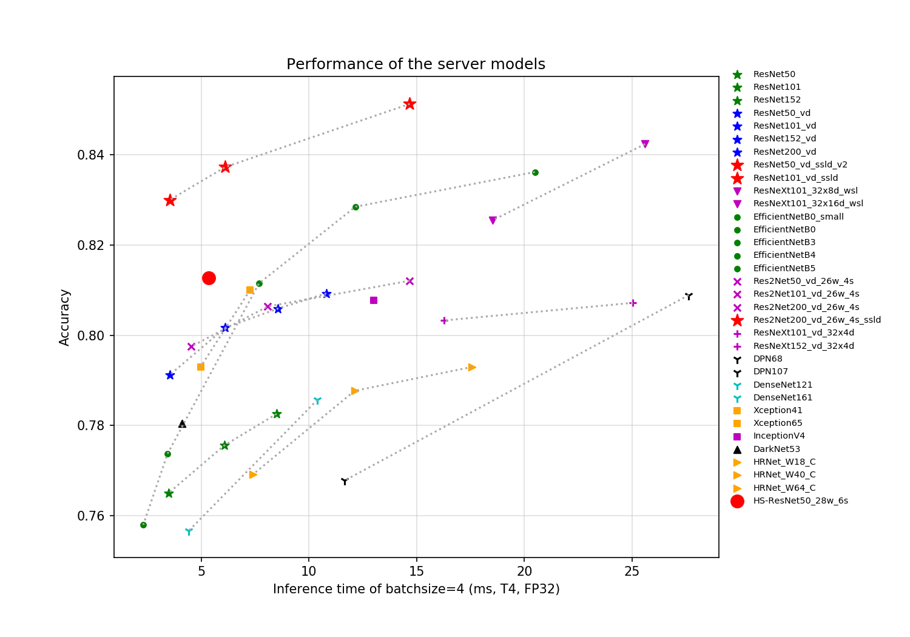
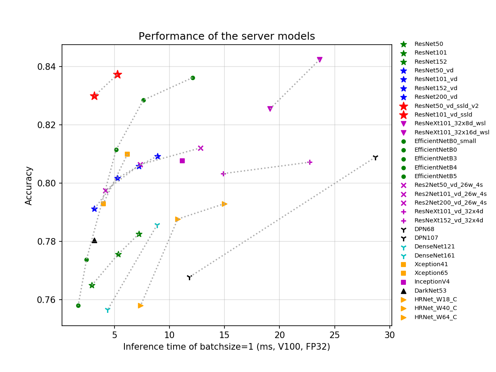

# 模型库概览

## 概述

基于ImageNet1k分类数据集，PaddleClas支持的23种系列分类网络结构以及对应的117个图像分类预训练模型如下所示，训练技巧、每个系列网络结构的简单介绍和性能评估将在相应章节展现。

## 评估环境
* CPU的评估环境基于骁龙855（SD855）。
* GPU评估环境基于V100和TensorRT，评估脚本如下。

```shell
#!/usr/bin/env bash

export PYTHONPATH=$PWD:$PYTHONPATH

python tools/infer/predict.py \
    --model_file='pretrained/infer/model' \
    --params_file='pretrained/infer/params' \
    --enable_benchmark=True \
    --model_name=ResNet50_vd \
    --use_tensorrt=True \
    --use_fp16=False \
    --batch_size=1
```






> 如果您觉得此文档对您有帮助，欢迎star我们的项目：[https://github.com/PaddlePaddle/PaddleClas](https://github.com/PaddlePaddle/PaddleClas)


## 预训练模型列表及下载地址
- ResNet及其Vd系列
  - ResNet系列<sup>[[1](#ref1)]</sup>([论文地址](http://openaccess.thecvf.com/content_cvpr_2016/html/He_Deep_Residual_Learning_CVPR_2016_paper.html))
    - [ResNet18](https://paddle-imagenet-models-name.bj.bcebos.com/ResNet18_pretrained.tar)
    - [ResNet34](https://paddle-imagenet-models-name.bj.bcebos.com/ResNet34_pretrained.tar)
    - [ResNet50](https://paddle-imagenet-models-name.bj.bcebos.com/ResNet50_pretrained.tar)
    - [ResNet101](https://paddle-imagenet-models-name.bj.bcebos.com/ResNet101_pretrained.tar)
    - [ResNet152](https://paddle-imagenet-models-name.bj.bcebos.com/ResNet152_pretrained.tar)
  - ResNet_vc、ResNet_vd系列<sup>[[2](#ref2)]</sup>([论文地址](https://arxiv.org/abs/1812.01187))
    - [ResNet50_vc](https://paddle-imagenet-models-name.bj.bcebos.com/ResNet50_vc_pretrained.tar)
    - [ResNet18_vd](https://paddle-imagenet-models-name.bj.bcebos.com/ResNet18_vd_pretrained.tar)
    - [ResNet34_vd](https://paddle-imagenet-models-name.bj.bcebos.com/ResNet34_vd_pretrained.tar)
    - [ResNet34_vd_ssld](https://paddle-imagenet-models-name.bj.bcebos.com/ResNet34_vd_ssld_pretrained.tar)
    - [ResNet50_vd](https://paddle-imagenet-models-name.bj.bcebos.com/ResNet50_vd_pretrained.tar)
    - [ResNet50_vd_v2](https://paddle-imagenet-models-name.bj.bcebos.com/ResNet50_vd_v2_pretrained.tar)
    - [ResNet101_vd](https://paddle-imagenet-models-name.bj.bcebos.com/ResNet101_vd_pretrained.tar)
    - [ResNet152_vd](https://paddle-imagenet-models-name.bj.bcebos.com/ResNet152_vd_pretrained.tar)
    - [ResNet200_vd](https://paddle-imagenet-models-name.bj.bcebos.com/ResNet200_vd_pretrained.tar)
    - [ResNet50_vd_ssld](https://paddle-imagenet-models-name.bj.bcebos.com/ResNet50_vd_ssld_pretrained.tar)
    - [ResNet50_vd_ssld_v2](https://paddle-imagenet-models-name.bj.bcebos.com/ResNet50_vd_ssld_v2_pretrained.tar)
    - [Fix_ResNet50_vd_ssld_v2](https://paddle-imagenet-models-name.bj.bcebos.com/Fix_ResNet50_vd_ssld_v2_pretrained.tar)
    - [ResNet101_vd_ssld](https://paddle-imagenet-models-name.bj.bcebos.com/ResNet101_vd_ssld_pretrained.tar)


- 移动端系列
  - MobileNetV3系列<sup>[[3](#ref3)]</sup>([论文地址](https://arxiv.org/abs/1905.02244))
    - [MobileNetV3_large_x0_35](https://paddle-imagenet-models-name.bj.bcebos.com/MobileNetV3_large_x0_35_pretrained.tar)
    - [MobileNetV3_large_x0_5](https://paddle-imagenet-models-name.bj.bcebos.com/MobileNetV3_large_x0_5_pretrained.tar)
    - [MobileNetV3_large_x0_75](https://paddle-imagenet-models-name.bj.bcebos.com/MobileNetV3_large_x0_75_pretrained.tar)
    - [MobileNetV3_large_x1_0](https://paddle-imagenet-models-name.bj.bcebos.com/MobileNetV3_large_x1_0_pretrained.tar)
    - [MobileNetV3_large_x1_25](https://paddle-imagenet-models-name.bj.bcebos.com/MobileNetV3_large_x1_25_pretrained.tar)
    - [MobileNetV3_small_x0_35](https://paddle-imagenet-models-name.bj.bcebos.com/MobileNetV3_small_x0_35_pretrained.tar)
    - [MobileNetV3_small_x0_5](https://paddle-imagenet-models-name.bj.bcebos.com/MobileNetV3_small_x0_5_pretrained.tar)
    - [MobileNetV3_small_x0_75](https://paddle-imagenet-models-name.bj.bcebos.com/MobileNetV3_small_x0_75_pretrained.tar)
    - [MobileNetV3_small_x1_0](https://paddle-imagenet-models-name.bj.bcebos.com/MobileNetV3_small_x1_0_pretrained.tar)
    - [MobileNetV3_small_x1_25](https://paddle-imagenet-models-name.bj.bcebos.com/MobileNetV3_small_x1_25_pretrained.tar)
    - [MobileNetV3_large_x1_0_ssld](https://paddle-imagenet-models-name.bj.bcebos.com/MobileNetV3_large_x1_0_ssld_pretrained.tar)
    - [MobileNetV3_large_x1_0_ssld_int8](https://paddle-imagenet-models-name.bj.bcebos.com/MobileNetV3_large_x1_0_ssld_int8_pretrained.tar)
    - [MobileNetV3_small_x1_0_ssld](https://paddle-imagenet-models-name.bj.bcebos.com/MobileNetV3_small_x1_0_ssld_pretrained.tar)
  - MobileNetV2系列<sup>[[4](#ref4)]</sup>([论文地址](https://arxiv.org/abs/1801.04381))
    - [MobileNetV2_x0_25](https://paddle-imagenet-models-name.bj.bcebos.com/MobileNetV2_x0_25_pretrained.tar)
    - [MobileNetV2_x0_5](https://paddle-imagenet-models-name.bj.bcebos.com/MobileNetV2_x0_5_pretrained.tar)
    - [MobileNetV2_x0_75](https://paddle-imagenet-models-name.bj.bcebos.com/MobileNetV2_x0_75_pretrained.tar)
    - [MobileNetV2](https://paddle-imagenet-models-name.bj.bcebos.com/MobileNetV2_pretrained.tar)
    - [MobileNetV2_x1_5](https://paddle-imagenet-models-name.bj.bcebos.com/MobileNetV2_x1_5_pretrained.tar)
    - [MobileNetV2_x2_0](https://paddle-imagenet-models-name.bj.bcebos.com/MobileNetV2_x2_0_pretrained.tar)
    - [MobileNetV2_ssld](https://paddle-imagenet-models-name.bj.bcebos.com/MobileNetV2_ssld_pretrained.tar)
  - MobileNetV1系列<sup>[[5](#ref5)]</sup>([论文地址](https://arxiv.org/abs/1704.04861))
    - [MobileNetV1_x0_25](https://paddle-imagenet-models-name.bj.bcebos.com/MobileNetV1_x0_25_pretrained.tar)
    - [MobileNetV1_x0_5](https://paddle-imagenet-models-name.bj.bcebos.com/MobileNetV1_x0_5_pretrained.tar)
    - [MobileNetV1_x0_75](https://paddle-imagenet-models-name.bj.bcebos.com/MobileNetV1_x0_75_pretrained.tar)
    - [MobileNetV1](https://paddle-imagenet-models-name.bj.bcebos.com/MobileNetV1_pretrained.tar)
    - [MobileNetV1_ssld](https://paddle-imagenet-models-name.bj.bcebos.com/MobileNetV1_ssld_pretrained.tar)
  - ShuffleNetV2系列<sup>[[6](#ref6)]</sup>([论文地址](https://arxiv.org/abs/1807.11164))
    - [ShuffleNetV2_x0_25](https://paddle-imagenet-models-name.bj.bcebos.com/ShuffleNetV2_x0_25_pretrained.tar)
    - [ShuffleNetV2_x0_33](https://paddle-imagenet-models-name.bj.bcebos.com/ShuffleNetV2_x0_33_pretrained.tar)
    - [ShuffleNetV2_x0_5](https://paddle-imagenet-models-name.bj.bcebos.com/ShuffleNetV2_x0_5_pretrained.tar)
    - [ShuffleNetV2](https://paddle-imagenet-models-name.bj.bcebos.com/ShuffleNetV2_pretrained.tar)
    - [ShuffleNetV2_x1_5](https://paddle-imagenet-models-name.bj.bcebos.com/ShuffleNetV2_x1_5_pretrained.tar)
    - [ShuffleNetV2_x2_0](https://paddle-imagenet-models-name.bj.bcebos.com/ShuffleNetV2_x2_0_pretrained.tar)
    - [ShuffleNetV2_swish](https://paddle-imagenet-models-name.bj.bcebos.com/ShuffleNetV2_swish_pretrained.tar)
  - GhostNet系列<sup>[[23](#ref23)]</sup>([论文地址](https://arxiv.org/pdf/1911.11907.pdf))
    - [GhostNet_x0_5](https://paddle-imagenet-models-name.bj.bcebos.com/GhostNet_x0_5_pretrained.pdparams)
    - [GhostNet_x1_0](https://paddle-imagenet-models-name.bj.bcebos.com/GhostNet_x1_0_pretrained.pdparams)
    - [GhostNet_x1_3](https://paddle-imagenet-models-name.bj.bcebos.com/GhostNet_x1_3_pretrained.pdparams)


- SEResNeXt与Res2Net系列
  - ResNeXt系列<sup>[[7](#ref7)]</sup>([论文地址](https://arxiv.org/abs/1611.05431))
    - [ResNeXt50_32x4d](https://paddle-imagenet-models-name.bj.bcebos.com/ResNeXt50_32x4d_pretrained.tar)
    - [ResNeXt50_64x4d](https://paddle-imagenet-models-name.bj.bcebos.com/ResNeXt50_64x4d_pretrained.tar)
    - [ResNeXt101_32x4d](https://paddle-imagenet-models-name.bj.bcebos.com/ResNeXt101_32x4d_pretrained.tar)
    - [ResNeXt101_64x4d](https://paddle-imagenet-models-name.bj.bcebos.com/ResNeXt101_64x4d_pretrained.tar)
    - [ResNeXt152_32x4d](https://paddle-imagenet-models-name.bj.bcebos.com/ResNeXt152_32x4d_pretrained.tar)
    - [ResNeXt152_64x4d](https://paddle-imagenet-models-name.bj.bcebos.com/ResNeXt152_64x4d_pretrained.tar)
  - ResNeXt_vd系列
    - [ResNeXt50_vd_32x4d](https://paddle-imagenet-models-name.bj.bcebos.com/ResNeXt50_vd_32x4d_pretrained.tar)
    - [ResNeXt50_vd_64x4d](https://paddle-imagenet-models-name.bj.bcebos.com/ResNeXt50_vd_64x4d_pretrained.tar)
    - [ResNeXt101_vd_32x4d](https://paddle-imagenet-models-name.bj.bcebos.com/ResNeXt101_vd_32x4d_pretrained.tar)
    - [ResNeXt101_vd_64x4d](https://paddle-imagenet-models-name.bj.bcebos.com/ResNeXt101_vd_64x4d_pretrained.tar)
    - [ResNeXt152_vd_32x4d](https://paddle-imagenet-models-name.bj.bcebos.com/ResNeXt152_vd_32x4d_pretrained.tar)
    - [ResNeXt152_vd_64x4d](https://paddle-imagenet-models-name.bj.bcebos.com/ResNeXt152_vd_64x4d_pretrained.tar)
  - SE_ResNet_vd系列<sup>[[8](#ref8)]</sup>([论文地址](https://arxiv.org/abs/1709.01507))
    - [SE_ResNet18_vd](https://paddle-imagenet-models-name.bj.bcebos.com/SE_ResNet18_vd_pretrained.tar)
    - [SE_ResNet34_vd](https://paddle-imagenet-models-name.bj.bcebos.com/SE_ResNet34_vd_pretrained.tar)
    - [SE_ResNet50_vd](https://paddle-imagenet-models-name.bj.bcebos.com/SE_ResNet50_vd_pretrained.tar)
  - SE_ResNeXt系列
    - [SE_ResNeXt50_32x4d](https://paddle-imagenet-models-name.bj.bcebos.com/SE_ResNeXt50_32x4d_pretrained.tar)
    - [SE_ResNeXt101_32x4d](https://paddle-imagenet-models-name.bj.bcebos.com/SE_ResNeXt101_32x4d_pretrained.tar)
  - SE_ResNeXt_vd系列
    - [SE_ResNeXt50_vd_32x4d](https://paddle-imagenet-models-name.bj.bcebos.com/SE_ResNeXt50_vd_32x4d_pretrained.tar)
    - [SENet154_vd](https://paddle-imagenet-models-name.bj.bcebos.com/SENet154_vd_pretrained.tar)
  - Res2Net系列<sup>[[9](#ref9)]</sup>([论文地址](https://arxiv.org/abs/1904.01169))
    - [Res2Net50_26w_4s](https://paddle-imagenet-models-name.bj.bcebos.com/Res2Net50_26w_4s_pretrained.tar)
    - [Res2Net50_vd_26w_4s](https://paddle-imagenet-models-name.bj.bcebos.com/Res2Net50_vd_26w_4s_pretrained.tar)
    - [Res2Net50_14w_8s](https://paddle-imagenet-models-name.bj.bcebos.com/Res2Net50_14w_8s_pretrained.tar)
    - [Res2Net101_vd_26w_4s](https://paddle-imagenet-models-name.bj.bcebos.com/Res2Net101_vd_26w_4s_pretrained.tar)
    - [Res2Net200_vd_26w_4s](https://paddle-imagenet-models-name.bj.bcebos.com/Res2Net200_vd_26w_4s_pretrained.tar)
    - [Res2Net200_vd_26w_4s_ssld](https://paddle-imagenet-models-name.bj.bcebos.com/Res2Net200_vd_26w_4s_ssld_pretrained.tar)


- Inception系列
  - GoogLeNet系列<sup>[[10](#ref10)]</sup>([论文地址](https://arxiv.org/pdf/1409.4842.pdf))
    - [GoogLeNet](https://paddle-imagenet-models-name.bj.bcebos.com/GoogLeNet_pretrained.tar)
  - InceptionV3系列<sup>[[26](#ref26)]</sup>([论文地址](https://arxiv.org/abs/1512.00567))
    - [InceptionV3](https://paddle-imagenet-models-name.bj.bcebos.com/InceptionV3_pretrained.tar)
  - InceptionV4系列<sup>[[11](#ref11)]</sup>([论文地址](https://arxiv.org/abs/1602.07261))
    - [InceptionV4](https://paddle-imagenet-models-name.bj.bcebos.com/InceptionV4_pretrained.tar)
  - Xception系列<sup>[[12](#ref12)]</sup>([论文地址](http://openaccess.thecvf.com/content_cvpr_2017/html/Chollet_Xception_Deep_Learning_CVPR_2017_paper.html))
    - [Xception41](https://paddle-imagenet-models-name.bj.bcebos.com/Xception41_pretrained.tar)
    - [Xception41_deeplab](https://paddle-imagenet-models-name.bj.bcebos.com/Xception41_deeplab_pretrained.tar)
    - [Xception65](https://paddle-imagenet-models-name.bj.bcebos.com/Xception65_pretrained.tar)
    - [Xception65_deeplab](https://paddle-imagenet-models-name.bj.bcebos.com/Xception65_deeplab_pretrained.tar)
    - [Xception71](https://paddle-imagenet-models-name.bj.bcebos.com/Xception71_pretrained.tar)


- HRNet系列
  - HRNet系列<sup>[[13](#ref13)]</sup>([论文地址](https://arxiv.org/abs/1908.07919))
    - [HRNet_W18_C](https://paddle-imagenet-models-name.bj.bcebos.com/HRNet_W18_C_pretrained.tar)
    - [HRNet_W18_C_ssld](https://paddle-imagenet-models-name.bj.bcebos.com/HRNet_W18_C_ssld_pretrained.tar)
    - [HRNet_W30_C](https://paddle-imagenet-models-name.bj.bcebos.com/HRNet_W30_C_pretrained.tar)
    - [HRNet_W32_C](https://paddle-imagenet-models-name.bj.bcebos.com/HRNet_W32_C_pretrained.tar)
    - [HRNet_W40_C](https://paddle-imagenet-models-name.bj.bcebos.com/HRNet_W40_C_pretrained.tar)
    - [HRNet_W44_C](https://paddle-imagenet-models-name.bj.bcebos.com/HRNet_W44_C_pretrained.tar)
    - [HRNet_W48_C](https://paddle-imagenet-models-name.bj.bcebos.com/HRNet_W48_C_pretrained.tar)
    - [HRNet_W48_C_ssld](https://paddle-imagenet-models-name.bj.bcebos.com/HRNet_W48_C_ssld_pretrained.tar)
    - [HRNet_W64_C](https://paddle-imagenet-models-name.bj.bcebos.com/HRNet_W64_C_pretrained.tar)


- DPN与DenseNet系列
  - DPN系列<sup>[[14](#ref14)]</sup>([论文地址](https://arxiv.org/abs/1707.01629))
    - [DPN68](https://paddle-imagenet-models-name.bj.bcebos.com/DPN68_pretrained.tar)
    - [DPN92](https://paddle-imagenet-models-name.bj.bcebos.com/DPN92_pretrained.tar)
    - [DPN98](https://paddle-imagenet-models-name.bj.bcebos.com/DPN98_pretrained.tar)
    - [DPN107](https://paddle-imagenet-models-name.bj.bcebos.com/DPN107_pretrained.tar)
    - [DPN131](https://paddle-imagenet-models-name.bj.bcebos.com/DPN131_pretrained.tar)
  - DenseNet系列<sup>[[15](#ref15)]</sup>([论文地址](https://arxiv.org/abs/1608.06993))
    - [DenseNet121](https://paddle-imagenet-models-name.bj.bcebos.com/DenseNet121_pretrained.tar)
    - [DenseNet161](https://paddle-imagenet-models-name.bj.bcebos.com/DenseNet161_pretrained.tar)
    - [DenseNet169](https://paddle-imagenet-models-name.bj.bcebos.com/DenseNet169_pretrained.tar)
    - [DenseNet201](https://paddle-imagenet-models-name.bj.bcebos.com/DenseNet201_pretrained.tar)
    - [DenseNet264](https://paddle-imagenet-models-name.bj.bcebos.com/DenseNet264_pretrained.tar)


- EfficientNet与ResNeXt101_wsl系列
  - EfficientNet系列<sup>[[16](#ref16)]</sup>([论文地址](https://arxiv.org/abs/1905.11946))
    - [EfficientNetB0_small](https://paddle-imagenet-models-name.bj.bcebos.com/EfficientNetB0_small_pretrained.tar)
    - [EfficientNetB0](https://paddle-imagenet-models-name.bj.bcebos.com/EfficientNetB0_pretrained.tar)
    - [EfficientNetB1](https://paddle-imagenet-models-name.bj.bcebos.com/EfficientNetB1_pretrained.tar)
    - [EfficientNetB2](https://paddle-imagenet-models-name.bj.bcebos.com/EfficientNetB2_pretrained.tar)
    - [EfficientNetB3](https://paddle-imagenet-models-name.bj.bcebos.com/EfficientNetB3_pretrained.tar)
    - [EfficientNetB4](https://paddle-imagenet-models-name.bj.bcebos.com/EfficientNetB4_pretrained.tar)
    - [EfficientNetB5](https://paddle-imagenet-models-name.bj.bcebos.com/EfficientNetB5_pretrained.tar)
    - [EfficientNetB6](https://paddle-imagenet-models-name.bj.bcebos.com/EfficientNetB6_pretrained.tar)
    - [EfficientNetB7](https://paddle-imagenet-models-name.bj.bcebos.com/EfficientNetB7_pretrained.tar)
  - ResNeXt101_wsl系列<sup>[[17](#ref17)]</sup>([论文地址](https://arxiv.org/abs/1805.00932))
    - [ResNeXt101_32x8d_wsl](https://paddle-imagenet-models-name.bj.bcebos.com/ResNeXt101_32x8d_wsl_pretrained.tar)
    - [ResNeXt101_32x16d_wsl](https://paddle-imagenet-models-name.bj.bcebos.com/ResNeXt101_32x16d_wsl_pretrained.tar)
    - [ResNeXt101_32x32d_wsl](https://paddle-imagenet-models-name.bj.bcebos.com/ResNeXt101_32x32d_wsl_pretrained.tar)
    - [ResNeXt101_32x48d_wsl](https://paddle-imagenet-models-name.bj.bcebos.com/ResNeXt101_32x48d_wsl_pretrained.tar)
    - [Fix_ResNeXt101_32x48d_wsl](https://paddle-imagenet-models-name.bj.bcebos.com/Fix_ResNeXt101_32x48d_wsl_pretrained.tar)

- ResNeSt与RegNet系列
  - ResNeSt系列<sup>[[24](#ref24)]</sup>([论文地址](https://arxiv.org/abs/2004.08955))
    - [ResNeSt50_fast_1s1x64d](https://paddle-imagenet-models-name.bj.bcebos.com/ResNeSt50_fast_1s1x64d_pretrained.pdparams)
    - [ResNeSt50](https://paddle-imagenet-models-name.bj.bcebos.com/ResNeSt50_pretrained.pdparams)
  - RegNet系列<sup>[[25](#ref25)]</sup>([paper link](https://arxiv.org/abs/2003.13678))
    - [RegNetX_4GF](https://paddle-imagenet-models-name.bj.bcebos.com/RegNetX_4GF_pretrained.pdparams)


- 其他模型
  - AlexNet系列<sup>[[18](#ref18)]</sup>([论文地址](https://papers.nips.cc/paper/4824-imagenet-classification-with-deep-convolutional-neural-networks.pdf))
    - [AlexNet](https://paddle-imagenet-models-name.bj.bcebos.com/AlexNet_pretrained.tar)
  - SqueezeNet系列<sup>[[19](#ref19)]</sup>([论文地址](https://arxiv.org/abs/1602.07360))
    - [SqueezeNet1_0](https://paddle-imagenet-models-name.bj.bcebos.com/SqueezeNet1_0_pretrained.tar)
    - [SqueezeNet1_1](https://paddle-imagenet-models-name.bj.bcebos.com/SqueezeNet1_1_pretrained.tar)
  - VGG系列<sup>[[20](#ref20)]</sup>([论文地址](https://arxiv.org/abs/1409.1556))
    - [VGG11](https://paddle-imagenet-models-name.bj.bcebos.com/VGG11_pretrained.tar)
    - [VGG13](https://paddle-imagenet-models-name.bj.bcebos.com/VGG13_pretrained.tar)
    - [VGG16](https://paddle-imagenet-models-name.bj.bcebos.com/VGG16_pretrained.tar)
    - [VGG19](https://paddle-imagenet-models-name.bj.bcebos.com/VGG19_pretrained.tar)
  - DarkNet系列<sup>[[21](#ref21)]</sup>([论文地址](https://arxiv.org/abs/1506.02640))
    - [DarkNet53](https://paddle-imagenet-models-name.bj.bcebos.com/DarkNet53_ImageNet1k_pretrained.tar)
  - ACNet系列<sup>[[22](#ref22)]</sup>([论文地址](https://arxiv.org/abs/1908.03930))
    - [ResNet50_ACNet_deploy](https://paddle-imagenet-models-name.bj.bcebos.com/ResNet50_ACNet_deploy_pretrained.tar)

**注意**：以上模型中EfficientNetB1-B7的预训练模型转自[pytorch版EfficientNet](https://github.com/lukemelas/EfficientNet-PyTorch)，ResNeXt101_wsl系列预训练模型转自[官方repo](https://github.com/facebookresearch/WSL-Images)，剩余预训练模型均基于飞浆训练得到的，并在configs里给出了相应的训练超参数。

## 参考文献


<a name="ref1">[1]</a> He K, Zhang X, Ren S, et al. Deep residual learning for image recognition[C]//Proceedings of the IEEE conference on computer vision and pattern recognition. 2016: 770-778.

<a name="ref2">[2]</a> He T, Zhang Z, Zhang H, et al. Bag of tricks for image classification with convolutional neural networks[C]//Proceedings of the IEEE Conference on Computer Vision and Pattern Recognition. 2019: 558-567.

<a name="ref3">[3]</a> Howard A, Sandler M, Chu G, et al. Searching for mobilenetv3[C]//Proceedings of the IEEE International Conference on Computer Vision. 2019: 1314-1324.

<a name="ref4">[4]</a> Sandler M, Howard A, Zhu M, et al. Mobilenetv2: Inverted residuals and linear bottlenecks[C]//Proceedings of the IEEE conference on computer vision and pattern recognition. 2018: 4510-4520.

<a name="ref5">[5]</a> Howard A G, Zhu M, Chen B, et al. Mobilenets: Efficient convolutional neural networks for mobile vision applications[J]. arXiv preprint arXiv:1704.04861, 2017.

<a name="ref6">[6]</a> Ma N, Zhang X, Zheng H T, et al. Shufflenet v2: Practical guidelines for efficient cnn architecture design[C]//Proceedings of the European Conference on Computer Vision (ECCV). 2018: 116-131.

<a name="ref7">[7]</a> Xie S, Girshick R, Dollár P, et al. Aggregated residual transformations for deep neural networks[C]//Proceedings of the IEEE conference on computer vision and pattern recognition. 2017: 1492-1500.


<a name="ref8">[8]</a> Hu J, Shen L, Sun G. Squeeze-and-excitation networks[C]//Proceedings of the IEEE conference on computer vision and pattern recognition. 2018: 7132-7141.


<a name="ref9">[9]</a> Gao S, Cheng M M, Zhao K, et al. Res2net: A new multi-scale backbone architecture[J]. IEEE transactions on pattern analysis and machine intelligence, 2019.

<a name="ref10">[10]</a> Szegedy C, Liu W, Jia Y, et al. Going deeper with convolutions[C]//Proceedings of the IEEE conference on computer vision and pattern recognition. 2015: 1-9.


<a name="ref11">[11]</a> Szegedy C, Ioffe S, Vanhoucke V, et al. Inception-v4, inception-resnet and the impact of residual connections on learning[C]//Thirty-first AAAI conference on artificial intelligence. 2017.

<a name="ref12">[12]</a> Chollet F. Xception: Deep learning with depthwise separable convolutions[C]//Proceedings of the IEEE conference on computer vision and pattern recognition. 2017: 1251-1258.

<a name="ref13">[13]</a> Wang J, Sun K, Cheng T, et al. Deep high-resolution representation learning for visual recognition[J]. arXiv preprint arXiv:1908.07919, 2019.

<a name="ref14">[14]</a> Chen Y, Li J, Xiao H, et al. Dual path networks[C]//Advances in neural information processing systems. 2017: 4467-4475.

<a name="ref15">[15]</a> Huang G, Liu Z, Van Der Maaten L, et al. Densely connected convolutional networks[C]//Proceedings of the IEEE conference on computer vision and pattern recognition. 2017: 4700-4708.


<a name="ref16">[16]</a> Tan M, Le Q V. Efficientnet: Rethinking model scaling for convolutional neural networks[J]. arXiv preprint arXiv:1905.11946, 2019.

<a name="ref17">[17]</a> Mahajan D, Girshick R, Ramanathan V, et al. Exploring the limits of weakly supervised pretraining[C]//Proceedings of the European Conference on Computer Vision (ECCV). 2018: 181-196.

<a name="ref18">[18]</a> Krizhevsky A, Sutskever I, Hinton G E. Imagenet classification with deep convolutional neural networks[C]//Advances in neural information processing systems. 2012: 1097-1105.

<a name="ref19">[19]</a> Iandola F N, Han S, Moskewicz M W, et al. SqueezeNet: AlexNet-level accuracy with 50x fewer parameters and< 0.5 MB model size[J]. arXiv preprint arXiv:1602.07360, 2016.

<a name="ref20">[20]</a> Simonyan K, Zisserman A. Very deep convolutional networks for large-scale image recognition[J]. arXiv preprint arXiv:1409.1556, 2014.

<a name="ref21">[21]</a> Redmon J, Divvala S, Girshick R, et al. You only look once: Unified, real-time object detection[C]//Proceedings of the IEEE conference on computer vision and pattern recognition. 2016: 779-788.

<a name="ref22">[22]</a> Ding X, Guo Y, Ding G, et al. Acnet: Strengthening the kernel skeletons for powerful cnn via asymmetric convolution blocks[C]//Proceedings of the IEEE International Conference on Computer Vision. 2019: 1911-1920.

<a name="ref23">[23]</a> Han K, Wang Y, Tian Q, et al. GhostNet: More features from cheap operations[C]//Proceedings of the IEEE/CVF Conference on Computer Vision and Pattern Recognition. 2020: 1580-1589.

<a name="ref24">[24]</a> Zhang H, Wu C, Zhang Z, et al. Resnest: Split-attention networks[J]. arXiv preprint arXiv:2004.08955, 2020.

<a name="ref25">[25]</a> Radosavovic I, Kosaraju R P, Girshick R, et al. Designing network design spaces[C]//Proceedings of the IEEE/CVF Conference on Computer Vision and Pattern Recognition. 2020: 10428-10436.

<a name="ref26">[26]</a> C.Szegedy, V.Vanhoucke, S.Ioffe, J.Shlens, and Z.Wojna. Rethinking the inception architecture for computer vision. arXiv preprint arXiv:1512.00567, 2015.
