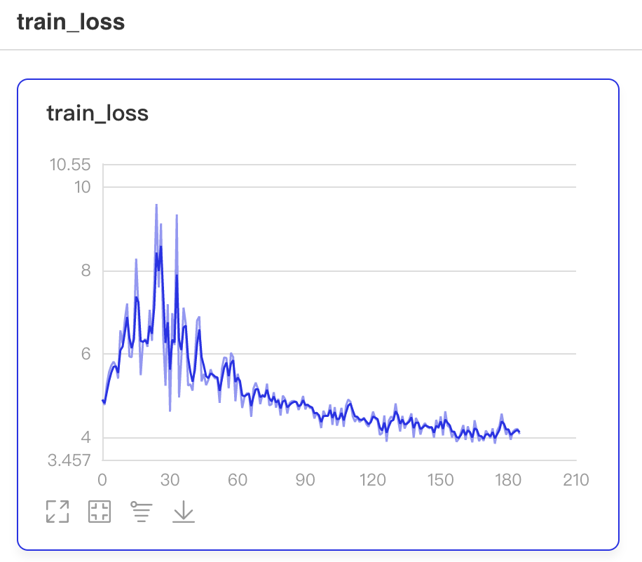

# 使用 VisualDL 可视化训练过程

---

## 目录
* [1. 前言](#1)
* [2. 在 PaddleClas 中使用 VisualDL](#2)
    * [2.1 设置 config 文件并启动训练](#2.1)
    * [2.2 启动 VisualDL](#2.2)

<a name='1'></a>

## 1. 前言
VisualDL 是飞桨可视化分析工具，以丰富的图表呈现训练参数变化趋势、模型结构、数据样本、高维数据分布等。可帮助用户更清晰直观地理解深度学习模型训练过程及模型结构，进而实现高效的模型优化。更多细节请查看[VisualDL](https://github.com/PaddlePaddle/VisualDL/)。

<a name='2'></a>

## 2. 在 PaddleClas 中使用 VisualDL
现在 PaddleClas 支持在训练阶段使用 VisualDL 查看训练过程中学习率（learning rate）、损失值（loss）以及准确率（accuracy）的变化情况。

<a name='2.1'></a>

### 2.1 设置 config 文件并启动训练
在 PaddleClas 中使用 VisualDL，只需在训练配置文件（config 文件）中设置字段 `Global.use_visualdl` 为 `True`：

```yaml
# config.yaml
Global:
...
  use_visualdl: True
...
```

PaddleClas 会将 VisualDL 的日志保存在 `Global.output_dir` 字段指定目录下的 `vdl/` 子目录下，然后正常启动训练即可：

```shell
python3 tools/train.py -c config.yaml
```
<a name='2.2'></a>

### 2.2 启动 VisualDL
在启动训练程序后，可以在新的终端 session 中启动 VisualDL 服务：

```shell
 visualdl --logdir ./output/vdl/
 ```

上述命令中，参数`--logdir` 用于指定保存 VisualDL 日志的目录，VisualDL 将遍历并且迭代寻找指定目录的子目录，将所有实验结果进行可视化。也同样可以使用下述参数设定 VisualDL 服务的 ip 及端口号：
* `--host`：设定 IP，默认为 127.0.0.1
* `--port`：设定端口，默认为 8040

更多参数信息，请查看[VisualDL](https://github.com/PaddlePaddle/VisualDL/blob/develop/README_CN.md#2-%E5%90%AF%E5%8A%A8%E9%9D%A2%E6%9D%BF)。

在启动 VisualDL 后，即可在浏览器中查看训练过程，输入地址 `127.0.0.1:8840`：


