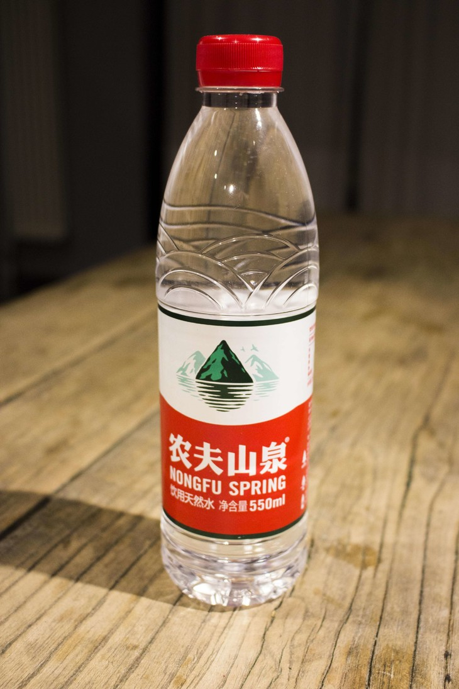
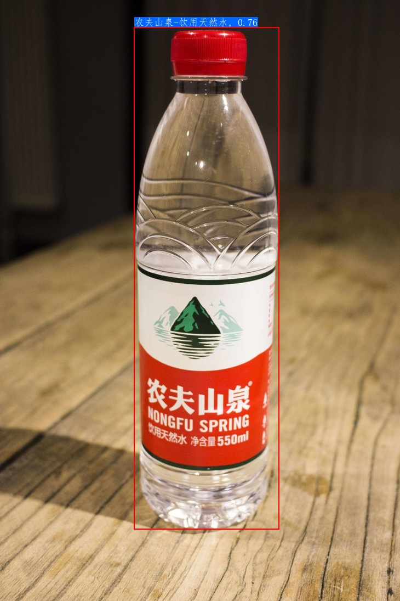
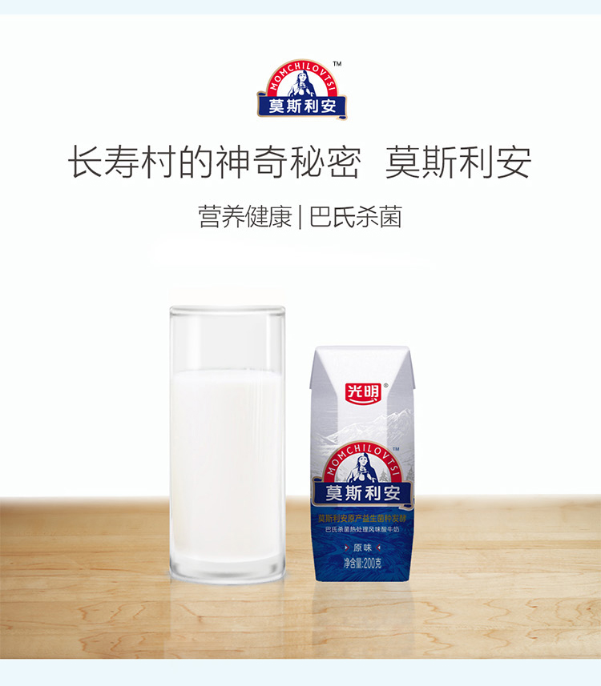
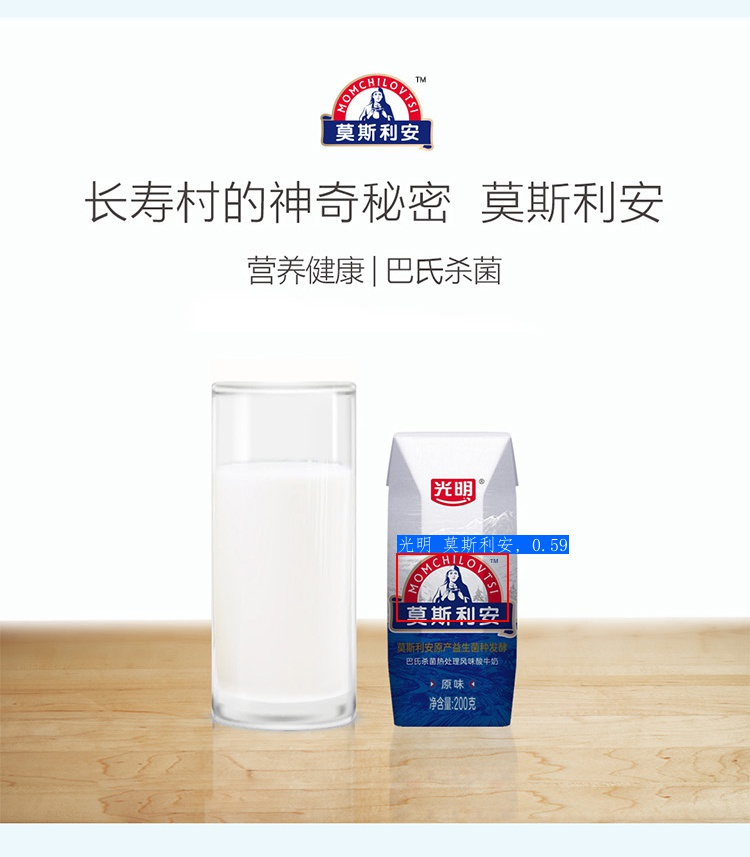

# 图像识别快速开始

本文档包含 3 个部分：环境配置、图像识别体验、未知类别的图像识别体验。

如果图像类别已经存在于图像索引库中，那么可以直接参考[图像识别体验](#图像识别体验)章节，完成图像识别过程；如果希望识别未知类别的图像，即图像类别之前不存在于索引库中，那么可以参考[未知类别的图像识别体验](#未知类别的图像识别体验)章节，完成建立索引并识别的过程。

## 目录

* [1. 环境配置](#环境配置)
* [2. 图像识别体验](#图像识别体验)
  * [2.1 下载、解压 inference 模型与 demo 数据](#2.1)
  * [2.2 瓶装饮料识别与检索](#瓶装饮料识别与检索)
    * [2.2.1 识别单张图像](#识别单张图像)
    * [2.2.2 基于文件夹的批量识别](#基于文件夹的批量识别)
* [3. 未知类别的图像识别体验](#未知类别的图像识别体验)
  * [3.1 准备新的数据与标签](#准备新的数据与标签)
  * [3.2 建立新的索引库](#建立新的索引库)
  * [3.3 基于新的索引库的图像识别](#基于新的索引库的图像识别)
* [4. 服务端识别模型列表](#4)

<a name="环境配置"></a>

## 1. 环境配置

* 安装：请先参考文档 [环境准备](../installation/install_paddleclas.md) 配置 PaddleClas 运行环境。

* 进入 `deploy` 运行目录。本部分所有内容与命令均需要在 `deploy` 目录下运行，可以通过下面的命令进入 `deploy` 目录。

  ```
  cd deploy
  ```

<a name="图像识别体验"></a>

## 2. 图像识别体验

轻量级通用主体检测模型与轻量级通用识别模型和配置文件下载方式如下表所示。

<a name="轻量级通用主体检测模型与轻量级通用识别模型"></a>

| 模型简介       | 推荐场景   | inference 模型  | 预测配置文件  |
| ------------  | ------------- | -------- | ------- |
| 轻量级通用主体检测模型 | 通用场景  |[tar 格式下载链接](https://paddle-imagenet-models-name.bj.bcebos.com/dygraph/rec/models/inference/picodet_PPLCNet_x2_5_mainbody_lite_v1.0_infer.tar) [zip 格式文件下载链接](https://paddle-imagenet-models-name.bj.bcebos.com/dygraph/rec/models/inference/picodet_PPLCNet_x2_5_mainbody_lite_v1.0_infer.zip) | - |
| 轻量级通用识别模型 | 通用场景  | [tar 格式下载链接](https://paddle-imagenet-models-name.bj.bcebos.com/dygraph/rec/models/inference/general_PPLCNet_x2_5_lite_v1.0_infer.tar) [zip 格式文件下载链接](https://paddle-imagenet-models-name.bj.bcebos.com/dygraph/rec/models/inference/general_PPLCNet_x2_5_lite_v1.0_infer.zip) | [inference_general.yaml](../../../deploy/configs/inference_general.yaml) |
| 轻量级通用识别二值模型 | 检索库很大， 存储受限场景  | [tar 格式下载链接](https://paddle-imagenet-models-name.bj.bcebos.com/dygraph/rec/models/inference/general_PPLCNet_x2_5_lite_binary_v1.0_infer.tar) [zip 格式文件下载链接](https://paddle-imagenet-models-name.bj.bcebos.com/dygraph/rec/models/inference/general_PPLCNet_x2_5_lite_binary_v1.0_infer.zip)| [inference_general_binary.yaml](../../../deploy/configs/inference_general_binary.yaml) |

注意：由于部分解压缩软件在解压上述 `tar` 格式文件时存在问题，建议非命令行用户下载 `zip` 格式文件并解压。`tar` 格式文件建议使用命令 `tar xf xxx.tar` 解压。

本章节 demo 数据下载地址如下: [瓶装饮料数据下载链接](https://paddle-imagenet-models-name.bj.bcebos.com/dygraph/rec/data/drink_dataset_v1.0.tar)。


如果希望体验服务端主体检测和各垂类方向的识别模型，可以参考[第4章](#4)。

**注意**

1. windows 环境下如果没有安装 wget, 可以按照下面的步骤安装 wget 与 tar 命令，也可以在下载模型时将链接复制到浏览器中下载，并解压放置在相应目录下； linux 或者 macOS 用户可以右键点击，然后复制下载链接，即可通过 `wget` 命令下载。
2. 如果 macOS 环境下没有安装 `wget` 命令，可以运行下面的命令进行安装。

```shell
# 安装 homebrew
ruby -e "$(curl -fsSL https://raw.githubusercontent.com/Homebrew/install/master/install)";
# 安装 wget
brew install wget
```

4. 如果希望在 windows 环境下安装 wget，可以参考：[链接](https://www.cnblogs.com/jeshy/p/10518062.html)；如果希望在 windows 环境中安装 tar 命令，可以参考：[链接](https://www.cnblogs.com/chooperman/p/14190107.html)。


* 可以按照下面的命令下载并解压数据与模型

```shell
mkdir models
cd models
# 下载识别 inference 模型并解压
wget {模型下载链接地址} && tar -xf {压缩包的名称}
cd ..

# 下载 demo 数据并解压
wget {数据下载链接地址} && tar -xf {压缩包的名称}
```

<a name="2.1"></a>

### 2.1 下载、解压 inference 模型与 demo 数据

下载 demo 数据集以及轻量级主体检测、识别模型，命令如下。

```shell
mkdir models
cd models
# 下载通用检测 inference 模型并解压
wget https://paddle-imagenet-models-name.bj.bcebos.com/dygraph/rec/models/inference/picodet_PPLCNet_x2_5_mainbody_lite_v1.0_infer.tar && tar -xf picodet_PPLCNet_x2_5_mainbody_lite_v1.0_infer.tar
# 下载识别 inference 模型并解压
wget https://paddle-imagenet-models-name.bj.bcebos.com/dygraph/rec/models/inference/general_PPLCNet_x2_5_lite_v1.0_infer.tar && tar -xf general_PPLCNet_x2_5_lite_v1.0_infer.tar

cd ../
# 下载 demo 数据并解压
wget https://paddle-imagenet-models-name.bj.bcebos.com/dygraph/rec/data/drink_dataset_v1.0.tar && tar -xf drink_dataset_v1.0.tar
```

解压完毕后，`drink_dataset_v1.0/` 文件夹下应有如下文件结构：

```
├── drink_dataset_v1.0/
│   ├── gallery/
│   ├── index/
│   ├── test_images/
├── ...
```

其中 `gallery` 文件夹中存放的是用于构建索引库的原始图像，`index` 表示基于原始图像构建得到的索引库信息，`test_images` 文件夹中存放的是用于测试识别效果的图像列表。


`models` 文件夹下应有如下文件结构：

```
├── general_PPLCNet_x2_5_lite_v1.0_infer
│   ├── inference.pdiparams
│   ├── inference.pdiparams.info
│   └── inference.pdmodel
├── picodet_PPLCNet_x2_5_mainbody_lite_v1.0_infer
│   ├── inference.pdiparams
│   ├── inference.pdiparams.info
│   └── inference.pdmodel
```

**注意**

如果使用服务端通用识别模型，Demo 数据需要重新提取特征、够建索引，方式如下：

```shell
# 下面是使用下载的服务端商品识别模型进行索引库构建
python3.7 python/build_gallery.py -c configs/inference_general.yaml -o Global.rec_inference_model_dir=./models/general_PPLCNet_x2_5_lite_v1.0_infer
```

<a name="瓶装饮料识别与检索"></a>

### 2.2 瓶装饮料识别与检索

以瓶装饮料识别 demo 为例，展示识别与检索过程（如果希望尝试其他方向的识别与检索效果，在下载解压好对应的 demo 数据与模型之后，替换对应的配置文件即可完成预测）。

注意，此部分使用了 `faiss` 作为检索库，安装方法如下：

```python
pip install faiss-cpu==1.7.1post2
```

若使用时，不能正常引用，则 `uninstall` 之后，重新 `install`，尤其是 windows 下。

<a name="识别单张图像"></a>

#### 2.2.1 识别单张图像

运行下面的命令，对图像 `./drink_dataset_v1.0/test_images/nongfu_spring.jpeg` 进行识别与检索

```shell
# 使用下面的命令使用 GPU 进行预测
python3.7 python/predict_system.py -c configs/inference_general.yaml
# 使用下面的命令使用 CPU 进行预测
python3.7 python/predict_system.py -c configs/inference_general.yaml -o Global.use_gpu=False
```

待检索图像如下所示。




最终输出结果如下。

```
[{'bbox': [244, 49, 509, 964], 'rec_docs': '农夫山泉-饮用天然水', 'rec_scores': 0.7585664}]
```

其中 `bbox` 表示检测出的主体所在位置，`rec_docs` 表示索引库中与检测框最为相似的类别，`rec_scores` 表示对应的置信度。

检测的可视化结果也保存在 `output` 文件夹下，对于本张图像，识别结果可视化如下所示。




<a name="基于文件夹的批量识别"></a>
#### 2.2.2 基于文件夹的批量识别

如果希望预测文件夹内的图像，可以直接修改配置文件中的 `Global.infer_imgs` 字段，也可以通过下面的 `-o` 参数修改对应的配置。

```shell
# 使用下面的命令使用 GPU 进行预测，如果希望使用 CPU 预测，可以在命令后面添加 -o Global.use_gpu=False
python3.7 python/predict_system.py -c configs/inference_general.yaml -o Global.infer_imgs="./drink_dataset_v1.0/test_images/"
```

终端中会输出该文件夹内所有图像的识别结果，如下所示。

```
...
[{'bbox': [345, 95, 524, 586], 'rec_docs': '红牛-强化型', 'rec_scores': 0.80164653}]
Inference: 23.43583106994629 ms per batch image
[{'bbox': [233, 0, 372, 436], 'rec_docs': '康师傅矿物质水', 'rec_scores': 0.72513914}]
Inference: 117.95639991760254 ms per batch image
[{'bbox': [138, 40, 573, 1198], 'rec_docs': '乐虎功能饮料', 'rec_scores': 0.7855944}]
Inference: 22.172927856445312 ms per batch image
[{'bbox': [328, 7, 467, 272], 'rec_docs': '脉动', 'rec_scores': 0.5829516}]
Inference: 118.08514595031738 ms per batch image
[{'bbox': [242, 82, 498, 726], 'rec_docs': '味全_每日C', 'rec_scores': 0.75581443}]
Inference: 150.06470680236816 ms per batch image
[{'bbox': [437, 71, 660, 728], 'rec_docs': '元气森林', 'rec_scores': 0.8478892}, {'bbox': [221, 72, 449, 701], 'rec_docs': '元气森林', 'rec_scores': 0.6790612}, {'bbox': [794, 104, 979, 652], 'rec_docs': '元气森林', 'rec_scores': 0.6292581}]
...
```

所有图像的识别结果可视化图像也保存在 `output` 文件夹内。


更多地，可以通过修改 `Global.rec_inference_model_dir` 字段来更改识别 inference 模型的路径，通过修改 `IndexProcess.index_dir` 字段来更改索引库索引的路径。

<a name="未知类别的图像识别体验"></a>

## 3. 未知类别的图像识别体验

对图像 `./drink_dataset_v1.0/test_images/mosilian.jpeg` 进行识别，命令如下

```shell
# 使用下面的命令使用 GPU 进行预测，如果希望使用 CPU 预测，可以在命令后面添加 -o Global.use_gpu=False
python3.7 python/predict_system.py -c configs/inference_general.yaml -o Global.infer_imgs="./drink_dataset_v1.0/test_images/mosilian.jpeg"
```

待检索图像如下所示。




输出结果为空。

由于默认的索引库中不包含对应的索引信息，所以这里的识别结果有误，此时我们可以通过构建新的索引库的方式，完成未知类别的图像识别。

当索引库中的图像无法覆盖我们实际识别的场景时，即在预测未知类别的图像时，我们需要将对应类别的相似图像添加到索引库中，从而完成对未知类别的图像识别，这一过程是不需要重新训练的。

<a name="准备新的数据与标签"></a>

### 3.1 准备新的数据与标签

首先需要将与待检索图像相似的图像列表拷贝到索引库原始图像的文件夹。这里 PaddleClas 已经将所有的图像数据都放在文件夹 `drink_dataset_v1.0/gallery/` 中。

然后需要编辑记录了图像路径和标签信息的文本文件，这里 PaddleClas 将更正后的标签信息文件放在了 `drink_dataset_v1.0/gallery/drink_label_all.txt` 文件中。可以与默认的 `drink_dataset_v1.0/gallery/drink_label.txt` 标签文件进行对比，添加了光明和三元系列牛奶的索引图像。


每一行的文本中，第一个字段表示图像的相对路径，第二个字段表示图像对应的标签信息，中间用 `\t` 键分隔开（注意：有些编辑器会将 `tab` 自动转换为 `空格`，这种情况下会导致文件解析报错）。

<a name="建立新的索引库"></a>

### 3.2 建立新的索引库

使用下面的命令构建 `index` 索引，加速识别后的检索过程。

```shell
python3.7 python/build_gallery.py -c configs/inference_general.yaml -o IndexProcess.data_file="./drink_dataset_v1.0/gallery/drink_label_all.txt" -o IndexProcess.index_dir="./drink_dataset_v1.0/index_all"
```

最终新的索引信息保存在文件夹 `./drink_dataset_v1.0/index_all` 中。具体 `yaml` 请参考[向量检索文档](../image_recognition_pipeline/vector_search.md)。

<a name="基于新的索引库的图像识别"></a>

### 3.3 基于新的索引库的图像识别

使用新的索引库，对上述图像进行识别，运行命令如下。

```shell
# 使用下面的命令使用 GPU 进行预测，如果希望使用 CPU 预测，可以在命令后面添加 -o Global.use_gpu=False
python3.7 python/predict_system.py -c configs/inference_general.yaml -o Global.infer_imgs="././drink_dataset_v1.0/test_images/mosilian.jpeg" -o IndexProcess.index_dir="./drink_dataset_v1.0/index_all"
```

输出结果如下。

```
[{'bbox': [396, 553, 508, 621], 'rec_docs': '光明_莫斯利安', 'rec_scores': 0.5921005}]
```

最终识别结果为`光明_莫斯利安`，识别正确，识别结果可视化如下所示。




<a name="4"></a>
## 4. 服务端识别模型列表

目前，我们更推荐您使用[轻量级通用主体检测模型与轻量级通用识别模型](#轻量级通用主体检测模型与轻量级通用识别模型)，以获得更好的测试结果。但是如果您希望体验服务端识别模型，服务器端通用主体检测模型与各方向识别模型、测试数据下载地址以及对应的配置文件地址如下。

| 模型简介       | 推荐场景   | inference 模型  | 预测配置文件  |
| ------------  | ------------- | -------- | ------- |
| 通用主体检测模型 | 通用场景  |[模型下载链接](https://paddle-imagenet-models-name.bj.bcebos.com/dygraph/rec/models/inference/ppyolov2_r50vd_dcn_mainbody_v1.0_infer.tar) | - |
| Logo 识别模型 | Logo 场景  | [模型下载链接](https://paddle-imagenet-models-name.bj.bcebos.com/dygraph/rec/models/inference/logo_rec_ResNet50_Logo3K_v1.0_infer.tar) | [inference_logo.yaml](../../../deploy/configs/inference_logo.yaml) |
| 动漫人物识别模型 | 动漫人物场景  | [模型下载链接](https://paddle-imagenet-models-name.bj.bcebos.com/dygraph/rec/models/inference/cartoon_rec_ResNet50_iCartoon_v1.0_infer.tar) | [inference_cartoon.yaml](../../../deploy/configs/inference_cartoon.yaml) |
| 车辆细分类模型 | 车辆场景  |  [模型下载链接](https://paddle-imagenet-models-name.bj.bcebos.com/dygraph/rec/models/inference/vehicle_cls_ResNet50_CompCars_v1.0_infer.tar) | [inference_vehicle.yaml](../../../deploy/configs/inference_vehicle.yaml) |
| 商品识别模型 | 商品场景  |  [模型下载链接](https://paddle-imagenet-models-name.bj.bcebos.com/dygraph/rec/models/inference/product_ResNet50_vd_aliproduct_v1.0_infer.tar) | [inference_product.yaml](../../../deploy/configs/inference_product.yaml) |
| 车辆 ReID 模型 | 车辆 ReID 场景 | [模型下载链接](https://paddle-imagenet-models-name.bj.bcebos.com/dygraph/rec/models/inference/vehicle_reid_ResNet50_VERIWild_v1.0_infer.tar) | [inference_vehicle.yaml](../../../deploy/configs/inference_vehicle.yaml) |

```shell
cd PaddleClas/deploy/
mkdir -p models
```

```shell
cd ./models
# 下载通用主体检测模型并解压
wget https://paddle-imagenet-models-name.bj.bcebos.com/dygraph/rec/models/inference/ppyolov2_r50vd_dcn_mainbody_v1.0_infer.tar && tar -xf ppyolov2_r50vd_dcn_mainbody_v1.0_infer.tar
# 下载识别模型并解压
wget {识别模型下载链接地址} && tar -xf {压缩包的名称}
```

使用如下命令下载各方向识别模型的测试数据：

```shell
# 回到 deploy 目录下
cd ..
# 下载测试数据并解压
wget https://paddle-imagenet-models-name.bj.bcebos.com/dygraph/rec/data/recognition_demo_data_en_v1.1.tar && tar -xf recognition_demo_data_en_v1.1.tar
```

解压完毕后，`recognition_demo_data_v1.1` 文件夹下应有如下文件结构：

```
├── recognition_demo_data_v1.1
│   ├── gallery_cartoon
│   ├── gallery_logo
│   ├── gallery_product
│   ├── gallery_vehicle
│   ├── test_cartoon
│   ├── test_logo
│   ├── test_product
│   └── test_vehicle
├── ...
```

按照上述步骤下载模型和测试数据后，您可以进行相关方向识别模型的测试。

* 更多关于主体检测的介绍可以参考：[主体检测教程文档](../image_recognition_pipeline/mainbody_detection.md)；关于特征提取的介绍可以参考：[特征提取教程文档](../image_recognition_pipeline/feature_extraction.md)；关于向量检索的介绍可以参考：[向量检索教程文档](../image_recognition_pipeline/vector_search.md)。
