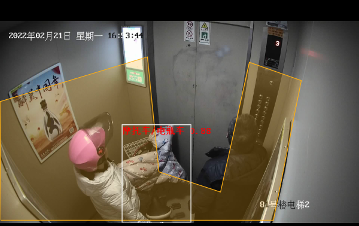

# 电梯内电瓶车入室检测

近年来，电瓶车进楼入户发生的火灾事故屡见不鲜，针对该现象推出了相应的电瓶车入室检测模型，旨在从源头减少这一情况的发生。  针对室内摩托车模型可能会发生的误报情况，采用了额外的图像检索方式实现更为精确的识别。  本案例使用了飞桨图像分类开发套件中的通用图像识别系统PP-ShiTu。

注:AI Studio在线运行代码请参考[电梯内电瓶车检测全流程](https://aistudio.baidu.com/aistudio/projectdetail/3497217?contributionType=1)