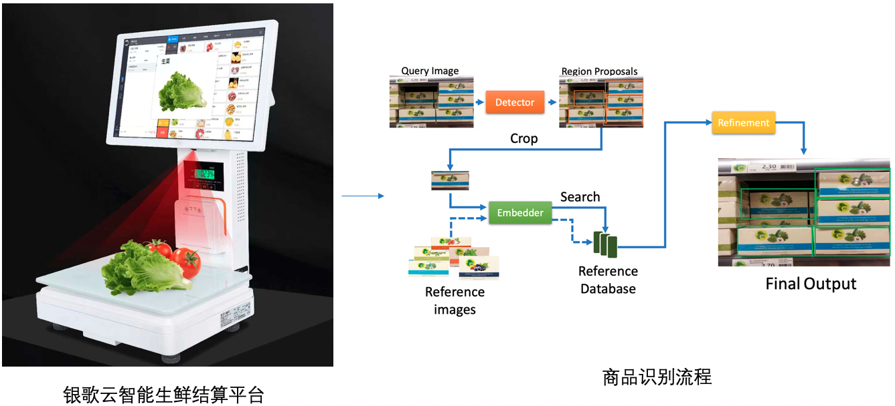

## 生鲜品自主结算

在超市等无人零售场景中，目前主要是结算方式，主要有以下几种

- 条形码方式
- RFID等射频码
- 称重方法

但是以上几种方法存在如下缺点： 1）针对条形码方式，对于成品包装的商品，较为成熟，但是对与生鲜产品等商品，并不能满足需求。 2）RFID等方式，虽然对生鲜等产品能够支持，但是额外生成标签，增加成本 3）称重方法，对于相同重量的山商品，不能很好的区分，同时重量称等精密仪器在长时间的负重和使用过程中，精度会发生变化，需要工作人员定期调教，以满足精度需求。

因此，如何选择一种既能大规模支持各种商品识别，又能方便管理，同时维护成本不高的识别系统，显得尤为重要。

深圳市银歌云技术有限公司基于飞桨的图像识别开发套件PaddleClas，提供了一套基于计算机视觉的完整生鲜品自主结算方案，其通过结算平台的摄像头拍摄的图像，自动的识别称上的商品，整个流程在1秒内完成，无需售卖人员的操作及称重。整个流程，实现了精度高、速度快，无需人工干预的自动结算效果。减少人工成本的同时，大大提高了效率和用户体验。

本案例使用了飞桨图像分类开发套件中的通用图像识别系统[PP-ShiTuV2](../../PPShiTu/PPShiTuV2_introduction.md)。

**注**: AI Studio在线运行代码请参考[生鲜品自主结算](https://aistudio.baidu.com/aistudio/projectdetail/4486158)

