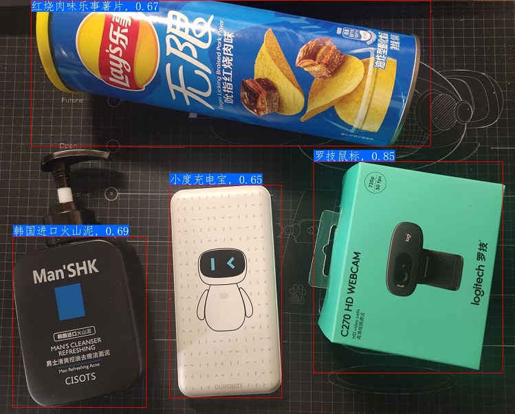

**商品识别**，即在智能零售场景下精准快速的识别商品类别、商品属性等。当下零售市场存在降低人力及运营成本、实现24小时不间断营业等需求，商品识别可以帮助越来越多的零售门店实现智慧零售数字化转型。在智慧零售概念火爆的今天，商品识别具有非常广阔的应用场景，如**货架陈列分析**、**智能结算**、**仓库管理**、**以图搜图**等。  

本案例使用了飞桨图像分类开发套件PaddleClas中的通用图像识别系统PP-ShiTu进行**商品识别**的实现。

**注**: AI Studio在线运行代码请参考[智慧商超商品识别系统](https://aistudio.baidu.com/aistudio/projectdetail/3460304)