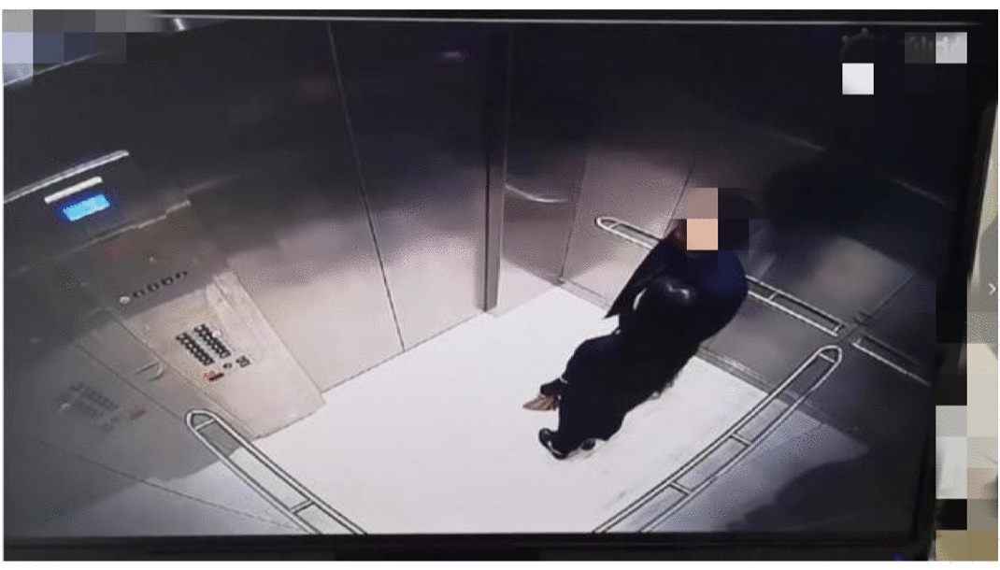

## 人员出入管理

近几年，AI视觉技术在安防、工业制造等场景在产业智能化升级进程中发挥着举足轻重的作用。【进出管控】作为各行业中的关键场景，应用需求十分迫切。 如在居家防盗、机房管控以及景区危险告警等场景中，存在大量对异常目标（人、车或其他物体）不经允许擅自进入规定区域的及时检测需求。利用深度学习视觉技术，可以及时准确地对闯入行为进行识别并发出告警信息。切实保障人员的生命财产安全。相比传统人力监管的方式，不仅可以实现7*24小时不间断的全方位保护，还能极大地降低管理成本，解放劳动力。

但在真实产业中，要实现高精度的人员进出识别不是一件容易的事，在实际场景中存在着各种各样的问题：

**摄像头采集到的图像会受到建筑、机器、车辆等遮挡的影响**

**天气多种多样，要适应白天、黑夜、雾天和雨天等**

针对上述场景，本次飞桨产业实践范例库推出了重点区域人员进出管控实践示例，提供从数据准备、技术方案、模型训练优化，到模型部署的全流程可复用方案，有效解决了不同光照、不同天气等室外复杂环境下的图像分类问题，并且极大地降低了数据标注和算力成本，适用于厂区巡检、家居防盗、景区管理等多个产业应用。

**注**: AI Studio在线运行代码请参考[人员出入管理](https://aistudio.baidu.com/aistudio/projectdetail/4094475)
