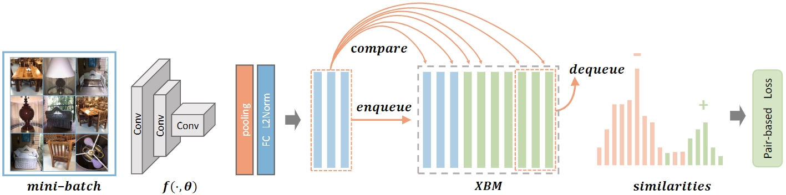

简体中文 | English(TODO)

# Cross-Batch Memory for Embedding Learning

论文出处：[Cross-Batch Memory for Embedding Learning](https://arxiv.org/pdf/1912.06798.pdf)

## 目录

- [1. 原理介绍](#1-原理介绍)
- [2. 精度指标](#2-精度指标)
- [3. 数据准备](#3-数据准备)
- [4. 模型训练](#4-模型训练)
- [5. 模型评估与推理部署](#5-模型评估与推理部署)
- [5.1 模型评估](#51-模型评估)
- [5.2 模型推理](#52-模型推理)
    - [5.2.1 推理模型准备](#521-推理模型准备)
    - [5.2.2 基于 Python 预测引擎推理](#522-基于-python-预测引擎推理)
    - [5.2.3 基于 C++ 预测引擎推理](#523-基于-c-预测引擎推理)
- [5.4 服务化部署](#54-服务化部署)
- [5.5 端侧部署](#55-端侧部署)
- [5.6 Paddle2ONNX 模型转换与预测](#56-paddle2onnx-模型转换与预测)
- [6. 总结](#6-总结)
    - [6.1 方法总结与对比](#61-方法总结与对比)
    - [6.2 使用建议/FAQ](#62-使用建议faq)
- [7. 参考资料](#7-参考资料)

## 1. 原理介绍

作者首先通过实验观察到 metric learning 方法学习到的特征在模型稳定后变化总是在一个可接受的范围内，因此提出了利用历史模型产生的特征来近似当前模型的特征，将这些历史特征按FIFO原则放入一个队列中，在一定程度上解耦了候选正负样本的数量与 mini-batch 大小的关系，且由于历史特征不记录梯度，开销相对较小，最终让informative样本的挖掘更加高效，解决了以往的 metric learning 方法只能利用 mini-batch 内部的样本的局限。



## 2. 精度指标

以下表格总结了复现的 Cross-Batch Memory for Embedding Learning 在 SOP 数据集上的精度指标，

| 配置文件 | recall@1(\%) | mAP(\%) | 参考recall@1(\%) | 参考mAP(\%) | 预训练模型下载地址 | inference模型下载地址 |
| -------- | ------------ | ------- | ---------------- | ----------- | ------------------ | --------------------- |
| xbm_resnet50.yaml | 81.0         | 61.9    | 80.6             | -           | [xbm_resnet50_pretrained.pdparams](https://paddle-imagenet-models-name.bj.bcebos.com/dygraph/metric_learning/xbm/xbm_resnet50_pretrained.pdparams)                  | [xbm_resnet50_infer.tar](https://paddle-imagenet-models-name.bj.bcebos.com/dygraph/metric_learning/xbm/xbm_resnet50_infer.tar)                     |

接下来主要以`xbm_resnet50.yaml`配置和训练好的模型文件为例，展示在 SOP 数据集上进行训练、测试、推理的过程。

## 3. 数据准备

下载 [Stanford Online Products (SOP)](https://aistudio.baidu.com/aistudio/datasetdetail/5103) 数据集，解压到 `PaddleClas/dataset/` 下，将文件夹重命名为 `SOP` ，并组织成以下文件结构：

  ```shell
  PaddleClas/dataset/
  └── SOP/
      ├── coffee_maker_final/    # coffee_maker_final类别图片文件夹
      ├── kettle_final/          # kettle_final类别图片文件夹
      ├── ...                    # ...类别图片文件夹
      ├── ...                    # ...类别图片文件夹
      ├── train_list.txt         # 训练集路径文件
      └── test_list.txt          # gallery(query)集路径文件
  ```

## 4. 模型训练

1. 执行以下命令开始训练

    单卡训练：
    ```shell
    python3.7 tools/train.py -c ./ppcls/configs/metric_learning/xbm_resnet50.yaml
    ```
    注：单卡训练大约需要4个小时。

2. 查看训练日志和保存的模型参数文件

    训练过程中会在屏幕上实时打印loss等指标信息，同时会保存日志文件`train.log`、模型参数文件`*.pdparams`、优化器参数文件`*.pdopt`等内容到`Global.output_dir`指定的文件夹下，默认在`PaddleClas/output/RecModel/`文件夹下。

## 5. 模型评估与推理部署

### 5.1 模型评估

准备用于评估的`*.pdparams`模型参数文件，可以使用训练好的模型，也可以使用[4. 模型训练](#4-模型训练)中保存的模型。

- 以训练过程中保存的`latest.pdparams`为例，执行如下命令即可进行评估。

  ```shell
  python3.7 tools/eval.py \
  -c ./ppcls/configs/metric_learning/xbm_resnet50.yaml \
  -o Global.pretrained_model="./output/RecModel/latest"
  ```

- 以训练好的模型为例，下载 [xbm_resnet50_pretrained.pdparams](https://paddle-imagenet-models-name.bj.bcebos.com/dygraph/metric_learning/xbm/xbm_resnet50_pretrained.pdparams) 到 `PaddleClas/pretrained_models` 文件夹中，执行如下命令即可进行评估。

  ```shell
  # 下载模型
  cd PaddleClas
  mkdir pretrained_models
  cd pretrained_models
  wget https://paddle-imagenet-models-name.bj.bcebos.com/dygraph/metric_learning/xbm/xbm_resnet50_pretrained.pdparams
  cd ..
  # 评估
  python3.7 tools/eval.py \
  -c ./ppcls/configs/metric_learning/xbm_resnet50.yaml \
  -o Global.pretrained_model="pretrained_models/xbm_resnet50_pretrained"
  ```
  注：`pretrained_model` 后填入的地址不需要加 `.pdparams` 后缀，在程序运行时会自动补上。

- 查看输出结果
  ```log
  ...
  ...
  ppcls INFO: query feature calculation process: [0/237]
  ppcls INFO: query feature calculation process: [20/237]
  ppcls INFO: query feature calculation process: [40/237]
  ppcls INFO: query feature calculation process: [60/237]
  ppcls INFO: query feature calculation process: [80/237]
  ppcls INFO: query feature calculation process: [100/237]
  ppcls INFO: query feature calculation process: [120/237]
  ppcls INFO: query feature calculation process: [140/237]
  ppcls INFO: query feature calculation process: [160/237]
  ppcls INFO: query feature calculation process: [180/237]
  ppcls INFO: query feature calculation process: [200/237]
  ppcls INFO: query feature calculation process: [220/237]
  ppcls INFO: Build query done, all feat shape: [60502, 128], begin to eval..
  ppcls INFO: re_ranking=False
  ppcls INFO: [Eval][Epoch 0][Avg]recall1: 0.81083, recall5: 0.89263, mAP: 0.62097
  ```
  默认评估日志保存在`PaddleClas/output/RecModel/eval.log`中，可以看到我们提供的 `xbm_pretrained.pdparams` 模型在 SOP 数据集上的评估指标为recall@1=0.81083，recall@5=0.89263，mAP=0.62097

- 使用re-ranking功能提升评估精度

  可参考 [ReID #41-模型评估](../../algorithm_introduction/ReID.md) 文档的re-ranking使用方法。

  **注**：目前re-ranking的计算复杂度较高，因此默认不启用。

### 5.2 模型推理

#### 5.2.1 推理模型准备

可以将训练过程中保存的模型文件转换成 inference 模型并推理，或者使用我们提供的转换好的 inference 模型直接进行推理
  - 将训练过程中保存的模型文件转换成 inference 模型，同样以 `latest.pdparams` 为例，执行以下命令进行转换
    ```shell
    python3.7 tools/export_model.py \
    -c ./ppcls/configs/metric_learning/xbm_resnet50.yaml \
    -o Global.pretrained_model="output/RecModel/latest" \
    -o Global.save_inference_dir="./deploy/xbm_resnet50_infer"
    ```

  - 或者下载并解压我们提供的 inference 模型
    ```shell
    cd ./deploy
    wget https://paddle-imagenet-models-name.bj.bcebos.com/dygraph/metric_learning/xbm/xbm_resnet50_infer.tar
    tar -xf xbm_resnet50_infer.tar
    cd ../
    ```

#### 5.2.2 基于 Python 预测引擎推理

  1. 修改 `PaddleClas/deploy/configs/inference_rec.yaml`
      - 将 `infer_imgs:` 后的路径段改为 SOP 中 query 文件夹下的任意一张图片路径（下方配置使用的是`111085122871_0.jpg`图片的路径）
      - 将 `rec_inference_model_dir:` 后的字段改为解压出来的 xbm_resnet50_infer 文件夹路径
      - 将 `transform_ops:` 字段下的预处理配置改为 `xbm_resnet50.yaml` 中`Eval.Query.dataset` 下的预处理配置

      ```yaml
      Global:
        infer_imgs: "../dataset/SOP/bicycle_final/111085122871_0.JPG"
        rec_inference_model_dir: "./xbm_resnet50_infer"
        batch_size: 1
        use_gpu: False
        enable_mkldnn: True
        cpu_num_threads: 10
        enable_benchmark: False
        use_fp16: False
        ir_optim: True
        use_tensorrt: False
        gpu_mem: 8000
        enable_profile: False

      RecPreProcess:
        transform_ops:
          - Resize:
              size: 256
          - CenterCrop:
              size: 224
          - ToTensor:
          - Normalize:
              mean: [0.485, 0.456, 0.406]
              std: [0.229, 0.224, 0.225]

      RecPostProcess: null
      ```

  2. 执行推理命令

       ```shell
       cd ./deploy/
       python3.7 python/predict_rec.py -c ./configs/inference_rec.yaml
       ```

  3. 查看输出结果，实际结果为一个长度2048的向量，表示输入图片经过模型转换后得到的特征向量

       ```log
       111085122871_0.JPG:        [ 0.02560742  0.05221584  ...  0.11635944 -0.18817757
       0.07170864]
       ```
        推理时的输出向量储存在[predict_rec.py](../../../../deploy/python/predict_rec.py#L131)的 `result_dict` 变量中。

  4. 批量预测，将配置文件中`infer_imgs:`后的路径改为为文件夹即可，如`../dataset/SOP/bicycle_final`，会预测并逐个输出query下所有图片的特征向量。

#### 5.2.3 基于 C++ 预测引擎推理

PaddleClas 提供了基于 C++ 预测引擎推理的示例，您可以参考[服务器端 C++ 预测](../../deployment/image_classification/cpp/linux.md)来完成相应的推理部署。如果您使用的是 Windows 平台，可以参考基于 Visual Studio 2019 Community CMake 编译指南完成相应的预测库编译和模型预测工作。

### 5.4 服务化部署

Paddle Serving 提供高性能、灵活易用的工业级在线推理服务。Paddle Serving 支持 RESTful、gRPC、bRPC 等多种协议，提供多种异构硬件和多种操作系统环境下推理解决方案。更多关于Paddle Serving 的介绍，可以参考Paddle Serving 代码仓库。

PaddleClas 提供了基于 Paddle Serving 来完成模型服务化部署的示例，您可以参考[模型服务化部署](../../deployment/PP-ShiTu/paddle_serving.md)来完成相应的部署工作。

### 5.5 端侧部署

Paddle Lite 是一个高性能、轻量级、灵活性强且易于扩展的深度学习推理框架，定位于支持包括移动端、嵌入式以及服务器端在内的多硬件平台。更多关于 Paddle Lite 的介绍，可以参考Paddle Lite 代码仓库。

PaddleClas 提供了基于 Paddle Lite 来完成模型端侧部署的示例，您可以参考[端侧部署](../../deployment/image_classification/paddle_lite.md)来完成相应的部署工作。

### 5.6 Paddle2ONNX 模型转换与预测

Paddle2ONNX 支持将 PaddlePaddle 模型格式转化到 ONNX 模型格式。通过 ONNX 可以完成将 Paddle 模型到多种推理引擎的部署，包括TensorRT/OpenVINO/MNN/TNN/NCNN，以及其它对 ONNX 开源格式进行支持的推理引擎或硬件。更多关于 Paddle2ONNX 的介绍，可以参考Paddle2ONNX 代码仓库。

PaddleClas 提供了基于 Paddle2ONNX 来完成 inference 模型转换 ONNX 模型并作推理预测的示例，您可以参考[Paddle2ONNX 模型转换与预测](../../deployment/image_classification/paddle2onnx.md)来完成相应的部署工作。

### 6. 总结

#### 6.1 方法总结与对比

上述算法能快速地迁移至多数的检索模型中，能进一步提升检索模型的性能，

#### 6.2 使用建议/FAQ

SOP 数据集比较小，可以尝试训练多次取最高精度。

### 7. 参考资料

1. [Cross-Batch Memory for Embedding Learning](https://arxiv.org/pdf/1912.06798.pdf)
