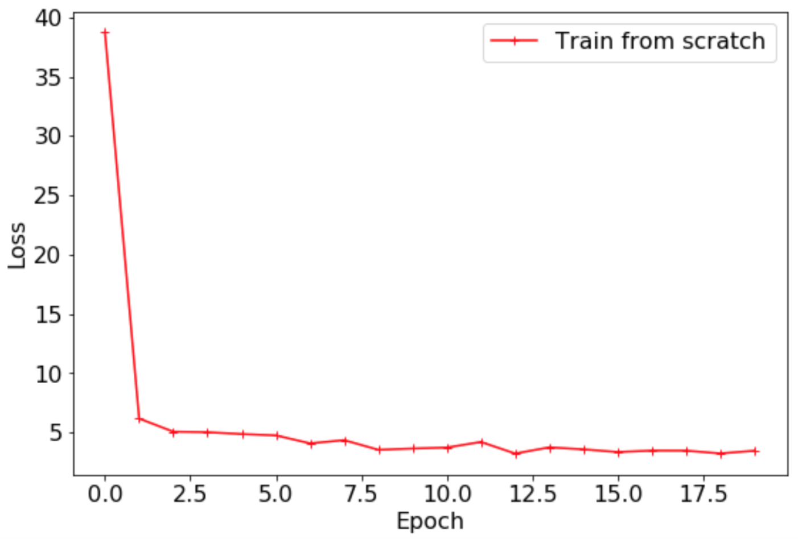
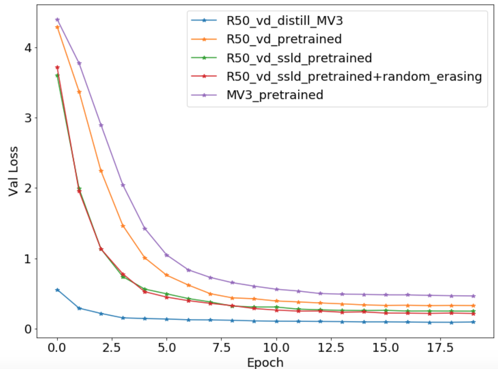

# 30min玩转PaddleClas

请事先参考[安装指南](install.md)配置运行环境


## 一、代码和数据准备

* 克隆代码到本地并进入PaddleClas目录。

```
git clone https://github.com/PaddlePaddle/PaddleClas.git
cd PaddleClas
```

* 进入`dataset/flowers102`目录，下载并解压flowers102数据集.

```shell
cd dataset/flowers102
wget https://www.robots.ox.ac.uk/~vgg/data/flowers/102/102flowers.tgz
wget https://www.robots.ox.ac.uk/~vgg/data/flowers/102/imagelabels.mat
wget https://www.robots.ox.ac.uk/~vgg/data/flowers/102/setid.ma
tar -xf 102flowers.tgz
```

* 制作train/val/test list

```shell
python generate_flowers102_list.py jpg train > train_list.txt
python generate_flowers102_list.py jpg valid > val_list.txt
python generate_flowers102_list.py jpg test > test_list.txt
cat train_list.txt test_list.txt > train_test.txt
```

**注意**：这里将train_list.txt和test_list.txt合并成train_test.txt，是为了之后在进行知识蒸馏时，使用更多的数据提升无标签知识蒸馏任务的效果。


* 返回`PaddleClas`根目录

```
cd ../../
```

## 二、环境准备

### 2.1 设置PYTHONPATH环境变量

```bash
export PYTHONPATH=path_to_PaddleClas:$PYTHONPATH
```

### 2.2 环境说明

* 为了保证对比的公平性，下面所有的训练过程均在`单卡V100`机器上实现。


## 三、模型训练


### 3.1 零基础训练：不加载预训练模型的训练

* 基于ResNet50_vd模型，训练脚本如下所示。

```shell
export CUDA_VISIBLE_DEVICES=0
python -m paddle.distributed.launch \  
    --selected_gpus="0" \  
    --log_dir=log_train \  
    tools/train.py \  
        -c ./configs/quick_start/ResNet50_vd.yaml

```

最终`Loss`曲线如下所示。



`Top1 Acc`曲线如下所示。


### 3.2 基于精度为79.12\%的ImageNet预训练模型微调


```shell
export CUDA_VISIBLE_DEVICES=0
python -m paddle.distributed.launch \  
    --selected_gpus="0" \  
    --log_dir=log_train \  
    tools/train.py \  
        -c ./configs/quick_start/ResNet50_vd.yaml

```

最终`Loss`曲线如下所示。


`Top1 Acc`曲线如下所示。


### 3.3 基于精度82.39\%的ImageNet预训练模型微调


需要注意的是，在使用通过知识蒸馏得到的预训练模型进行微调时，我们推荐使用相对较小的网络中间层学习率。


```yaml
ARCHITECTURE:
    name: 'ResNet50_vd'
    params:
        lr_mult_list: [0.1, 0.1, 0.2, 0.2, 0.3]
pretrained_model: "./pretrained/ResNet50_vd_ssld_pretrained"
```


最终的训练脚本所示。
```shell
export CUDA_VISIBLE_DEVICES=0
python -m paddle.distributed.launch \  
    --selected_gpus="0" \  
    --log_dir=log_train \  
    tools/train.py \  
        -c ./configs/quick_start/ResNet50_vd_ssld_finetune.yaml
```

### 3.4 使用ResNet50_vd蒸馏MobileNetV3

* 使用flowers102数据集进行模型蒸馏，为了进一步提提升模型的精度，使用test_list.txt充当无标签数据，在这里有三点需要注意：
    * `test_list.txt`与`val_list.txt`的样本没有重复。
    * 即使引入了有标签的test_list.txt中的测试集图像，但是代码中没有使用标签信息，因此仍然可以视为无标签的模型蒸馏。
    * 蒸馏过程中，教师模型使用的预训练模型为flowers102数据集上的训练结果，学生模型使用的是ImageNet1k数据集上精度为75.32\%的MobileNetV3_large_x1_0预训练模型。

* 首先需要保存之前训练得到的ResNet50_vd预训练模型到合适的位置，作教师模型的预训练。

脚本如下所示。

```shell
cp -r output/ResNet50_vd/19/  ./pretrained/flowers102_R50_vd_final/
```


配置文件中数据数量、模型结构、预训练地址以及训练的数据配置如下：

```yaml
total_images: 7169
ARCHITECTURE:
    name: 'ResNet50_vd_distill_MobileNetV3_large_x1_0'
pretrained_model:
    - "./pretrained/flowers102_R50_vd_final/ppcls"
    - "./pretrained/MobileNetV3_large_x1_0_pretrained/”
TRAIN:
    file_list: "./dataset/flowers102/train_test_list.txt"
```

最终的训练脚本如下所示。

```shell
export CUDA_VISIBLE_DEVICES=0
python -m paddle.distributed.launch \  
    --selected_gpus="0" \  
    --log_dir=log_train \  
    tools/train.py \  
        -c ./configs/quick_start/R50_vd_distill_MV3_large_x1_0.yaml

```


### 3.5 其他模型

* 如果希望尝试更多的模型结构，可以很方便地修改模型名称，下面给出了使用MobileNetV3模型训练的命令。

```shell
export CUDA_VISIBLE_DEVICES=0
python -m paddle.distributed.launch \  
    --selected_gpus="0" \  
    --log_dir=log_train \  
    tools/train.py \  
        -c ./configs/quick_start/MobileNetV3_large_x1_0_finetune.yaml

```

* 如果希望尝试增广方式，可以通过以下命令提供体验RandomErasing数据增广的训练效果。

```shell
export CUDA_VISIBLE_DEVICES=0
python -m paddle.distributed.launch \  
    --selected_gpus="0" \  
    --log_dir=log_train \  
    tools/train.py \  
        -c ./configs/quick_start/ResNet50_vd_ssld_random_erasing_finetune.yaml
```


### 3.6 精度一览

* 下表给出了不同训练yaml文件对应的精度。

|配置文件 | Top1 Acc |
|- |:-: |
| ResNet50_vd.yaml | 0.2735 |
| MobileNetV3_large_x1_0_finetune.yaml | 0.9000 |
| ResNet50_vd_finetune.yaml | 0.9402 |
| ResNet50_vd_ssld_finetune.yaml | 0.9500 |
| ResNet50_vd_ssld_random_erasing_finetune.yaml | 0.9627 |
| R50_vd_distill_MV3_large_x1_0.yaml | 0.9647 |


下图给出了不同配置文件的`Loss`与`Top1 Acc`的精度对比。




`Top1 Acc`曲线如下所示。


### 3.7 总结

* 对于新数据集，更推荐通过加载预训练模型进行微调的方式进行训练，以在新的数据集上获得更高的精度，减少收敛时间。
* 预训练模型
* 不同模型结构的网络在相同数据集上的性能表现不同，需要根据预测耗时以及存储的需求选择合适的模型。
* 数据增广在小数据集的训练中可以进一步提升模型精度。PaddleClas中也提供了8种数据增广方式，您也开业
* 无标签数据的知识蒸馏可以大幅提升学生模型的精度，甚至超越教师模型。
