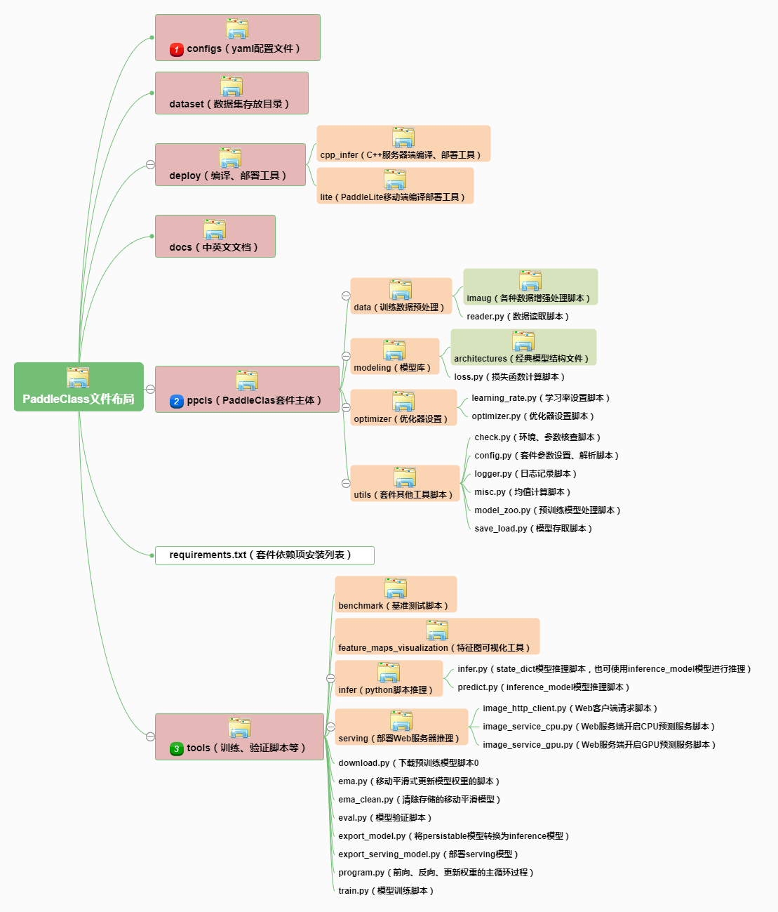

# 主要思路

* 整体代码结构
* 如果要提交代码，需要遵循哪些规范
* 使用的过程中可能会遇到的一些问题

# 30分钟玩转PaddleClas（社区版）

## 1. 整体代码结构解析

### 1.1 前言

有用户对PaddleClas的代码做了非常详细的解读，可以参考下面的三篇文档。本部分内容大部分也是来自该系列文档，在此感谢[FutureSI](https://aistudio.baidu.com/aistudio/personalcenter/thirdview/76563)的贡献与解读。

* [PaddleClas 分类套件源码解析（一）](https://aistudio.baidu.com/aistudio/projectdetail/1308952)
* [PaddleClas 分类套件源码解析（二）](https://aistudio.baidu.com/aistudio/projectdetail/1315501)
* [PaddleClas 分类套件源码解析（三）](https://aistudio.baidu.com/aistudio/projectdetail/1339544)

### 1.2 代码解析

#### 1.2.1 整体代码和目录概览

* PaddleClas主要代码和目录结构如下

* configs 文件夹下存放训练脚本和验证脚本的yaml配置文件，文件按模型类别存放。
* dataset 文件夹下存放数据集和预处理训练数据的脚本。脚本负责将数据集处理为适合Dataloader处理的格式。
* docs 文件夹下存放中英文文档。
* deploy 文件夹存放的是编译、部署工具，支持 Cpp inference、Hub Serveing、Paddle Lite、Slim量化等多种部署方式。
* ppcls 文件夹下存放PaddleClas框架主体。模型结构脚本、数据增强脚本、优化脚本等DL程序的标准流程代码都在这里。
* tools 文件夹下存放用于模型下载、训练、预测的脚本。
* requirements.txt 文件用于安装 PaddleClas 的依赖项。使用pip进行升级安装使用。

#### 1.2.2 训练模块定义

深度学习模型训练过程中，主要包含以下几个核心模块。

* 数据：对于有监督任务来说，训练数据一般包含原始数据及其标注。在图像分类任务中，原始数据指的是图像数据，而标注则是该图像数据所属的类别。在代码`ppcls/data/reader.py`中包含了数据

数据部分，包含数据预处理、后处理等，

* 网络结构
* 优化器
* 学习率衰减策略
* 权重衰减策略
* 训练时评估与模型存储

### 其他部分

## 2. 如何贡献代码

### 2.1 代码模块修改

### 2.2 提交代码的规范与流程

## 3. 开发过程中遇到的一些问题

* 常见问题

* 数据检查

* 模型调优

* 模型预测

* 模型融合

* tensorRT加速

* 其他
