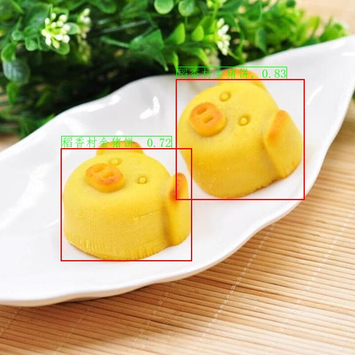

# 图像识别快速开始

本文档包含3个部分：环境配置、图像识别体验、未知类别的图像识别体验。

如果图像类别已经存在于图像索引库中，那么可以直接参考[图像识别体验](#图像识别体验)章节，完成图像识别过程；如果希望识别未知类别的图像，即图像类别之前不存在于索引库中，那么可以参考[未知类别的图像识别体验](#未知类别的图像识别体验)章节，完成建立索引并识别的过程。

## 目录

* [1. 环境配置](#环境配置)
* [2. 图像识别体验](#图像识别体验)
  * [2.1 下载、解压inference 模型与demo数据](#下载、解压inference_模型与demo数据)
  * [2.2 商品别与检索](#商品识别与检索)
    * [2.2.1 识别单张图像](#识别单张图像)
    * [2.2.2 基于文件夹的批量识别](#基于文件夹的批量识别)
* [3. 未知类别的图像识别体验](#未知类别的图像识别体验)
  * [3.1 准备新的数据与标签](#准备新的数据与标签)
  * [3.2 建立新的索引库](#建立新的索引库)
  * [3.3 基于新的索引库的图像识别](#基于新的索引库的图像识别)


<a name="环境配置"></a>
## 1. 环境配置

* 安装：请先参考[快速安装](./install.md)配置PaddleClas运行环境。

* 进入`deploy`运行目录。本部分所有内容与命令均需要在`deploy`目录下运行，可以通过下面的命令进入`deploy`目录。

  ```
  cd deploy
  ```

<a name="图像识别体验"></a>
## 2. 图像识别体验

检测模型与4个方向(Logo、动漫人物、车辆、商品)的识别inference模型、测试数据下载地址以及对应的配置文件地址如下。

服务器端通用主体检测模型与各方向识别模型：

| 模型简介       | 推荐场景   | inference模型  | 预测配置文件  | 构建索引库的配置文件 |
| ------------  | ------------- | -------- | ------- | -------- |
| 通用主体检测模型 | 通用场景  |[模型下载链接](https://paddle-imagenet-models-name.bj.bcebos.com/dygraph/rec/models/inference/ppyolov2_r50vd_dcn_mainbody_v1.0_infer.tar) | - | - |
| Logo识别模型 | Logo场景  | [模型下载链接](https://paddle-imagenet-models-name.bj.bcebos.com/dygraph/rec/models/inference/logo_rec_ResNet50_Logo3K_v1.0_infer.tar) | [inference_logo.yaml](../../../deploy/configs/inference_logo.yaml) | [build_logo.yaml](../../../deploy/configs/build_logo.yaml) |
| 动漫人物识别模型 | 动漫人物场景  | [模型下载链接](https://paddle-imagenet-models-name.bj.bcebos.com/dygraph/rec/models/inference/cartoon_rec_ResNet50_iCartoon_v1.0_infer.tar) | [inference_cartoon.yaml](../../../deploy/configs/inference_cartoon.yaml) | [build_cartoon.yaml](../../../deploy/configs/build_cartoon.yaml) |
| 车辆细分类模型 | 车辆场景  |  [模型下载链接](https://paddle-imagenet-models-name.bj.bcebos.com/dygraph/rec/models/inference/vehicle_cls_ResNet50_CompCars_v1.0_infer.tar) | [inference_vehicle.yaml](../../../deploy/configs/inference_vehicle.yaml) | [build_vehicle.yaml](../../../deploy/configs/build_vehicle.yaml) |
| 商品识别模型 | 商品场景  |  [模型下载链接](https://paddle-imagenet-models-name.bj.bcebos.com/dygraph/rec/models/inference/product_ResNet50_vd_aliproduct_v1.0_infer.tar) | [inference_product.yaml](../../../deploy/configs/inference_product.yaml) | [build_product.yaml](../../../deploy/configs/build_product.yaml) |
| 车辆ReID模型 | 车辆ReID场景 | [模型下载链接](https://paddle-imagenet-models-name.bj.bcebos.com/dygraph/rec/models/inference/vehicle_reid_ResNet50_VERIWild_v1.0_infer.tar) | - | - |

轻量级通用主体检测模型与轻量级通用识别模型：

| 模型简介       | 推荐场景   | inference模型  | 预测配置文件  | 构建索引库的配置文件 |
| ------------  | ------------- | -------- | ------- | -------- |
| 轻量级通用主体检测模型 | 通用场景  |[模型下载链接](https://paddle-imagenet-models-name.bj.bcebos.com/dygraph/rec/models/inference/picodet_PPLCNet_x2_5_mainbody_lite_v1.0_infer.tar) | - | - |
| 轻量级通用识别模型 | 通用场景  | [模型下载链接](https://paddle-imagenet-models-name.bj.bcebos.com/dygraph/rec/models/inference/general_PPLCNet_x2_5_lite_v1.0_infer.tar) | [inference_product.yaml](../../../deploy/configs/inference_product.yaml) | [build_product.yaml](../../../deploy/configs/build_product.yaml) |

本章节demo数据下载地址如下: [数据下载链接](https://paddle-imagenet-models-name.bj.bcebos.com/dygraph/rec/data/recognition_demo_data_v1.1.tar)。

**注意**

1. windows 环境下如果没有安装wget,可以按照下面的步骤安装wget与tar命令，也可以在，下载模型时将链接复制到浏览器中下载，并解压放置在相应目录下；linux或者macOS用户可以右键点击，然后复制下载链接，即可通过`wget`命令下载。
2. 如果macOS环境下没有安装`wget`命令，可以运行下面的命令进行安装。
3. 轻量级通用识别模型的预测配置文件和构建索引的配置文件目前使用的是服务器端商品识别模型的配置，您可以自行修改模型的路径完成相应的索引构建和识别预测。

```shell
# 安装 homebrew
ruby -e "$(curl -fsSL https://raw.githubusercontent.com/Homebrew/install/master/install)";
# 安装wget
brew install wget
```

3. 如果希望在windows环境下安装wget，可以参考：[链接](https://www.cnblogs.com/jeshy/p/10518062.html)；如果希望在windows环境中安装tar命令，可以参考：[链接](https://www.cnblogs.com/chooperman/p/14190107.html)。


* 可以按照下面的命令下载并解压数据与模型

```shell
mkdir models
cd models
# 下载识别inference模型并解压
wget {模型下载链接地址} && tar -xf {压缩包的名称}
cd ..

# 下载demo数据并解压
wget {数据下载链接地址} && tar -xf {压缩包的名称}
```

<a name="下载、解压inference_模型与demo数据"></a>

### 2.1 下载、解压inference 模型与demo数据

以商品识别为例，下载demo数据集以及通用检测、识别模型，命令如下。

```shell
mkdir models
cd models
# 下载通用检测inference模型并解压
wget https://paddle-imagenet-models-name.bj.bcebos.com/dygraph/rec/models/inference/ppyolov2_r50vd_dcn_mainbody_v1.0_infer.tar && tar -xf ppyolov2_r50vd_dcn_mainbody_v1.0_infer.tar
# 下载识别inference模型并解压
wget https://paddle-imagenet-models-name.bj.bcebos.com/dygraph/rec/models/inference/product_ResNet50_vd_aliproduct_v1.0_infer.tar && tar -xf product_ResNet50_vd_aliproduct_v1.0_infer.tar

cd ../
# 下载demo数据并解压
wget https://paddle-imagenet-models-name.bj.bcebos.com/dygraph/rec/data/recognition_demo_data_v1.1.tar && tar -xf recognition_demo_data_v1.1.tar
```

解压完毕后，`recognition_demo_data_v1.1`文件夹下应有如下文件结构：

```
├── recognition_demo_data_v1.1
│   ├── gallery_cartoon
│   ├── gallery_logo
│   ├── gallery_product
│   ├── gallery_vehicle
│   ├── test_cartoon
│   ├── test_logo
│   ├── test_product
│   └── test_vehicle
├── ...
```

其中`gallery_xxx`文件夹中存放的是用于构建索引库的原始图像，`test_xxx`文件夹中存放的是用于测试识别效果的图像列表。


`models`文件夹下应有如下文件结构：

```
├── product_ResNet50_vd_aliproduct_v1.0_infer
│   ├── inference.pdiparams
│   ├── inference.pdiparams.info
│   └── inference.pdmodel
├── ppyolov2_r50vd_dcn_mainbody_v1.0_infer
│   ├── inference.pdiparams
│   ├── inference.pdiparams.info
│   └── inference.pdmodel
```

**注意**
如果使用轻量级通用识别模型，Demo数据需要重新提取特征、够建索引，方式如下：

```shell
python3.7 python/build_gallery.py -c configs/build_product.yaml -o Global.rec_inference_model_dir=./models/general_PPLCNet_x2_5_lite_v1.0_infer
```

<a name="商品识别与检索"></a>
### 2.2 商品识别与检索

以商品识别demo为例，展示识别与检索过程（如果希望尝试其他方向的识别与检索效果，在下载解压好对应的demo数据与模型之后，替换对应的配置文件即可完成预测）。

注意，此部分使用了`faiss`作为检索库，安装方法如下：

```python
pip install faiss-cpu==1.7.1post2
```

若使用时，不能正常引用，则`uninstall` 之后，重新`install`，尤其是windows下。

<a name="识别单张图像"></a>

#### 2.2.1 识别单张图像

运行下面的命令，对图像`./recognition_demo_data_v1.1/test_product/daoxiangcunjinzhubing_6.jpg`进行识别与检索

```shell
# 使用下面的命令使用GPU进行预测
python3.7 python/predict_system.py -c configs/inference_product.yaml
# 使用下面的命令使用CPU进行预测
python3.7 python/predict_system.py -c configs/inference_product.yaml -o Global.use_gpu=False
```

待检索图像如下所示。

<div align="center">

</div>


最终输出结果如下。

```
[{'bbox': [287, 129, 497, 326], 'rec_docs': '稻香村金猪饼', 'rec_scores': 0.8309420943260193}, {'bbox': [99, 242, 313, 426], 'rec_docs': '稻香村金猪饼', 'rec_scores': 0.7245652079582214}]
```

其中bbox表示检测出的主体所在位置，rec_docs表示索引库中与检测框最为相似的类别，rec_scores表示对应的置信度。

检测的可视化结果也保存在`output`文件夹下，对于本张图像，识别结果可视化如下所示。

<div align="center">

</div>


<a name="基于文件夹的批量识别"></a>
#### 2.2.2 基于文件夹的批量识别

如果希望预测文件夹内的图像，可以直接修改配置文件中的`Global.infer_imgs`字段，也可以通过下面的`-o`参数修改对应的配置。

```shell
# 使用下面的命令使用GPU进行预测，如果希望使用CPU预测，可以在命令后面添加-o Global.use_gpu=False
python3.7 python/predict_system.py -c configs/inference_product.yaml -o Global.infer_imgs="./recognition_demo_data_v1.1/test_product/"
```

终端中会输出该文件夹内所有图像的识别结果，如下所示。

```
...
[{'bbox': [37, 29, 123, 89], 'rec_docs': '香奈儿包', 'rec_scores': 0.6163763999938965}, {'bbox': [153, 96, 235, 175], 'rec_docs': '香奈儿包', 'rec_scores': 0.5279821157455444}]
[{'bbox': [735, 562, 1133, 851], 'rec_docs': '香奈儿包', 'rec_scores': 0.5588355660438538}]
[{'bbox': [124, 50, 230, 129], 'rec_docs': '香奈儿包', 'rec_scores': 0.6980369687080383}]
[{'bbox': [0, 0, 275, 183], 'rec_docs': '香奈儿包', 'rec_scores': 0.5818190574645996}]
[{'bbox': [400, 1179, 905, 1537], 'rec_docs': '香奈儿包', 'rec_scores': 0.9814301133155823}]
[{'bbox': [544, 4, 1482, 932], 'rec_docs': '香奈儿包', 'rec_scores': 0.5143815279006958}]
[{'bbox': [29, 42, 194, 183], 'rec_docs': '香奈儿包', 'rec_scores': 0.9543638229370117}]
...
```

所有图像的识别结果可视化图像也保存在`output`文件夹内。


更多地，可以通过修改`Global.rec_inference_model_dir`字段来更改识别inference模型的路径，通过修改`IndexProcess.index_dir`字段来更改索引库索引的路径。

<a name="未知类别的图像识别体验"></a>

## 3. 未知类别的图像识别体验

对图像`./recognition_demo_data_v1.1/test_product/anmuxi.jpg`进行识别，命令如下

```shell
# 使用下面的命令使用GPU进行预测，如果希望使用CPU预测，可以在命令后面添加-o Global.use_gpu=False
python3.7 python/predict_system.py -c configs/inference_product.yaml -o Global.infer_imgs="./recognition_demo_data_v1.1/test_product/anmuxi.jpg"
```

待检索图像如下所示。

<div align="center">

</div>


输出结果为空。

由于默认的索引库中不包含对应的索引信息，所以这里的识别结果有误，此时我们可以通过构建新的索引库的方式，完成未知类别的图像识别。

当索引库中的图像无法覆盖我们实际识别的场景时，即在预测未知类别的图像时，我们需要将对应类别的相似图像添加到索引库中，从而完成对未知类别的图像识别，这一过程是不需要重新训练的。

<a name="准备新的数据与标签"></a>
### 3.1 准备新的数据与标签

首先需要将与待检索图像相似的图像列表拷贝到索引库原始图像的文件夹(`./recognition_demo_data_v1.1/gallery_product/gallery`)中，运行下面的命令拷贝相似图像。

```shell
cp -r  ../docs/images/recognition/product_demo/gallery/anmuxi ./recognition_demo_data_v1.1/gallery_product/gallery/
```

然后需要编辑记录了图像路径和标签信息的文本文件(`./recognition_demo_data_v1.1/gallery_product/data_file_update.txt`)，这里基于原始标签文件，新建一个文件。命令如下。

```shell
# 复制文件
cp recognition_demo_data_v1.1/gallery_product/data_file.txt recognition_demo_data_v1.1/gallery_product/data_file_update.txt
```

然后在文件`recognition_demo_data_v1.1/gallery_product/data_file_update.txt`中添加以下的信息，

```
gallery/anmuxi/001.jpg    安慕希酸奶
gallery/anmuxi/002.jpg    安慕希酸奶
gallery/anmuxi/003.jpg    安慕希酸奶
gallery/anmuxi/004.jpg    安慕希酸奶
gallery/anmuxi/005.jpg    安慕希酸奶
gallery/anmuxi/006.jpg    安慕希酸奶
```

每一行的文本中，第一个字段表示图像的相对路径，第二个字段表示图像对应的标签信息，中间用`tab`键分隔开（注意：有些编辑器会将`tab`自动转换为`空格`，这种情况下会导致文件解析报错）。


<a name="建立新的索引库"></a>
### 3.2 建立新的索引库

使用下面的命令构建index索引，加速识别后的检索过程。

```shell
python3.7 python/build_gallery.py -c configs/build_product.yaml -o IndexProcess.data_file="./recognition_demo_data_v1.1/gallery_product/data_file_update.txt" -o IndexProcess.index_dir="./recognition_demo_data_v1.1/gallery_product/index_update"
```

最终新的索引信息保存在文件夹`./recognition_demo_data_v1.1/gallery_product/index_update`中。

<a name="基于新的索引库的图像识别"></a>

### 3.3 基于新的索引库的图像识别

使用新的索引库，对上述图像进行识别，运行命令如下。

```shell
# 使用下面的命令使用GPU进行预测，如果希望使用CPU预测，可以在命令后面添加-o Global.use_gpu=False
python3.7 python/predict_system.py -c configs/inference_product.yaml -o Global.infer_imgs="./recognition_demo_data_v1.1/test_product/anmuxi.jpg" -o IndexProcess.index_dir="./recognition_demo_data_v1.1/gallery_product/index_update"
```

输出结果如下。

```
[{'bbox': [243, 80, 523, 522], 'rec_docs': '安慕希酸奶', 'rec_scores': 0.5570770502090454}]
```

最终识别结果为`安慕希酸奶`，识别正确，识别结果可视化如下所示。

<div align="center">

</div>
