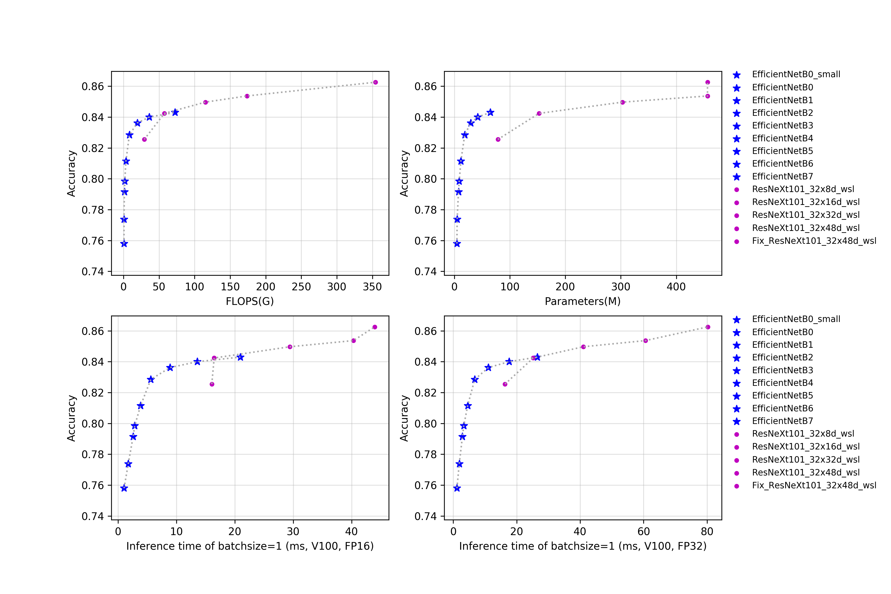

# EfficientNet与ResNeXt101_wsl系列

## 概述

更多的模型简介正在持续更新中。

在预测时，图像的crop_size和resize_short_size如下表所示。

| Models                    | crop_size | resize_short_size |
|:--:|:--:|:--:|
| ResNeXt101_32x8d_wsl      | 224       | 256               |
| ResNeXt101_32x16d_wsl     | 224       | 256               |
| ResNeXt101_32x32d_wsl     | 224       | 256               |
| ResNeXt101_32x48d_wsl     | 224       | 256               |
| Fix_ResNeXt101_32x48d_wsl | 320       | 320               |
| EfficientNetB0            | 224       | 256               |
| EfficientNetB1            | 240       | 272               |
| EfficientNetB2            | 260       | 292               |
| EfficientNetB3            | 300       | 332               |
| EfficientNetB4            | 380       | 412               |
| EfficientNetB5            | 456       | 488               |
| EfficientNetB6            | 528       | 560               |
| EfficientNetB7            | 600       | 632               |
| EfficientNetB0_small      | 224       | 256               |

## 精度、FLOPS和参数量

| Models                        | Top1   | Top5   | Reference top1 | Reference top5 | FLOPS (G) | Parameters (M) |
|:--:|:--:|:--:|:--:|:--:|:--:|:--:|
| ResNeXt101_ 32x8d_wsl      | 0.826  | 0.967  | 0.822             | 0.964             | 29.140       | 78.440            |
| ResNeXt101_ 32x16d_wsl     | 0.842  | 0.973  | 0.842             | 0.972             | 57.550       | 152.660           |
| ResNeXt101_ 32x32d_wsl     | 0.850  | 0.976  | 0.851             | 0.975             | 115.170      | 303.110           |
| ResNeXt101_ 32x48d_wsl     | 0.854  | 0.977  | 0.854             | 0.976             | 173.580      | 456.200           |
| Fix_ResNeXt101_ 32x48d_wsl | 0.863  | 0.980  | 0.864             | 0.980             | 354.230      | 456.200           |
| EfficientNetB0                | 0.774  | 0.933  | 0.773             | 0.935             | 0.720        | 5.100             |
| EfficientNetB1                | 0.792  | 0.944  | 0.792             | 0.945             | 1.270        | 7.520             |
| EfficientNetB2                | 0.799  | 0.947  | 0.803             | 0.950             | 1.850        | 8.810             |
| EfficientNetB3                | 0.812  | 0.954  | 0.817             | 0.956             | 3.430        | 11.840            |
| EfficientNetB4                | 0.829  | 0.962  | 0.830             | 0.963             | 8.290        | 18.760            |
| EfficientNetB5                | 0.836  | 0.967  | 0.837             | 0.967             | 19.510       | 29.610            |
| EfficientNetB6                | 0.840  | 0.969  | 0.842             | 0.968             | 36.270       | 42.000            |
| EfficientNetB7                | 0.843  | 0.969  | 0.844             | 0.971             | 72.350       | 64.920            |
| EfficientNetB0_ small      | 0.758  | 0.926  |                   |                   | 0.720        | 4.650             |

## FP16预测速度

| Models                        | batch_size=1 (ms) | batch_size=4 (ms) | batch_size=8 (ms) | batch_size=32 (ms) |
|:--:|:--:|:--:|:--:|:--:|
| ResNeXt101_ 32x8d_wsl      | 16.063               | 16.342               | 24.914               | 45.035                |
| ResNeXt101_ 32x16d_wsl     | 16.471               | 25.235               | 30.762               | 67.869                |
| ResNeXt101_ 32x32d_wsl     | 29.425               | 37.149               | 50.834               |                       |
| ResNeXt101_ 32x48d_wsl     | 40.311               | 58.414               |                      |                       |
| Fix_ResNeXt101_ 32x48d_wsl | 43.960               | 86.514               |                      |                       |
| EfficientNetB0                | 1.759                | 2.748                | 3.761                | 10.178                |
| EfficientNetB1                | 2.592                | 4.122                | 5.829                | 16.262                |
| EfficientNetB2                | 2.866                | 4.715                | 7.064                | 20.954                |
| EfficientNetB3                | 3.869                | 6.815                | 10.672               | 34.097                |
| EfficientNetB4                | 5.626                | 11.937               | 19.753               | 67.436                |
| EfficientNetB5                | 8.907                | 21.685               | 37.248               | 134.185               |
| EfficientNetB6                | 13.591               | 34.093               | 60.976               |                       |
| EfficientNetB7                | 20.963               | 56.397               | 103.971              |                       |
| EfficientNetB0_ small      | 1.039                | 1.665                | 2.493                | 7.748                 |

## FP32预测速度

| Models                        | batch_size=1 (ms) | batch_size=4 (ms) | batch_size=8 (ms) | batch_size=32 (ms) |
|:--:|:--:|:--:|:--:|:--:|
| ResNeXt101_ 32x8d_wsl      | 16.325               | 25.633               | 37.196               | 108.535               |
| ResNeXt101_ 32x16d_wsl     | 25.224               | 40.929               | 62.898               |                       |
| ResNeXt101_ 32x32d_wsl     | 41.047               | 79.575               |                      |                       |
| ResNeXt101_ 32x48d_wsl     | 60.610               |                      |                      |                       |
| Fix_ResNeXt101_ 32x48d_wsl | 80.280               |                      |                      |                       |
| EfficientNetB0                | 1.902                | 3.296                | 4.361                | 11.319                |
| EfficientNetB1                | 2.908                | 5.093                | 6.900                | 18.015                |
| EfficientNetB2                | 3.324                | 5.832                | 8.357                | 23.371                |
| EfficientNetB3                | 4.557                | 8.526                | 12.485               | 38.124                |
| EfficientNetB4                | 6.767                | 14.742               | 23.218               | 77.590                |
| EfficientNetB5                | 11.097               | 26.642               | 43.590               |                       |
| EfficientNetB6                | 17.582               | 42.408               | 74.336               |                       |
| EfficientNetB7                | 26.529               | 70.337               | 126.839              |                       |
| EfficientNetB0_ small      | 1.171                | 2.026                | 2.906                | 8.506                 |
