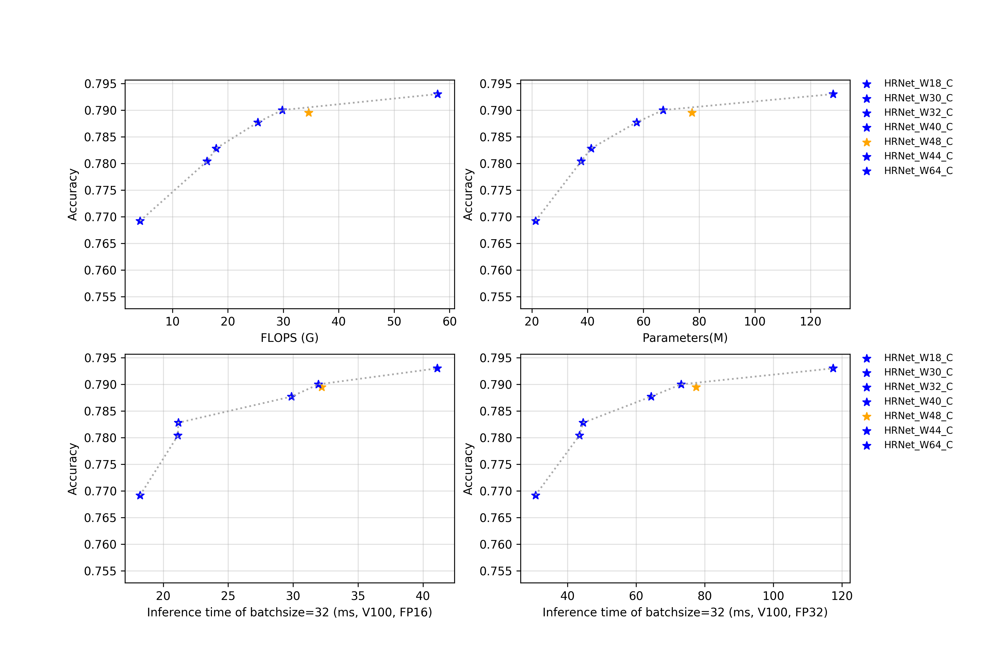

# HRNet系列

## 概述
正在持续更新中......

所有模型在预测时，图像的crop_size设置为224，resize_short_size设置为256。

## 精度、FLOPS和参数量

| Models      | Top1   | Top5   | Reference top1 | Reference top5 | FLOPS (G) | Parameters (M) |
|:--:|:--:|:--:|:--:|:--:|:--:|:--:|
| HRNet_W18_C | 0.769  | 0.934  | 0.768             | 0.934             | 4.140        | 21.290            |
| HRNet_W30_C | 0.780  | 0.940  | 0.782             | 0.942             | 16.230       | 37.710            |
| HRNet_W32_C | 0.783  | 0.942  | 0.785             | 0.942             | 17.860       | 41.230            |
| HRNet_W40_C | 0.788  | 0.945  | 0.789             | 0.945             | 25.410       | 57.550            |
| HRNet_W44_C | 0.790  | 0.945  | 0.789             | 0.944             | 29.790       | 67.060            |
| HRNet_W48_C | 0.790  | 0.944  | 0.793             | 0.945             | 34.580       | 77.470            |
| HRNet_W64_C | 0.793  | 0.946  | 0.795             | 0.946             | 57.830       | 128.060           |

## FP16预测速度

| Models      | batch_size=1 (ms) | batch_size=4 (ms) | batch_size=8 (ms) | batch_size=32 (ms) |
|:--:|:--:|:--:|:--:|:--:|
| HRNet_W18_C | 6.188                | 7.207                | 9.149                | 18.221                |
| HRNet_W30_C | 7.941                | 8.851                | 10.540               | 21.129                |
| HRNet_W32_C | 7.904                | 8.890                | 10.752               | 21.159                |
| HRNet_W40_C | 9.233                | 11.600               | 13.927               | 29.868                |
| HRNet_W44_C | 9.917                | 12.119               | 15.555               | 31.948                |
| HRNet_W48_C | 10.198               | 12.399               | 15.572               | 32.210                |
| HRNet_W64_C | 12.264               | 14.552               | 18.251               | 41.106                |

## FP32预测速度

| Models      | batch_size=1 (ms) | batch_size=4 (ms) | batch_size=8 (ms) | batch_size=32 (ms) |
|:--:|:--:|:--:|:--:|:--:|
| HRNet_W18_C | 6.828                | 8.552                | 11.154               | 30.665                |
| HRNet_W30_C | 8.901                | 11.067               | 14.421               | 43.459                |
| HRNet_W32_C | 8.983                | 11.334               | 14.688               | 44.564                |
| HRNet_W40_C | 10.300               | 14.720               | 20.257               | 64.346                |
| HRNet_W44_C | 11.183               | 15.830               | 25.292               | 73.136                |
| HRNet_W48_C | 11.619               | 16.791               | 26.569               | 77.536                |
| HRNet_W64_C | 14.434               | 20.988               | 35.114               | 117.434               |
