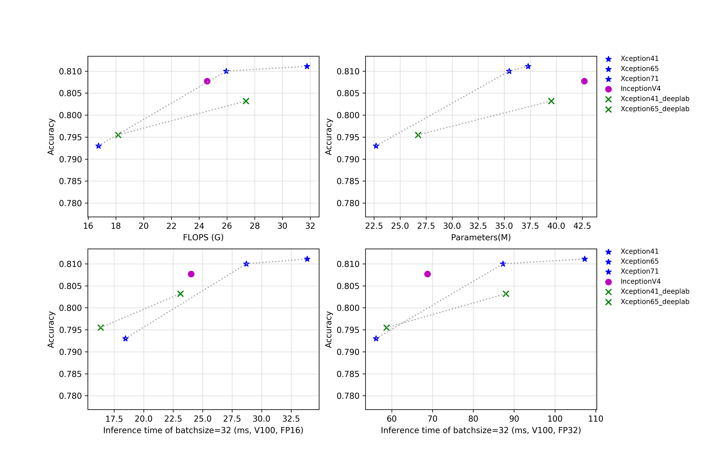

# Inception系列

## 概述

所有模型在预测时，图像的crop_size设置为299，resize_short_size设置为320。

更多的模型简介正在持续更新中。

## 精度、FLOPS和参数量

| Models             | Top1   | Top5   | Reference top1 | Reference top5 | FLOPS (G) | Parameters (M) |
|:--:|:--:|:--:|:--:|:--:|:--:|:--:|
| GoogLeNet          | 0.707  | 0.897  | 0.698             |                   | 2.880        | 8.460             |
| Xception41         | 0.793  | 0.945  | 0.790             | 0.945             | 16.740       | 22.690            |
| Xception41 _deeplab | 0.796  | 0.944  |                   |                   | 18.160       | 26.730            |
| Xception65         | 0.810  | 0.955  |                   |                   | 25.950       | 35.480            |
| Xception65 _deeplab | 0.803  | 0.945  |                   |                   | 27.370       | 39.520            |
| Xception71         | 0.811  | 0.955  |                   |                   | 31.770       | 37.280            |
| InceptionV4        | 0.808  | 0.953  | 0.800             | 0.950             | 24.570       | 42.680            |

## FP16预测速度

| Models             | batch_size=1 (ms) | batch_size=4 (ms) | batch_size=8 (ms) | batch_size=32 (ms) |
|:--:|:--:|:--:|:--:|:--:|
| GoogLeNet          | 1.428                | 1.833                | 2.138                | 4.143                 |
| Xception41         | 1.545                | 2.772                | 4.961                | 18.447                |
| Xception41 _deeplab | 1.630                | 2.647                | 4.462                | 16.354                |
| Xception65         | 5.398                | 4.215                | 8.611                | 28.702                |
| Xception65 _deeplab | 5.317                | 3.688                | 6.168                | 23.108                |
| Xception71         | 2.732                | 5.033                | 8.948                | 33.857                |
| InceptionV4        | 6.172                | 7.558                | 9.527                | 24.021                |

## FP32预测速度

| Models             | batch_size=1 (ms) | batch_size=4 (ms) | batch_size=8 (ms) | batch_size=32 (ms) |
|:--:|:--:|:--:|:--:|:--:|
| GoogLeNet          | 1.436                | 2.904                | 3.800                | 9.049                 |
| Xception41         | 3.402                | 7.889                | 14.953               | 56.142                |
| Xception41 _deeplab | 3.778                | 8.396                | 15.449               | 58.735                |
| Xception65         | 6.802                | 13.935               | 34.301               | 87.256                |
| Xception65 _deeplab | 8.583                | 12.132               | 22.917               | 87.983                |
| Xception71         | 6.156                | 14.359               | 27.360               | 107.282               |
| InceptionV4        | 10.384               | 17.438               | 23.312               | 68.777                |
