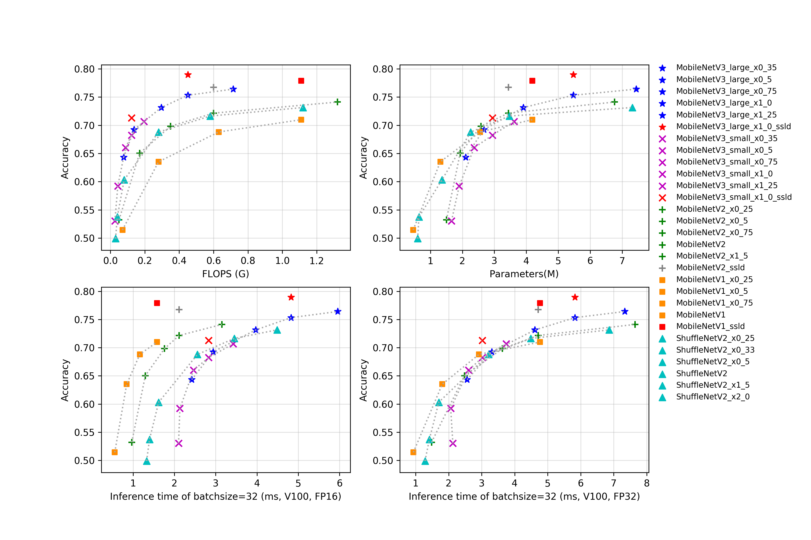

# 移动端系列

## 概述

所有模型在预测时，图像的crop_size设置为224，resize_short_size设置为256。

更多的模型概述正在持续更新中。

## 精度、FLOPS和参数量

| Models                               | Top1    | Top5    | Reference top1 | Reference top5 | FLOPS (G) | Parameters (M) |
|:--:|:--:|:--:|:--:|:--:|:--:|:--:|
| MobileNetV1_x0_25                    | 0.514   | 0.755   | 0.506             |                   | 0.070        | 0.460             |
| MobileNetV1_x0_5                     | 0.635   | 0.847   | 0.637             |                   | 0.280        | 1.310             |
| MobileNetV1_x0_75                    | 0.688   | 0.882   | 0.684             |                   | 0.630        | 2.550             |
| MobileNetV1                          | 0.710   | 0.897   | 0.706             |                   | 1.110        | 4.190             |
| MobileNetV1_ssld                     | 0.779   | 0.939   |                   |                   | 1.110        | 4.190             |
| MobileNetV2_x0_25                    | 0.532   | 0.765   |                   |                   | 0.050        | 1.500             |
| MobileNetV2_x0_5                     | 0.650   | 0.857   | 0.654             | 0.864             | 0.170        | 1.930             |
| MobileNetV2_x0_75                    | 0.698   | 0.890   | 0.698             | 0.896             | 0.350        | 2.580             |
| MobileNetV2                          | 0.722   | 0.907   | 0.718             | 0.910             | 0.600        | 3.440             |
| MobileNetV2_x1_5                     | 0.741   | 0.917   |                   |                   | 1.320        | 6.760             |
| MobileNetV2_x2_0                     | 0.752   | 0.926   |                   |                   | 2.320        | 11.130            |
| MobileNetV2_ssld                     | 0.7674  | 0.9339  |                   |                   | 0.600        | 3.440             |
| MobileNetV3_large_ x1_25          | 0.764   | 0.930   | 0.766             |                   | 0.714        | 7.440             |
| MobileNetV3_large_ x1_0           | 0.753   | 0.753   | 0.752             |                   | 0.450        | 5.470             |
| MobileNetV3_large_ x0_75          | 0.731   | 0.911   | 0.733             |                   | 0.296        | 3.910             |
| MobileNetV3_large_ x0_5           | 0.692   | 0.885   | 0.688             |                   | 0.138        | 2.670             |
| MobileNetV3_large_ x0_35          | 0.643   | 0.855   | 0.642             |                   | 0.077        | 2.100             |
| MobileNetV3_small_ x1_25          | 0.707   | 0.895   | 0.704             |                   | 0.195        | 3.620             |
| MobileNetV3_small_ x1_0           | 0.682   | 0.881   | 0.675             |                   | 0.123        | 2.940             |
| MobileNetV3_small_ x0_75          | 0.660   | 0.863   | 0.654             |                   | 0.088        | 2.370             |
| MobileNetV3_small_ x0_5           | 0.592   | 0.815   | 0.580             |                   | 0.043        | 1.900             |
| MobileNetV3_small_ x0_35          | 0.530   | 0.764   | 0.498             |                   | 0.026        | 1.660             |
| MobileNetV3_large_ x1_0_ssld      | 0.790   | 0.945   |                   |                   | 0.450        | 5.470             |
| MobileNetV3_large_ x1_0_ssld_int8 | 0.761   |         |                   |                   |              |                   |
| MobileNetV3_small_ x1_0_ssld      | 0.713   | 0.901   |                   |                   | 0.123        | 2.940             |
| ShuffleNetV2                         | 0.688   | 0.885   | 0.694             |                   | 0.280        | 2.260             |
| ShuffleNetV2_x0_25                   | 0.499   | 0.738   |                   |                   | 0.030        | 0.600             |
| ShuffleNetV2_x0_33                   | 0.537   | 0.771   |                   |                   | 0.040        | 0.640             |
| ShuffleNetV2_x0_5                    | 0.603   | 0.823   | 0.603             |                   | 0.080        | 1.360             |
| ShuffleNetV2_x1_5                    | 0.716   | 0.902   | 0.726             |                   | 0.580        | 3.470             |
| ShuffleNetV2_x2_0                    | 0.732   | 0.912   | 0.749             |                   | 1.120        | 7.320             |
| ShuffleNetV2_swish                   | 0.700   | 0.892   |                   |                   | 0.290        | 2.260             |

## FP16预测速度

| Models                               | batch_size=1 (ms) | batch_size=4 (ms) | batch_size=8 (ms) | batch_size=32 (ms) |
|:--:|:--:|:--:|:--:|:--:|
| MobileNetV1_x0_25                    | 0.236                | 0.258                | 0.281                | 0.556                 |
| MobileNetV1_x0_5                     | 0.246                | 0.318                | 0.364                | 0.845                 |
| MobileNetV1_x0_75                    | 0.303                | 0.380                | 0.512                | 1.164                 |
| MobileNetV1                          | 0.340                | 0.426                | 0.601                | 1.578                 |
| MobileNetV1_ssld                     | 0.340                | 0.426                | 0.601                | 1.578                 |
| MobileNetV2_x0_25                    | 0.432                | 0.488                | 0.532                | 0.967                 |
| MobileNetV2_x0_5                     | 0.475                | 0.564                | 0.654                | 1.296                 |
| MobileNetV2_x0_75                    | 0.553                | 0.653                | 0.821                | 1.761                 |
| MobileNetV2                          | 0.610                | 0.738                | 0.931                | 2.115                 |
| MobileNetV2_x1_5                     | 0.731                | 0.966                | 1.252                | 3.152                 |
| MobileNetV2_x2_0                     | 0.870                | 1.123                | 1.494                | 3.910                 |
| MobileNetV2_ssld                     | 0.610                | 0.738                | 0.931                | 2.115                 |
| MobileNetV3_large_ x1_25          | 2.004                | 2.223                | 2.433                | 5.954                 |
| MobileNetV3_large_ x1_0           | 1.943                | 2.203                | 2.113                | 4.823                 |
| MobileNetV3_large_ x0_75          | 2.107                | 2.266                | 2.120                | 3.968                 |
| MobileNetV3_large_ x0_5           | 1.942                | 2.178                | 2.179                | 2.936                 |
| MobileNetV3_large_ x0_35          | 1.994                | 2.407                | 2.285                | 2.420                 |
| MobileNetV3_small_ x1_25          | 1.876                | 2.141                | 2.118                | 3.423                 |
| MobileNetV3_small_ x1_0           | 1.751                | 2.160                | 2.203                | 2.830                 |
| MobileNetV3_small_ x0_75          | 1.856                | 2.235                | 2.166                | 2.464                 |
| MobileNetV3_small_ x0_5           | 1.773                | 2.304                | 2.242                | 2.133                 |
| MobileNetV3_small_ x0_35          | 1.870                | 2.392                | 2.323                | 2.101                 |
| MobileNetV3_large_ x1_0_ssld      | 1.943                | 2.203                | 2.113                | 4.823                 |                      |
| MobileNetV3_small_ x1_0_ssld      | 1.751                | 2.160                | 2.203                | 2.830                 |
| ShuffleNetV2                         | 1.134                | 1.068                | 1.199                | 2.558                 |
| ShuffleNetV2_x0_25                   | 0.911                | 0.953                | 0.948                | 1.327                 |
| ShuffleNetV2_x0_33                   | 0.853                | 1.072                | 0.958                | 1.398                 |
| ShuffleNetV2_x0_5                    | 0.858                | 1.059                | 1.084                | 1.620                 |
| ShuffleNetV2_x1_5                    | 1.040                | 1.153                | 1.394                | 3.452                 |
| ShuffleNetV2_x2_0                    | 1.061                | 1.316                | 1.694                | 4.485                 |
| ShuffleNetV2_swish                   | 1.688                | 1.958                | 1.707                | 3.711                 |

## FP32预测速度

| Models                               | batch_size=1 (ms) | batch_size=4 (ms) | batch_size=8 (ms) | batch_size=32 (ms) |
|:--:|:--:|:--:|:--:|:--:|
| MobileNetV1_x0_25                    | 0.233                | 0.372                | 0.424                | 0.930                 |
| MobileNetV1_x0_5                     | 0.281                | 0.532                | 0.677                | 1.808                 |
| MobileNetV1_x0_75                    | 0.344                | 0.733                | 0.960                | 2.920                 |
| MobileNetV1                          | 0.420                | 0.963                | 1.462                | 4.769                 |
| MobileNetV1_ssld                     | 0.420                | 0.963                | 1.462                | 4.769                 |
| MobileNetV2_x0_25                    | 0.718                | 0.738                | 0.775                | 1.482                 |
| MobileNetV2_x0_5                     | 0.818                | 0.975                | 1.107                | 2.481                 |
| MobileNetV2_x0_75                    | 0.830                | 1.104                | 1.514                | 3.629                 |
| MobileNetV2                          | 0.889                | 1.346                | 1.875                | 4.711                 |
| MobileNetV2_x1_5                     | 1.221                | 1.982                | 2.951                | 7.645                 |
| MobileNetV2_x2_0                     | 1.546                | 2.625                | 3.734                | 10.429                |
| MobileNetV2_ssld                     | 0.889                | 1.346                | 1.875                | 4.711                 |
| MobileNetV3_large_ x1_25          | 2.113                | 2.377                | 3.114                | 7.332                 |
| MobileNetV3_large_ x1_0           | 1.991                | 2.380                | 2.517                | 5.826                 |
| MobileNetV3_large_ x0_75          | 2.105                | 2.454                | 2.336                | 4.611                 |
| MobileNetV3_large_ x0_5           | 1.978                | 2.603                | 2.291                | 3.306                 |
| MobileNetV3_large_ x0_35          | 2.017                | 2.469                | 2.316                | 2.558                 |
| MobileNetV3_small_ x1_25          | 1.915                | 2.411                | 2.295                | 3.742                 |
| MobileNetV3_small_ x1_0           | 1.915                | 2.889                | 2.862                | 3.022                 |
| MobileNetV3_small_ x0_75          | 1.941                | 2.358                | 2.232                | 2.602                 |
| MobileNetV3_small_ x0_5           | 1.872                | 2.364                | 2.238                | 2.061                 |
| MobileNetV3_small_ x0_35          | 1.889                | 2.407                | 2.328                | 2.127                 |
| MobileNetV3_large_ x1_0_ssld      | 1.991                | 2.380                | 2.517                | 5.826                 |
| MobileNetV3_small_ x1_0_ssld      | 1.915                | 2.889                | 2.862                | 3.022                 |
| ShuffleNetV2                         | 1.328                | 1.211                | 1.440                | 3.210                 |
| ShuffleNetV2_x0_25                   | 0.905                | 0.908                | 0.924                | 1.284                 |
| ShuffleNetV2_x0_33                   | 0.871                | 1.073                | 0.891                | 1.416                 |
| ShuffleNetV2_x0_5                    | 0.852                | 1.150                | 1.093                | 1.702                 |
| ShuffleNetV2_x1_5                    | 0.874                | 1.470                | 1.889                | 4.490                 |
| ShuffleNetV2_x2_0                    | 1.443                | 1.908                | 2.556                | 6.864                 |
| ShuffleNetV2_swish                   | 1.694                | 1.856                | 2.101                | 3.942                 |

## CPU预测速度和存储大小

| Models                               | batch_size=1(ms) | Storage Size(M) |
|:--:|:--:|:--:|
| MobileNetV1_x0_25                    | 3.220            | 1.900           |
| MobileNetV1_x0_5                     | 9.580            | 5.200           |
| MobileNetV1_x0_75                    | 19.436           | 10.000          |
| MobileNetV1                          | 32.523           | 16.000          |
| MobileNetV1_ssld                     | 32.523           | 16.000          |
| MobileNetV2_x0_25                    | 3.799            | 6.100           |
| MobileNetV2_x0_5                     | 8.702            | 7.800           |
| MobileNetV2_x0_75                    | 15.531           | 10.000          |
| MobileNetV2                          | 23.318           | 14.000          |
| MobileNetV2_x1_5                     | 45.624           | 26.000          |
| MobileNetV2_x2_0                     | 74.292           | 43.000          |
| MobileNetV2_ssld                     | 23.318           | 14.000          |
| MobileNetV3_large_x1_25          | 28.218           | 29.000          |
| MobileNetV3_large_x1_0           | 19.308           | 21.000          |
| MobileNetV3_large_x0_75          | 13.565           | 16.000          |
| MobileNetV3_large_x0_5           | 7.493            | 11.000          |
| MobileNetV3_large_x0_35          | 5.137            | 8.600           |
| MobileNetV3_small_x1_25          | 9.275            | 14.000          |
| MobileNetV3_small_x1_0           | 6.546            | 12.000          |
| MobileNetV3_small_x0_75          | 5.284            | 9.600           |
| MobileNetV3_small_x0_5           | 3.352            | 7.800           |
| MobileNetV3_small_x0_35          | 2.635            | 6.900           |
| MobileNetV3_large_x1_0_ssld      | 19.308           | 21.000          |
| MobileNetV3_large_x1_0_ssld_int8 | 14.395           | 10.000          |
| MobileNetV3_small_x1_0_ssld      | 6.546            | 12.000          |
| ShuffleNetV2                         | 10.941           | 9.000           |
| ShuffleNetV2_x0_25                   | 2.329            | 2.700           |
| ShuffleNetV2_x0_33                   | 2.643            | 2.800           |
| ShuffleNetV2_x0_5                    | 4.261            | 5.600           |
| ShuffleNetV2_x1_5                    | 19.352           | 14.000          |
| ShuffleNetV2_x2_0                    | 34.770           | 28.000          |
| ShuffleNetV2_swish                   | 16.023           | 9.100           |
