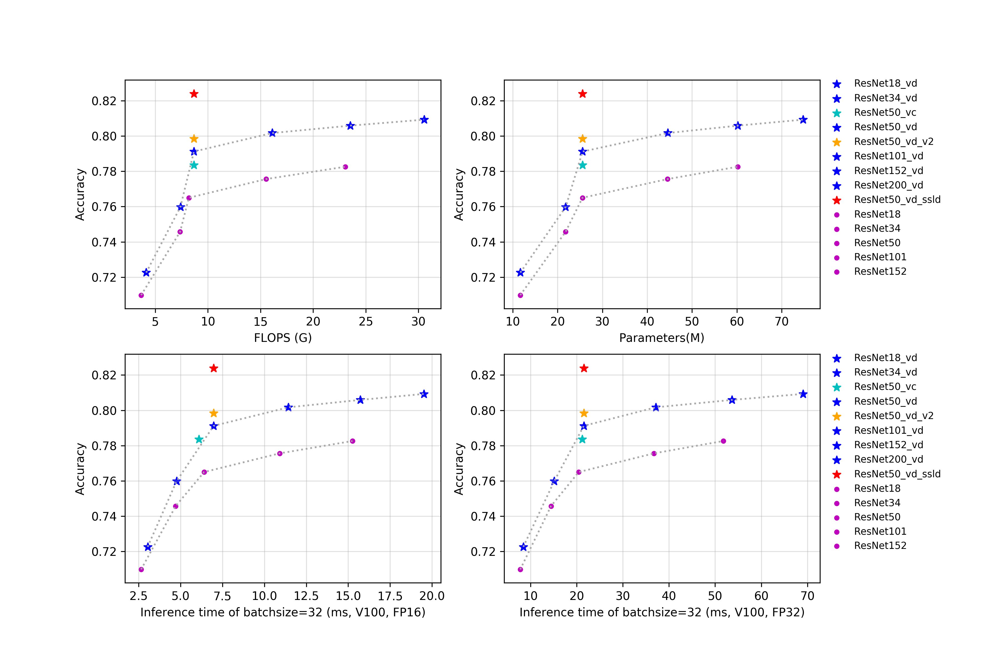

# ResNet及其Vd系列

## 概述

ResNet系列模型是在2015年提出的，一举在ILSVRC2015比赛中取得冠军，top5错误率为3.57%。该网络创新性的提出了残差结构，通过堆叠多个残差结构从而构建了ResNet网络。实验表明使用残差块可以有效地提升收敛速度和精度。

斯坦福大学的Joyce Xu将ResNet称为「真正重新定义了我们看待神经网络的方式」的三大架构之一。由于ResNet卓越的性能，越来越多的来自学术界和工业界学者和工程师对其结构进行了改进，比较出名的有Wide-ResNet, ResNet-vc ,ResNet-vd, Res2Net等，其中ResNet-vc与ResNet-vd的参数量和计算量与ResNet几乎一致，所以在此我们将其与ResNet统一归为ResNet系列。

本次发布ResNet系列的模型包括ResNet50，ResNet50_vd，ResNet50_vd_ssld，ResNet200_vd等14个预训练模型。在训练层面上，ResNet的模型采用了训练ImageNet的标准训练流程，而其余改进版模型采用了更多的训练策略，如learning rate的下降方式采用了cosine decay，引入了label smoothing的标签正则方式，在数据预处理加入了mixup的操作，迭代总轮数从120个epoch增加到200个epoch。

其中，ResNet50_vd_v2与ResNet50_vd_ssld采用了知识蒸馏，保证模型结构不变的情况下，进一步提升了模型的精度，具体地，ResNet50_vd_v2的teacher模型是ResNet152_vd（top1准确率80.59%），数据选用的是ImageNet-1k的训练集，ResNet50_vd_ssld的teacher模型是ResNeXt101_32x16d_wsl（top1准确率84.2%），数据选用结合了ImageNet-1k的训练集和ImageNet-22k挖掘的400万数据。知识蒸馏的具体方法正在持续更新中。

通过上述曲线可以看出，层数越多，准确率越高，但是相应的参数量、计算量和延时都会增加。ResNet50_vd_ssld通过用更强的teacher和更多的数据，将其在ImageNet-1k上的验证集top-1精度进一步提高，达到了82.39%，刷新了ResNet50系列模型的精度。

**注意**：所有模型在预测时，图像的crop_size设置为224，resize_short_size设置为256。

## 精度、FLOPS和参数量

| Models           | Top1 | Top5 | Reference top1 | Reference top5 | FLOPS (G) | Parameters (M) |
|:--:|:--:|:--:|:--:|:--:|:--:|:--:|
| ResNet18         | 0.710           | 0.899           | 0.696                    | 0.891                    | 3.660     | 11.690    |
| ResNet18_vd      | 0.723           | 0.908           |                          |                          | 4.140     | 11.710    |
| ResNet34         | 0.746           | 0.921           | 0.732                    | 0.913                    | 7.360     | 21.800    |
| ResNet34_vd      | 0.760           | 0.930           |                          |                          | 7.390     | 21.820    |
| ResNet50         | 0.765           | 0.930           | 0.760                    | 0.930                    | 8.190     | 25.560    |
| ResNet50_vc      | 0.784           | 0.940           |                          |                          | 8.670     | 25.580    |
| ResNet50_vd      | 0.791           | 0.944           | 0.792                    | 0.946                    | 8.670     | 25.580    |
| ResNet50_vd_v2   | 0.798           | 0.949           |                          |                          | 8.670     | 25.580    |
| ResNet101        | 0.776           | 0.936           | 0.776                    | 0.938                    | 15.520    | 44.550    |
| ResNet101_vd     | 0.802           | 0.950           |                          |                          | 16.100    | 44.570    |
| ResNet152        | 0.783           | 0.940           | 0.778                    | 0.938                    | 23.050    | 60.190    |
| ResNet152_vd     | 0.806           | 0.953           |                          |                          | 23.530    | 60.210    |
| ResNet200_vd     | 0.809           | 0.953           |                          |                          | 30.530    | 74.740    |
| ResNet50_vd_ssld | 0.824           | 0.961           |                          |                          | 8.670     | 25.580    |

## FP16预测速度

| Models           | batch_size=1 (ms) | batch_size=4 (ms) | batch_size=8 (ms) | batch_size=32 (ms) |
|:--:|:--:|:--:|:--:|:--:|
| ResNet18         | 0.966      | 1.076     | 1.263     | 2.656      |
| ResNet18_vd      | 1.002      | 1.163     | 1.392     | 3.045      |
| ResNet34         | 1.798      | 1.959     | 2.269     | 4.716      |
| ResNet34_vd      | 1.839      | 2.011     | 2.482     | 4.767      |
| ResNet50         | 1.892      | 2.146     | 2.692     | 6.411      |
| ResNet50_vc      | 1.903      | 2.094     | 2.677     | 6.096      |
| ResNet50_vd      | 1.918      | 2.273     | 2.833     | 6.978      |
| ResNet50_vd_v2   | 1.918      | 2.273     | 2.833     | 6.978      |
| ResNet101        | 3.790      | 4.128     | 4.789     | 10.913     |
| ResNet101_vd     | 3.853      | 4.229     | 5.001     | 11.437     |
| ResNet152        | 5.523      | 5.871     | 6.710     | 15.258     |
| ResNet152_vd     | 5.503      | 6.003     | 7.001     | 15.716     |
| ResNet200_vd     | 7.270      | 7.595     | 8.802     | 19.516     |
| ResNet50_vd_ssld | 1.918      | 2.273     | 2.833     | 6.978      |

## FP32预测速度

| Models           | batch_size=1 (ms) | batch_size=4 (ms) | batch_size=8 (ms) | batch_size=32 (ms) |
|:--:|:--:|:--:|:--:|:--:|
| ResNet18         | 1.127     | 1.428     | 2.352     | 7.780      |
| ResNet18_vd      | 1.142     | 1.532     | 2.584     | 8.441      |
| ResNet34         | 1.936     | 2.409     | 4.197     | 14.442     |
| ResNet34_vd      | 1.948     | 2.526     | 4.403     | 15.133     |
| ResNet50         | 2.630     | 4.393     | 6.491     | 20.449     |
| ResNet50_vc      | 2.728     | 4.413     | 6.618     | 21.183     |
| ResNet50_vd      | 2.649     | 4.522     | 6.771     | 21.552     |
| ResNet50_vd_v2   | 2.649     | 4.522     | 6.771     | 21.552     |
| ResNet101        | 4.747     | 8.015     | 11.555    | 36.739     |
| ResNet101_vd     | 4.735     | 8.111     | 11.820    | 37.155     |
| ResNet152        | 6.618     | 11.471    | 16.580    | 51.792     |
| ResNet152_vd     | 6.626     | 11.613    | 16.843    | 53.645     |
| ResNet200_vd     | 8.540     | 14.770    | 21.554    | 69.053     |
| ResNet50_vd_ssld | 2.649     | 4.522     | 6.771     | 21.552     |
