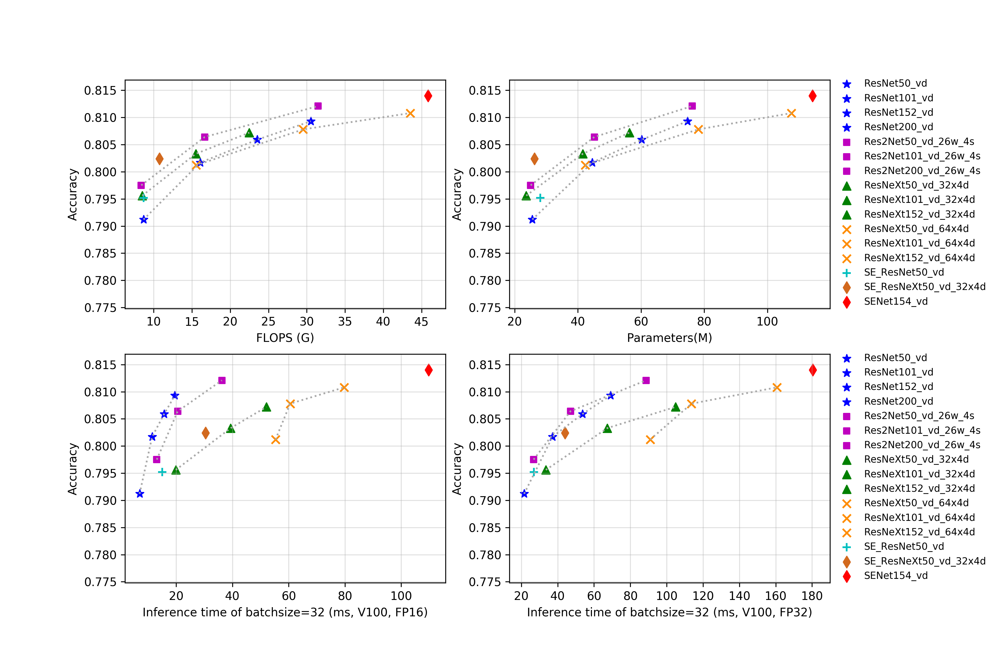

# SEResNeXt与Res2Net系列

## 概述

所有模型在预测时，图像的crop_size设置为224，resize_short_size设置为256。

更多的模型概述正在持续更新中。

## 精度、FLOPS和参数量

| Models                | Top1   | Top5   | Reference top1 | Reference top5 | FLOPS (G) | Parameters (M) |
|:--:|:--:|:--:|:--:|:--:|:--:|:--:|
| Res2Net50_26w_4s      | 0.793  | 0.946  | 0.780             | 0.936             | 8.520        | 25.700            |
| Res2Net50_vd_26w_4s   | 0.798  | 0.949  |                   |                   | 8.370        | 25.060            |
| Res2Net50_14w_8s      | 0.795  | 0.947  | 0.781             | 0.939             | 9.010        | 25.720            |
| Res2Net101_vd_26w_4s  | 0.806  | 0.952  |                   |                   | 16.670       | 45.220            |
| Res2Net200_vd_26w_4s  | 0.812  | 0.957  |                   |                   | 31.490       | 76.210            |
| ResNeXt50_32x4d       | 0.778  | 0.938  | 0.778             |                   | 8.020        | 23.640            |
| ResNeXt50_vd_32x4d    | 0.796  | 0.946  |                   |                   | 8.500        | 23.660            |
| ResNeXt50_64x4d       | 0.784  | 0.941  |                   |                   | 15.060       | 42.360            |
| ResNeXt50_vd_64x4d    | 0.801  | 0.949  |                   |                   | 15.540       | 42.380            |
| ResNeXt101_32x4d      | 0.787  | 0.942  | 0.788             |                   | 15.010       | 41.540            |
| ResNeXt101_vd_32x4d   | 0.803  | 0.951  |                   |                   | 15.490       | 41.560            |
| ResNeXt101_64x4d      | 0.784  | 0.945  | 0.796             |                   | 29.050       | 78.120            |
| ResNeXt101_vd_64x4d   | 0.808  | 0.952  |                   |                   | 29.530       | 78.140            |
| ResNeXt152_32x4d      | 0.790  | 0.943  |                   |                   | 22.010       | 56.280            |
| ResNeXt152_vd_32x4d   | 0.807  | 0.952  |                   |                   | 22.490       | 56.300            |
| ResNeXt152_64x4d      | 0.795  | 0.947  |                   |                   | 43.030       | 107.570           |
| ResNeXt152_vd_64x4d   | 0.811  | 0.953  |                   |                   | 43.520       | 107.590           |
| SE_ResNet18_vd        | 0.733  | 0.914  |                   |                   | 4.140        | 11.800            |
| SE_ResNet34_vd        | 0.765  | 0.932  |                   |                   | 7.840        | 21.980            |
| SE_ResNet50_vd        | 0.795  | 0.948  |                   |                   | 8.670        | 28.090            |
| SE_ResNeXt50_32x4d    | 0.784  | 0.940  | 0.789             | 0.945             | 8.020        | 26.160            |
| SE_ResNeXt50_vd_32x4d | 0.802  | 0.949  |                   |                   | 10.760       | 26.280            |
| SE_ResNeXt101_32x4d   | 0.791  | 0.942  | 0.793             | 0.950             | 15.020       | 46.280            |
| SENet154_vd           | 0.814  | 0.955  |                   |                   | 45.830       | 114.290           |

## FP16预测速度

| Models                | batch_size=1 (ms) | batch_size=4 (ms) | batch_size=8 (ms) | batch_size=32 (ms) |
|:--:|:--:|:--:|:--:|:--:|
| Res2Net50_26w_4s      | 2.625                | 3.338                | 4.670                | 11.939                |
| Res2Net50_vd_26w_4s   | 2.642                | 3.480                | 4.862                | 13.089                |
| Res2Net50_14w_8s      | 3.393                | 4.237                | 5.473                | 13.979                |
| Res2Net101_vd_26w_4s  | 5.128                | 6.190                | 7.995                | 20.534                |
| Res2Net200_vd_26w_4s  | 9.594                | 11.131               | 14.278               | 36.258                |
| ResNeXt50_32x4d       | 6.795                | 7.102                | 8.444                | 18.938                |
| ResNeXt50_vd_32x4d    | 7.455                | 7.231                | 8.891                | 19.849                |
| ResNeXt50_64x4d       | 20.279               | 12.343               | 13.633               | 32.772                |
| ResNeXt50_vd_64x4d    | 16.325               | 21.773               | 25.007               | 55.329                |
| ResNeXt101_32x4d      | 14.847               | 15.092               | 15.847               | 42.681                |
| ResNeXt101_vd_32x4d   | 15.227               | 15.139               | 16.603               | 39.371                |
| ResNeXt101_64x4d      | 28.221               | 29.455               | 29.873               | 59.415                |
| ResNeXt101_vd_64x4d   | 31.051               | 28.160               | 28.915               | 60.525                |
| ResNeXt152_32x4d      | 22.961               | 23.167               | 24.173               | 51.621                |
| ResNeXt152_vd_32x4d   | 23.259               | 23.469               | 23.886               | 52.085                |
| ResNeXt152_64x4d      | 41.930               | 42.441               | 45.985               | 79.405                |
| ResNeXt152_vd_64x4d   | 42.778               | 43.281               | 45.017               | 79.728                |
| SE_ResNet18_vd        | 1.256                | 1.463                | 1.917                | 4.316                 |
| SE_ResNet34_vd        | 2.314                | 2.691                | 3.432                | 7.411                 |
| SE_ResNet50_vd        | 2.884                | 4.051                | 5.421                | 15.013                |
| SE_ResNeXt50_32x4d    | 7.973                | 10.613               | 12.788               | 29.091                |
| SE_ResNeXt50_vd_32x4d | 8.340                | 12.245               | 15.253               | 30.399                |
| SE_ResNeXt101_32x4d   | 17.324               | 21.004               | 28.541               | 52.888                |
| SENet154_vd           | 47.234               | 48.018               | 52.967               | 109.787               |

## FP32预测速度

| Models                | batch_size=1 (ms) | batch_size=4 (ms) | batch_size=8 (ms) | batch_size=32 (ms) |
|:--:|:--:|:--:|:--:|:--:|
| Res2Net50_26w_4s      | 3.711                | 5.855                | 8.450                | 26.084                |
| Res2Net50_vd_26w_4s   | 3.651                | 5.986                | 8.747                | 26.772                |
| Res2Net50_14w_8s      | 4.549                | 6.863                | 9.492                | 27.049                |
| Res2Net101_vd_26w_4s  | 6.658                | 10.870               | 15.364               | 47.054                |
| Res2Net200_vd_26w_4s  | 12.017               | 19.871               | 28.330               | 88.645                |
| ResNeXt50_32x4d       | 6.747                | 8.862                | 11.961               | 32.782                |
| ResNeXt50_vd_32x4d    | 6.746                | 9.037                | 12.279               | 33.496                |
| ResNeXt50_64x4d       | 11.577               | 14.570               | 20.425               | 57.979                |
| ResNeXt50_vd_64x4d    | 19.219               | 21.454               | 30.943               | 90.950                |
| ResNeXt101_32x4d      | 14.652               | 18.082               | 24.148               | 70.200                |
| ResNeXt101_vd_32x4d   | 14.927               | 18.454               | 23.894               | 67.334                |
| ResNeXt101_64x4d      | 28.726               | 30.999               | 43.169               | 116.282               |
| ResNeXt101_vd_64x4d   | 28.350               | 31.186               | 41.315               | 113.655               |
| ResNeXt152_32x4d      | 23.578               | 27.323               | 35.588               | 99.121                |
| ResNeXt152_vd_32x4d   | 23.548               | 26.879               | 35.091               | 104.832               |
| ResNeXt152_64x4d      | 43.214               | 43.339               | 60.990               | 159.381               |
| ResNeXt152_vd_64x4d   | 43.998               | 44.510               | 61.094               | 160.601               |
| SE_ResNet18_vd        | 1.353                | 1.867                | 3.021                | 9.331                 |
| SE_ResNet34_vd        | 2.421                | 3.201                | 5.294                | 16.849                |
| SE_ResNet50_vd        | 3.403                | 6.023                | 8.721                | 26.978                |
| SE_ResNeXt50_32x4d    | 8.339                | 12.689               | 15.471               | 41.562                |
| SE_ResNeXt50_vd_32x4d | 7.849                | 13.530               | 16.810               | 44.020                |
| SE_ResNeXt101_32x4d   | 16.853               | 24.409               | 32.666               | 81.806                |
| SENet154_vd           | 46.002               | 53.666               | 70.589               | 180.334               |
